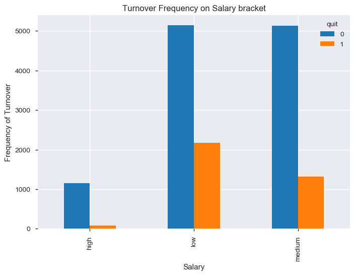
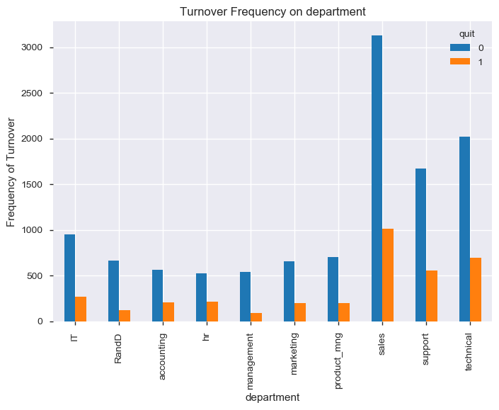
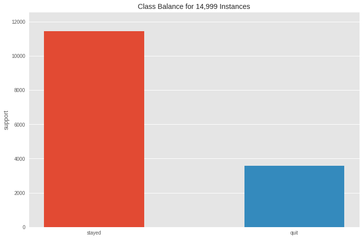
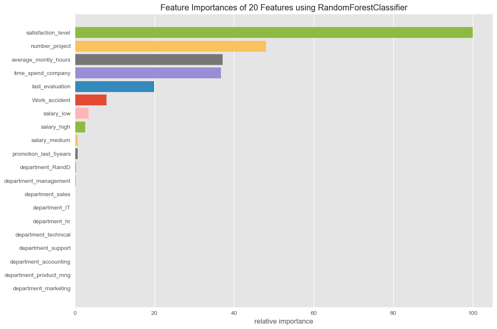
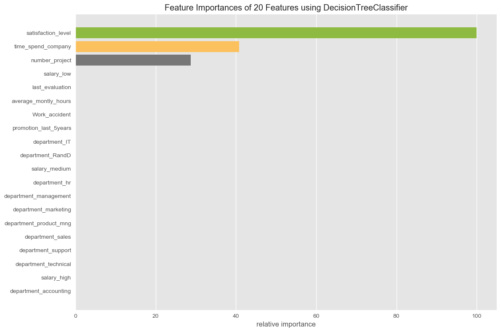
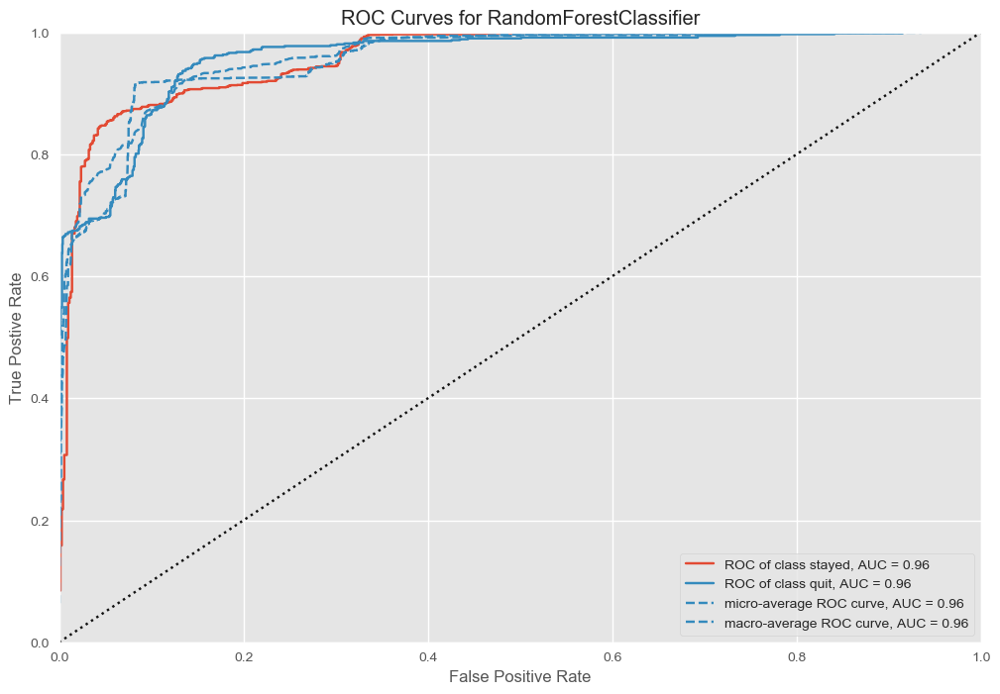
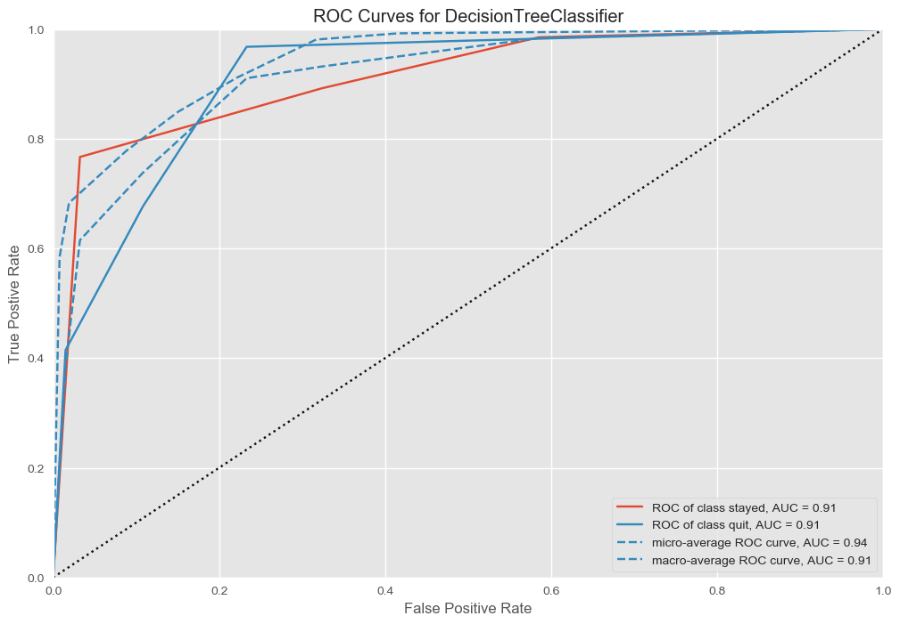

</img>
<h2 align="center">Predict Employee Churn with Decision Trees and Random Forests</h2>

 

### Task 1: Import Libraries
---


```python
pip install <https://github.com/pandas-profiling/pandas-profiling/archive/master.zip>
```

    /bin/sh: -c: line 0: syntax error near unexpected token `newline'
    /bin/sh: -c: line 0: `/opt/anaconda3/bin/python -m pip install <https://github.com/pandas-profiling/pandas-profiling/archive/master.zip>'
    Note: you may need to restart the kernel to use updated packages.
    


```python
conda install python-graphviz

```

    Collecting package metadata (current_repodata.json): done
    Solving environment: failed with initial frozen solve. Retrying with flexible solve.
    Solving environment: failed with repodata from current_repodata.json, will retry with next repodata source.
    Collecting package metadata (repodata.json): done
    Solving environment: done
    
    ## Package Plan ##
    
      environment location: /opt/anaconda3
    
      added / updated specs:
        - python-graphviz
    
    
    The following packages will be downloaded:
    
        package                    |            build
        ---------------------------|-----------------
        cairo-1.14.12              |       hc4e6be7_4         860 KB
        certifi-2019.9.11          |           py37_0         151 KB
        conda-4.8.4                |           py37_0         2.9 MB
        fontconfig-2.13.0          |       h5d5b041_1         202 KB
        fribidi-1.0.10             |       haf1e3a3_0          63 KB
        graphite2-1.3.13           |       h2098e52_0          80 KB
        graphviz-2.40.1            |       hefbbd9a_2         6.3 MB
        harfbuzz-1.8.8             |       hb8d4a28_0         414 KB
        pango-1.42.4               |       h060686c_0         455 KB
        pixman-0.40.0              |       haf1e3a3_0         340 KB
        python-graphviz-0.14       |             py_0          25 KB
        ------------------------------------------------------------
                                               Total:        11.7 MB
    
    The following NEW packages will be INSTALLED:
    
      cairo              pkgs/main/osx-64::cairo-1.14.12-hc4e6be7_4
      fontconfig         pkgs/main/osx-64::fontconfig-2.13.0-h5d5b041_1
      fribidi            pkgs/main/osx-64::fribidi-1.0.10-haf1e3a3_0
      graphite2          pkgs/main/osx-64::graphite2-1.3.13-h2098e52_0
      graphviz           pkgs/main/osx-64::graphviz-2.40.1-hefbbd9a_2
      harfbuzz           pkgs/main/osx-64::harfbuzz-1.8.8-hb8d4a28_0
      pango              pkgs/main/osx-64::pango-1.42.4-h060686c_0
      pixman             pkgs/main/osx-64::pixman-0.40.0-haf1e3a3_0
      python-graphviz    pkgs/main/noarch::python-graphviz-0.14-py_0
    
    The following packages will be SUPERSEDED by a higher-priority channel:
    
      certifi                                       conda-forge --> pkgs/main
      conda                                            anaconda --> pkgs/main
    
    
    
    Downloading and Extracting Packages
    python-graphviz-0.14 | 25 KB     | ##################################### | 100% 
    fribidi-1.0.10       | 63 KB     | ##################################### | 100% 
    graphite2-1.3.13     | 80 KB     | ##################################### | 100% 
    certifi-2019.9.11    | 151 KB    | ##################################### | 100% 
    pixman-0.40.0        | 340 KB    | ##################################### | 100% 
    conda-4.8.4          | 2.9 MB    | ##################################### | 100% 
    pango-1.42.4         | 455 KB    | ##################################### | 100% 
    harfbuzz-1.8.8       | 414 KB    | ##################################### | 100% 
    graphviz-2.40.1      | 6.3 MB    | ##################################### | 100% 
    cairo-1.14.12        | 860 KB    | ##################################### | 100% 
    fontconfig-2.13.0    | 202 KB    | ##################################### | 100% 
    Preparing transaction: done
    Verifying transaction: done
    Executing transaction: done
    
    Note: you may need to restart the kernel to use updated packages.
    


```python
conda install pydot

```

    Collecting package metadata (current_repodata.json): done
    Solving environment: done
    
    ## Package Plan ##
    
      environment location: /opt/anaconda3
    
      added / updated specs:
        - pydot
    
    
    The following packages will be downloaded:
    
        package                    |            build
        ---------------------------|-----------------
        pydot-1.4.1                |           py37_0          42 KB
        ------------------------------------------------------------
                                               Total:          42 KB
    
    The following NEW packages will be INSTALLED:
    
      pydot              pkgs/main/osx-64::pydot-1.4.1-py37_0
    
    
    
    Downloading and Extracting Packages
    pydot-1.4.1          | 42 KB     | ##################################### | 100% 
    Preparing transaction: done
    Verifying transaction: done
    Executing transaction: done
    
    Note: you may need to restart the kernel to use updated packages.
    


```python
conda install -c districtdatalabs yellowbrick
```

    Collecting package metadata (current_repodata.json): done
    Solving environment: done
    
    ## Package Plan ##
    
      environment location: /opt/anaconda3
    
      added / updated specs:
        - yellowbrick
    
    
    The following packages will be downloaded:
    
        package                    |            build
        ---------------------------|-----------------
        pytest-runner-5.2          |             py_0          13 KB
        yellowbrick-1.1            |           py37_0         282 KB  districtdatalabs
        ------------------------------------------------------------
                                               Total:         295 KB
    
    The following NEW packages will be INSTALLED:
    
      pytest-runner      pkgs/main/noarch::pytest-runner-5.2-py_0
      yellowbrick        districtdatalabs/osx-64::yellowbrick-1.1-py37_0
    
    
    
    Downloading and Extracting Packages
    pytest-runner-5.2    | 13 KB     | ##################################### | 100% 
    yellowbrick-1.1      | 282 KB    | ##################################### | 100% 
    Preparing transaction: done
    Verifying transaction: done
    Executing transaction: done
    
    Note: you may need to restart the kernel to use updated packages.
    


```python
from __future__ import print_function
%matplotlib inline
import os
import warnings
import numpy as np
import matplotlib.pyplot as plt
import matplotlib.image as image
import pandas as pd
import pandas_profiling
plt.style.use("ggplot")
warnings.simplefilter("ignore")
```


```python
plt.rcParams['figure.figsize'] = (12,8)
```

 

### Task 2: Exploratory Data Analysis
---

# point 1
pd.profile_report(title="something") is better than shape


```python
hr =  pd.read_csv('data/employee_data.csv')
hr.head()
```


<div>
<style scoped>
    .dataframe tbody tr th:only-of-type {
        vertical-align: middle;
    }

    .dataframe tbody tr th {
        vertical-align: top;
    }

    .dataframe thead th {
        text-align: right;
    }
</style>
<table border="1" class="dataframe">
  <thead>
    <tr style="text-align: right;">
      <th></th>
      <th>satisfaction_level</th>
      <th>last_evaluation</th>
      <th>number_project</th>
      <th>average_montly_hours</th>
      <th>time_spend_company</th>
      <th>Work_accident</th>
      <th>quit</th>
      <th>promotion_last_5years</th>
      <th>department</th>
      <th>salary</th>
    </tr>
  </thead>
  <tbody>
    <tr>
      <td>0</td>
      <td>0.38</td>
      <td>0.53</td>
      <td>2</td>
      <td>157</td>
      <td>3</td>
      <td>0</td>
      <td>1</td>
      <td>0</td>
      <td>sales</td>
      <td>low</td>
    </tr>
    <tr>
      <td>1</td>
      <td>0.80</td>
      <td>0.86</td>
      <td>5</td>
      <td>262</td>
      <td>6</td>
      <td>0</td>
      <td>1</td>
      <td>0</td>
      <td>sales</td>
      <td>medium</td>
    </tr>
    <tr>
      <td>2</td>
      <td>0.11</td>
      <td>0.88</td>
      <td>7</td>
      <td>272</td>
      <td>4</td>
      <td>0</td>
      <td>1</td>
      <td>0</td>
      <td>sales</td>
      <td>medium</td>
    </tr>
    <tr>
      <td>3</td>
      <td>0.72</td>
      <td>0.87</td>
      <td>5</td>
      <td>223</td>
      <td>5</td>
      <td>0</td>
      <td>1</td>
      <td>0</td>
      <td>sales</td>
      <td>low</td>
    </tr>
    <tr>
      <td>4</td>
      <td>0.37</td>
      <td>0.52</td>
      <td>2</td>
      <td>159</td>
      <td>3</td>
      <td>0</td>
      <td>1</td>
      <td>0</td>
      <td>sales</td>
      <td>low</td>
    </tr>
  </tbody>
</table>
</div>


```python
import numpy as np
import pandas as pd
from pandas_profiling import ProfileReport


```


```python
profile = ProfileReport(hr)
```


```python
profile
```


<meta charset="UTF-8">

<style>

        .variablerow {
            border: 1px solid #e1e1e8;
            border-top: hidden;
            padding-top: 2em;
            padding-bottom: 2em;
            padding-left: 1em;
            padding-right: 1em;
        }

        .headerrow {
            border: 1px solid #e1e1e8;
            background-color: #f5f5f5;
            padding: 2em;
        }
        .namecol {
            margin-top: -1em;
            overflow-x: auto;
        }

        .dl-horizontal dt {
            text-align: left;
            padding-right: 1em;
            white-space: normal;
        }

        .dl-horizontal dd {
            margin-left: 0;
        }

        .ignore {
            opacity: 0.4;
        }

        .container.pandas-profiling {
            max-width:975px;
        }

        .col-md-12 {
            padding-left: 2em;
        }

        .indent {
            margin-left: 1em;
        }

        .center-img {
            margin-left: auto !important;
            margin-right: auto !important;
            display: block;
        }

        /* Table example_values */
            table.example_values {
                border: 0;
            }

            .example_values th {
                border: 0;
                padding: 0 ;
                color: #555;
                font-weight: 600;
            }

            .example_values tr, .example_values td{
                border: 0;
                padding: 0;
                color: #555;
            }

        /* STATS */
            table.stats {
                border: 0;
            }

            .stats th {
                border: 0;
                padding: 0 2em 0 0;
                color: #555;
                font-weight: 600;
            }

            .stats tr {
                border: 0;
            }

            .stats td{
                color: #555;
                padding: 1px;
                border: 0;
            }


        /* Sample table */
            table.sample {
                border: 0;
                margin-bottom: 2em;
                margin-left:1em;
            }
            .sample tr {
                border:0;
            }
            .sample td, .sample th{
                padding: 0.5em;
                white-space: nowrap;
                border: none;

            }

            .sample thead {
                border-top: 0;
                border-bottom: 2px solid #ddd;
            }

            .sample td {
                width:100%;
            }


        /* There is no good solution available to make the divs equal height and then center ... */
            .histogram {
                margin-top: 3em;
            }
        /* Freq table */

            table.freq {
                margin-bottom: 2em;
                border: 0;
            }
            table.freq th, table.freq tr, table.freq td {
                border: 0;
                padding: 0;
            }

            .freq thead {
                font-weight: 600;
                white-space: nowrap;
                overflow: hidden;
                text-overflow: ellipsis;

            }

            td.fillremaining{
                width:auto;
                max-width: none;
            }

            td.number, th.number {
                text-align:right ;
            }

        /* Freq mini */
            .freq.mini td{
                width: 50%;
                padding: 1px;
                font-size: 12px;

            }
            table.freq.mini {
                 width:100%;
            }
            .freq.mini th {
                overflow: hidden;
                text-overflow: ellipsis;
                white-space: nowrap;
                max-width: 5em;
                font-weight: 400;
                text-align:right;
                padding-right: 0.5em;
            }

            .missing {
                color: #a94442;
            }
            .alert, .alert > th, .alert > td {
                color: #a94442;
            }


        /* Bars in tables */
            .freq .bar{
                float: left;
                width: 0;
                height: 100%;
                line-height: 20px;
                color: #fff;
                text-align: center;
                background-color: #337ab7;
                border-radius: 3px;
                margin-right: 4px;
            }
            .other .bar {
                background-color: #999;
            }
            .missing .bar{
                background-color: #a94442;
            }
            .tooltip-inner {
                width: 100%;
                white-space: nowrap;
                text-align:left;
            }

            .extrapadding{
                padding: 2em;
            }

            .pp-anchor{

            }

</style>

<div class="container pandas-profiling">
    <div class="row headerrow highlight">
        <h1>Overview</h1>
    </div>
    <div class="row variablerow">
    <div class="col-md-6 namecol">
        <p class="h4">Dataset info</p>
        <table class="stats" style="margin-left: 1em;">
            <tbody>
            <tr>
                <th>Number of variables</th>
                <td>10 </td>
            </tr>
            <tr>
                <th>Number of observations</th>
                <td>14999 </td>
            </tr>
            <tr>
                <th>Total Missing (%)</th>
                <td>0.0% </td>
            </tr>
            <tr>
                <th>Total size in memory</th>
                <td>1.1 MiB </td>
            </tr>
            <tr>
                <th>Average record size in memory</th>
                <td>80.0 B </td>
            </tr>
            </tbody>
        </table>
    </div>
    <div class="col-md-6 namecol">
        <p class="h4">Variables types</p>
        <table class="stats" style="margin-left: 1em;">
            <tbody>
            <tr>
                <th>Numeric</th>
                <td>5 </td>
            </tr>
            <tr>
                <th>Categorical</th>
                <td>2 </td>
            </tr>
            <tr>
                <th>Boolean</th>
                <td>3 </td>
            </tr>
            <tr>
                <th>Date</th>
                <td>0 </td>
            </tr>
            <tr>
                <th>Text (Unique)</th>
                <td>0 </td>
            </tr>
            <tr>
                <th>Rejected</th>
                <td>0 </td>
            </tr>
            <tr>
                <th>Unsupported</th>
                <td>0 </td>
            </tr>
            </tbody>
        </table>
    </div>
    <div class="col-md-12" style="padding-left: 1em;">
        
        <p class="h4">Warnings</p>
        <ul class="list-unstyled"><li>Dataset has 3008 duplicate rows <span class="label label-warning">Warning</span></li> </ul>
    </div>
</div>
    <div class="row headerrow highlight">
        <h1>Variables</h1>
    </div>
    <div class="row variablerow">
    <div class="col-md-3 namecol">
        <p class="h4 pp-anchor" id="pp_var_satisfaction_level">satisfaction_level<br/>
            <small>Numeric</small>
        </p>
    </div><div class="col-md-6">
    <div class="row">
        <div class="col-sm-6">
            <table class="stats ">
                <tr>
                    <th>Distinct count</th>
                    <td>92</td>
                </tr>
                <tr>
                    <th>Unique (%)</th>
                    <td>0.6%</td>
                </tr>
                <tr class="ignore">
                    <th>Missing (%)</th>
                    <td>0.0%</td>
                </tr>
                <tr class="ignore">
                    <th>Missing (n)</th>
                    <td>0</td>
                </tr>
                <tr class="ignore">
                    <th>Infinite (%)</th>
                    <td>0.0%</td>
                </tr>
                <tr class="ignore">
                    <th>Infinite (n)</th>
                    <td>0</td>
                </tr>
            </table>

        </div>
        <div class="col-sm-6">
            <table class="stats ">

                <tr>
                    <th>Mean</th>
                    <td>0.61283</td>
                </tr>
                <tr>
                    <th>Minimum</th>
                    <td>0.09</td>
                </tr>
                <tr>
                    <th>Maximum</th>
                    <td>1</td>
                </tr>
                <tr class="ignore">
                    <th>Zeros (%)</th>
                    <td>0.0%</td>
                </tr>
            </table>
        </div>
    </div>
</div>
<div class="col-md-3 collapse in" id="minihistogram-7061495918342940164">
    

</div>
<div class="col-md-12 text-right">
    <a role="button" data-toggle="collapse" data-target="#descriptives-7061495918342940164,#minihistogram-7061495918342940164"
       aria-expanded="false" aria-controls="collapseExample">
        Toggle details
    </a>
</div>
<div class="row collapse col-md-12" id="descriptives-7061495918342940164">
    <ul class="nav nav-tabs" role="tablist">
        <li role="presentation" class="active"><a href="#quantiles-7061495918342940164"
                                                  aria-controls="quantiles-7061495918342940164" role="tab"
                                                  data-toggle="tab">Statistics</a></li>
        <li role="presentation"><a href="#histogram-7061495918342940164" aria-controls="histogram-7061495918342940164"
                                   role="tab" data-toggle="tab">Histogram</a></li>
        <li role="presentation"><a href="#common-7061495918342940164" aria-controls="common-7061495918342940164"
                                   role="tab" data-toggle="tab">Common Values</a></li>
        <li role="presentation"><a href="#extreme-7061495918342940164" aria-controls="extreme-7061495918342940164"
                                   role="tab" data-toggle="tab">Extreme Values</a></li>

    </ul>

    <div class="tab-content">
        <div role="tabpanel" class="tab-pane active row" id="quantiles-7061495918342940164">
            <div class="col-md-4 col-md-offset-1">
                <p class="h4">Quantile statistics</p>
                <table class="stats indent">
                    <tr>
                        <th>Minimum</th>
                        <td>0.09</td>
                    </tr>
                    <tr>
                        <th>5-th percentile</th>
                        <td>0.11</td>
                    </tr>
                    <tr>
                        <th>Q1</th>
                        <td>0.44</td>
                    </tr>
                    <tr>
                        <th>Median</th>
                        <td>0.64</td>
                    </tr>
                    <tr>
                        <th>Q3</th>
                        <td>0.82</td>
                    </tr>
                    <tr>
                        <th>95-th percentile</th>
                        <td>0.96</td>
                    </tr>
                    <tr>
                        <th>Maximum</th>
                        <td>1</td>
                    </tr>
                    <tr>
                        <th>Range</th>
                        <td>0.91</td>
                    </tr>
                    <tr>
                        <th>Interquartile range</th>
                        <td>0.38</td>
                    </tr>
                </table>
            </div>
            <div class="col-md-4 col-md-offset-2">
                <p class="h4">Descriptive statistics</p>
                <table class="stats indent">
                    <tr>
                        <th>Standard deviation</th>
                        <td>0.24863</td>
                    </tr>
                    <tr>
                        <th>Coef of variation</th>
                        <td>0.40571</td>
                    </tr>
                    <tr>
                        <th>Kurtosis</th>
                        <td>-0.67086</td>
                    </tr>
                    <tr>
                        <th>Mean</th>
                        <td>0.61283</td>
                    </tr>
                    <tr>
                        <th>MAD</th>
                        <td>0.20691</td>
                    </tr>
                    <tr class="">
                        <th>Skewness</th>
                        <td>-0.47636</td>
                    </tr>
                    <tr>
                        <th>Sum</th>
                        <td>9191.9</td>
                    </tr>
                    <tr>
                        <th>Variance</th>
                        <td>0.061817</td>
                    </tr>
                    <tr>
                        <th>Memory size</th>
                        <td>117.3 KiB</td>
                    </tr>
                </table>
            </div>
        </div>
        <div role="tabpanel" class="tab-pane col-md-8 col-md-offset-2" id="histogram-7061495918342940164">
            <img src="data:image/png;base64,iVBORw0KGgoAAAANSUhEUgAAAlgAAAGQCAYAAAByNR6YAAAABHNCSVQICAgIfAhkiAAAAAlwSFlzAAAPYQAAD2EBqD%2BnaQAAADh0RVh0U29mdHdhcmUAbWF0cGxvdGxpYiB2ZXJzaW9uMy4xLjEsIGh0dHA6Ly9tYXRwbG90bGliLm9yZy8QZhcZAAAgAElEQVR4nO3de1hVdb7H8Q%2BwUTYoQiJ2OZWOQo6KQRp4ixJlzLupReU4NqU9kyTpeGlMy1ukjqZmPnnKbJrUMzGaZhcv2TyljdPBS1pWaqJ56VCyFVTkErd1/pjHfc4Oy03%2BWDs279fz7If2b/32b31/P3bLD2stNgGWZVkCAACAMYG%2BLgAAAMDfELAAAAAMI2ABAAAYRsACAAAwjIAFAABgGAELAADAMAIWAACAYQQsAAAAwwhYAAAAhhGwAAAADCNgAQAAGEbAAgAAMIyABQAAYBgBCwAAwDACFgAAgGEELAAAAMMIWAAAAIYRsAAAAAwjYAEAABhGwAIAADCMgAUAAGAYAQsAAMAwAhYAAIBhBCwAAADDCFgAAACGEbAAAAAMI2ABAAAYRsACAAAwjIAFAABgGAELAADAMAIWAACAYQQsAAAAwwhYAAAAhhGwAAAADCNgAQAAGEbAAgAAMIyABQAAYBgBCwAAwDACFgAAgGEOXxdQX7hchb4uoU4IDAzQVVeFKT%2B/SFVVlq/LqVdYe99i/X2L9fet2lz/Zs0aGx3PW5zBwi9KYGCAAgICFBgY4OtS6h3W3rdYf99i/X3LH9efgAUAAGAYAQsAAMAwAhYAAIBhBCwAAADDCFgAAACGEbAAAAAMI2ABAAAYRsACAAAwjIAFAABgGAELAADAMAIWAACAYQQsAAAAwwhYAAAAhjl8XQAAoP7qs3iHr0uokU3juvm6BNQRnMECAAAwjIAFAABgGAELAADAMAIWAACAYQQsAAAAwwhYAAAAhhGwAAAADCNgAQAAGEbAAgAAMIyABQAAYBgBCwAAwLA6G7AOHjyo3//%2B90pMTFS3bt00efJk5efnS5I%2B/fRT3X333UpISFBKSorWrFnj8dr169crNTVV8fHxGjJkiPbu3eveVllZqXnz5qlr165KSEjQI488ory8PFvnBgAA6rY6GbBKS0s1atQoJSQk6J///KfeeecdnT17Vk888YTOnTunhx9%2BWIMHD9auXbuUmZmpOXPm6LPPPpMkZWdna/bs2Zo7d6527dqlgQMH6pFHHlFJSYkkadmyZdqxY4feeOMNffTRRwoJCdG0adN8OV0AAFDH1MmAlZubqzZt2ig9PV0NGjRQZGSk0tLStGvXLr333nuKiIjQ8OHD5XA41KVLFw0YMECrV6%2BWJK1Zs0b9%2BvVTx44dFRwcrAceeECRkZHauHGje/vo0aN1zTXXqFGjRpo6daq2b9%2BukydP%2BnLKAACgDqmTAetXv/qVXn75ZQUFBbnbtmzZonbt2unw4cOKjY316N%2B6dWsdPHhQkpSTk/Oj2wsLC/Xdd995bI%2BKilKTJk106NChWpwRAADwJw5fF3ClLMvS4sWL9cEHH2jVqlV67bXX5HQ6PfqEhISouLhYklRUVPSj24uKiiRJoaGh1bZf3OaNvLw8uVwujzaHI1TR0dFej1FfBQUFenyFfVh732L96waHg%2B9PbfDH93%2BdDlgXLlzQlClT9MUXX2jVqlW66aab5HQ6VVhY6NGvtLRUYWFhkiSn06nS0tJq2yMjI93B6%2BL9WJd6vTeysrK0dOlSj7b09HRlZGR4PUZ9Fx7uvHwn1ArW3rdY/1%2B21AUf%2BbqEGtmdeaevS6gRf3r/19mAdeLECY0ePVrXXnut1q5dq6uuukqSFBsbqx07dnj0zcnJUUxMjCQpJiZGhw8frrY9OTlZTZo0UfPmzT0uI7pcLp09e7baZcWfkpaWppSUFI82hyNUBQXenwWrr4KCAhUe7tT58yWqrKzydTn1CmvvW6w/akNd%2BXenNt//kZHenyAxqU4GrHPnzmnkyJHq3LmzMjMzFRj4f6cUU1NTNX/%2BfL366qsaPny49uzZo7ffflsvvPCCJGnYsGFKT09Xnz591LFjR61evVpnzpxRamqqJGnIkCFatmyZ4uLiFBkZqWeeeUaJiYm64YYbvK4vOjq62uVAl6tQFRUcNL1VWVnFevkIa%2B9brD9MqmvvJX96/9fJgLVu3Trl5uZq06ZN2rx5s8e2vXv36pVXXlFmZqaWLFmiq666StOmTVPnzp0lSV26dNH06dM1Y8YMnTp1Sq1bt9by5csVEREh6d%2BX8ioqKjR8%2BHAVFRUpKSlJixcvtn2OAACg7gqwLMvydRH1gctVePlOkMMRqMjIMBUUFPnNTzF1BWvvW/V1/fss3nH5TvjZNo3r5usSvFKb7/9mzRobHc9b/nO7PgAAwC8EAQsAAMAwAhYAAIBhBCwAAADDCFgAAACGEbAAAAAMI2ABAAAYRsACAAAwjIAFAABgGAELAADAMAIWAACAYQQsAAAAwwhYAAAAhhGwAAAADCNgAQAAGEbAAgAAMIyABQAAYBgBCwAAwDACFgAAgGEELAAAAMMIWAAAAIYRsAAAAAwjYAEAABhGwAIAADCMgAUAAGAYAQsAAMAwh68LuFL5%2BflKS0vT008/raSkJD311FN6%2B%2B23PfqUlpaqa9euWrFihaqqqtSxY0dZlqWAgAB3nx07dig0NFRnzpzRk08%2BqZ07dyooKEgDBw7U448/Loejzi8VAKCe6bN4h69L8NruzDt9XYJRdTo17NmzR3/605904sQJd9usWbM0a9Ys9/N//vOfmjBhgv70pz9JknJyclReXq5PPvlEDRo0qDbmuHHj1Lx5c3300Uc6ffq0HnnkEb366qsaNWpU7U8IuAJ16UC6aVw3X5dQI3VpbaW6t76AP6qzAWv9%2BvVasmSJJk2apPHjx1%2ByT35%2BviZOnKipU6cqJiZGkrR//37ddNNNlwxXx48f186dO7V9%2B3Y5nU5df/31GjNmjObPn0/AAlBn1LVACPijOnsPVvfu3bV161b17dv3R/ssWLBA7du318CBA91t%2B/fv1/fff6%2BhQ4eqc%2BfOGj58uD755BNJ0uHDhxUREaHmzZu7%2B7dq1Uq5ubk6f/587U0GAAD4lTp7BqtZs2Y/uf3kyZN66623tGbNGo/2kJAQdejQQY899piaNGmi1atX66GHHtJbb72loqIiOZ1Oj/4XnxcXFys8PNyr2vLy8uRyuTzaHI5QRUdHe/X6%2BiwoKNDjK/yTw8H3F0B1/nTsr7MB63LeeOMNJSQk6Ne//rVH%2B8V7sS566KGHtG7dOm3btk3NmzdXSUmJx/aLz8PCwrzed1ZWlpYuXerRlp6eroyMjJpMoV4LD3devhPqrMhI7/9/AlB/%2BNOx328D1nvvvacHH3ywWvuiRYvUu3dvtW3b1t1WVlamhg0bKiYmRmfPntXp06cVFRUlSTpy5IiuvvpqNW7c2Ot9p6WlKSUlxaPN4QhVQUHRz5xN/REUFKjwcKfOny9RZWWVr8tBLeH/BQCXUhvHfl/9QOeXAaugoEBHjhzRrbfeWm3bV199pd27d2vx4sVq0qSJXnrpJV24cEGpqamKiIhQx44d9cwzz2jWrFkqKCjQCy%2B8oGHDhtVo/9HR0dUuB7pchaqoIDB4q7KyivXyY3xvAVyKPx37/edi5//zzTffSJLHzeoXzZkzRzfccIMGDRqkpKQk7dy5U3/5y18UEREhSVqyZIkqKirUs2dP3XPPPbrttts0ZswYW%2BsHAAB1m1%2BcwTp06JDH87i4uGptF0VERGjOnDk/OlZUVJSWLFlitD4AAFC/%2BOUZLAAAAF8iYAEAABhGwAIAADCMgAUAAGAYAQsAAMAwAhYAAIBhBCwAAADDCFgAAACGEbAAAAAMI2ABAAAYRsACAAAwjIAFAABgGAELAADAMAIWAACAYQQsAAAAwwhYAAAAhhGwAAAADCNgAQAAGEbAAgAAMIyABQAAYBgBCwAAwDACFgAAgGEELAAAAMMIWAAAAIYRsAAAAAwjYAEAABhW5wNWfn6%2BUlNTlZ2d7W6bPn262rdvr4SEBPcjKyvLvX358uVKTk5WfHy8RowYoaNHj7q3FRcXa8qUKUpKSlLHjh01efJkFRUV2TonAABQt9XpgLVnzx6lpaXpxIkTHu379%2B/X7NmztXfvXvcjLS1NkrR%2B/XqtXLlSK1asUHZ2ttq1a6eMjAxZliVJmj17tr799ltt2bJF7733nr799lstWLDA9rkBAIC6q84GrPXr12vixIkaP368R3tZWZm%2B%2BuortW/f/pKv%2B/vf/677779fMTExatiwoSZMmKDc3FxlZ2erpKREb7/9tjIyMhQREaGmTZtq4sSJWrdunUpKSuyYFgAA8AN1NmB1795dW7duVd%2B%2BfT3aDx48qIqKCi1ZskRdu3ZV79699dJLL6mqqkqSlJOTo9jYWHf/4OBgtWjRQgcPHtTx48dVXl7usb1Vq1YqLS3VsWPHbJkXAACo%2Bxy%2BLuDnatas2SXbCwsLlZiYqBEjRmjhwoU6cOCA0tPTFRgYqFGjRqmoqEhOp9PjNSEhISouLtaFCxckSaGhoe5tF/vW5D6svLw8uVwujzaHI1TR0dFej1FfBQUFenyFf3I4%2BP4CqM6fjv11NmD9mG7duqlbt27u5x06dNDIkSO1ceNGjRo1Sk6nU6WlpR6vKS0tVVhYmDtYlZSUKCwszP3fktSoUSOva8jKytLSpUs92tLT05WRkfGz5lQfhYc7L98JdVZkZJivSwDwC%2BRPx36/C1jvv/%2B%2BTp8%2BrXvvvdfdVlZWppCQEElSTEyMDh8%2BrB49ekiSysvLdezYMcXGxqply5YKDg5WTk6Obr75ZknSkSNH3JcRvZWWlqaUlBSPNocjVAUF/Dbi5QQFBSo83Knz50tUWVnl63JQS/h/AcCl1Max31c/0PldwLIsS3PmzNGNN96ozp07a9%2B%2BfXrttdc0ZcoUSdLQoUP1/PPPKzk5WS1bttSiRYsUFRWlTp06KTg4WH369NGCBQv03HPPSZIWLFig/v37uwOaN6Kjo6tdDnS5ClVRQWDwVmVlFevlx/jeArgUfzr2%2B13ASk1N1ZQpUzRjxgydOnVKUVFRGjt2rAYNGiRJGjZsmAoLC5Wenq78/HzFxcXpxRdfVHBwsKR/f4bWvHnzNGDAAJWXl6tnz5568sknfTklAABQxwRYFz8ACrXK5Sr0dQl1gsMRqMjIMBUUFPnNTzF26bN4h69LAICfbXfmnbVy7G/WrLHR8bzlP7frAwAA/EIQsAAAAAwjYAEAABhGwAIAADCMgAUAAGAYAQsAAMAwAhYAAIBhBCwAAADDCFgAAACGEbAAAAAMI2ABAAAYRsACAAAwjIAFAABgGAELAADAMAIWAACAYQQsAAAAwwhYAAAAhtkesCorK%2B3eJQAAgK1sD1jJycn685//rJycHLt3DQAAYAuH3Tt89NFHtWHDBr3yyiuKi4vT0KFD1a9fPzVu3NjuUvxCn8U7fF2C1zaN6%2BbrEgAAsIXtZ7Duu%2B8%2Bvf7669q8ebO6du2q5cuXq3v37powYYL%2B9a9/2V0OAACAcT67yb1FixYaP368Nm/erPT0dP3jH//QQw89pJSUFP3lL3/hXi0AAFBn2X6J8KJPP/1Ub775pjZu3KiysjKlpqZqyJAhOnXqlJ577jnt379fCxcu9FV5AAAAP5vtAeuFF17Qhg0bdPz4ccXFxWn8%2BPHq37%2B/GjVq5O4TFBSkp556yu7SAAAAjLA9YK1atUoDBw7UsGHD1Lp160v2adWqlSZOnGhzZQAAAGbYHrC2b9%2BuCxcu6OzZs%2B62jRs3qkuXLoqMjJQktW3bVm3btrW7NAAAACNsv8n9yy%2B/VO/evZWVleVumz9/vgYMGKCvvvqqxuPl5%2BcrNTVV2dnZ7rYtW7Zo0KBBuuWWW5SSkqKlS5eqqqrKvb1Pnz66%2BeablZCQ4H4cOXJEklRcXKwpU6YoKSlJHTt21OTJk1VUVHQFMwYAAPWN7QHrz3/%2Bs37zm99o/Pjx7rb3339fycnJmjt3bo3G2rNnj9LS0nTixAl32%2Beff67Jkydr3Lhx2r17t5YvX65169bp1VdflSRduHBBX3/9tTZu3Ki9e/e6H61atZIkzZ49W99%2B%2B622bNmi9957T99%2B%2B60WLFhw5RMHAAD1hu0B64svvtDDDz%2BsBg0auNuCgoL08MMPa9%2B%2BfV6Ps379ek2cONEjqEnS//zP/%2Bjee%2B9Vjx49FBgYqFatWik1NVW7du2S9O8AFhERoeuuu67amCUlJXr77beVkZGhiIgINW3aVBMnTtS6detUUlLyM2cMAADqG9sDVqNGjTzOOF303XffKSQkxOtxunfvrq1bt6pv374e7b1799aUKVPcz0tLS/Xhhx%2BqXbt2kqT9%2B/fL6XTqt7/9rZKSkjRkyBB98MEHkqTjx4%2BrvLxcsbGx7te3atVKpaWlOnbsWE2mCQAA6jHbb3Lv3bu3ZsyYoZkzZ6pDhw4KCAjQ/v37NWvWLKWmpno9TrNmzS7b58KFC3rssccUEhKiBx54QJIUEBCguLg4/fGPf9S1116rzZs3a%2BzYsVq1apUqKiokSaGhoe4xnE6nJNXoPqy8vDy5XC6PNocjVNHR0V6P4Y8cjsvn%2BaCgQI%2BvAID6w5%2BO/bYHrAkTJujkyZN68MEHFRAQ4G5PTU3V5MmTje3n6NGjysjIUNOmTfXaa6%2B5P2dr1KhRHv0GDhyod955R1u2bNGAAQMk/ftSYVhYmPu/JXl8TtflZGVlaenSpR5t6enpysjI%2BNnz8QeRkWFe9w0Pd9ZiJQCAXyJ/OvbbHrCcTqdefPFFff311zp06JCCg4PVqlUrtWjRwtg%2Btm3bpj/%2B8Y%2B65557NGHCBDkc/zfNFStWqG3bturSpYu7raysTA0bNlTLli0VHBysnJwc3XzzzZKkI0eOKDg4uEb1paWlKSUlxaPN4QhVQUH9/m1Eb%2BYfFBSo8HCnzp8vUWVl1WX7AwD8R20c%2B2vyw71JPvtTOS1btlTLli2Nj7tv3z6lp6drxowZGjZsWLXt3377rdasWaPly5frmmuu0Ztvvqm9e/dq5syZcjqd6tOnjxYsWKDnnntOkrRgwQL179%2B/RveHRUdHV7sc6HIVqqKifgeGmsy/srKq3q8XANQ3/nTstz1gff3115o1a5b27Nmj8vLyatsPHDhwReP/53/%2BpyoqKpSZmanMzEx3e8eOHfXyyy9r8uTJCgwM1P3336/CwkK1bt1aL730km688UZJ0vTp0zVv3jwNGDBA5eXl6tmzp5588skrqgkAANQvAZZlWXbucOTIkcrNzdWIESPUuHHjatvvuusuO8uxjctVWCvj9lm8o1bGrQ2bxnW7bB%2BHI1CRkWEqKCjym59i7FKX3gsA8EO7M%2B%2BslWN/s2bVs4YdbD%2BDtXfvXv31r39VQkKC3bsGAACwhe2/DxkZGen%2BDT0AAAB/ZHvAGjFihBYuXKjCwtq5ZAYAAOBrtl8i3LZtm/bt26ekpCQ1bdrU40/mSNI//vEPu0sCAAAwyvaAlZSUpKSkJLt3CwAAYBvbA9ajjz5q9y4BAABs5ZM/%2BnPw4EFNmTJF9957r06dOqXVq1crOzvbF6UAAAAYZ3vA%2Bvzzz3X33Xfrm2%2B%2B0eeff66ysjIdOHBADz74oD744AO7ywEAADDO9oC1YMECPfjgg1q5cqWCg4MlSU8//bR%2B97vfVfsDyQAAAHWRT85gDR48uFr7fffdp6NHj9pdDgAAgHG2B6zg4GBduHChWntubq6cTqfd5QAAABhne8Dq1auXnn32WRUUFLjbjhw5oszMTN1xxx12lwMAAGCc7QHr8ccfV2lpqbp27aqSkhINGTJE/fv3l8Ph0OTJk%2B0uBwAAwDjbPwerUaNGev311/Xxxx/ryy%2B/VFVVlWJjY3XbbbcpMNAnnxoBAABglO0B66IuXbqoS5cuvto9AABArbE9YKWkpCggIOBHt/O3CAEAQF1ne8C66667PAJWeXm5jh8/ru3bt2vcuHF2lwMAAGCc7QFr7Nixl2xftWqV9uzZo9/97nc2VwQAAGDWL%2Bau8h49emjbtm2%2BLgMAAOCK/WIC1s6dO9WwYUNflwEAAHDFbL9E%2BMNLgJZl6cKFCzp06BCXBwEAgF%2BwPWBde%2B211X6LMDg4WCNHjtSAAQPsLgcAAMA42wPW3Llz7d4lAACArWwPWLt27fK676233lqLlQAAANQO2wPWAw88IMuy3I%2BLLl42vNgWEBCgAwcO2F0eAADAFbM9YD3//POaM2eOHn/8cXXu3FnBwcH69NNPNWPGDN1///3q0aOH3SUBAAAYZfvHNMybN0/Tp09Xr1691KhRIzVs2FCJiYmaNWuWXnnlFV133XXuhzfy8/OVmpqq7Oxsd9unn36qu%2B%2B%2BWwkJCUpJSdGaNWs8XrN%2B/XqlpqYqPj5eQ4YM0d69e93bKisrNW/ePHXt2lUJCQl65JFHlJeXZ2byAACgXrA9YOXl5emaa66p1t6oUSMVFBTUaKw9e/YoLS1NJ06ccLedO3dODz/8sAYPHqxdu3YpMzNTc%2BbM0WeffSZJys7O1uzZszV37lzt2rVLAwcO1COPPKKSkhJJ0rJly7Rjxw698cYb%2BuijjxQSEqJp06ZdwYwBAEB9Y3vAio%2BP18KFC3XhwgV329mzZzV//nx16dLF63HWr1%2BviRMnavz48R7t7733niIiIjR8%2BHA5HA516dJFAwYM0OrVqyVJa9asUb9%2B/dSxY0cFBwfrgQceUGRkpDZu3OjePnr0aF1zzTVq1KiRpk6dqu3bt%2BvkyZMGZg8AAOoD2wPWtGnT9Omnnyo5OVlDhgzRkCFD1KNHD508eVJPPfWU1%2BN0795dW7duVd%2B%2BfT3aDx8%2BrNjYWI%2B21q1b6%2BDBg5KknJycH91eWFio7777zmN7VFSUmjRpokOHDtV0qgAAoJ6y/Sb3Vq1aaePGjXr77bd15MgRSdL999%2Bvfv36yel0ej1Os2bNLtleVFRUbZyQkBAVFxdfdntRUZEkKTQ0tNr2i9u8kZeXJ5fL5dHmcIQqOjra6zH8kcNx%2BTwfFBTo8RUAUH/407Hf9oAlSeHh4br77rv1zTff6Prrr5f0709zN8HpdKqwsNCjrbS0VGFhYe7tpaWl1bZHRka6g9fF%2B7Eu9XpvZGVlaenSpR5t6enpysjI8HoMfxQZ6f0ahod7H7YBAP7Bn479tgcsy7L07LPPauXKlSovL9eWLVu0aNEiNWzYULNmzbrioBUbG6sdO3Z4tOXk5CgmJkaSFBMTo8OHD1fbnpycrCZNmqh58%2BYelxFdLpfOnj1b7bLiT0lLS1NKSopHm8MRqoIC78%2BC%2BSNv5h8UFKjwcKfOny9RZWWVDVUBAH4pauPYX5Mf7k2yPWCtXLlSGzZs0PTp0zVr1ixJUq9evTRz5kw1bdpUEydOvKLxU1NTNX/%2BfL366qsaPny49uzZo7ffflsvvPCCJGnYsGFKT09Xnz591LFjR61evVpnzpxRamqqJGnIkCFatmyZ4uLiFBkZqWeeeUaJiYm64YYbvK4hOjq62uVAl6tQFRX1OzDUZP6VlVX1fr0AoL7xp2O/7Rc7s7Ky9NRTT2nIkCHuT2/v27evMjMz9e67717x%2BJGRkXrllVe0efNmJSUladq0aZo2bZo6d%2B4sSerSpYumT5%2BuGTNmKDExUe%2B%2B%2B66WL1%2BuiIgISf%2B%2BlHf77bdr%2BPDhuv322/X9999r8eLFV1wXAACoP2w/g/XNN9/o17/%2BdbX2m266SadPn/5ZY/7wN/zi4uL0%2Buuv/2j/QYMGadCgQZfcFhwcrIkTJ17xmTQAAFB/2X4G67rrrnN/6Of/t23bNvcN7wAAAHWZ7WewHnroIc2cOVOnTp2SZVn6%2BOOP9frrr2vlypWaMmWK3eUAAAAYZ3vAGjp0qCoqKrRs2TKVlpbqqaeeUtOmTTV%2B/Hjdd999dpcDAABgnO0B66233tKdd96ptLQ05efny7IsNW3a1O4yAAAAao3t92A9/fTT7pvZr7rqKsIVAADwO7YHrBYtWvB3/QAAgF%2Bz/RJhTEyMJk6cqJdfflktWrRQw4YNPbbPmTPH7pIAAACMsj1gnThxQh07dpSkan8QGQAAwB/YErDmzJmjxx57TKGhoVq5cqUduwQAAPAZW%2B7Beu2111RSUuLR9tBDDykvL8%2BO3QMAANjKloBlWVa1tk8%2B%2BUTff/%2B9HbsHAACwle2/RQgAAODvCFgAAACG2RawAgIC7NoVAACAT9n2MQ1PP/20x2delZeXa/78%2BQoLC/Pox%2BdgAQCAus6WgHXrrbdW%2B8yrhIQEFRQUqKCgwI4SAAAAbGNLwOKzrwAAQH3CTe4AAACGEbAAAAAMI2ABAAAYRsACAAAwjIAFAABgGAELAADAMAIWAACAYQQsAAAAwwhYAAAAhtn2twjt9NZbb2n69OkebeXl5ZKkzz//XKNGjVJ2drYcjv%2Bb/nPPPafk5GRVVlZqwYIF2rBhg0pKStS5c2fNnDlT0dHRts4BAADUXX4ZsAYOHKiBAwe6n586dUpDhw7VpEmTJP07ZK1YsUKJiYnVXrts2TLt2LFDb7zxhho3bqwnn3xS06ZN00svvWRb/QAAoG7z%2B0uElmVp0qRJuuOOOzRo0CCdPHlS586dU9u2bS/Zf82aNRo9erSuueYaNWrUSFOnTtX27dt18uRJmysHAAB1ld8HrA0bNignJ0d/%2BtOfJEn79%2B9XWFiYxo8fr86dO6t///5au3atJKmwsFDfffedYmNj3a%2BPiopSkyZNdOjQIZ/UDwAA6h6/vER4UVVVlZYtW6Y//OEPatSokSSprKxM8fHxGj9%2BvGJiYpSdna2xY8cqLCxMCQkJkqTQ0FCPcUJCQlRUVOT1fvPy8uRyuTzaHI7Qen8fl8Nx%2BTwfFBTo8RUAUH/407HfrwNWdna28vLyNGzYMHfb4MGDNXjwYPfz7t27a/Dgwdq0aZO6du0qSSopKfEYp7S0VGFhYV7vNysrS0uXLvVoS09PV0ZGxs%2BZht%2BIjPR%2BDcPDnbVYCQDgl8ifjv1%2BHbC2bNmi1NRUjzNSa9euVVhYmPr06eNuKysrU8OGDdWkSRM1b95cOVH8alUAABFzSURBVDk57suELpdLZ8%2Be9bhseDlpaWlKSUnxaHM4QlVQ4P1ZMH/kzfyDggIVHu7U%2BfMlqqyssqEqAMAvRW0c%2B2vyw71Jfh2w9uzZo9/97ncebRcuXNDChQt14403qk2bNtq%2BfbveeecdrVixQpI0ZMgQLVu2THFxcYqMjNQzzzyjxMRE3XDDDV7vNzo6utrlQJerUBUV9Tsw1GT%2BlZVV9X69AKC%2B8adjv18HrG%2B%2B%2BaZa0Bk5cqSKi4v16KOP6syZM7r%2B%2Bus1b948derUSdK/L%2BVVVFRo%2BPDhKioqUlJSkhYvXuyL8gEAQB0VYFmW5esi6gOXq7BWxu2zeEetjFsbNo3rdtk%2BDkegIiPDVFBQ5Dc/xdilLr0XAOCHdmfeWSvH/mbNGhsdz1v%2Bc7s%2BAADALwQBCwAAwDACFgAAgGEELAAAAMMIWAAAAIYRsAAAAAwjYAEAABhGwAIAADCMgAUAAGAYAQsAAMAwAhYAAIBhBCwAAADDCFgAAACGEbAAAAAMI2ABAAAYRsACAAAwjIAFAABgGAELAADAMAIWAACAYQQsAAAAwwhYAAAAhhGwAAAADCNgAQAAGEbAAgAAMIyABQAAYBgBCwAAwDC/DVgbN25U27ZtlZCQ4H5MmjRJkrRt2zYNGDBA8fHx6tOnjz744AOP1y5fvlzJycmKj4/XiBEjdPToUV9MAQAA1FF%2BG7D279%2BvQYMGae/eve7H/PnzdezYMY0dO1aPPfaYdu/erbFjx2rcuHE6deqUJGn9%2BvVauXKlVqxYoezsbLVr104ZGRmyLMvHMwIAAHWFXwes9u3bV2tfv369OnXqpF69esnhcKhv37669dZblZWVJUn6%2B9//rvvvv18xMTFq2LChJkyYoNzcXGVnZ9s9BQAAUEf5ZcCqqqrSF198oQ8//FA9evRQcnKynnzySZ07d045OTmKjY316N%2B6dWsdPHhQkqptDw4OVosWLdzbAQAALsfh6wJqQ35%2Bvtq2bavevXtryZIlKigo0OOPP65JkyaprKxMTqfTo39ISIiKi4slSUVFRT%2B53Rt5eXlyuVwebQ5HqKKjo3/mjPyDw3H5PB8UFOjxFQBQf/jTsd8vA1ZUVJRWr17tfu50OjVp0iTdc889SkpKUmlpqUf/0tJShYWFufv%2B1HZvZGVlaenSpR5t6enpysjIqOlU/Erqgo98XUKN7M6809clAEC9Eh7uvHynOsIvA9bBgwf1zjvvaMKECQoICJAklZWVKTAwUB06dNCBAwc8%2Bufk5Ljv14qJidHhw4fVo0cPSVJ5ebmOHTtW7bLiT0lLS1NKSopHm8MRqoKCoiuZFmzG9wsA7HX%2BfIkqK6uMjhkZ6f0JEpP8MmBFRERo9erVatKkiX7/%2B98rLy9P8%2BfP11133aXBgwfrr3/9qzZu3Kjf/OY3eu%2B997Rz505NnTpVkjR06FA9//zzSk5OVsuWLbVo0SJFRUWpU6dOXu8/Ojq62uVAl6tQFRVm3zSoXXy/AMBelZVVfnPsDbD89PMHdu7cqYULF%2Bqrr75Sw4YN1a9fP02aNEkNGzbURx99pAULFujEiRO67rrrNGnSJN1%2B%2B%2B2SJMuy9Je//EWrV69Wfn6%2B4uLiNHPmTLVs2fKK6nG5Ck1Mq5o%2Bi3fUyrgAANhpd%2BadKigoMh6wmjVrbHQ8b/ltwPqlIWABAPDj/C1g%2Bc/t%2BgAAAL8QBCwAAADDCFgAAACGEbAAAAAMI2ABAAAYRsACAAAwjIAFAABgGAELAADAMAIWAACAYQQsAAAAwwhYAAAAhhGwAAAADCNgAQAAGEbAAgAAMIyABQAAYBgBCwAAwDACFgAAgGEELAAAAMMIWAAAAIYRsAAAAAwjYAEAABhGwAIAADCMgAUAAGAYAQsAAMAwAhYAAIBhBCwAAADD/DZgHTx4UL///e%2BVmJiobt26afLkycrPz5ckTZ8%2BXe3bt1dCQoL7kZWV5X7t8uXLlZycrPj4eI0YMUJHjx711TQAAEAd5JcBq7S0VKNGjVJCQoL%2B%2Bc9/6p133tHZs2f1xBNPSJL279%2Bv2bNna%2B/eve5HWlqaJGn9%2BvVauXKlVqxYoezsbLVr104ZGRmyLMuXUwIAAHWIXwas3NxctWnTRunp6WrQoIEiIyOVlpamXbt2qaysTF999ZXat29/ydf%2B/e9/1/3336%2BYmBg1bNhQEyZMUG5urrKzs22eBQAAqKv8MmD96le/0ssvv6ygoCB325YtW9SuXTsdPHhQFRUVWrJkibp27arevXvrpZdeUlVVlSQpJydHsbGx7tcFBwerRYsWOnjwoO3zAAAAdZPD1wXUNsuytHjxYn3wwQdatWqVTp8%2BrcTERI0YMUILFy7UgQMHlJ6ersDAQI0aNUpFRUVyOp0eY4SEhKi4uNjrfebl5cnlcnm0ORyhio6ONjInAAD8UVCQ/5z38euAdeHCBU2ZMkVffPGFVq1apZtuukk33XSTunXr5u7ToUMHjRw5Uhs3btSoUaPkdDpVWlrqMU5paanCwsK83m9WVpaWLl3q0Zaenq6MjIwrmxAAAH4sPNx5%2BU51hN8GrBMnTmj06NG69tprtXbtWl111VWSpPfff1%2BnT5/Wvffe6%2B5bVlamkJAQSVJMTIwOHz6sHj16SJLKy8t17Ngxj8uGl5OWlqaUlBSPNocjVAUFRVc6LQAA/Nb58yWqrKwyOmZkpPcnSEzyy4B17tw5jRw5Up07d1ZmZqYCA//vlKNlWZozZ45uvPFGde7cWfv27dNrr72mKVOmSJKGDh2q559/XsnJyWrZsqUWLVqkqKgoderUyev9R0dHV7sc6HIVqqLC7JsGAAB/UllZ5Tf/VvplwFq3bp1yc3O1adMmbd682WPb3r17NWXKFM2YMUOnTp1SVFSUxo4dq0GDBkmShg0bpsLCQqWnpys/P19xcXF68cUXFRwc7IupAACAOijA4gOebOFyFdbKuH0W76iVcQEAsNPuzDtVUFBk/AxWs2aNjY7nLf%2B5XR8AAOAXgoAFAABgGAELAADAMAIWAACAYQQsAAAAwwhYAAAAhhGwAAAADCNgAQAAGEbAAgAAMIyABQAAYBgBCwAAwDACFgAAgGEELAAAAMMIWAAAAIYRsAAAAAwjYAEAABhGwAIAADCMgAUAAGAYAQsAAMAwAhYAAIBhBCwAAADDCFgAAACGEbAAAAAMI2ABAAAYRsACAAAwjIAFAABgGAHrEs6cOaMxY8aoU6dOSkpKUmZmpioqKnxdFgAAqCMIWJcwbtw4hYaG6qOPPtLatWv18ccf69VXX/V1WQAAoI4gYP3A8ePHtXPnTk2aNElOp1PXX3%2B9xowZo9WrV/u6NAAAUEcQsH7g8OHDioiIUPPmzd1trVq1Um5urs6fP%2B/DygAAQF3h8HUBvzRFRUVyOp0ebRefFxcXKzw8/LJj5OXlyeVyebQ5HKGKjo42VygAAH4mKMh/zvsQsH4gNDRUJSUlHm0Xn4eFhXk1RlZWlpYuXerR9uijj2rs2LFmivx/dmfeaXxMX8rLy1NWVpbS0tIIpDZj7X2L9fct1t%2B38vLy9Pzzz/vV%2BvtPVDQkJiZGZ8%2Be1enTp91tR44c0dVXX63GjRt7NUZaWprWrVvn8UhLS6utkv2Ky%2BXS0qVLq50BRO1j7X2L9fct1t%2B3/HH9OYP1Ay1atFDHjh31zDPPaNasWSooKNALL7ygYcOGeT1GdHS03yRwAABQc5zBuoQlS5aooqJCPXv21D333KPbbrtNY8aM8XVZAACgjuAM1iVERUVpyZIlvi4DAADUUUEzZsyY4esigP8vLCxMiYmJXv9SAcxh7X2L9fct1t%2B3/G39AyzLsnxdBAAAgD/hHiwAAADDCFgAAACGEbAAAAAMI2ABAAAYRsACAAAwjIAFAABgGAELAADAMAIWAACAYQQs2O7MmTMaM2aMOnXqpKSkJGVmZqqiouKSff/2t7%2Bpd%2B/eSkhIUO/evbV69Wqbq/UvNVn7i7766ivdfPPNys7OtqlK/1WT9d%2B5c6fuvvtuJSQk6Pbbb9eLL75oc7X%2Bpybr/9e//lUpKSm65ZZbNGDAAG3ZssXmav1Xfn6%2BUlNTf/KYsm3bNg0YMEDx8fHq06ePPvjgAxsrNMQCbPbb3/7WmjBhglVcXGydOHHC6tevn7V8%2BfJq/bZu3Wp16tTJ2rt3r1VVVWV98sknVqdOnazNmzf7oGr/4O3aX1RcXGz179/fio2Ntf77v//bxkr9k7frn5OTY918883WunXrrKqqKuvAgQNWYmKitWnTJh9U7T%2B8Xf8PP/zQ6tKli3XkyBHLsixr8%2BbNVps2bayTJ0/aXbLf2b17t9WrV6%2BfPKZ8/fXXVlxcnLV161arvLzcevfdd60OHTpY3333nc3VXhnOYMFWx48f186dOzVp0iQ5nU5df/31GjNmzCXPTJ06dUqjR49WfHy8AgIClJCQoKSkJO3atcsHldd9NVn7i2bOnKlevXrZWKX/qsn6/9d//Zd69uypu%2B66SwEBAWrTpo1ef/11dezY0QeV%2B4earP/Ro0dlWZb7ERQUpODgYDkcDh9U7j/Wr1%2BviRMnavz48Zft16lTJ/Xq1UsOh0N9%2B/bVrbfeqqysLJsqNYOABVsdPnxYERERat68ubutVatWys3N1fnz5z36Dh8%2BXA8//LD7%2BZkzZ7Rr1y61b9/etnr9SU3WXpLefPNNHT9%2BXI8%2B%2BqidZfqtmqz/Z599pv/4j//QH//4RyUlJalPnz7auXOnmjVrZnfZfqMm69%2BvXz9FRUWpb9%2B%2BateunR577DHNnTtXV199td1l%2B5Xu3btr69at6tu370/2y8nJUWxsrEdb69atdfDgwdoszzgCFmxVVFQkp9Pp0XbxeXFx8Y%2B%2BzuVyafTo0Wrfvr369%2B9fqzX6q5qs/ZEjR7Ro0SI9%2B%2ByzCgoKsq1Gf1aT9T937pxee%2B01DRw4UDt27NCsWbM0b948bd682bZ6/U1N1r%2B8vFxt2rTRmjVrtG/fPs2aNUtTp07VoUOHbKvXHzVr1syrs4CX%2Bl6FhIT85L8Rv0QELNgqNDRUJSUlHm0Xn4eFhV3yNfv27dOwYcPUsmVLLVu2jNP0P5O3a//9999r/PjxeuKJJ3TttdfaWqM/q8l7v0GDBurZs6fuuOMOORwO3XrrrRo0aJA2bdpkW73%2BpibrP3v2bMXExKhDhw5q0KCBhg4dqvj4eK1fv962euszp9Op0tJSj7bS0tIf/Tfil4qABVvFxMTo7NmzOn36tLvtyJEjuvrqq9W4ceNq/deuXasHHnhAI0eO1LPPPqsGDRrYWa5f8Xbt9%2B/fr2PHjmnq1Knq1KmTOnXqJEn6wx/%2BoBkzZthdtt%2BoyXu/VatWKisr82irrKyUZVm21OqParL%2Bubm51dbf4XAoODjYllrru9jYWB0%2BfNijLScnRzExMT6q6Gfy7T32qI/uu%2B8%2Ba/z48VZhYaH7N3mWLFlSrd/mzZutdu3aWdu3b/dBlf7J27X/IX6L0Axv1/9f//qX1bZtW%2BvNN9%2B0qqqqrJ07d1rx8fHW%2B%2B%2B/74Oq/Ye3679o0SIrKSnJ%2Bvzzz63Kykpr06ZNVlxcnPXll1/6oGr/9FPHlJycHCsuLs5699133b9FGBcXZx09etTmKq8MAQu2c7lc1tixY63ExESrc%2BfO1ty5c62KigrLsiwrPj7e2rBhg2VZltW/f3%2BrTZs2Vnx8vMfjySef9GX5dZq3a/9DBCwzarL%2BH374oTVkyBArISHB6tmzp/W3v/3NV2X7DW/Xv7y83FqyZInVo0cP65ZbbrHuuusuftAz7IfHlB%2B%2B/7dv324NHDjQio%2BPt/r162d9%2BOGHvijzigRYFuecAQAATOIeLAAAAMMIWAAAAIYRsAAAAAwjYAEAABhGwAIAADCMgAUAAGAYAQsAAMAwAhYAAIBhBCwAAADDCFgAAACGEbAAAAAMI2ABAAAYRsACAAAwjIAFAABgGAELAADAsP8FXZmmgn0giQYAAAAASUVORK5CYII%3D"/>
        </div>
        <div role="tabpanel" class="tab-pane col-md-12" id="common-7061495918342940164">
            
<table class="freq table table-hover">
    <thead>
    <tr>
        <td class="fillremaining">Value</td>
        <td class="number">Count</td>
        <td class="number">Frequency (%)</td>
        <td style="min-width:200px">&nbsp;</td>
    </tr>
    </thead>
    <tr class="">
        <td class="fillremaining">0.1</td>
        <td class="number">358</td>
        <td class="number">2.4%</td>
        <td>
            <div class="bar" style="width:3%">&nbsp;</div>
        </td>
</tr><tr class="">
        <td class="fillremaining">0.11</td>
        <td class="number">335</td>
        <td class="number">2.2%</td>
        <td>
            <div class="bar" style="width:3%">&nbsp;</div>
        </td>
</tr><tr class="">
        <td class="fillremaining">0.74</td>
        <td class="number">257</td>
        <td class="number">1.7%</td>
        <td>
            <div class="bar" style="width:3%">&nbsp;</div>
        </td>
</tr><tr class="">
        <td class="fillremaining">0.77</td>
        <td class="number">252</td>
        <td class="number">1.7%</td>
        <td>
            <div class="bar" style="width:3%">&nbsp;</div>
        </td>
</tr><tr class="">
        <td class="fillremaining">0.84</td>
        <td class="number">247</td>
        <td class="number">1.6%</td>
        <td>
            <div class="bar" style="width:2%">&nbsp;</div>
        </td>
</tr><tr class="">
        <td class="fillremaining">0.73</td>
        <td class="number">246</td>
        <td class="number">1.6%</td>
        <td>
            <div class="bar" style="width:2%">&nbsp;</div>
        </td>
</tr><tr class="">
        <td class="fillremaining">0.37</td>
        <td class="number">241</td>
        <td class="number">1.6%</td>
        <td>
            <div class="bar" style="width:2%">&nbsp;</div>
        </td>
</tr><tr class="">
        <td class="fillremaining">0.78</td>
        <td class="number">241</td>
        <td class="number">1.6%</td>
        <td>
            <div class="bar" style="width:2%">&nbsp;</div>
        </td>
</tr><tr class="">
        <td class="fillremaining">0.82</td>
        <td class="number">241</td>
        <td class="number">1.6%</td>
        <td>
            <div class="bar" style="width:2%">&nbsp;</div>
        </td>
</tr><tr class="">
        <td class="fillremaining">0.89</td>
        <td class="number">237</td>
        <td class="number">1.6%</td>
        <td>
            <div class="bar" style="width:2%">&nbsp;</div>
        </td>
</tr><tr class="other">
        <td class="fillremaining">Other values (82)</td>
        <td class="number">12344</td>
        <td class="number">82.3%</td>
        <td>
            <div class="bar" style="width:100%">&nbsp;</div>
        </td>
</tr>
</table>
        </div>
        <div role="tabpanel" class="tab-pane col-md-12"  id="extreme-7061495918342940164">
            <p class="h4">Minimum 5 values</p>
            
<table class="freq table table-hover">
    <thead>
    <tr>
        <td class="fillremaining">Value</td>
        <td class="number">Count</td>
        <td class="number">Frequency (%)</td>
        <td style="min-width:200px">&nbsp;</td>
    </tr>
    </thead>
    <tr class="">
        <td class="fillremaining">0.09</td>
        <td class="number">195</td>
        <td class="number">1.3%</td>
        <td>
            <div class="bar" style="width:54%">&nbsp;</div>
        </td>
</tr><tr class="">
        <td class="fillremaining">0.1</td>
        <td class="number">358</td>
        <td class="number">2.4%</td>
        <td>
            <div class="bar" style="width:100%">&nbsp;</div>
        </td>
</tr><tr class="">
        <td class="fillremaining">0.11</td>
        <td class="number">335</td>
        <td class="number">2.2%</td>
        <td>
            <div class="bar" style="width:93%">&nbsp;</div>
        </td>
</tr><tr class="">
        <td class="fillremaining">0.12</td>
        <td class="number">30</td>
        <td class="number">0.2%</td>
        <td>
            <div class="bar" style="width:9%">&nbsp;</div>
        </td>
</tr><tr class="">
        <td class="fillremaining">0.13</td>
        <td class="number">54</td>
        <td class="number">0.4%</td>
        <td>
            <div class="bar" style="width:15%">&nbsp;</div>
        </td>
</tr>
</table>
            <p class="h4">Maximum 5 values</p>
            
<table class="freq table table-hover">
    <thead>
    <tr>
        <td class="fillremaining">Value</td>
        <td class="number">Count</td>
        <td class="number">Frequency (%)</td>
        <td style="min-width:200px">&nbsp;</td>
    </tr>
    </thead>
    <tr class="">
        <td class="fillremaining">0.96</td>
        <td class="number">203</td>
        <td class="number">1.4%</td>
        <td>
            <div class="bar" style="width:100%">&nbsp;</div>
        </td>
</tr><tr class="">
        <td class="fillremaining">0.97</td>
        <td class="number">176</td>
        <td class="number">1.2%</td>
        <td>
            <div class="bar" style="width:86%">&nbsp;</div>
        </td>
</tr><tr class="">
        <td class="fillremaining">0.98</td>
        <td class="number">183</td>
        <td class="number">1.2%</td>
        <td>
            <div class="bar" style="width:90%">&nbsp;</div>
        </td>
</tr><tr class="">
        <td class="fillremaining">0.99</td>
        <td class="number">172</td>
        <td class="number">1.1%</td>
        <td>
            <div class="bar" style="width:84%">&nbsp;</div>
        </td>
</tr><tr class="">
        <td class="fillremaining">1.0</td>
        <td class="number">111</td>
        <td class="number">0.7%</td>
        <td>
            <div class="bar" style="width:55%">&nbsp;</div>
        </td>
</tr>
</table>
        </div>
    </div>
</div>
</div><div class="row variablerow">
    <div class="col-md-3 namecol">
        <p class="h4 pp-anchor" id="pp_var_last_evaluation">last_evaluation<br/>
            <small>Numeric</small>
        </p>
    </div><div class="col-md-6">
    <div class="row">
        <div class="col-sm-6">
            <table class="stats ">
                <tr>
                    <th>Distinct count</th>
                    <td>65</td>
                </tr>
                <tr>
                    <th>Unique (%)</th>
                    <td>0.4%</td>
                </tr>
                <tr class="ignore">
                    <th>Missing (%)</th>
                    <td>0.0%</td>
                </tr>
                <tr class="ignore">
                    <th>Missing (n)</th>
                    <td>0</td>
                </tr>
                <tr class="ignore">
                    <th>Infinite (%)</th>
                    <td>0.0%</td>
                </tr>
                <tr class="ignore">
                    <th>Infinite (n)</th>
                    <td>0</td>
                </tr>
            </table>

        </div>
        <div class="col-sm-6">
            <table class="stats ">

                <tr>
                    <th>Mean</th>
                    <td>0.7161</td>
                </tr>
                <tr>
                    <th>Minimum</th>
                    <td>0.36</td>
                </tr>
                <tr>
                    <th>Maximum</th>
                    <td>1</td>
                </tr>
                <tr class="ignore">
                    <th>Zeros (%)</th>
                    <td>0.0%</td>
                </tr>
            </table>
        </div>
    </div>
</div>
<div class="col-md-3 collapse in" id="minihistogram1690328009800264809">
    

</div>
<div class="col-md-12 text-right">
    <a role="button" data-toggle="collapse" data-target="#descriptives1690328009800264809,#minihistogram1690328009800264809"
       aria-expanded="false" aria-controls="collapseExample">
        Toggle details
    </a>
</div>
<div class="row collapse col-md-12" id="descriptives1690328009800264809">
    <ul class="nav nav-tabs" role="tablist">
        <li role="presentation" class="active"><a href="#quantiles1690328009800264809"
                                                  aria-controls="quantiles1690328009800264809" role="tab"
                                                  data-toggle="tab">Statistics</a></li>
        <li role="presentation"><a href="#histogram1690328009800264809" aria-controls="histogram1690328009800264809"
                                   role="tab" data-toggle="tab">Histogram</a></li>
        <li role="presentation"><a href="#common1690328009800264809" aria-controls="common1690328009800264809"
                                   role="tab" data-toggle="tab">Common Values</a></li>
        <li role="presentation"><a href="#extreme1690328009800264809" aria-controls="extreme1690328009800264809"
                                   role="tab" data-toggle="tab">Extreme Values</a></li>

    </ul>

    <div class="tab-content">
        <div role="tabpanel" class="tab-pane active row" id="quantiles1690328009800264809">
            <div class="col-md-4 col-md-offset-1">
                <p class="h4">Quantile statistics</p>
                <table class="stats indent">
                    <tr>
                        <th>Minimum</th>
                        <td>0.36</td>
                    </tr>
                    <tr>
                        <th>5-th percentile</th>
                        <td>0.46</td>
                    </tr>
                    <tr>
                        <th>Q1</th>
                        <td>0.56</td>
                    </tr>
                    <tr>
                        <th>Median</th>
                        <td>0.72</td>
                    </tr>
                    <tr>
                        <th>Q3</th>
                        <td>0.87</td>
                    </tr>
                    <tr>
                        <th>95-th percentile</th>
                        <td>0.98</td>
                    </tr>
                    <tr>
                        <th>Maximum</th>
                        <td>1</td>
                    </tr>
                    <tr>
                        <th>Range</th>
                        <td>0.64</td>
                    </tr>
                    <tr>
                        <th>Interquartile range</th>
                        <td>0.31</td>
                    </tr>
                </table>
            </div>
            <div class="col-md-4 col-md-offset-2">
                <p class="h4">Descriptive statistics</p>
                <table class="stats indent">
                    <tr>
                        <th>Standard deviation</th>
                        <td>0.17117</td>
                    </tr>
                    <tr>
                        <th>Coef of variation</th>
                        <td>0.23903</td>
                    </tr>
                    <tr>
                        <th>Kurtosis</th>
                        <td>-1.239</td>
                    </tr>
                    <tr>
                        <th>Mean</th>
                        <td>0.7161</td>
                    </tr>
                    <tr>
                        <th>MAD</th>
                        <td>0.15039</td>
                    </tr>
                    <tr class="">
                        <th>Skewness</th>
                        <td>-0.026622</td>
                    </tr>
                    <tr>
                        <th>Sum</th>
                        <td>10741</td>
                    </tr>
                    <tr>
                        <th>Variance</th>
                        <td>0.029299</td>
                    </tr>
                    <tr>
                        <th>Memory size</th>
                        <td>117.3 KiB</td>
                    </tr>
                </table>
            </div>
        </div>
        <div role="tabpanel" class="tab-pane col-md-8 col-md-offset-2" id="histogram1690328009800264809">
            <img src="data:image/png;base64,iVBORw0KGgoAAAANSUhEUgAAAlgAAAGQCAYAAAByNR6YAAAABHNCSVQICAgIfAhkiAAAAAlwSFlzAAAPYQAAD2EBqD%2BnaQAAADh0RVh0U29mdHdhcmUAbWF0cGxvdGxpYiB2ZXJzaW9uMy4xLjEsIGh0dHA6Ly9tYXRwbG90bGliLm9yZy8QZhcZAAAgAElEQVR4nO3de1hVdb7H8Q%2BwUTd4AVO6nZlHR6HGvECaSBqTJFOGqIEOlWMXtZ5TpOl4G0dLUwkdzTF09PjYeMzLc4Z0JI%2BF2mVSOx5F9DjmmBigph1TMLxwEbmt88cc9zk7LCF/rA279%2Bt59mP81tprf9e3tVkf1lp7bR/LsiwBAADAGF9PFwAAAOBtCFgAAACGEbAAAAAMI2ABAAAYRsACAAAwjIAFAABgGAELAADAMAIWAACAYQQsAAAAwwhYAAAAhhGwAAAADCNgAQAAGEbAAgAAMIyABQAAYBgBCwAAwDACFgAAgGEELAAAAMMIWAAAAIYRsAAAAAwjYAEAABhGwAIAADCMgAUAAGAYAQsAAMAwAhYAAIBhBCwAAADDCFgAAACGEbAAAAAMI2ABAAAYRsACAAAwjIAFAABgGAELAADAMAIWAACAYQQsAAAAwwhYAAAAhhGwAAAADCNgAQAAGEbAAgAAMIyABQAAYBgBCwAAwDCHpwv4sSgsLPZ0CTfF19dHbdsGqqioVDU1lqfL8Tj64Y5%2B1EZP3NEPd/TDXUP2o337VkaXV1ccwUKd%2BPr6yMfHR76%2BPp4upVGgH%2B7oR230xB39cEc/3HljPwhYAAAAhhGwAAAADCNgAQAAGEbAAgAAMIyABQAAYBgBCwAAwDACFgAAgGEELAAAAMMIWAAAAIYRsAAAAAwjYAEAABhGwAIAADCMgAUAAGCYw9MFAI3VwMW7PV1CvWwd39fTJQAA/hdHsAAAAAwjYAEAABhGwAIAADCMgAUAAGAYAQsAAMAwAhYAAIBhBCwAAADDCFgAAACGEbAAAAAMI2ABAAAYRsACAAAwjIAFAABgGAELAADAMAIWAACAYQQsAAAAwwhYAAAAhhGwAAAADCNgAQAAGEbAAgAAMIyABQAAYBgBCwAAwDACFgAAgGEELAAAAMMIWAAAAIYRsAAAAAwjYAEAABhGwAIAADCMgAUAAGAYAQsAAMAwAhYAAIBhBCwAAADDCFgAAACGEbAAAAAMI2ABAAAYRsACAAAwjIAFAABgGAELAADAMAIWAACAYQQsAAAAwwhYAAAAhhGwAAAADCNgAQAAGNZkA1ZOTo6effZZ9e7dW3379tWUKVNUVFQkSTp06JCGDx%2BuiIgIxcTEaMOGDW7PzcjIUGxsrMLDw5WQkKCDBw%2B6plVXV2v%2B/Pm6//77FRERoRdeeEEFBQW2rhsAAGjammTAKi8v15gxYxQREaH/%2BI//0HvvvaeLFy/qd7/7nS5duqTnn39eQ4cOVXZ2tlJSUpSamqrPPvtMkpSVlaU5c%2BZo3rx5ys7O1uDBg/XCCy/oypUrkqTly5dr9%2B7d%2Bstf/qJPP/1ULVq00IwZMzy5ugAAoIlpkgHrzJkzuvvuu5WcnKxmzZopODhYSUlJys7O1gcffKCgoCCNGDFCDodDUVFRio%2BP1/r16yVJGzZsUFxcnHr27Cl/f38988wzCg4OVmZmpmv6c889p9tvv10tW7bU9OnTtWvXLp0%2BfdqTqwwAAJqQJhmwfvazn%2Bmtt96Sn5%2Bfa2z79u265557lJubq7CwMLf5O3furJycHElSXl7ed04vLi7W2bNn3aa3a9dObdq00bFjxxpwjQAAgDdxeLqAm2VZlhYvXqxPPvlE69at05o1a%2BR0Ot3madGihcrKyiRJpaWl3zm9tLRUkhQQEFBr%2BrVpdVFQUKDCwkK3MYcjQCEhIXVeRmPj5%2Bfr9i8aH4fDc/9v2D5qoyfu6Ic7%2BuHOG/vRpANWSUmJpk2bpiNHjmjdunW666675HQ6VVxc7DZfeXm5AgMDJUlOp1Pl5eW1pgcHB7uC17Xrsa73/LpIT0/X0qVL3caSk5M1bty4Oi%2BjsWrd2nnjmeARwcF130YbCttHbfTEHf1wRz/ceVM/mmzAOnXqlJ577jndcccd2rhxo9q2bStJCgsL0%2B7du93mzcvLU2hoqCQpNDRUubm5taZHR0erTZs2uvXWW91OIxYWFurixYu1Tit%2Bn6SkJMXExLiNORwBunCh7kfBGhs/P1%2B1bu3U5ctXVF1d4%2BlycB2e3L7YPmqjJ%2B7ohzv64a4h%2B%2BGpPz6bZMC6dOmSnn76afXp00cpKSny9f2/Q4qxsbFasGCBVq9erREjRujAgQPasmWLli1bJkkaNmyYkpOTNXDgQPXs2VPr16/XN998o9jYWElSQkKCli9frm7duik4OFivv/66evfurZ/%2B9Kd1ri8kJKTW6cDCwmJVVTX9N1F1dY1XrIc3agz/X9g%2BaqMn7uiHO/rhzpv60SQD1qZNm3TmzBlt3bpV27Ztc5t28OBBrVq1SikpKUpLS1Pbtm01Y8YM9enTR5IUFRWlmTNnatasWTp37pw6d%2B6slStXKigoSNI/TuVVVVVpxIgRKi0tVWRkpBYvXmz7OgIAgKbLx7Isy9NF/BgUFhbfeKZGzOHwVXBwoC5cKPWavy5uZODi3TeeqRHZOr6vx177x7h93Ag9cfdd/fixvs/YPtw1ZD/at29ldHl15T2X6wMAADQSBCwAAADDCFgAAACGEbAAAAAMI2ABAAAYRsACAAAwjIAFAABgGAELAADAMAIWAACAYQQsAAAAwwhYAAAAhhGwAAAADCNgAQAAGEbAAgAAMMzh6QIAAEDDGLh4t6dLqLP9KY94ugSjOIIFAABgGAELAADAMAIWAACAYQQsAAAAwwhYAAAAhhGwAAAADCNgAQAAGEbAAgAAMIyABQAAYBgBCwAAwDACFgAAgGEELAAAAMMIWAAAAIYRsAAAAAwjYAEAABhGwAIAADCMgAUAAGAYAQsAAMAwAhYAAIBhBCwAAADDCFgAAACGEbAAAAAMc3i6AAAAmoqBi3d7ugQ0ERzBAgAAMIyABQAAYBgBCwAAwDACFgAAgGEELAAAAMMIWAAAAIYRsAAAAAwjYAEAABhGwAIAADCMgAUAAGAYX5UDeImm9BUeW8f39XQJANCgOIIFAABgGAELAADAMAIWAACAYQQsAAAAwwhYAAAAhhGwAAAADGvyAauoqEixsbHKyspyjc2cOVNdu3ZVRESE65Genu6avnLlSkVHRys8PFwjR47U8ePHXdPKyso0bdo0RUZGqmfPnpoyZYpKS0ttXScAANC0NemAdeDAASUlJenUqVNu44cPH9acOXN08OBB1yMpKUmSlJGRobVr1%2BpPf/qTsrKydM8992jcuHGyLEuSNGfOHH399dfavn27PvjgA3399ddauHCh7esGAACariZ7o9GMjAylpaVp8uTJmjBhgmu8oqJCX3zxhbp27Xrd573zzjt68sknFRoaKkmaOHGi3nnnHWVlZalHjx7asmWL1qxZo6CgIEnSpEmT9NRTT2nKlClyOp0Nv2IAGp2mdBNXiRu5Ao2B7QGrurpafn5%2BN72cfv36KT4%2BXg6Hwy1g5eTkqKqqSmlpaTpw4IBatWqlxMREjRkzRr6%2BvsrLy9Nzzz3nmt/f318dOnRQTk6OgoKCVFlZqbCwMNf0Tp06qby8XCdPntTPf/7zOtVWUFCgwsJCtzGHI0AhISE3udae4%2Bfn6/YvcDMcDrajhtQY%2B8vvENSFN20ftges6OhoDRkyRAkJCercufMPXk779u2vO15cXKzevXtr5MiRWrRokY4ePark5GT5%2BvpqzJgxKi0trXUkqkWLFiorK1NJSYkkKSAgwDXt2rz1uQ4rPT1dS5cudRtLTk7WuHHj6ryMxqp1a47i4eYFBwd6ugSv1pj7y%2B8QfB9v2j5sD1gvvfSSNm/erFWrVqlbt25KTExUXFycWrVqZWT5ffv2Vd%2B%2B/3d4vHv37nr66aeVmZmpMWPGyOl0qry83O055eXlCgwMdAWrK1euKDAw0PXfktSyZcs615CUlKSYmBi3MYcjQBcuNN2L5f38fNW6tVOXL19RdXWNp8tBE9eU3wtNQWPsL79DUBcNsX146g8O2wPWE088oSeeeEInT55URkaGVq5cqdTUVA0YMECJiYm6//77b2r5H330kc6fP6/HH3/cNVZRUaEWLVpIkkJDQ5Wbm6v%2B/ftLkiorK3Xy5EmFhYWpY8eO8vf3V15ennr06CFJys/Pd51GrKuQkJBapwMLC4tVVdX0f6lUV9d4xXrAs9iGGlZj7i%2B/Q/B9vGn78NjJzg4dOmjChAnatm2bkpOT9fHHH2v06NGKiYnRv/7rv6q6uvoHLdeyLKWmpmrPnj2yLEsHDx7UmjVrXJ8iTExM1Lp165STk6OrV6/qjTfeULt27dSrVy85nU4NHDhQCxcuVFFRkYqKirRw4UINGjTIFdAAAABuxGOfIjx06JDeffddZWZmqqKiQrGxsUpISNC5c%2Bf05ptv6vDhw1q0aFG9lxsbG6tp06Zp1qxZOnfunNq1a6exY8dqyJAhkqRhw4apuLhYycnJKioqUrdu3bRixQr5%2B/tL%2Bsc9tObPn6/4%2BHhVVlbqoYce0iuvvGJ03QEAgHezPWAtW7ZMmzdv1pdffqlu3bppwoQJGjRokNs1Tn5%2Bfnr11VfrvMxjx465/fz444%2B7nSL8/3x8fDRq1CiNGjXqutNbtmypOXPmaM6cOXV%2BfQAAgP/P9oC1bt06DR48WMOGDfvOTxF26tRJkyZNsrkyAAAAM2wPWLt27VJJSYkuXrzoGsvMzFRUVJSCg4MlSV26dFGXLl3sLg0AAMAI2y9y//zzz/Xwww%2B7fTfgggULFB8fry%2B%2B%2BMLucgAAAIyzPWD9/ve/1y9/%2BUu3u69/9NFHio6O1rx58%2BwuBwAAwDjbTxEeOXJEqampatasmWvMz89Pzz//vBISEuwuBwC8TlP77kTAG9l%2BBKtly5Y6depUrfGzZ89yrykAAOAVbA9YDz/8sGbNmqX//M//VElJiUpLS7V3717Nnj1bsbGxdpcDAABgnO2nCCdOnKjTp09r1KhR8vHxcY3HxsZqypQpdpcDAABgnO0By%2Bl0asWKFTpx4oSOHTsmf39/derUqV7f9QcAANCYeeyrcjp27KiOHTt66uUBAAAajO0B68SJE5o9e7YOHDigysrKWtOPHj1qd0kAAABG2R6wZs2apTNnzmjSpElq1aqV3S8PoBHgNgIAvJ3tAevgwYN6%2B%2B23FRERYfdLAwAA2ML22zQEBwcrMDDQ7pcFAACwje0Ba%2BTIkVq0aJGKi4vtfmkAAABb2H6KcOfOnfrb3/6myMhI3XLLLW5fmSNJH3/8sd0lAQAAGGV7wIqMjFRkZKTdLwsAAGAb2wPWSy%2B9ZPdLAgAA2Mr2a7AkKScnR9OmTdPjjz%2Buc%2BfOaf369crKyvJEKQAAAMbZHrD%2B/ve/a/jw4frqq6/097//XRUVFTp69KhGjRqlTz75xO5yAAAAjLM9YC1cuFCjRo3S2rVr5e/vL0maO3eunnrqKS1dutTucgAAAIzzyBGsoUOH1hp/4okndPz4cbvLAQAAMM72gOXv76%2BSkpJa42fOnJHT6bS7HAAAAONsD1gDBgzQG2%2B8oQsXLrjG8vPzlZKSogcffNDucgAAAIyzPWBNnTpV5eXluv/%2B%2B3XlyhUlJCRo0KBBcjgcmjJlit3lAAAAGGf7fbBatmypP//5z9qzZ48%2B//xz1dTUKCwsTA888IB8fT1y1wgAAACjbA9Y10RFRSkqKspTLw8AANBgbA9YMTEx8vHx%2Bc7pfBchAABo6mwPWI899phbwKqsrNSXX36pXbt2afz48XaXAwAAYJztAWvs2LHXHV%2B3bp0OHDigp556yuaKAAAAzGo0V5X3799fO3fu9HQZAAAAN63RBKx9%2B/apefPmni4DAADgptl%2BivDbpwAty1JJSYmOHTvG6UEAAOAVbA9Yd9xxR61PEfr7%2B%2Bvpp59WfHy83eUAAAAYZ3vAmjdvnt0vCQAAYCvbA1Z2dnad573vvvsasBIAAICGYXvAeuaZZ2RZlutxzbXThtfGfHx8dPToUbvLAwAAuGm2B6wlS5YoNTVVU6dOVZ8%2BfeTv769Dhw5p1qxZevLJJ9W/f3%2B7SwIAADDK9ts0zJ8/XzNnztSAAQPUsmVLNW/eXL1799bs2bO1atUq3Xnnna4HAABAU2R7wCooKNDtt99ea7xly5a6cOGC3eUAAAAYZ3vACg8P16JFi1RSUuIau3jxohYsWKCoqCi7ywEAADDO9muwZsyYoaefflrR0dHq0KGDJOnEiRNq37691qxZY3c5AAAAxtkesDp16qTMzExt2bJF%2Bfn5kqQnn3xScXFxcjqddpcDAABgnO0BS5Jat26t4cOH66uvvtJPfvITSf%2B4mzsAAIA3sP0aLMuytHDhQt13330aNGiQzp49q6lTp2ratGmqrKy0uxwAAADjbA9Ya9eu1ebNmzVz5kw1a9ZMkjRgwAD99a9/1Ztvvml3OQAAAMbZHrDS09P16quvKiEhwXX39kcffVQpKSl6//337S4HAADAONsD1ldffaWf//zntcbvuusunT9/3u5yAAAAjLM9YN1555367LPPao3v3LnTdcE7AABAU2b7pwhHjx6t1157TefOnZNlWdqzZ4/%2B/Oc/a%2B3atZo2bZrd5QAAABhne8BKTExUVVWVli9frvLycr366qu65ZZbNGHCBD3xxBN2lwMAAGCc7QHr3//93/XII48oKSlJRUVFsixLt9xyi91lAAAANBjbr8GaO3eu62L2tm3bEq4AAIDXsT1gdejQQceOHbP7ZQEAAGxj%2BynC0NBQTZo0SW%2B99ZY6dOig5s2bu01PTU2t1/KKioqUlJSkuXPnKjIyUpJ06NAhzZ07V3l5eQoODtYLL7yg4cOHu56TkZGhZcuWqbCwUD/72c/0yiuvKCIiQpJUXV2thQsXavPmzbpy5Yr69Omj1157TSEhITe55gAA4MfC9iNYp06dUs%2BePRUYGKjCwkJ99dVXbo/6OHDggJKSknTq1CnX2KVLl/T8889r6NChys7OVkpKilJTU123hsjKytKcOXM0b948ZWdna/DgwXrhhRd05coVSdLy5cu1e/du/eUvf9Gnn36qFi1aaMaMGeYaAAAAvJ4tR7BSU1P18ssvKyAgQGvXrjWyzIyMDKWlpWny5MmaMGGCa/yDDz5QUFCQRowYIUmKiopSfHy81q9fr%2B7du2vDhg2Ki4tTz549JUnPPPOM0tPTlZmZqcTERG3YsEGTJk3S7bffLkmaPn26%2BvXrp9OnT3OfLgAAUCe2BKw1a9bo%2BeefV0BAgGts9OjRSk1N/cGn3vr166f4%2BHg5HA63gJWbm6uwsDC3eTt37qyNGzdKkvLy8pSYmFhrek5OjoqLi3X27Fm357dr105t2rTRsWPH6hywCgoKVFhY6DbmcAQ06dOMfn6%2Bbv8CAGCaN%2B1jbAlYlmXVGvuv//ovXb169Qcvs3379tcdLy0tldPpdBtr0aKFysrKbji9tLRUktyC4LXp16bVRXp6upYuXeo2lpycrHHjxtV5GY1V69bOG88EAMAP4E37GNsvcm9oTqdTxcXFbmPl5eUKDAx0TS8vL681PTg42BW8rl2Pdb3n10VSUpJiYmLcxhyOAF24UPeQ1tj4%2BfmqdWunLl%2B%2BourqGk%2BXAwDwQg2xjwkOrvv%2B2ySvC1hhYWHavXu321heXp5CQ0Ml/eNTjLm5ubWmR0dHq02bNrr11luVl5fnOk1YWFioixcv1jrt%2BH1CQkJqnQ4sLCxWVVXTDybV1TVesR4AgMbHm/Yxtp3s9PHxseV1YmNjdf78ea1evVqVlZXau3evtmzZ4rruatiwYdqyZYv27t2ryspKrV69Wt98841iY2MlSQkJCVq%2BfLlOnz6tkpISvf766%2Brdu7d%2B%2BtOf2lI/AABo%2Bmw7gjV37ly3e15VVlZqwYIFtU691fc%2BWN8WHBysVatWKSUlRWlpaWrbtq1mzJihPn36SPrHpwpnzpypWbNm6dy5c%2BrcubNWrlypoKAgSf%2B4VqqqqkojRoxQaWmpIiMjtXjx4puqCQAA/Lj4WNe7At2wkSNH1nleU7dxaGwKC4tvPFMj5nD4Kjg4UBculHrN4dsbGbh4941nAgAYsT/lkQbZx7Rv38ro8urKliNY3hqaAAAArsd7bjgBAADQSBCwAAAADCNgAQAAGEbAAgAAMIyABQAAYBgBCwAAwDACFgAAgGEELAAAAMO87sue0XhxZ3QAwI8FR7AAAAAMI2ABAAAYRsACAAAwjIAFAABgGAELAADAMAIWAACAYQQsAAAAwwhYAAAAhhGwAAAADCNgAQAAGEbAAgAAMIyABQAAYBgBCwAAwDACFgAAgGEELAAAAMMIWAAAAIYRsAAAAAwjYAEAABhGwAIAADCMgAUAAGAYAQsAAMAwAhYAAIBhBCwAAADDCFgAAACGEbAAAAAMI2ABAAAYRsACAAAwjIAFAABgGAELAADAMAIWAACAYQQsAAAAwwhYAAAAhhGwAAAADCNgAQAAGEbAAgAAMIyABQAAYBgBCwAAwDACFgAAgGEELAAAAMMIWAAAAIYRsAAAAAwjYAEAABhGwAIAADCMgAUAAGCY1waszMxMdenSRREREa7H5MmTJUk7d%2B5UfHy8wsPDNXDgQH3yySduz125cqWio6MVHh6ukSNH6vjx455YBQAA0ER5bcA6fPiwhgwZooMHD7oeCxYs0MmTJzV27Fi9/PLL2r9/v8aOHavx48fr3LlzkqSMjAytXbtWf/rTn5SVlaV77rlH48aNk2VZHl4jAADQVHh1wOratWut8YyMDPXq1UsDBgyQw%2BHQo48%2Bqvvuu0/p6emSpHfeeUdPPvmkQkND1bx5c02cOFFnzpxRVlaW3asAAACaKK8MWDU1NTpy5Ih27Nih/v37Kzo6Wq%2B88oouXbqkvLw8hYWFuc3fuXNn5eTkSFKt6f7%2B/urQoYNrOgAAwI04PF1AQygqKlKXLl308MMPKy0tTRcuXNDUqVM1efJkVVRUyOl0us3fokULlZWVSZJKS0u/d3pdFBQUqLCw0G3M4QhQSEjID1wjz/Pz83X7FwAA07xpH%2BOVAatdu3Zav36962en06nJkyfrV7/6lSIjI1VeXu42f3l5uQIDA13zft/0ukhPT9fSpUvdxpKTkzVu3Lj6rkqj07q188YzAQDwA3jTPsYrA1ZOTo7ee%2B89TZw4UT4%2BPpKkiooK%2Bfr6qnv37jp69Kjb/Hl5ea7rtUJDQ5Wbm6v%2B/ftLkiorK3Xy5MlapxW/T1JSkmJiYtzGHI4AXbhQejOr5VF%2Bfr5q3dqpy5evqLq6xtPlAAC8UEPsY4KD636AxCSvDFhBQUFav3692rRpo2effVYFBQVasGCBHnvsMQ0dOlRvv/22MjMz9ctf/lIffPCB9u3bp%2BnTp0uSEhMTtWTJEkVHR6tjx476wx/%2BoHbt2qlXr151fv2QkJBapwMLC4tVVdX0g0l1dY1XrAcAoPHxpn2MVwas2267TStWrNCiRYu0fPlyNW/eXHFxcZo8ebKaN2%2BuP/7xj1q4cKGmT5%2BuO%2B%2B8U0uWLFHHjh0lScOGDVNxcbGSk5NVVFSkbt26acWKFfL39/fwWgEAgKbCx%2BIGT7YoLCz2dAk3xeHwVXBwoC5cKP3Bf10MXLzbcFUAAG%2BxP%2BWRm9rHfJf27VsZXV5dec/l%2BgAAAI0EAQsAAMAwAhYAAIBhBCwAAADDCFgAAACGEbAAAAAMI2ABAAAYRsACAAAwjIAFAABgGAELAADAMAIWAACAYQQsAAAAwwhYAAAAhhGwAAAADHN4ugDcnIGLd3u6BAAA8C0cwQIAADCMgAUAAGAYAQsAAMAwAhYAAIBhBCwAAADDCFgAAACGEbAAAAAMI2ABAAAYRsACAAAwjIAFAABgGAELAADAMAIWAACAYQQsAAAAwwhYAAAAhhGwAAAADCNgAQAAGEbAAgAAMIyABQAAYBgBCwAAwDACFgAAgGEELAAAAMMIWAAAAIYRsAAAAAwjYAEAABhGwAIAADCMgAUAAGAYAQsAAMAwAhYAAIBhBCwAAADDCFgAAACGEbAAAAAMI2ABAAAYRsACAAAwjIAFAABgGAELAADAMAIWAACAYQQsAAAAwwhYAAAAhhGwAAAADCNgXcc333yjF198Ub169VJkZKRSUlJUVVXl6bIAAEATQcC6jvHjxysgIECffvqpNm7cqD179mj16tWeLgsAADQRBKxv%2BfLLL7Vv3z5NnjxZTqdTP/nJT/Tiiy9q/fr1ni4NAAA0EQSsb8nNzVVQUJBuvfVW11inTp105swZXb582YOVAQCApsLh6QIam9LSUjmdTrexaz%2BXlZWpdevWN1xGQUGBCgsL3cYcjgCFhISYKxQAAC/j5%2Bc9x30IWN8SEBCgK1euuI1d%2BzkwMLBOy0hPT9fSpUvdxl566SWNHTvWTJH/z/6UR4wv83oKCgqUnp6upKQkgqLox7fRj9roiTv64Y5%2BuCsoKNCSJUu8qh/eExUNCQ0N1cWLF3X%2B/HnXWH5%2Bvm677Ta1atWqTstISkrSpk2b3B5JSUkNVbItCgsLtXTp0lpH5n6s6Ic7%2BlEbPXFHP9zRD3fe2A%2BOYH1Lhw4d1LNnT73%2B%2BuuaPXu2Lly4oGXLlmnYsGF1XkZISIjXJHAAAFB/HMG6jrS0NFVVVemhhx7Sr371Kz3wwAN68cUXPV0WAABoIjiCdR3t2rVTWlqap8sAAABNlN%2BsWbNmeboINA2BgYHq3bt3nS/293b0wx39qI2euKMf7uiHO2/rh49lWZaniwAAAPAmXIMFAABgGAELAADAMAIWAACAYQQsAAAAwwhYAAAAhhGwAAAADCNgAQAAGEbAAgAAMIyABZdvvvlGL774onr16qXIyEilpKSoqqrqe5/zxRdfqEePHsrKyrKpSvvUpx9jxoxRt27dFBER4Xrs2rXL5oobVn36sW/fPg0fPlwRERH6xS9%2BoRUrVthcrT3q2pMxY8a4bRsRERG666679Oqrr3qg6oZTn23k7bffVkxMjO69917Fx8dr%2B/btNlfb8PNUWRcAAAcgSURBVOrTj02bNumRRx5RRESEkpKSlJ2dbXO19ikqKlJsbOz37jd27typ%2BPh4hYeHa%2BDAgfrkk09srNAQC/hfv/71r62JEydaZWVl1qlTp6y4uDhr5cqV3zl/WVmZNWjQICssLMzau3evjZXaoz79iIyMtLKysmyu0F517UdeXp7Vo0cPa9OmTVZNTY119OhRq3fv3tbWrVs9UHXDqu975poNGzZYv/jFL6xz587ZUKV96tqPHTt2WFFRUVZ%2Bfr5lWZa1bds26%2B6777ZOnz5td8kNqq79%2BOijj6yuXbtaf/3rX62qqipr%2B/btVo8ePVz98Sb79%2B%2B3BgwY8L37jRMnTljdunWzPvzwQ6uystJ6//33re7du1tnz561udqbQ8CCZVmWdfLkSSssLMxtA37//fetBx988DufM3XqVGvx4sVeGbDq049Tp05Zd999t1VcXGxnibaqTz9mz55t/eY3v3EbO378uFVQUNDgddrph7xnLMuy8vPzre7du1vZ2dkNXaKt6tOPVatWWX369LHy8vKsmpoa68MPP7S6detmff3113aW3KDq04/x48dbv/3tb93GRo8ebf3%2B979v8DrttGnTJuvBBx%2B03n///e/dbyxatMh69tln3cZGjx5tvfnmm3aUaQynCCFJys3NVVBQkG699VbXWKdOnXTmzBldvny51vzvvvuuvvzyS7300kt2lmmb%2BvTj8OHDCgwM1IQJE9SnTx8NGjRIGzdutLvkBlWffnz22Wf6p3/6J/3mN79RZGSkBg4cqH379ql9%2B/Z2l92g6vueuea1117T0KFD1atXLzvKtE19%2BhEXF6d27drp0Ucf1T333KOXX35Z8%2BbN02233WZ32Q2mPv2orq5WQECA25ivr6%2BOHz9uS6126devnz788EM9%2Buij3ztfXl6ewsLC3MY6d%2B6snJychizPOAIWJEmlpaVyOp1uY9d%2BLisrcxvPz8/XH/7wB73xxhvy8/OzrUY71acfFRUVCg8P14QJE/Tpp5/qt7/9rVJSUrR161bb6m1o9enHpUuXtGbNGg0ePFi7d%2B/W7NmzNX/%2BfG3bts22eu1Qn55cs3//fh06dMgr/zCpTz8qKyt19913a8OGDfrb3/6m2bNna/r06Tp27Jht9Ta0%2BvTj4Ycf1rvvvqt9%2B/apqqpKH330kfbs2aOrV6/aVq8d2rdvL4fDccP5rte7Fi1afOf7qrEiYEGSFBAQoCtXrriNXfs5MDDQNXb16lVNmDBBv/vd73THHXfYWqOd6toPSRo6dKjeeustdenSRf7%2B/urXr5%2BGDh3qVQGrPv1o1qyZHnroIT344INyOBy67777NGTIEK/qh1S/nlyTnp6ugQMHet3RPKl%2B/ZgzZ45CQ0PVvXt3NWvWTImJiQoPD1dGRoZt9Ta0%2BvQjLi5O48eP1yuvvOI6yjNo0CC1bt3atnobE6fTqfLycrex8vLy73xfNVYELEiSQkNDdfHiRZ0/f941lp%2Bfr9tuu02tWrVyjR0%2BfFgnT57U9OnT1atXL9dpjn/%2B53/WrFmz7C67wdS1H5K0cePGWuGhoqJCzZs3t6VWO9SnH506dVJFRYXbWHV1tSzLsqVWu9SnJ5JUVVWljz/%2BWIMHD7azTNvUpx9nzpyptY04HA75%2B/vbUqsd6tOPwsJCPfDAA9q%2Bfbv27t2r%2BfPnKz8/X127drW77EYhLCxMubm5bmN5eXkKDQ31UEU/DAELkqQOHTqoZ8%2Beev3111VSUqLTp09r2bJlGjZsmNt8vXr10meffab9%2B/e7HpL0L//yL14VsOraD0kqKSnRnDlz9Pnnn6umpkY7duzQe%2B%2B9p6SkJA9U3jDq04/HH39cH3/8sTZv3izLspSdna0tW7ZoyJAhHqi84dSnJ5J07NgxXb16Vffee6/NldqjPv2IiYnRunXrdOTIEdXU1Gjbtm3Kysq64bU5TUl9%2BpGdna2RI0fqv//7v3X16lWtXr1aJ06c0GOPPeaByj1v8ODB2rdvnzIzM1VVVaXMzEzt27ev6f0O8fRV9mg8CgsLrbFjx1q9e/e2%2BvTpY82bN8%2BqqqqyLMuywsPDrc2bN1/3ed74KULLqns/ampqrD/%2B8Y9W//79re7du1txcXFeeUuC%2BmwfO3bssBISEqyIiAjroYcesv7t3/7NU2U3qPr0ZOvWrVZUVJSnSrVFXftRWVlppaWlWf3797fuvfde67HHHrN27drlydIbRH22jyVLllh9%2B/a1IiIirF//%2BtfWkSNHPFW2Lb693/h2P3bt2mUNHjzYCg8Pt%2BLi4qwdO3Z4osyb4mNZXnbcHgAAwMM4RQgAAGAYAQsAAMAwAhYAAIBhBCwAAADDCFgAAACGEbAAAAAMI2ABAAAYRsACAAAwjIAFAABgGAELAADAMAIWAACAYQQsAAAAwwhYAAAAhhGwAAAADCNgAQAAGPY/m48q5Y5o1ewAAAAASUVORK5CYII%3D"/>
        </div>
        <div role="tabpanel" class="tab-pane col-md-12" id="common1690328009800264809">
            
<table class="freq table table-hover">
    <thead>
    <tr>
        <td class="fillremaining">Value</td>
        <td class="number">Count</td>
        <td class="number">Frequency (%)</td>
        <td style="min-width:200px">&nbsp;</td>
    </tr>
    </thead>
    <tr class="">
        <td class="fillremaining">0.55</td>
        <td class="number">358</td>
        <td class="number">2.4%</td>
        <td>
            <div class="bar" style="width:4%">&nbsp;</div>
        </td>
</tr><tr class="">
        <td class="fillremaining">0.5</td>
        <td class="number">353</td>
        <td class="number">2.4%</td>
        <td>
            <div class="bar" style="width:4%">&nbsp;</div>
        </td>
</tr><tr class="">
        <td class="fillremaining">0.54</td>
        <td class="number">350</td>
        <td class="number">2.3%</td>
        <td>
            <div class="bar" style="width:3%">&nbsp;</div>
        </td>
</tr><tr class="">
        <td class="fillremaining">0.51</td>
        <td class="number">345</td>
        <td class="number">2.3%</td>
        <td>
            <div class="bar" style="width:3%">&nbsp;</div>
        </td>
</tr><tr class="">
        <td class="fillremaining">0.57</td>
        <td class="number">333</td>
        <td class="number">2.2%</td>
        <td>
            <div class="bar" style="width:3%">&nbsp;</div>
        </td>
</tr><tr class="">
        <td class="fillremaining">0.49</td>
        <td class="number">332</td>
        <td class="number">2.2%</td>
        <td>
            <div class="bar" style="width:3%">&nbsp;</div>
        </td>
</tr><tr class="">
        <td class="fillremaining">0.87</td>
        <td class="number">326</td>
        <td class="number">2.2%</td>
        <td>
            <div class="bar" style="width:3%">&nbsp;</div>
        </td>
</tr><tr class="">
        <td class="fillremaining">0.53</td>
        <td class="number">324</td>
        <td class="number">2.2%</td>
        <td>
            <div class="bar" style="width:3%">&nbsp;</div>
        </td>
</tr><tr class="">
        <td class="fillremaining">0.56</td>
        <td class="number">322</td>
        <td class="number">2.1%</td>
        <td>
            <div class="bar" style="width:3%">&nbsp;</div>
        </td>
</tr><tr class="">
        <td class="fillremaining">0.85</td>
        <td class="number">316</td>
        <td class="number">2.1%</td>
        <td>
            <div class="bar" style="width:3%">&nbsp;</div>
        </td>
</tr><tr class="other">
        <td class="fillremaining">Other values (55)</td>
        <td class="number">11640</td>
        <td class="number">77.6%</td>
        <td>
            <div class="bar" style="width:100%">&nbsp;</div>
        </td>
</tr>
</table>
        </div>
        <div role="tabpanel" class="tab-pane col-md-12"  id="extreme1690328009800264809">
            <p class="h4">Minimum 5 values</p>
            
<table class="freq table table-hover">
    <thead>
    <tr>
        <td class="fillremaining">Value</td>
        <td class="number">Count</td>
        <td class="number">Frequency (%)</td>
        <td style="min-width:200px">&nbsp;</td>
    </tr>
    </thead>
    <tr class="">
        <td class="fillremaining">0.36</td>
        <td class="number">22</td>
        <td class="number">0.1%</td>
        <td>
            <div class="bar" style="width:39%">&nbsp;</div>
        </td>
</tr><tr class="">
        <td class="fillremaining">0.37</td>
        <td class="number">55</td>
        <td class="number">0.4%</td>
        <td>
            <div class="bar" style="width:96%">&nbsp;</div>
        </td>
</tr><tr class="">
        <td class="fillremaining">0.38</td>
        <td class="number">50</td>
        <td class="number">0.3%</td>
        <td>
            <div class="bar" style="width:87%">&nbsp;</div>
        </td>
</tr><tr class="">
        <td class="fillremaining">0.39</td>
        <td class="number">52</td>
        <td class="number">0.3%</td>
        <td>
            <div class="bar" style="width:91%">&nbsp;</div>
        </td>
</tr><tr class="">
        <td class="fillremaining">0.4</td>
        <td class="number">57</td>
        <td class="number">0.4%</td>
        <td>
            <div class="bar" style="width:100%">&nbsp;</div>
        </td>
</tr>
</table>
            <p class="h4">Maximum 5 values</p>
            
<table class="freq table table-hover">
    <thead>
    <tr>
        <td class="fillremaining">Value</td>
        <td class="number">Count</td>
        <td class="number">Frequency (%)</td>
        <td style="min-width:200px">&nbsp;</td>
    </tr>
    </thead>
    <tr class="">
        <td class="fillremaining">0.96</td>
        <td class="number">249</td>
        <td class="number">1.7%</td>
        <td>
            <div class="bar" style="width:88%">&nbsp;</div>
        </td>
</tr><tr class="">
        <td class="fillremaining">0.97</td>
        <td class="number">276</td>
        <td class="number">1.8%</td>
        <td>
            <div class="bar" style="width:97%">&nbsp;</div>
        </td>
</tr><tr class="">
        <td class="fillremaining">0.98</td>
        <td class="number">263</td>
        <td class="number">1.8%</td>
        <td>
            <div class="bar" style="width:93%">&nbsp;</div>
        </td>
</tr><tr class="">
        <td class="fillremaining">0.99</td>
        <td class="number">258</td>
        <td class="number">1.7%</td>
        <td>
            <div class="bar" style="width:91%">&nbsp;</div>
        </td>
</tr><tr class="">
        <td class="fillremaining">1.0</td>
        <td class="number">283</td>
        <td class="number">1.9%</td>
        <td>
            <div class="bar" style="width:100%">&nbsp;</div>
        </td>
</tr>
</table>
        </div>
    </div>
</div>
</div><div class="row variablerow">
    <div class="col-md-3 namecol">
        <p class="h4 pp-anchor" id="pp_var_number_project">number_project<br/>
            <small>Numeric</small>
        </p>
    </div><div class="col-md-6">
    <div class="row">
        <div class="col-sm-6">
            <table class="stats ">
                <tr>
                    <th>Distinct count</th>
                    <td>6</td>
                </tr>
                <tr>
                    <th>Unique (%)</th>
                    <td>0.0%</td>
                </tr>
                <tr class="ignore">
                    <th>Missing (%)</th>
                    <td>0.0%</td>
                </tr>
                <tr class="ignore">
                    <th>Missing (n)</th>
                    <td>0</td>
                </tr>
                <tr class="ignore">
                    <th>Infinite (%)</th>
                    <td>0.0%</td>
                </tr>
                <tr class="ignore">
                    <th>Infinite (n)</th>
                    <td>0</td>
                </tr>
            </table>

        </div>
        <div class="col-sm-6">
            <table class="stats ">

                <tr>
                    <th>Mean</th>
                    <td>3.8031</td>
                </tr>
                <tr>
                    <th>Minimum</th>
                    <td>2</td>
                </tr>
                <tr>
                    <th>Maximum</th>
                    <td>7</td>
                </tr>
                <tr class="ignore">
                    <th>Zeros (%)</th>
                    <td>0.0%</td>
                </tr>
            </table>
        </div>
    </div>
</div>
<div class="col-md-3 collapse in" id="minihistogram6432995462347490946">
    

</div>
<div class="col-md-12 text-right">
    <a role="button" data-toggle="collapse" data-target="#descriptives6432995462347490946,#minihistogram6432995462347490946"
       aria-expanded="false" aria-controls="collapseExample">
        Toggle details
    </a>
</div>
<div class="row collapse col-md-12" id="descriptives6432995462347490946">
    <ul class="nav nav-tabs" role="tablist">
        <li role="presentation" class="active"><a href="#quantiles6432995462347490946"
                                                  aria-controls="quantiles6432995462347490946" role="tab"
                                                  data-toggle="tab">Statistics</a></li>
        <li role="presentation"><a href="#histogram6432995462347490946" aria-controls="histogram6432995462347490946"
                                   role="tab" data-toggle="tab">Histogram</a></li>
        <li role="presentation"><a href="#common6432995462347490946" aria-controls="common6432995462347490946"
                                   role="tab" data-toggle="tab">Common Values</a></li>
        <li role="presentation"><a href="#extreme6432995462347490946" aria-controls="extreme6432995462347490946"
                                   role="tab" data-toggle="tab">Extreme Values</a></li>

    </ul>

    <div class="tab-content">
        <div role="tabpanel" class="tab-pane active row" id="quantiles6432995462347490946">
            <div class="col-md-4 col-md-offset-1">
                <p class="h4">Quantile statistics</p>
                <table class="stats indent">
                    <tr>
                        <th>Minimum</th>
                        <td>2</td>
                    </tr>
                    <tr>
                        <th>5-th percentile</th>
                        <td>2</td>
                    </tr>
                    <tr>
                        <th>Q1</th>
                        <td>3</td>
                    </tr>
                    <tr>
                        <th>Median</th>
                        <td>4</td>
                    </tr>
                    <tr>
                        <th>Q3</th>
                        <td>5</td>
                    </tr>
                    <tr>
                        <th>95-th percentile</th>
                        <td>6</td>
                    </tr>
                    <tr>
                        <th>Maximum</th>
                        <td>7</td>
                    </tr>
                    <tr>
                        <th>Range</th>
                        <td>5</td>
                    </tr>
                    <tr>
                        <th>Interquartile range</th>
                        <td>2</td>
                    </tr>
                </table>
            </div>
            <div class="col-md-4 col-md-offset-2">
                <p class="h4">Descriptive statistics</p>
                <table class="stats indent">
                    <tr>
                        <th>Standard deviation</th>
                        <td>1.2326</td>
                    </tr>
                    <tr>
                        <th>Coef of variation</th>
                        <td>0.32411</td>
                    </tr>
                    <tr>
                        <th>Kurtosis</th>
                        <td>-0.49548</td>
                    </tr>
                    <tr>
                        <th>Mean</th>
                        <td>3.8031</td>
                    </tr>
                    <tr>
                        <th>MAD</th>
                        <td>1.0083</td>
                    </tr>
                    <tr class="">
                        <th>Skewness</th>
                        <td>0.33771</td>
                    </tr>
                    <tr>
                        <th>Sum</th>
                        <td>57042</td>
                    </tr>
                    <tr>
                        <th>Variance</th>
                        <td>1.5193</td>
                    </tr>
                    <tr>
                        <th>Memory size</th>
                        <td>117.3 KiB</td>
                    </tr>
                </table>
            </div>
        </div>
        <div role="tabpanel" class="tab-pane col-md-8 col-md-offset-2" id="histogram6432995462347490946">
            <img src="data:image/png;base64,iVBORw0KGgoAAAANSUhEUgAAAlgAAAGQCAYAAAByNR6YAAAABHNCSVQICAgIfAhkiAAAAAlwSFlzAAAPYQAAD2EBqD%2BnaQAAADh0RVh0U29mdHdhcmUAbWF0cGxvdGxpYiB2ZXJzaW9uMy4xLjEsIGh0dHA6Ly9tYXRwbG90bGliLm9yZy8QZhcZAAAgAElEQVR4nO3df1TUdb7H8RcyIAOoQIq13Tq6graVZyVRQls2WcncRFuEWPO6Zm3uNcqrN7Q1LN0Mf6xaZmweVytLPUdXi8wOGXdbN13zt66WG15wM%2B1yFZIfAULyY%2B4fe51zZ7EN1898v33H5%2BMcT8fvd5h5z/sgPZkZhiCPx%2BMRAAAAjOlk9wAAAACBhsACAAAwjMACAAAwjMACAAAwjMACAAAwjMACAAAwjMACAAAwjMACAAAwjMACAAAwjMACAAAwjMACAAAwjMACAAAwjMACAAAwjMACAAAwjMACAAAwjMACAAAwjMACAAAwjMACAAAwjMACAAAwjMACAAAwjMACAAAwjMACAAAwjMACAAAwjMACAAAwjMACAAAwjMACAAAwjMACAAAwjMACAAAwjMACAAAwjMACAAAwjMACAAAwjMACAAAwjMACAAAwjMACAAAwjMACAAAwjMACAAAwjMACAAAwjMACAAAwjMACAAAwzGX3AFeLyso649fZqVOQYmIiVFXVoLY2j/Hrv5qxW/9ht/7Ffv2H3fqPP3fbo0cXo9fXUTyC5WCdOgUpKChInToF2T1KwGG3/sNu/Yv9%2Bg%2B79Z9A3C2BBQAAYBiBBQAAYBiBBQAAYBiBBQAAYBiBBQAAYBiBBQAAYBiBBQAAYBiBBQAAYBiBBQAAYBiBBQAAYBiBBQAAYBiBBQAAYBiBBQAAYJjL7gEAXH0S87bZPcJleXfaULtHAOAwPIIFAABgGIEFAABgGIEFAABgGIEFAABgGIEFAABgGIEFAABgGIEFAABgGIEFAABgGIEFAABgGIEFAABgGIEFAABgGIEFAABgGIEFAABgGIEFAABgGIEFAABgGIEFAABgGIEFAABgGIEFAABgGIEFAABgGIEFAABgmOMDq7W1VRMmTNAvf/lL77EPPvhA6enpGjBggEaOHKnt27f7fMyqVauUkpKiAQMGaMKECfrrX//qPXf%2B/HnNmjVLSUlJGjhwoGbOnKmGhgbL7g8AAHA%2Bl90DXKmCggIdOHBA119/vSTp5MmTeuyxx/Tcc8/pzjvvVHFxsaZNm6bi4mL17NlThYWFWrt2rV5%2B%2BWXdeOONev755zV16lRt3bpVQUFBmjdvnv7nf/5H7733nlpbWzVt2jQtWbJEc%2BbMsfmewmqJedvsHuGyvDttqN0jAAD%2Bj6Mfwdq9e7eKi4t11113eY8VFhYqMTFRw4cPl8vl0o9//GMNGjRIGzdulCT97ne/0/3336/4%2BHh17txZjz/%2BuMrLy7V37141NjZq69atmjp1qqKionTNNdcoNzdXb775phobG%2B26mwAAwGEcG1jnzp1TXl6eli5dKrfb7T1eVlamvn37%2Blw2Li5OJSUllzwfEhKiXr16qaSkRJ999pmam5t9zvfp00dNTU06efKkf%2B8QAAAIGI58irCtrU0zZszQpEmTdNNNN/mca2ho8AkuSQoLC9P58%2Be/8Xx9fb0kKTw83Hvu4mUv53VYFRUVqqys9DnmcoUrNja2w9fREcHBnXz%2BC3OcuFOXyxkzs1v/4uuC/7Bb/wnE3ToysFauXKnQ0FBNmDCh3Tm3262mpiafY01NTYqIiPjG8xfDqrGx0Xv5i08NRkZGdni%2BjRs3qqCgwOdYTk6Opk6d2uHruBxdu7q/%2BUIIeNHREXaPELCcuFu%2BLvgPu/WfQNqtIwNry5YtqqioUGJioiR5g%2Bn3v/%2B9xo8fr2PHjvlcvqysTLfeeqskKT4%2BXqWlpRo2bJgkqbm5WSdPnlTfvn3Vu3dvhYSEqKysTN///vclSSdOnPA%2BjdhR2dnZSk1N9TnmcoWrutrsTyMGB3dS165uffllo1pb24xe99XOid9Fmf788hd26198XfAfdus//tytXd8gOTKwtm3z/emui2/RsHDhQp04cUKvvvqqioqKdNddd6m4uFj79u1TXl6eJGns2LF68cUXlZKSot69e%2Bv5559X9%2B7dlZiYqJCQEI0cOVJLlizRCy%2B8IElasmSJRo0apbCwsA7PFxsb2%2B7pwMrKOrW0%2BOcfZGtrm9%2BuG87B54D/OHG3fF3wH3brP4G0W0cG1j/Sp08f/eY3v9GSJUuUl5en66%2B/Xi%2B%2B%2BKJ69%2B4tScrMzFRdXZ1ycnJUVVWl/v37a%2BXKlQoJCZEkzZkzR4sWLVJ6erqam5v1ox/9SE899ZSddwkAADhMkMfj8dg9xNWgsrLO%2BHW6XJ0UHR2h6uqGgCn%2BbwuXq5PSluy0e4zL4pT3wWK3/sXXBf9ht/7jz9326NHF6PV1lPNeDAEAAPAtR2ABAAAYRmABAAAYRmABAAAYRmABAAAYRmABAAAYRmABAAAYRmABAAAYRmABAAAYRmABAAAYRmABAAAYRmABAAAYRmABAAAYRmABAAAYRmABAAAYRmABAAAYRmABAAAYRmABAAAYRmABAAAYRmABAAAYRmABAAAYRmABAAAYRmABAAAYRmABAAAYRmABAAAYRmABAAAYRmABAAAYRmABAAAYRmABAAAYRmABAAAYRmABAAAYRmABAAAYRmABAAAYRmABAAAYRmABAAAYRmABAAAYRmABAAAYRmABAAAYRmABAAAYRmABAAAYRmABAAAYRmABAAAYRmABAAAYRmABAAAYRmABAAAYRmABAAAYRmABAAAYRmABAAAYRmABAAAYRmABAAAYRmABAAAYRmABAAAYRmABAAAYRmABAAAYRmABAAAYRmABAAAYRmABAAAYRmABAAAYRmABAAAYRmABAAAY5tjA2r17t7KysnTbbbdp6NChmjdvnpqamiRJR44cUVZWlhISEpSamqpNmzb5fGxhYaHS0tI0YMAAZWRk6PDhw95zra2tWrRokYYMGaKEhARNmTJFFRUVlt43AADgbI4MrKqqKv3iF7/QuHHjdODAARUWFmrfvn367W9/q9raWk2ePFn33nuv9u/fr/z8fC1YsEBHjx6VJO3du1fz5s3TwoULtX//fo0ePVpTpkxRY2OjJGnFihXatWuX3njjDe3cuVNhYWGaPXu2nXcXAAA4jCMDKyYmRh9%2B%2BKEyMjIUFBSkmpoaffXVV4qJiVFxcbGioqI0fvx4uVwuJScnKz09XevXr5ckbdq0Sffcc48GDhyokJAQPfDAA4qOjlZRUZH3/MMPP6zrrrtOkZGRysvL044dO3T69Gk77zIAAHAQRwaWJEVGRkqSfvjDHyo9PV09evRQRkaGSktL1bdvX5/LxsXFqaSkRJJUVlb2tefr6up05swZn/Pdu3dXt27ddPz4cT/fIwAAEChcdg9wpYqLi1VbW6vc3FxNnTpVPXv2lNvt9rlMWFiYzp8/L0lqaGj42vMNDQ2SpPDw8HbnL57riIqKClVWVvocc7nCFRsb2%2BHr6Ijg4E4%2B/4U5Ttypy%2BWMmdmtf/F1wX/Yrf8E4m4dH1hhYWEKCwvTjBkzlJWVpQkTJqiurs7nMk1NTYqIiJAkud1u74vh///56Ohob3hdfD3WpT6%2BIzZu3KiCggKfYzk5OZo6dWqHr%2BNydO3q/uYLIeBFR3f8cxSXx4m75euC/7Bb/wmk3ToysA4dOqQnn3xSb7/9tkJDQyVJFy5cUEhIiOLi4rRr1y6fy5eVlSk%2BPl6SFB8fr9LS0nbnU1JS1K1bN/Xs2dPnacTKykrV1NS0e1rxH8nOzlZqaqrPMZcrXNXVHX8UrCOCgzupa1e3vvyyUa2tbUav%2B2rnxO%2BiTH9%2B%2BQu79S%2B%2BLvgPu/Uff%2B7Wrm%2BQHBlY/fr1U1NTk5YuXarHH39clZWVWrRokTIzMzVixAgtXbpUa9as0fjx43Xw4EFt3bpVL730kiQpMzNTOTk5GjlypAYOHKj169fr3LlzSktLkyRlZGRoxYoV6t%2B/v6KjozV//nwNHjxYN954Y4fni42Nbfd0YGVlnVpa/PMPsrW1zW/XDefgc8B/nLhbvi74D7v1n0DarSMDKyIiQqtXr9b8%2BfM1dOhQdenSRenp6crJyVFoaKheeeUV5efna/ny5YqJidHs2bN1%2B%2B23S5KSk5M1Z84czZ07V2fPnlVcXJxWrVqlqKgoSX97Kq%2BlpUXjx49XQ0ODkpKStGzZMjvvLgAAcJggj8fjsXuIq0FlZd03X%2BgyuVydFB0doerqhoAp/m8Ll6uT0pbstHuMy/LutKF2j9Ah7Na/%2BLrgP%2BzWf/y52x49uhi9vo5y3oshAAAAvuUILAAAAMMILAAAAMMILAAAAMMILAAAAMMILAAAAMMILAAAAMMILAAAAMMILAAAAMMILAAAAMMsD6zW1larbxIAAMBSlv%2By55SUFI0ZM0YZGRmKi4uz%2BuYBIOAl5m2ze4QOc9LveQQuh%2BWPYD366KM6dOiQRo0apaysLG3YsEF1deZ/ETIAAIBdLA%2BscePGacOGDdq2bZuGDBmiVatW6Y477tDjjz%2BuDz/80OpxAAAAjLPtRe69evXS9OnTtW3bNuXk5Oj999/XQw89pNTUVL366qu8VgsAADiW5a/BuujIkSN66623VFRUpAsXLigtLU0ZGRk6e/asXnjhBX300Ud67rnn7BoPAADgn2Z5YL300kvasmWLPvvsM/Xv31/Tp0/XqFGjFBkZ6b1McHCwnn76aatHAwAAMMLywFq3bp1Gjx6tzMzMr/0pwj59%2Big3N9fiyQAAAMywPLB27Nih%2Bvp61dTUeI8VFRUpOTlZ0dHRkqSbb75ZN998s9WjAQAAGGH5i9z/8pe/aMSIEdq4caP32OLFi5Wenq7/%2Bq//snocAAAA4ywPrF//%2Bte66667NH36dO%2Bx3//%2B90pJSdHChQutHgcAAMA4ywPr2LFjmjx5skJDQ73HgoODNXnyZP35z3%2B2ehwAAADjLA%2BsyMhInTp1qt3xM2fOKCwszOpxAAAAjLM8sEaMGKG5c%2Bfqww8/VH19vRoaGrRnzx4988wzSktLs3ocAAAA4yz/KcLHH39cp0%2Bf1oMPPqigoCDv8bS0NM2cOdPqcQAAAIyzPLDcbrdWrlypTz/9VMePH1dISIj69OmjXr16WT0KAACAX9j2q3J69%2B6t3r1723XzAAAAfmN5YH366ad65plndPDgQTU3N7c7/8knn1g9EgAAgFGWB9bcuXNVXl6u3NxcdenSxeqbBwAA8DvLA%2Bvw4cN67bXXlJCQYPVNAwAAWMLyt2mIjo5WRESE1TcLAABgGcsDa8KECXruuedUV1dn9U0DAABYwvKnCD/44AP9%2Bc9/VlJSkq655hqfX5kjSe%2B//77VIwEAABhleWAlJSUpKSnJ6psFAACwjOWB9eijj1p9kwAAAJay/DVYklRSUqJZs2bppz/9qc6ePav169dr7969dowCAABgnOWB9fHHHysrK0uff/65Pv74Y124cEGffPKJHnzwQW3fvt3qcQAAAIyz/CnCJUuW6MEHH9T06dO974X17LPPqkuXLiooKNCwYcOsHsnREvO22T1Ch707bajdIwAAYAlbHsG699572x0fN26c/vrXv1o9DgAAgHGWB1ZISIjq6%2BvbHS8vL5fb7bZ6HAAAAOMsD6zhw4dr6dKlqq6u9h47ceKE8vPzdeedd1o9DgAAgHGWB9YTTzyhpqYmDRkyRI2NjcrIyNCoUaPkcrk0c%2BZMq8cBAAAwzvIXuUdGRmrDhg3avXu3/vKXv6itrU19%2B/bVD37wA3XqZMu7RgAAABhleWBdlJycrOTkZLtuHgAAwG8sD6zU1FQFBQV97Xl%2BFyEAAHA6ywPrJz/5iU9gNTc367PPPtOOHTs0bdo0q8cBAAAwzvLAeuyxxy55fN26dTp48KB%2B9rOfWTwRAACAWd%2BaV5UPGzZMH3zwgd1jAAAAXLFvTWDt27dPnTt3tnsMAACAK2b5U4R//xSgx%2BNRfX29jh8/ztODAAAgIFgeWN/5znfa/RRhSEiIJk6cqPT0dKvHAQAAMM7ywFq4cKHVNwkAAGApywNr//79Hb7soEGD/DgJAACAf1geWA888IA8Ho/3z0UXnza8eCwoKEiffPKJ1eMBAABcMcsD68UXX9SCBQv0xBNP6Pbbb1dISIiOHDmiuXPn6v7779ewYcOsHgkAAMAoy9%2BmYdGiRZozZ46GDx%2BuyMhIde7cWYMHD9YzzzyjV155Rddff733DwAAgBNZHlgVFRW67rrr2h2PjIxUdXW11eMAAAAYZ3lgDRgwQM8995zq6%2Bu9x2pqarR48WIlJydbPQ4AAIBxlr8Ga/bs2Zo4caJSUlLUq1cvSdKnn36qHj166PXXX7d6HAAAAOMsD6w%2BffqoqKhIW7du1YkTJyRJ999/v%2B655x653W6rxwEAADDOlt9F2LVrV2VlZelf//VfNWvWLI0ZM%2Bay46qkpESTJk3S4MGDNXToUM2cOVNVVVWSpCNHjigrK0sJCQlKTU3Vpk2bfD62sLBQaWlpGjBggDIyMnT48GHvudbWVi1atEhDhgxRQkKCpkyZooqKiiu/0wAA4KpheWB5PB4tWbJEgwYN0qhRo3TmzBk98cQTmjVrlpqbmzt0HU1NTfr5z3%2BuhIQE/elPf9I777yjmpoaPfnkk6qtrdXkyZN17733av/%2B/crPz9eCBQt09OhRSdLevXs1b948LVy4UPv379fo0aM1ZcoUNTY2SpJWrFihXbt26Y033tDOnTsVFham2bNn%2B20fAAAg8FgeWGvXrtWWLVs0Z84chYaGSpKGDx%2BuP/zhD3rhhRc6dB3l5eW66aablJOTo9DQUEVHRys7O1v79%2B9XcXGxoqKiNH78eLlcLiUnJys9PV3r16%2BXJG3atEn33HOPBg4cqJCQED3wwAOKjo5WUVGR9/zDDz%2Bs6667TpGRkcrLy9OOHTt0%2BvRp/ywEAAAEHMtfg7Vx40Y9/fTTSktL07x58yRJP/7xjxUaGqr8/Hzl5uZ%2B43V897vf1erVq32Ovffee7rllltUWlqqvn37%2BpyLi4vT5s2bJUllZWUaO3Zsu/MlJSWqq6vTmTNnfD6%2Be/fu6tatm44fP64bbrihQ/exoqJClZWVPsdcrnDFxsZ26OM7KjjYlmd4/2kul3PmddpuJefsl936l9P268TdOm3HThCIu7U8sD7//HN973vfa3e8X79%2B%2BuKLLy77%2Bjwej5YtW6bt27dr3bp1ev3119u9nissLEznz5%2BXJDU0NHzt%2BYaGBklSeHh4u/MXz3XExo0bVVBQ4HMsJydHU6dO7fB1BKLo6Ai7Rwho7Nd/2K3/OHG3XbvyA1n%2BEki7tTywrr/%2Beh09elT/8i//4nP8gw8%2B6PAjRBfV19dr1qxZOnbsmNatW6d%2B/frJ7Xarrq7O53JNTU2KiPjbP2K3262mpqZ256Ojo73hdfH1WJf6%2BI7Izs5WamqqzzGXK1zV1R2PtI5wWumbvv/%2B5LTdSs7ZL7v1L6ft12m77drVrS%2B/bFRra5vd4wQUf%2B7Wroi3PLAeeugh/epXv9LZs2fl8Xi0e/dubdiwQWvXrtWsWbM6fD2nTp3Sww8/rO985zvavHmzYmJiJEl9%2B/bVrl27fC5bVlam%2BPh4SVJ8fLxKS0vbnU9JSVG3bt3Us2dPlZWVeZ8mrKysVE1NTbunHf%2BR2NjYdk8HVlbWqaXl6v4HebXff39jv/7Dbv3HibttbW1z5NxOEEi7tfxbnbFjx%2Bo//uM/9Nprr6mpqUlPP/203nrrLU2fPl3jxo3r0HXU1tZq4sSJuu222/Tyyy9740qS0tLS9MUXX2jNmjVqbm7Wnj17tHXrVu/rrjIzM7V161bt2bNHzc3NWrNmjc6dO6e0tDRJUkZGhlasWKHTp0%2Brvr5e8%2BfP1%2BDBg3XjjTeaXwYAAAhIlj%2BC9fbbb%2Bvuu%2B9Wdna2qqqq5PF4dM0111zWdbz55psqLy/Xu%2B%2B%2Bq23btvmcO3z4sF555RXl5%2Bdr%2BfLliomJ0ezZs3X77bdLkpKTkzVnzhzNnTtXZ8%2BeVVxcnFatWqWoqChJf3utVEtLi8aPH6%2BGhgYlJSVp2bJlZu48AAC4KlgeWM8%2B%2B6xuueUWdevWzeeRp8sxadIkTZo06WvP9%2B/fXxs2bPja82PGjNGYMWMueS4kJES5ubkd%2BmlGAACAS7H8KcJevXrp%2BPHjVt8sAACAZSx/BCs%2BPl65ublavXq1evXqpc6dO/ucX7BggdUjAQAAGGV5YJ06dUoDBw6UpHZvxgkAABAILAmsBQsW6N///d8VHh6utWvXWnGTAAAAtrHkNVivv/56uzfvfOihh1RRUWHFzQMAAFjKksDyeDztjh06dEhfffWVFTcPAABgKWf9TgUAAAAHILAAAAAMsyywgoKCrLopAAAAW1n2Ng3PPvusz3teNTc3a/HixYqI8P0t17wPFgAAcDpLAmvQoEHt3vMqISFB1dXVqq6utmIEAAAAy1gSWLz3FQAAuJrwIncAAADDCCwAAADDCCwAAADDCCwAAADDCCwAAADDCCwAAADDCCwAAADDCCwAAADDCCwAAADDCCwAAADDCCwAAADDCCwAAADDCCwAAADDCCwAAADDCCwAAADDCCwAAADDCCwAAADDCCwAAADDCCwAAADDCCwAAADDCCwAAADDCCwAAADDCCwAAADDCCwAAADDCCwAAADDCCwAAADDCCwAAADDCCwAAADDCCwAAADDCCwAAADDCCwAAADDCCwAAADDCCwAAADDCCwAAADDCCwAAADDCCwAAADDCCwAAADDCCwAAADDCCwAAADDCCwAAADDXHYPAACAUyTmbbN7hMvy7rShdo9w1eIRLAAAAMMILAAAAMMILAAAAMMILAAAAMMILAAAAMMILAAAAMMILAAAAMMcH1hVVVVKS0vT3r17vceOHDmirKwsJSQkKDU1VZs2bfL5mMLCQqWlpWnAgAHKyMjQ4cOHvedaW1u1aNEiDRkyRAkJCZoyZYoqKiosuz8AAMD5HB1YBw8eVHZ2tk6dOuU9Vltbq8mTJ%2Bvee%2B/V/v37lZ%2BfrwULFujo0aOSpL1792revHlauHCh9u/fr9GjR2vKlClqbGyUJK1YsUK7du3SG2%2B8oZ07dyosLEyzZ8%2B25f4BAABncmxgFRYWKjc3V9OnT/c5XlxcrKioKI0fP14ul0vJyclKT0/X%2BvXrJUmbNm3SPffco4EDByokJEQPPPCAoqOjVVRU5D3/8MMP67rrrlNkZKTy8vK0Y8cOnT592vL7CAAAnMmxvyrnjjvuUHp6ulwul09klZaWqm/fvj6XjYuL0%2BbNmyVJZWVlGjt2bLvzJSUlqqur05kzZ3w%2Bvnv37urWrZuOHz%2BuG264oUOzVVRUqLKy0ueYyxWu2NjYy7qP3yQ42Fl97HI5Z16n7VZyzn7ZrX85bb/s1r%2Bcst%2BLu3Xijr%2BOYwOrR48elzze0NAgt9vtcywsLEznz5//xvMNDQ2SpPDw8HbnL57riI0bN6qgoMDnWE5OjqZOndrh6whE0dERdo8Q0Niv/7Bb/2G3/uW0/Xbt6v7mCzmEYwPr67jdbtXV1fkca2pqUkREhPd8U1NTu/PR0dHe8Lr4eqxLfXxHZGdnKzU11eeYyxWu6uqOR1pHOK30Td9/f3LabiXn7Jfd%2BpfT9stu/csp%2Bw0O7qSuXd368stGtba2Gb1uuyIz4AKrb9%2B%2B2rVrl8%2BxsrIyxcfHS5Li4%2BNVWlra7nxKSoq6deumnj17qqyszPs0YWVlpWpqato97fiPxMbGtns6sLKyTi0tZj9pnOZqv//%2Bxn79h936D7v1L6ftt7W1zXEzfx3n5fg3SEtL0xdffKE1a9aoublZe/bs0datW72vu8rMzNTWrVu1Z88eNTc3a82aNTp37pzS0tIkSRkZGVqxYoVOnz6t%2Bvp6zZ8/X4MHD9aNN95o590CAAAOEnCPYEVHR%2BuVV15Rfn6%2Bli9frpiYGM2ePVu33367JCk5OVlz5szR3LlzdfbsWcXFxWnVqlWKioqS9LfXSrW0tGj8%2BPFqaGhQUlKSli1bZuddAgAADhMQgXX8%2BHGfv/fv318bNmz42suPGTNGY8aMueS5kJAQ5ebmKjc31%2BiMAADg6hFwTxECAADYjcACAAAwjMACAAAwjMACAAAwjMACAAAwjMACAAAwjMACAAAwjMACAAAwjMACAAAwjMACAAAwjMACAAAwjMACAAAwjMACAAAwjMACAAAwjMACAAAwjMACAAAwjMACAAAwjMACAAAwjMACAAAwjMACAAAwjMACAAAwjMACAAAwjMACAAAwjMACAAAwjMACAAAwjMACAAAwjMACAAAwjMACAAAwjMACAAAwjMACAAAwjMACAAAwjMACAAAwjMACAAAwjMACAAAwjMACAAAwjMACAAAwjMACAAAwjMACAAAwjMACAAAwjMACAAAwjMACAAAwjMACAAAwjMACAAAwjMACAAAwjMACAAAwjMACAAAwzGX3AAAAwD9GLttl9wgddiD/brtHMIpHsAAAAAwjsAAAAAwjsAAAAAwjsAAAAAwjsAAAAAwjsAAAAAwjsAAAAAwjsAAAAAwjsAAAAAwjsAAAAAwjsAAAAAwjsAAAAAwjsC7h3LlzeuSRR5SYmKikpCTl5%2BerpaXF7rEAAIBDEFiXMG3aNIWHh2vnzp3avHmzdu/erTVr1tg9FgAAcAgC6%2B989tln2rdvn2bMmCG3260bbrhBjzzyiNavX2/3aAAAwCEIrL9TWlqqqKgo9ezZ03usT58%2BKi8v15dffmnjZAAAwClcdg/wbdPQ0CC32%2B1z7OLfz58/r65du37jdVRUVKiystLnmMsVrtjYWHODSgoOdlYfu1zOmddpu5Wcs192619O2y%2B7xf8XSDsmsP5OeHi4GhsbfY5d/HtERESHrmPjxo0qKCjwOfboo4/qscceMzPk/6moqNDEa0uVnZ1tPN6uduzWf9itf7Ff/2G3/lNRUaEXX3wxoHYbOKloSHx8vGpqavTFF194j504cULXXnutunTp0qHryM7O1ptvvunzJzs72/islZWVKigoaPdoGa4cuzLHX0kAAAYFSURBVPUfdutf7Nd/2K3/BOJueQTr7/Tq1UsDBw7U/Pnz9cwzz6i6ulovvfSSMjMzO3wdsbGxAVPgAADg8vEI1iUsX75cLS0t%2BtGPfqT77rtPP/jBD/TII4/YPRYAAHAIHsG6hO7du2v58uV2jwEAABwqeO7cuXPtHgL/vIiICA0ePLjDL8BHx7Fb/2G3/sV%2B/Yfd%2Bk%2Bg7TbI4/F47B4CAAAgkPAaLAAAAMMILAAAAMMILAAAAMMILAAAAMMILAAAAMMILAAAAMMILAAAAMMILAAAAMMILAcqKSnRpEmTNHjwYA0dOlQzZ85UVVWV3WMFjN27dysrK0u33Xabhg4dqnnz5qmpqcnusQJKa2urJkyYoF/%2B8pd2jxIwioqKdPPNNyshIcH7Z8aMGXaPFTBqamo0c%2BZMJSUladCgQXrkkUdUUVFh91iO9/bbb/t8ziYkJOjWW2/VrbfeavdoV4zAcpimpib9/Oc/V0JCgv70pz/pnXfeUU1NjZ588km7RwsIVVVV%2BsUvfqFx48bpwIEDKiws1L59%2B/Tb3/7W7tECSkFBgQ4cOGD3GAHlo48%2B0pgxY3T48GHvn8WLF9s9VsB47LHHdP78ef3nf/6ntm/fruDgYD311FN2j%2BV4o0eP9vmc3bZtm6KiopSfn2/3aFeMX/bsMOXl5brpppuUk5Oj4OBghYaGKjs7WzNnzrR7tIAQExOjDz/8UJGRkfJ4PKqpqdFXX32lmJgYu0cLGLt371ZxcbHuuusuu0cJKB999JFGjhxp9xgB6eOPP9aRI0e8Xxskad68eaqsrLR5ssDi8Xg0Y8YM3XnnnRozZozd41wxHsFymO9%2B97tavXq1goODvcfee%2B893XLLLTZOFVgufgH94Q9/qPT0dPXo0UMZGRk2TxUYzp07p7y8PC1dulRut9vucQJGW1ubjh07pj/%2B8Y8aNmyYUlJS9NRTT6m2ttbu0QLC0aNHFRcXp9/97ndKS0vTHXfcoUWLFqlHjx52jxZQtmzZorKysoB56QCB5WAej0fPP/%2B8tm/frry8PLvHCTjFxcXasWOHOnXqpKlTp9o9juO1tbVpxowZmjRpkm666Sa7xwkoVVVVuvnmmzVixAgVFRVpw4YNOnnyJK/BMqS2tlbHjx/XyZMnVVhYqLfeektnz57VE088YfdoAaOtrU0rVqzQv/3bv3m/yXU6niJ0qPr6es2aNUvHjh3TunXr1K9fP7tHCjhhYWEKCwvTjBkzlJWVpdraWnXr1s3usRxr5cqVCg0N1YQJE%2BweJeB0795d69ev9/7d7XZrxowZuu%2B%2B%2B1RfXx8w/8OyS2hoqCQpLy9PnTt3VmRkpKZNm6b77rtPDQ0NioiIsHlC59u7d68qKiqUmZlp9yjG8AiWA506dUpjx45VfX29Nm/eTFwZdOjQId199926cOGC99iFCxcUEhLCU1pXaMuWLdq3b58SExOVmJiod955R%2B%2B8844SExPtHs3xSkpKtGTJEnk8Hu%2BxCxcuqFOnTt44wD8vLi5ObW1tam5u9h5ra2uTJJ%2Bd45/33nvvKS0tTeHh4XaPYgyB5TC1tbWaOHGibrvtNr388su8%2BNqwfv36qampSUuXLtWFCxf03//931q0aJEyMzP5H9UV2rZtmw4dOqQDBw7owIEDGjVqlEaNGsVPExoQFRWl9evXa/Xq1WppaVF5ebkWL16sn/zkJ3zeGjBkyBDdcMMNevLJJ9XQ0KCqqio9//zzGj58OI8OGnLw4EENGjTI7jGMIrAc5s0331R5ebneffddDRw40Oe9Q3DlIiIitHr1apWWlmro0KGaMGGChgwZwttg4Fvt2muv1cqVK/X%2B%2B%2B9r8ODBGjt2rPr376%2Bnn37a7tECQkhIiNauXavg4GCNGDFCI0aM0LXXXqv58%2BfbPVrA%2BPzzzxUbG2v3GEYFeXh8EwAAwCgewQIAADCMwAIAADCMwAIAADCMwAIAADCMwAIAADCMwAIAADCMwAIAADCMwAIAADCMwAIAADCMwAIAADCMwAIAADCMwAIAADCMwAIAADCMwAIAADCMwAIAADDsfwF/fbgCkdfzJwAAAABJRU5ErkJggg%3D%3D"/>
        </div>
        <div role="tabpanel" class="tab-pane col-md-12" id="common6432995462347490946">
            
<table class="freq table table-hover">
    <thead>
    <tr>
        <td class="fillremaining">Value</td>
        <td class="number">Count</td>
        <td class="number">Frequency (%)</td>
        <td style="min-width:200px">&nbsp;</td>
    </tr>
    </thead>
    <tr class="">
        <td class="fillremaining">4</td>
        <td class="number">4365</td>
        <td class="number">29.1%</td>
        <td>
            <div class="bar" style="width:100%">&nbsp;</div>
        </td>
</tr><tr class="">
        <td class="fillremaining">3</td>
        <td class="number">4055</td>
        <td class="number">27.0%</td>
        <td>
            <div class="bar" style="width:92%">&nbsp;</div>
        </td>
</tr><tr class="">
        <td class="fillremaining">5</td>
        <td class="number">2761</td>
        <td class="number">18.4%</td>
        <td>
            <div class="bar" style="width:63%">&nbsp;</div>
        </td>
</tr><tr class="">
        <td class="fillremaining">2</td>
        <td class="number">2388</td>
        <td class="number">15.9%</td>
        <td>
            <div class="bar" style="width:55%">&nbsp;</div>
        </td>
</tr><tr class="">
        <td class="fillremaining">6</td>
        <td class="number">1174</td>
        <td class="number">7.8%</td>
        <td>
            <div class="bar" style="width:27%">&nbsp;</div>
        </td>
</tr><tr class="">
        <td class="fillremaining">7</td>
        <td class="number">256</td>
        <td class="number">1.7%</td>
        <td>
            <div class="bar" style="width:6%">&nbsp;</div>
        </td>
</tr>
</table>
        </div>
        <div role="tabpanel" class="tab-pane col-md-12"  id="extreme6432995462347490946">
            <p class="h4">Minimum 5 values</p>
            
<table class="freq table table-hover">
    <thead>
    <tr>
        <td class="fillremaining">Value</td>
        <td class="number">Count</td>
        <td class="number">Frequency (%)</td>
        <td style="min-width:200px">&nbsp;</td>
    </tr>
    </thead>
    <tr class="">
        <td class="fillremaining">2</td>
        <td class="number">2388</td>
        <td class="number">15.9%</td>
        <td>
            <div class="bar" style="width:55%">&nbsp;</div>
        </td>
</tr><tr class="">
        <td class="fillremaining">3</td>
        <td class="number">4055</td>
        <td class="number">27.0%</td>
        <td>
            <div class="bar" style="width:92%">&nbsp;</div>
        </td>
</tr><tr class="">
        <td class="fillremaining">4</td>
        <td class="number">4365</td>
        <td class="number">29.1%</td>
        <td>
            <div class="bar" style="width:100%">&nbsp;</div>
        </td>
</tr><tr class="">
        <td class="fillremaining">5</td>
        <td class="number">2761</td>
        <td class="number">18.4%</td>
        <td>
            <div class="bar" style="width:63%">&nbsp;</div>
        </td>
</tr><tr class="">
        <td class="fillremaining">6</td>
        <td class="number">1174</td>
        <td class="number">7.8%</td>
        <td>
            <div class="bar" style="width:27%">&nbsp;</div>
        </td>
</tr>
</table>
            <p class="h4">Maximum 5 values</p>
            
<table class="freq table table-hover">
    <thead>
    <tr>
        <td class="fillremaining">Value</td>
        <td class="number">Count</td>
        <td class="number">Frequency (%)</td>
        <td style="min-width:200px">&nbsp;</td>
    </tr>
    </thead>
    <tr class="">
        <td class="fillremaining">3</td>
        <td class="number">4055</td>
        <td class="number">27.0%</td>
        <td>
            <div class="bar" style="width:92%">&nbsp;</div>
        </td>
</tr><tr class="">
        <td class="fillremaining">4</td>
        <td class="number">4365</td>
        <td class="number">29.1%</td>
        <td>
            <div class="bar" style="width:100%">&nbsp;</div>
        </td>
</tr><tr class="">
        <td class="fillremaining">5</td>
        <td class="number">2761</td>
        <td class="number">18.4%</td>
        <td>
            <div class="bar" style="width:63%">&nbsp;</div>
        </td>
</tr><tr class="">
        <td class="fillremaining">6</td>
        <td class="number">1174</td>
        <td class="number">7.8%</td>
        <td>
            <div class="bar" style="width:27%">&nbsp;</div>
        </td>
</tr><tr class="">
        <td class="fillremaining">7</td>
        <td class="number">256</td>
        <td class="number">1.7%</td>
        <td>
            <div class="bar" style="width:6%">&nbsp;</div>
        </td>
</tr>
</table>
        </div>
    </div>
</div>
</div><div class="row variablerow">
    <div class="col-md-3 namecol">
        <p class="h4 pp-anchor" id="pp_var_average_montly_hours">average_montly_hours<br/>
            <small>Numeric</small>
        </p>
    </div><div class="col-md-6">
    <div class="row">
        <div class="col-sm-6">
            <table class="stats ">
                <tr>
                    <th>Distinct count</th>
                    <td>215</td>
                </tr>
                <tr>
                    <th>Unique (%)</th>
                    <td>1.4%</td>
                </tr>
                <tr class="ignore">
                    <th>Missing (%)</th>
                    <td>0.0%</td>
                </tr>
                <tr class="ignore">
                    <th>Missing (n)</th>
                    <td>0</td>
                </tr>
                <tr class="ignore">
                    <th>Infinite (%)</th>
                    <td>0.0%</td>
                </tr>
                <tr class="ignore">
                    <th>Infinite (n)</th>
                    <td>0</td>
                </tr>
            </table>

        </div>
        <div class="col-sm-6">
            <table class="stats ">

                <tr>
                    <th>Mean</th>
                    <td>201.05</td>
                </tr>
                <tr>
                    <th>Minimum</th>
                    <td>96</td>
                </tr>
                <tr>
                    <th>Maximum</th>
                    <td>310</td>
                </tr>
                <tr class="ignore">
                    <th>Zeros (%)</th>
                    <td>0.0%</td>
                </tr>
            </table>
        </div>
    </div>
</div>
<div class="col-md-3 collapse in" id="minihistogram-1052300575001512674">
    

</div>
<div class="col-md-12 text-right">
    <a role="button" data-toggle="collapse" data-target="#descriptives-1052300575001512674,#minihistogram-1052300575001512674"
       aria-expanded="false" aria-controls="collapseExample">
        Toggle details
    </a>
</div>
<div class="row collapse col-md-12" id="descriptives-1052300575001512674">
    <ul class="nav nav-tabs" role="tablist">
        <li role="presentation" class="active"><a href="#quantiles-1052300575001512674"
                                                  aria-controls="quantiles-1052300575001512674" role="tab"
                                                  data-toggle="tab">Statistics</a></li>
        <li role="presentation"><a href="#histogram-1052300575001512674" aria-controls="histogram-1052300575001512674"
                                   role="tab" data-toggle="tab">Histogram</a></li>
        <li role="presentation"><a href="#common-1052300575001512674" aria-controls="common-1052300575001512674"
                                   role="tab" data-toggle="tab">Common Values</a></li>
        <li role="presentation"><a href="#extreme-1052300575001512674" aria-controls="extreme-1052300575001512674"
                                   role="tab" data-toggle="tab">Extreme Values</a></li>

    </ul>

    <div class="tab-content">
        <div role="tabpanel" class="tab-pane active row" id="quantiles-1052300575001512674">
            <div class="col-md-4 col-md-offset-1">
                <p class="h4">Quantile statistics</p>
                <table class="stats indent">
                    <tr>
                        <th>Minimum</th>
                        <td>96</td>
                    </tr>
                    <tr>
                        <th>5-th percentile</th>
                        <td>130</td>
                    </tr>
                    <tr>
                        <th>Q1</th>
                        <td>156</td>
                    </tr>
                    <tr>
                        <th>Median</th>
                        <td>200</td>
                    </tr>
                    <tr>
                        <th>Q3</th>
                        <td>245</td>
                    </tr>
                    <tr>
                        <th>95-th percentile</th>
                        <td>275</td>
                    </tr>
                    <tr>
                        <th>Maximum</th>
                        <td>310</td>
                    </tr>
                    <tr>
                        <th>Range</th>
                        <td>214</td>
                    </tr>
                    <tr>
                        <th>Interquartile range</th>
                        <td>89</td>
                    </tr>
                </table>
            </div>
            <div class="col-md-4 col-md-offset-2">
                <p class="h4">Descriptive statistics</p>
                <table class="stats indent">
                    <tr>
                        <th>Standard deviation</th>
                        <td>49.943</td>
                    </tr>
                    <tr>
                        <th>Coef of variation</th>
                        <td>0.24841</td>
                    </tr>
                    <tr>
                        <th>Kurtosis</th>
                        <td>-1.135</td>
                    </tr>
                    <tr>
                        <th>Mean</th>
                        <td>201.05</td>
                    </tr>
                    <tr>
                        <th>MAD</th>
                        <td>43.671</td>
                    </tr>
                    <tr class="">
                        <th>Skewness</th>
                        <td>0.052842</td>
                    </tr>
                    <tr>
                        <th>Sum</th>
                        <td>3015554</td>
                    </tr>
                    <tr>
                        <th>Variance</th>
                        <td>2494.3</td>
                    </tr>
                    <tr>
                        <th>Memory size</th>
                        <td>117.3 KiB</td>
                    </tr>
                </table>
            </div>
        </div>
        <div role="tabpanel" class="tab-pane col-md-8 col-md-offset-2" id="histogram-1052300575001512674">
            <img src="data:image/png;base64,iVBORw0KGgoAAAANSUhEUgAAAlgAAAGQCAYAAAByNR6YAAAABHNCSVQICAgIfAhkiAAAAAlwSFlzAAAPYQAAD2EBqD%2BnaQAAADh0RVh0U29mdHdhcmUAbWF0cGxvdGxpYiB2ZXJzaW9uMy4xLjEsIGh0dHA6Ly9tYXRwbG90bGliLm9yZy8QZhcZAAAgAElEQVR4nO3df1RVdb7/8RdwUA6ggSFNtepiCjapCWn4g2KuKGOm9ENwSF2ONWl3Fcno8keXyUlvZuT4IzVvLscfeRXXDTWZLl1Mp7ktbUzJHLKmEQXNbC4lKGj8lF/7/tG3850T/sD8sA8Hn4%2B1ziI/n332573Xhw/n1d6bjY9lWZYAAABgjK%2BnCwAAAOhoCFgAAACGEbAAAAAMI2ABAAAYRsACAAAwjIAFAABgGAELAADAMAIWAACAYQQsAAAAwwhYAAAAhhGwAAAADCNgAQAAGEbAAgAAMIyABQAAYBgBCwAAwDACFgAAgGEELAAAAMMIWAAAAIYRsAAAAAwjYAEAABhGwAIAADCMgAUAAGAYAQsAAMAwAhYAAIBhBCwAAADDCFgAAACGEbAAAAAMI2ABAAAYRsACAAAwjIAFAABgGAELAADAMAIWAACAYQQsAAAAwwhYAAAAhhGwAAAADCNgAQAAGEbAAgAAMIyABQAAYBgBCwAAwDCHpwu4XpSVVdo%2Bpq%2Bvj7p1C1J5ebWamy3bx8fFMS/tE/PSPjEv7ZM3zUv37l08Mi5nsDowX18f%2Bfj4yNfXx9Ol4B8wL%2B0T89I%2BMS/tE/NyZQQsAAAAwwhYAAAAhhGwAAAADCNgAQAAGEbAAgAAMIyABQAAYBgBCwAAwDACFgAAgGEELAAAAMMIWAAAAIYRsAAAAAwjYAEAABhGwAIAADDM4ekCgPZq1PJ9ni7hquycHufpEgAA/w9nsAAAAAwjYAEAABhGwAIAADCMgAUAAGAYAQsAAMAwAhYAAIBhBCwAAADDCFgAAACGEbAAAAAMI2ABAAAYRsACAAAwjIAFAABgGAELAADAMAIWAACAYQQsAAAAwwhYAAAAhhGwAAAADCNgAQAAGEbAAgAAMIyABQAAYBgBCwAAwDCvDViFhYV64oknFBsbq7i4OM2ZM0fl5eWSpHnz5qlv376KiYlxvbKzs13vXbt2reLj4xUdHa1JkybpxIkTrr6amhplZGRo0KBBGjBggObMmaPq6mrbjw8AAHgvrwxYdXV1mjJlimJiYvTnP/9Z77zzjs6dO6ff/OY3kqTPPvtMCxYsUEFBgeuVmpoqScrJydHmzZu1fv165efnq0%2BfPkpPT5dlWZKkBQsW6Ouvv9auXbu0e/duff3111qyZInHjhUAAHgfrwxYJSUluvPOO5WWlqZOnTopNDRUqampOnjwoOrr63Xs2DH17dv3ou/dunWrJkyYoMjISHXu3FkzZ85USUmJ8vPzVVtbq9zcXKWnpyskJEQ33nijZs2apR07dqi2ttbmowQAAN7K4ekCfow77rhD69atc2vbtWuX%2BvTpo8LCQjU2NmrlypU6dOiQunTpouTkZE2ZMkW%2Bvr4qLi7W1KlTXe/z9/dXRESECgsLFRISooaGBkVFRbn6e/bsqbq6Op08eVI//elPW1VfaWmpysrK3NocjkCFh4dfw1FfPT8/X7ev6NgcDub5WrBe2ifmpX1iXq7MKwPWP7IsS8uXL9f777%2BvrKwsnTlzRrGxsZo0aZKWLVumI0eOKC0tTb6%2BvpoyZYqqq6vldDrd9hEQEKCamhpVVVVJkgIDA1193297NfdhZWdna9WqVW5taWlpSk9P/7GHeU26dnVeeSN4vdDQIE%2BX0CGwXton5qV9Yl4uzasDVlVVlTIyMvT5558rKytLvXv3Vu/evRUXF%2Bfa5u6779bkyZOVl5enKVOmyOl0qq6uzm0/dXV1CgoKcgWr2tpaBQUFuf5bkoKDg1tdV2pqqhISEtzaHI5AVVTYe7O8n5%2BvunZ16ttva9XU1Gzr2LCf3d9fHQ3rpX1iXtonb5oXT/3Pp9cGrFOnTmnq1Km65ZZbtH37dnXr1k2S9N577%2BnMmTN67LHHXNvW19crICBAkhQZGamioiINGzZMktTQ0KCTJ08qKipKPXr0kL%2B/v4qLi9W/f39J0vHjx12XEVsrPDy8xeXAsrJKNTZ65puwqanZY2PDPsyxGayX9ol5aZ%2BYl0vzyoun58%2Bf1%2BTJk3XPPfdo/fr1rnAlfXfJMDMzU/v375dlWSooKNCmTZtcv0WYnJysrKwsFRYW6sKFC1q6dKnCwsI0cOBAOZ1OjRo1SkuWLFF5ebnKy8u1ZMkSjRkzxhXQAAAArsQrz2Dt2LFDJSUl2rlzp9599123voKCAmVkZGj%2B/Pk6ffq0wsLCNG3aND388MOSpJSUFFVWViotLU3l5eXq16%2Bf1qxZI39/f0nfPUNr0aJFSkpKUkNDg4YPH67f/va3th8jAADwXj7W9w%2BAQpsqK6u0fUyHw1ehoUGqqKjmFO6PMGr5Pk%2BXcFV2To%2B78ka4JNZL%2B8S8tE/eNC/du3fxyLheeYkQAACgPSNgAQAAGEbAAgAAMIyABQAAYBgBCwAAwDACFgAAgGEELAAAAMMIWAAAAIYRsAAAAAwjYAEAABhGwAIAADCMgAUAAGAYAQsAAMAwAhYAAIBhBCwAAADDCFgAAACGEbAAAAAMI2ABAAAYRsACAAAwjIAFAABgGAELAADAMAIWAACAYQQsAAAAwxyeLgAAcP0atXyfp0u4Kjunx3m6BHgJzmABAAAYRsACAAAwjIAFAABgGAELAADAMAIWAACAYQQsAAAAwwhYAAAAhhGwAAAADCNgAQAAGEbAAgAAMIyABQAAYBgBCwAAwDACFgAAgGEELAAAAMMIWAAAAIYRsAAAAAwjYAEAABhGwAIAADCMgAUAAGAYAQsAAMAwAhYAAIBhXhuwCgsL9cQTTyg2NlZxcXGaM2eOysvLJUmHDx/WuHHjFBMTo4SEBG3bts3tvTk5OUpMTFR0dLTGjh2rgoICV19TU5MWLVqkoUOHKiYmRk8//bRKS0ttPTYAAODdvDJg1dXVacqUKYqJidGf//xnvfPOOzp37px%2B85vf6Pz583rqqaf0yCOP6ODBg1q4cKEyMzP16aefSpLy8/O1YMECvfLKKzp48KAeeughPf3006qtrZUkrV69Wvv27dNbb72lDz74QAEBAZo7d64nDxcAAHgZrwxYJSUluvPOO5WWlqZOnTopNDRUqampOnjwoHbv3q2QkBBNnDhRDodDQ4YMUVJSkrZs2SJJ2rZtm0aPHq0BAwbI399fjz/%2BuEJDQ5WXl%2Bfqnzp1qm6%2B%2BWYFBwfr%2Beef1969e/XVV1958pABAIAX8cqAdccdd2jdunXy8/Nzte3atUt9%2BvRRUVGRoqKi3Lbv1auXCgsLJUnFxcWX7K%2BsrNQ333zj1h8WFqYbbrhBR48ebcMjAgAAHYnD0wVcK8uytHz5cr3//vvKysrSpk2b5HQ63bYJCAhQTU2NJKm6uvqS/dXV1ZKkwMDAFv3f97VGaWmpysrK3NocjkCFh4e3eh8m%2BPn5un1Fx%2BZwMM/XgvWC1mCdfYf1cmVeHbCqqqqUkZGhzz//XFlZWerdu7ecTqcqKyvdtqurq1NQUJAkyel0qq6urkV/aGioK3h9fz/Wxd7fGtnZ2Vq1apVbW1pamtLT01u9D5O6dnVeeSN4vdDQ1n%2BP4tJYL7gc1pk71suleW3AOnXqlKZOnapbbrlF27dvV7du3SRJUVFR2rdvn9u2xcXFioyMlCRFRkaqqKioRX98fLxuuOEG3XTTTW6XEcvKynTu3LkWlxUvJzU1VQkJCW5tDkegKipafxbMBD8/X3Xt6tS339aqqanZ1rFhP7u/vzoa1gtag3X2HW9aL54KxV4ZsM6fP6/Jkydr8ODBWrhwoXx9//8pysTERC1evFgbN27UxIkTdejQIeXm5ur111%2BXJKWkpCgtLU2jRo3SgAEDtGXLFp09e1aJiYmSpLFjx2r16tXq16%2BfQkND9fLLLys2Nla33357q%2BsLDw9vcTmwrKxSjY2e%2BSZsamr22NiwD3NsBusFl8P3hjvWy6V5ZcDasWOHSkpKtHPnTr377rtufQUFBdqwYYMWLlyolStXqlu3bpo7d64GDx4sSRoyZIjmzZun%2BfPn6/Tp0%2BrVq5fWrl2rkJAQSd9dymtsbNTEiRNVXV2tQYMGafny5bYfIwAA8F4%2BlmVZni7ielBWVnnljQxzOHwVGhqkiopq/g/jRxi1fN%2BVN2pHdk6P83QJXo314hmsM%2B/kTeule/cuHhmX2/8BAAAMI2ABAAAYRsACAAAwjIAFAABgGAELAADAMK98TAMA4NK87TfzgI6IM1gAAACGEbAAAAAMI2ABAAAYRsACAAAwjIAFAABgGAELAADAMAIWAACAYQQsAAAAwwhYAAAAhhGwAAAADCNgAQAAGEbAAgAAMIyABQAAYBgBCwAAwDACFgAAgGEELAAAAMMIWAAAAIYRsAAAAAyzPWA1NTXZPSQAAICtbA9Y8fHx%2Bt3vfqfi4mK7hwYAALCFw%2B4Bn332Wb399tvasGGD%2BvXrp%2BTkZI0ePVpdunSxuxSgQxm1fJ%2BnS2i1ndPjPF0CALQp2wPW%2BPHjNX78eJ08eVI5OTlau3atMjMzNWLECCUnJ2vo0KF2lwQAl%2BVN4RVA%2B%2BCxm9wjIiI0Y8YMvfvuu0pLS9Of/vQnPfnkk0pISNAbb7zBvVoAAMBr2X4G63uHDx/WH/7wB%2BXl5am%2Bvl6JiYkaO3asTp8%2BrRUrVuizzz7TsmXLPFUeAADAj2Z7wHr99df19ttv68svv1S/fv00Y8YMjRkzRsHBwa5t/Pz89MILL9hdGgAAgBG2B6ysrCw99NBDSklJUa9evS66Tc%2BePTVr1iybKwMAADDD9oC1d%2B9eVVVV6dy5c662vLw8DRkyRKGhoZKku%2B66S3fddZfdpQEAABhh%2B03uf/vb3zRy5EhlZ2e72hYvXqykpCQdO3bM7nIAAACMsz1g/e53v9PPf/5zzZgxw9X23nvvKT4%2BXq%2B88ord5QAAABhne8D6/PPP9dRTT6lTp06uNj8/Pz311FP65JNP7C4HAADAONvvwQoODtapU6d02223ubV/8803CggIsLscAB7AgzsBdHS2n8EaOXKk5s%2Bfrw8//FBVVVWqrq7WgQMH9OKLLyoxMdHucgAAAIyz/QzWzJkz9dVXX%2BlXv/qVfHx8XO2JiYmaM2eO3eUAAAAYZ3vAcjqdWrNmjb744gsdPXpU/v7%2B6tmzpyIiIuwuBQAAoE147E/l9OjRQz169PDU8AAAAG3G9oD1xRdf6MUXX9ShQ4fU0NDQov/IkSN2lwQAAGCU7QFr/vz5Kikp0axZs9SlSxe7hwcAAGhztgesgoIC/cd//IdiYmLsHhoAAMAWtj%2BmITQ0VEFBQXYPCwAAYBvbA9akSZO0bNkyVVZW2j00AACALWwPWHv27NG%2Bffs0aNAg3X///Ro%2BfLjb62qVl5crMTFR%2Bfn5rrZ58%2Bapb9%2B%2BiomJcb3%2B8Y9Lr127VvHx8YqOjtakSZN04sQJV19NTY0yMjI0aNAgDRgwQHPmzFF1dfW1HTQAALiu2H4P1qBBgzRo0CAj%2Bzp06JD%2B9V//VadOnXJr/%2Byzz7RgwQI9%2BuijLd6Tk5OjzZs3a/369br99tv16quvKj09Xbm5ufLx8dGCBQv09ddfa9euXWpqatL06dO1ZMkSzZs3z0jNAACg47M9YD377LNG9pOTk6OVK1dq9uzZmjFjhqu9vr5ex44dU9%2B%2BfS/6vq1bt2rChAmKjIyU9N2T5bdu3ar8/Hz1799fubm52rRpk0JCQiRJs2bN0i9/%2BUvNmTNHTqfTSO0AAKBjs/0SoSQVFhYqIyNDjz32mE6fPq0tW7a4XeJrjfvuu09//OMf9eCDD7bYd2Njo1auXKmhQ4dq5MiR%2Bv3vf6/m5mZJUnFxsaKiolzb%2B/v7KyIiQoWFhfryyy/V0NDg1t%2BzZ0/V1dXp5MmTP/6AAQDAdcX2M1h//etfNX78eEVHR%2Buvf/2r6uvrdeTIEb388statWqVhg0b1qr9dO/e/aLtlZWVio2Ndd1Mf%2BTIEaWlpcnX11dTpkxRdXV1izNRAQEBqqmpUVVVlSQpMDDQ1ff9tldzH1ZpaanKysrc2hyOQIWHh7d6Hyb4%2Bfm6fQUAXBuHg5%2BnEp8vrWF7wFqyZIl%2B9atfacaMGa5nYb300kvq0qXLVQWsS4mLi1NcXJzr33fffbcmT56svLw8TZkyRU6nU3V1dW7vqaurU1BQkCtY1dbWuh4lUVtbK0kKDg5udQ3Z2dlatWqVW1taWprS09N/1DFdq65dubQJACaEhvKYoX/E58uleeQM1sVuGB8/frzefPPNa97/e%2B%2B9pzNnzuixxx5ztdXX1ysgIECSFBkZqaKiIleQa2ho0MmTJxUVFaUePXrI399fxcXF6t%2B/vyTp%2BPHjrsuIrZWamqqEhAS3NocjUBUV9v42op%2Bfr7p2derbb2vV1NRs69gA0BHZ/XO8vfKmzxdPhWLbA5a/v7/rUtw/KikpMXITuWVZyszM1D/90z9p8ODB%2BuSTT7Rp0yZlZGRIkpKTk/Xaa68pPj5ePXr00KuvvqqwsDANHDhQ/v7%2BGjVqlJYsWaIVK1ZI%2Bu6M25gxY1wBrTXCw8NbXA4sK6tUY6Nnvgmbmpo9NjYAdCT8LHXH58ul2R6wRowYoaVLl%2BrVV191tR0/flwLFy7UP//zP1/z/hMTE5WRkaH58%2Bfr9OnTCgsL07Rp0/Twww9LklJSUlRZWam0tDSVl5erX79%2BWrNmjfz9/SV99wytRYsWKSkpSQ0NDRo%2BfLh%2B%2B9vfXnNdAADg%2BuFjWZZl54BVVVWaMmWKDh8%2BLMuy1KVLF1VVVenOO%2B/UG2%2B84Xo8QkdTVmb/k%2BsdDl%2BFhgapoqKa/8P4EUYt3%2BfpEgC0Mzunx115o%2BuAN32%2BdO/exSPj2n4GKzg4WG%2B%2B%2Bab279%2Bvv/3tb2publZUVJTuv/9%2B%2Bfry2wgAAMD72R6wvjdkyBANGTLEU8MDAAC0GdsDVkJCgnx8fC7Z/6c//cnGagAAAMyzPWA9%2BuijbgGroaFBX375pfbu3avp06fbXQ4AAIBxtgesadOmXbQ9KytLhw4d0i9/%2BUubKwIAADCr3dxVPmzYMO3Zs8fTZQAAAFyzdhOwPvroI3Xu3NnTZQAAAFwz2y8R/vASoGVZqqqq0tGjR7k8CAAAOgTbA9Ytt9zS4rcI/f39NXnyZCUlJdldDgAAgHG2B6xXXnnF7iEBAABsZXvAOnjwYKu3vffee9uwEgAAgLZhe8B6/PHHZVmW6/W97y8bft/m4%2BOjI0eO2F0eAADANbM9YL322mvKzMzUc889p8GDB8vf31%2BHDx/W/PnzNWHCBA0bNszukgAAAIyy/TENixYt0rx58zRixAgFBwerc%2BfOio2N1YsvvqgNGzbo1ltvdb0AAAC8ke0Bq7S0VDfffHOL9uDgYFVUVNhdDgAAgHG2B6zo6GgtW7ZMVVVVrrZz585p8eLFGjJkiN3lAAAAGGf7PVhz587V5MmTFR8fr4iICEnSF198oe7du2vTpk12lwMAAGCc7QGrZ8%2BeysvLU25uro4fPy5JmjBhgkaPHi2n02l3OQAAAMbZHrAkqWvXrho3bpz%2B/ve/67bbbpP03dPcAQAAOgLb78GyLEtLlizRvffeqzFjxuibb77Rc889p4yMDDU0NNhdDgAAgHG2B6zNmzfr7bff1rx589SpUydJ0ogRI/Q///M/WrFihd3lAAAAGGd7wMrOztYLL7ygsWPHup7e/uCDD2rhwoX67//%2Bb7vLAQAAMM72gPX3v/9dP/3pT1u09%2B7dW2fOnLG7HAAAAONsD1i33nqrPv300xbte/bscd3wDgAA4M1s/y3CJ598Uv/2b/%2Bm06dPy7Is7d%2B/X2%2B%2B%2BaY2b96sjIwMu8uBjUYt3%2BfpEgAAsIXtASs5OVmNjY1avXq16urq9MILL%2BjGG2/UjBkzNH78eLvLAQAAMM72gPVf//VfeuCBB5Samqry8nJZlqUbb7zR7jIAAADajO33YL300kuum9m7detGuAIAAB2O7QErIiJCR48etXtYAAAA29h%2BiTAyMlKzZs3SunXrFBERoc6dO7v1Z2Zm2l0SAACAUbYHrFOnTmnAgAGSpLKyMruHBwAAaHO2BKzMzEz9%2Bte/VmBgoDZv3mzHkAAAAB5jyz1YmzZtUm1trVvbk08%2BqdLSUjuGBwAAsJUtAcuyrBZtf/nLX3ThwgU7hgcAALCV7b9FCAAA0NERsAAAAAyz7bcIfXx87BoKAIA24W1/U3Xn9DhPl3Ddsi1gvfTSS27PvGpoaNDixYsVFBTkth3PwQIAAN7OloB17733tnjmVUxMjCoqKlRRUWFHCQAAALaxJWDx7CsAAHA94SZ3AAAAwwhYAAAAhhGwAAAADCNgAQAAGEbAAgAAMIyABQAAYJjXB6zy8nIlJiYqPz/f1Xb48GGNGzdOMTExSkhI0LZt29zek5OTo8TEREVHR2vs2LEqKChw9TU1NWnRokUaOnSoYmJi9PTTT6u0tNS24wEAAN7PqwPWoUOHlJqaqlOnTrnazp8/r6eeekqPPPKIDh48qIULFyozM1OffvqpJCk/P18LFizQK6%2B8ooMHD%2Bqhhx7S008/rdraWknS6tWrtW/fPr311lv64IMPFBAQoLlz53rk%2BAAAgHfy2oCVk5OjWbNmacaMGW7tu3fvVkhIiCZOnCiHw6EhQ4YoKSlJW7ZskSRt27ZNo0eP1oABA%2BTv76/HH39coaGhysvLc/VPnTpVN998s4KDg/X8889r7969%2Buqrr2w/RgAA4J1s%2B1uEpt13331KSkqSw%2BFwC1lFRUWKiopy27ZXr17avn27JKm4uFjJyckt%2BgsLC1VZWalvvvnG7f1hYWG64YYbdPToUd12222tqq20tLTFnwZyOAIVHh5%2BVcd4rfz8fN2%2BAgCuLw5H2/z85/Plyrw2YHXv3v2i7dXV1XI6nW5tAQEBqqmpuWJ/dXW1JCkwMLBF//d9rZGdna1Vq1a5taWlpSk9Pb3V%2BzCpa1fnlTcCAHQ4oaFBbbp/Pl8uzWsD1qU4nU5VVla6tdXV1SkoKMjVX1dX16I/NDTUFby%2Bvx/rYu9vjdTUVCUkJLi1ORyBqqhofUgzwc/PV127OvXtt7Vqamq2dWwAgOe11eeON32%2BtHXIvJQOF7CioqK0b98%2Bt7bi4mJFRkZKkiIjI1VUVNSiPz4%2BXjfccINuuukmFRcXuy4TlpWV6dy5cy0uO15OeHh4i8uBZWWVamz0zDdhU1Ozx8YGAHhOW//s5/Pl0jrcxdPExESdOXNGGzduVENDgw4cOKDc3FzXfVcpKSnKzc3VgQMH1NDQoI0bN%2Brs2bNKTEyUJI0dO1arV6/WV199paqqKr388suKjY3V7bff7snDAgAAXqTDncEKDQ3Vhg0btHDhQq1cuVLdunXT3LlzNXjwYEnSkCFDNG/ePM2fP1%2BnT59Wr169tHbtWoWEhEj67l6pxsZGTZw4UdXV1Ro0aJCWL1/uyUMCAABexseyLMvTRVwPysoqr7yRYQ6Hr0JDg1RRUd0uTuGOWr7vyhsBAIzZOT2uTfbb3j5fLqd79y4eGbfDXSIEAADwNAIWAACAYQQsAAAAwwhYAAAAhhGwAAAADCNgAQAAGEbAAgAAMIyABQAAYBgBCwAAwDACFgAAgGEELAAAAMMIWAAAAIYRsAAAAAwjYAEAABhGwAIAADCMgAUAAGAYAQsAAMAwAhYAAIBhBCwAAADDCFgAAACGEbAAAAAMI2ABAAAYRsACAAAwjIAFAABgGAELAADAMAIWAACAYQQsAAAAwwhYAAAAhhGwAAAADCNgAQAAGEbAAgAAMIyABQAAYBgBCwAAwDACFgAAgGEELAAAAMMIWAAAAIYRsAAAAAwjYAEAABhGwAIAADCMgAUAAGAYAQsAAMAwAhYAAIBhBCwAAADDCFgAAACGEbAAAAAMI2ABAAAY1mEDVl5enu666y7FxMS4XrNnz5Yk7dmzR0lJSYqOjtaoUaP0/vvvu7137dq1io%2BPV3R0tCZNmqQTJ0544hAAAICX6rAB67PPPtPDDz%2BsgoIC12vx4sU6efKkpk2bpl//%2Btf6%2BOOPNW3aNE2fPl2nT5%2BWJOXk5Gjz5s1av3698vPz1adPH6Wnp8uyLA8fEQAA8BYdOmD17du3RXtOTo4GDhyoESNGyOFw6MEHH9S9996r7OxsSdLWrVs1YcIERUZGqnPnzpo5c6ZKSkqUn59v9yEAAAAv5fB0AW2hublZn3/%2BuZxOp9atW6empib97Gc/06xZs1RcXKyoqCi37Xv16qXCwkJJUnFxsaZOnerq8/f3V0REhAoLCzV48OBWjV9aWqqysjK3NocjUOHh4dd4ZFfHz8/X7SsA4PricLTNz38%2BX66sQwas8vJy3XXXXRo5cqRWrlypiooKPffcc5o9e7bq6%2BvldDrdtg8ICFBNTY0kqbq6%2BrL9rZGdna1Vq1a5taWlpSk9Pf1HHtG16drVeeWNAAAdTmhoUJvun8%2BXS%2BuQASssLExbtmxx/dvpdGr27Nn6xS9%2BoUGDBqmurs5t%2B7q6OgUFBbm2vVx/a6SmpiohIcGtzeEIVEVF9dUeyjXx8/NV165OffttrZqamm0dGwDgeW31ueNNny9tHTIvpUMGrMLCQr3zzjuaOXOmfHx8JEn19fXy9fXV3XffrSNHjrhtX1xc7LpfKzIyUkVFRRo2bJgkqaGhQSdPnmxxWfFywsPDW1wOLCurVGOjZ74Jm5qaPTY2AMBz2vpnP58vl9YhL56GhIRoy5YtWrdunRobG1VSUqLFixfr0Ucf1SOPPKKPPvpIeXl5amxsVF5enj766CM9/PDDkqTk5GRlZWWpsLBQFy5c0NKlSxUWFqaBAwd6%2BKgAAIC36JBnsH7yk59ozZo1WrZsmVavXq3OnTtr9OjRmj17tjp37qx///d/15IlS/T888/r1ltv1WuvvaYePXpIklJSUlRZWam0tDSVl5erX79%2BWrNmjfz9/T18VAAAwFv4WDzgyRZlZZW2j%2Blw%2BCo0NEgVFdXt4kvzY7AAAAj0SURBVBTuqOX7PF0CAFxXdk6Pa5P9trfPl8vp3r2LR8btkJcIAQAAPImABQAAYBgBCwAAwDACFgAAgGEELAAAAMMIWAAAAIYRsAAAAAwjYAEAABhGwAIAADCsQ/6pnOsJT0cHAKD94QwWAACAYQQsAAAAwwhYAAAAhhGwAAAADOMmdwAAOihv%2BkWondPjPF2CUZzBAgAAMIyABQAAYBgBCwAAwDACFgAAgGEELAAAAMMIWAAAAIYRsAAAAAwjYAEAABhGwAIAADCMgAUAAGAYAQsAAMAwAhYAAIBhBCwAAADDCFgAAACGEbAAAAAMI2ABAAAYRsACAAAwjIAFAABgGAELAADAMAIWAACAYQQsAAAAwwhYAAAAhhGwAAAADCNgAQAAGEbAAgAAMIyABQAAYBgBCwAAwDACFgAAgGEELAAAAMMIWAAAAIYRsC7i7NmzeuaZZzRw4EANGjRICxcuVGNjo6fLAgAAXoKAdRHTp09XYGCgPvjgA23fvl379%2B/Xxo0bPV0WAADwEgSsH/jyyy/10Ucfafbs2XI6nbrtttv0zDPPaMuWLZ4uDQAAeAkC1g8UFRUpJCREN910k6utZ8%2BeKikp0bfffuvBygAAgLdweLqA9qa6ulpOp9Ot7ft/19TUqGvXrlfcR2lpqcrKytzaHI5AhYeHmysUAIAOxOHoWOd8CFg/EBgYqNraWre27/8dFBTUqn1kZ2dr1apVbm3PPvuspk2bZqbIf/Dxwgcu2VdaWqrs7GylpqYS7toR5qV9Yl7aJ%2BalfWJerqxjxUUDIiMjde7cOZ05c8bVdvz4cf3kJz9Rly5dWrWP1NRU7dixw%2B2VmpraViVfUllZmVatWtXibBo8i3lpn5iX9ol5aZ%2BYlyvjDNYPREREaMCAAXr55Zf14osvqqKiQq%2B//rpSUlJavY/w8HASPQAA1zHOYF3EypUr1djYqOHDh%2BsXv/iF7r//fj3zzDOeLgsAAHgJzmBdRFhYmFauXOnpMgAAgJfymz9//nxPF4G2ExQUpNjY2FbfoA97MC/tE/PSPjEv7RPzcnk%2BlmVZni4CAACgI%2BEeLAAAAMMIWAAAAIYRsAAAAAwjYAEAABhGwAIAADCMgAUAAGAYAQsAAMAwAhYAAIBhBCwvV15ersTEROXn57vaDh8%2BrHHjxikmJkYJCQnatm2b23tycnKUmJio6OhojR07VgUFBXaX3eFdbF7mzZunvn37KiYmxvXKzs529a9du1bx8fGKjo7WpEmTdOLECU%2BU3iEVFhbqiSeeUGxsrOLi4jRnzhyVl5dLYr140uXmhfXiOfv379e4ceN0zz33KC4uTgsWLFBdXZ0k1stVseC1Pv74Y2vEiBFWVFSUdeDAAcuyLOvcuXNWbGyslZWVZTU0NFgffvihFRMTYx0%2BfNiyLMs6cOCAFRMTY3388cdWfX299cYbb1iDBg2yampqPHkoHcrF5sWyLOvRRx%2B1duzYcdH37Nixw7r//vutY8eOWXV1dVZmZqY1evRoq7m52a6yO6za2lorLi7OWrFihXXhwgWrvLzcmjp1qvUv//IvrBcPuty8WBbrxVPOnj1r9evXz3rrrbespqYm6/Tp09aYMWOsFStWsF6uEmewvFROTo5mzZqlGTNmuLXv3r1bISEhmjhxohwOh4YMGaKkpCRt2bJFkrRt2zaNHj1aAwYMkL%2B/vx5//HGFhoYqLy/PE4fR4VxqXurr63Xs2DH17dv3ou/bunWrJkyYoMjISHXu3FkzZ85USUmJ2xkw/DglJSW68847lZaWpk6dOik0NFSpqak6ePAg68WDLjcvrBfP6datmz788EONHTtWPj4%2BOnfunC5cuKBu3bqxXq4SActL3XffffrjH/%2BoBx980K29qKhIUVFRbm29evVSYWGhJKm4uPiy/bg2l5qXwsJCNTY2auXKlRo6dKhGjhyp3//%2B92pubpbUcl78/f0VERHBvBhwxx13aN26dfLz83O17dq1S3369GG9eNDl5oX14lnBwcGSpJ/97GdKSkpS9%2B7dNXbsWNbLVSJgeanu3bvL4XC0aK%2BurpbT6XRrCwgIUE1NTav6cW0uNS%2BVlZWKjY3VpEmTtGfPHi1evFibN2/Whg0bJDEvdrEsS6%2B%2B%2Bqref/99Pf/886yXduKH88J6aR92796tvXv3ytfXV%2Bnp6ayXq0TA6mCcTqfrZsTv1dXVKSgoqFX9aBtxcXHatGmTYmNj5e/vr7vvvluTJ092nTpnXtpeVVWV0tPTlZubq6ysLPXu3Zv10g5cbF5YL%2B1DQECAbrrpJs2ePVsffPAB6%2BUqEbA6mKioKBUVFbm1FRcXKzIyUpIUGRl52X60jffee09vvvmmW1t9fb0CAgIktZyXhoYGnTx5ssXpdvw4p06dUnJysqqqqrR9%2B3b17t1bEuvF0y41L6wXz/nLX/6iBx54QPX19a62%2Bvp6%2Bfv7q1evXqyXq0DA6mASExN15swZbdy4UQ0NDTpw4IByc3OVnJwsSUpJSVFubq4OHDighoYGbdy4UWfPnlViYqKHK%2B/YLMtSZmam9u/fL8uyVFBQoE2bNik1NVWSlJycrKysLBUWFurChQtaunSpwsLCNHDgQA9X7v3Onz%2BvyZMn65577tH69evVrVs3Vx/rxXMuNy%2BsF8/p3bu36urqtHTpUtXX1%2Bt///d/tWjRIqWkpGjkyJGsl6vhyV9hhBk/fBzAp59%2BaqWmploxMTHW8OHDrbfeestt%2Bz/84Q/WyJEjrejoaCslJcX65JNP7C75uvDDefnP//xP6%2Bc//7nVv39/a/jw4VZWVparr7m52Vq/fr2VkJBgRUdHW5MmTbJOnDjhibI7nA0bNlhRUVFW//79rejoaLeXZbFePOVK88J68ZyioiLriSeesAYOHGgNGzbMWrZsmXXhwgXLslgvV8PHsizL0yEPAACgI%2BESIQAAgGEELAAAAMMIWAAAAIYRsAAAAAwjYAEAABhGwAIAADCMgAUAAGAYAQsAAMAwAhYAAIBhBCwAAADDCFgAAACGEbAAAAAMI2ABAAAYRsACAAAwjIAFAABg2P8BZCnITF5fYCYAAAAASUVORK5CYII%3D"/>
        </div>
        <div role="tabpanel" class="tab-pane col-md-12" id="common-1052300575001512674">
            
<table class="freq table table-hover">
    <thead>
    <tr>
        <td class="fillremaining">Value</td>
        <td class="number">Count</td>
        <td class="number">Frequency (%)</td>
        <td style="min-width:200px">&nbsp;</td>
    </tr>
    </thead>
    <tr class="">
        <td class="fillremaining">156</td>
        <td class="number">153</td>
        <td class="number">1.0%</td>
        <td>
            <div class="bar" style="width:2%">&nbsp;</div>
        </td>
</tr><tr class="">
        <td class="fillremaining">135</td>
        <td class="number">153</td>
        <td class="number">1.0%</td>
        <td>
            <div class="bar" style="width:2%">&nbsp;</div>
        </td>
</tr><tr class="">
        <td class="fillremaining">149</td>
        <td class="number">148</td>
        <td class="number">1.0%</td>
        <td>
            <div class="bar" style="width:2%">&nbsp;</div>
        </td>
</tr><tr class="">
        <td class="fillremaining">151</td>
        <td class="number">147</td>
        <td class="number">1.0%</td>
        <td>
            <div class="bar" style="width:2%">&nbsp;</div>
        </td>
</tr><tr class="">
        <td class="fillremaining">160</td>
        <td class="number">136</td>
        <td class="number">0.9%</td>
        <td>
            <div class="bar" style="width:1%">&nbsp;</div>
        </td>
</tr><tr class="">
        <td class="fillremaining">145</td>
        <td class="number">134</td>
        <td class="number">0.9%</td>
        <td>
            <div class="bar" style="width:1%">&nbsp;</div>
        </td>
</tr><tr class="">
        <td class="fillremaining">140</td>
        <td class="number">129</td>
        <td class="number">0.9%</td>
        <td>
            <div class="bar" style="width:1%">&nbsp;</div>
        </td>
</tr><tr class="">
        <td class="fillremaining">143</td>
        <td class="number">127</td>
        <td class="number">0.8%</td>
        <td>
            <div class="bar" style="width:1%">&nbsp;</div>
        </td>
</tr><tr class="">
        <td class="fillremaining">257</td>
        <td class="number">126</td>
        <td class="number">0.8%</td>
        <td>
            <div class="bar" style="width:1%">&nbsp;</div>
        </td>
</tr><tr class="">
        <td class="fillremaining">157</td>
        <td class="number">126</td>
        <td class="number">0.8%</td>
        <td>
            <div class="bar" style="width:1%">&nbsp;</div>
        </td>
</tr><tr class="other">
        <td class="fillremaining">Other values (205)</td>
        <td class="number">13620</td>
        <td class="number">90.8%</td>
        <td>
            <div class="bar" style="width:100%">&nbsp;</div>
        </td>
</tr>
</table>
        </div>
        <div role="tabpanel" class="tab-pane col-md-12"  id="extreme-1052300575001512674">
            <p class="h4">Minimum 5 values</p>
            
<table class="freq table table-hover">
    <thead>
    <tr>
        <td class="fillremaining">Value</td>
        <td class="number">Count</td>
        <td class="number">Frequency (%)</td>
        <td style="min-width:200px">&nbsp;</td>
    </tr>
    </thead>
    <tr class="">
        <td class="fillremaining">96</td>
        <td class="number">6</td>
        <td class="number">0.0%</td>
        <td>
            <div class="bar" style="width:26%">&nbsp;</div>
        </td>
</tr><tr class="">
        <td class="fillremaining">97</td>
        <td class="number">14</td>
        <td class="number">0.1%</td>
        <td>
            <div class="bar" style="width:61%">&nbsp;</div>
        </td>
</tr><tr class="">
        <td class="fillremaining">98</td>
        <td class="number">23</td>
        <td class="number">0.2%</td>
        <td>
            <div class="bar" style="width:100%">&nbsp;</div>
        </td>
</tr><tr class="">
        <td class="fillremaining">99</td>
        <td class="number">11</td>
        <td class="number">0.1%</td>
        <td>
            <div class="bar" style="width:48%">&nbsp;</div>
        </td>
</tr><tr class="">
        <td class="fillremaining">100</td>
        <td class="number">19</td>
        <td class="number">0.1%</td>
        <td>
            <div class="bar" style="width:82%">&nbsp;</div>
        </td>
</tr>
</table>
            <p class="h4">Maximum 5 values</p>
            
<table class="freq table table-hover">
    <thead>
    <tr>
        <td class="fillremaining">Value</td>
        <td class="number">Count</td>
        <td class="number">Frequency (%)</td>
        <td style="min-width:200px">&nbsp;</td>
    </tr>
    </thead>
    <tr class="">
        <td class="fillremaining">306</td>
        <td class="number">18</td>
        <td class="number">0.1%</td>
        <td>
            <div class="bar" style="width:90%">&nbsp;</div>
        </td>
</tr><tr class="">
        <td class="fillremaining">307</td>
        <td class="number">14</td>
        <td class="number">0.1%</td>
        <td>
            <div class="bar" style="width:70%">&nbsp;</div>
        </td>
</tr><tr class="">
        <td class="fillremaining">308</td>
        <td class="number">20</td>
        <td class="number">0.1%</td>
        <td>
            <div class="bar" style="width:100%">&nbsp;</div>
        </td>
</tr><tr class="">
        <td class="fillremaining">309</td>
        <td class="number">16</td>
        <td class="number">0.1%</td>
        <td>
            <div class="bar" style="width:80%">&nbsp;</div>
        </td>
</tr><tr class="">
        <td class="fillremaining">310</td>
        <td class="number">18</td>
        <td class="number">0.1%</td>
        <td>
            <div class="bar" style="width:90%">&nbsp;</div>
        </td>
</tr>
</table>
        </div>
    </div>
</div>
</div><div class="row variablerow">
    <div class="col-md-3 namecol">
        <p class="h4 pp-anchor" id="pp_var_time_spend_company">time_spend_company<br/>
            <small>Numeric</small>
        </p>
    </div><div class="col-md-6">
    <div class="row">
        <div class="col-sm-6">
            <table class="stats ">
                <tr>
                    <th>Distinct count</th>
                    <td>8</td>
                </tr>
                <tr>
                    <th>Unique (%)</th>
                    <td>0.1%</td>
                </tr>
                <tr class="ignore">
                    <th>Missing (%)</th>
                    <td>0.0%</td>
                </tr>
                <tr class="ignore">
                    <th>Missing (n)</th>
                    <td>0</td>
                </tr>
                <tr class="ignore">
                    <th>Infinite (%)</th>
                    <td>0.0%</td>
                </tr>
                <tr class="ignore">
                    <th>Infinite (n)</th>
                    <td>0</td>
                </tr>
            </table>

        </div>
        <div class="col-sm-6">
            <table class="stats ">

                <tr>
                    <th>Mean</th>
                    <td>3.4982</td>
                </tr>
                <tr>
                    <th>Minimum</th>
                    <td>2</td>
                </tr>
                <tr>
                    <th>Maximum</th>
                    <td>10</td>
                </tr>
                <tr class="ignore">
                    <th>Zeros (%)</th>
                    <td>0.0%</td>
                </tr>
            </table>
        </div>
    </div>
</div>
<div class="col-md-3 collapse in" id="minihistogram-5885928381278507611">
    

</div>
<div class="col-md-12 text-right">
    <a role="button" data-toggle="collapse" data-target="#descriptives-5885928381278507611,#minihistogram-5885928381278507611"
       aria-expanded="false" aria-controls="collapseExample">
        Toggle details
    </a>
</div>
<div class="row collapse col-md-12" id="descriptives-5885928381278507611">
    <ul class="nav nav-tabs" role="tablist">
        <li role="presentation" class="active"><a href="#quantiles-5885928381278507611"
                                                  aria-controls="quantiles-5885928381278507611" role="tab"
                                                  data-toggle="tab">Statistics</a></li>
        <li role="presentation"><a href="#histogram-5885928381278507611" aria-controls="histogram-5885928381278507611"
                                   role="tab" data-toggle="tab">Histogram</a></li>
        <li role="presentation"><a href="#common-5885928381278507611" aria-controls="common-5885928381278507611"
                                   role="tab" data-toggle="tab">Common Values</a></li>
        <li role="presentation"><a href="#extreme-5885928381278507611" aria-controls="extreme-5885928381278507611"
                                   role="tab" data-toggle="tab">Extreme Values</a></li>

    </ul>

    <div class="tab-content">
        <div role="tabpanel" class="tab-pane active row" id="quantiles-5885928381278507611">
            <div class="col-md-4 col-md-offset-1">
                <p class="h4">Quantile statistics</p>
                <table class="stats indent">
                    <tr>
                        <th>Minimum</th>
                        <td>2</td>
                    </tr>
                    <tr>
                        <th>5-th percentile</th>
                        <td>2</td>
                    </tr>
                    <tr>
                        <th>Q1</th>
                        <td>3</td>
                    </tr>
                    <tr>
                        <th>Median</th>
                        <td>3</td>
                    </tr>
                    <tr>
                        <th>Q3</th>
                        <td>4</td>
                    </tr>
                    <tr>
                        <th>95-th percentile</th>
                        <td>6</td>
                    </tr>
                    <tr>
                        <th>Maximum</th>
                        <td>10</td>
                    </tr>
                    <tr>
                        <th>Range</th>
                        <td>8</td>
                    </tr>
                    <tr>
                        <th>Interquartile range</th>
                        <td>1</td>
                    </tr>
                </table>
            </div>
            <div class="col-md-4 col-md-offset-2">
                <p class="h4">Descriptive statistics</p>
                <table class="stats indent">
                    <tr>
                        <th>Standard deviation</th>
                        <td>1.4601</td>
                    </tr>
                    <tr>
                        <th>Coef of variation</th>
                        <td>0.41739</td>
                    </tr>
                    <tr>
                        <th>Kurtosis</th>
                        <td>4.7732</td>
                    </tr>
                    <tr>
                        <th>Mean</th>
                        <td>3.4982</td>
                    </tr>
                    <tr>
                        <th>MAD</th>
                        <td>1.0761</td>
                    </tr>
                    <tr class="">
                        <th>Skewness</th>
                        <td>1.8533</td>
                    </tr>
                    <tr>
                        <th>Sum</th>
                        <td>52470</td>
                    </tr>
                    <tr>
                        <th>Variance</th>
                        <td>2.132</td>
                    </tr>
                    <tr>
                        <th>Memory size</th>
                        <td>117.3 KiB</td>
                    </tr>
                </table>
            </div>
        </div>
        <div role="tabpanel" class="tab-pane col-md-8 col-md-offset-2" id="histogram-5885928381278507611">
            <img src="data:image/png;base64,iVBORw0KGgoAAAANSUhEUgAAAlgAAAGQCAYAAAByNR6YAAAABHNCSVQICAgIfAhkiAAAAAlwSFlzAAAPYQAAD2EBqD%2BnaQAAADh0RVh0U29mdHdhcmUAbWF0cGxvdGxpYiB2ZXJzaW9uMy4xLjEsIGh0dHA6Ly9tYXRwbG90bGliLm9yZy8QZhcZAAAgAElEQVR4nO3df1RVdb7/8RdwEA4ggj8wa9nSEbCsZiRRQh1LkhxTzFDjlsuyH9pVkmwJOoWmk6E4ajnmxDiaeVNukRZjuiht7vKqmSKaaXnDAcu0TEEBhSMov75/9JU1J/qB%2BeGczu75WIvl8vPZ53PebzZHX%2By9zz5ejY2NjQIAAIAx3u4uAAAAwGoIWAAAAIYRsAAAAAwjYAEAABhGwAIAADCMgAUAAGAYAQsAAMAwAhYAAIBhBCwAAADDCFgAAACGEbAAAAAMI2ABAAAYRsACAAAwjIAFAABgGAELAADAMAIWAACAYQQsAAAAwwhYAAAAhhGwAAAADCNgAQAAGEbAAgAAMIyABQAAYBgBCwAAwDACFgAAgGEELAAAAMMIWAAAAIYRsAAAAAwjYAEAABhGwAIAADCMgAUAAGAYAQsAAMAwAhYAAIBhBCwAAADDCFgAAACGEbAAAAAMI2ABAAAYRsACAAAwjIAFAABgGAELAADAMJu7C/i1KC2tNL6mt7eX2rcPVFmZQw0NjcbXdxer9iVZtzer9iXRmyeyal%2BSdXtrzb46dWprdL2W4giWB/P29pKXl5e8vb3cXYpRVu1Lsm5vVu1LojdPZNW%2BJOv2ZsW%2BCFgAAACGEbAAAAAMI2ABAAAYRsACAAAwjIAFAABgGAELAADAMAIWAACAYQQsAAAAwwhYAAAAhhGwAAAADCNgAQAAGEbAAgAAMIyABQAAYJjN3QXg12PY0l3uLuGKvDttgLtLAAB4KI5gAQAAGEbAAgAAMIyABQAAYBgBCwAAwDACFgAAgGEELAAAAMMIWAAAAIYRsAAAAAwjYAEAABhGwAIAADCMgAUAAGAYAQsAAMAwAhYAAIBhBCwAAADDCFgAAACGEbAAAAAM89iAVVFRoRkzZigmJkZ9%2B/bVlClTVFJSIkk6ePCgxo4dq6ioKMXFxWn9%2BvVOj83NzVV8fLx69%2B6txMREHThwoGmuvr5eCxcuVP/%2B/RUVFaXJkyc3rQsAANASHhuwpk6dqgsXLuj999/Xtm3b5OPjo9mzZ%2BvcuXOaNGmSRo0apYKCAmVkZGjBggU6dOiQJCk/P1/z5s1TZmamCgoKNHLkSE2ePFnV1dWSpKysLO3atUtvvfWWdu7cKX9/f82aNcudrQIAAA/jkQHr008/1cGDB5WZmang4GAFBQVp3rx5Sk1N1datWxUSEqJx48bJZrMpNjZWCQkJys7OliStX79ew4cPV58%2BfeTr66sJEyYoNDRUeXl5TfMTJ05Uly5dFBQUpPT0dO3YsUMnTpxwZ8sAAMCD2NxdwM9x6NAhhYeH680339Trr7%2Bu6upq/f73v9fMmTNVVFSkyMhIp%2B3Dw8O1YcMGSVJxcbFGjx7dbL6wsFCVlZU6deqU0%2BM7duyodu3a6ciRI%2BratWuL6ispKVFpaanTmM0WoLCwsJ/T7g/y8fF2%2BhNm2Wzmv69W3WdW7UuiN09k1b4k6/Zmxb48MmCdO3dOR44c0c0336zc3FzV1NRoxowZmjlzpjp27Ci73e60vb%2B/vy5cuCBJcjgcPzjvcDgkSQEBAc3mL8%2B1RE5OjpYvX%2B40lpycrJSUlBavcSWCg%2B0/vRGuWGhoYKutbdV9ZtW%2BJHrzRFbtS7Jub1bqyyMDVps2bSRJ6enp8vPzU1BQkKZNm6b77rtPiYmJqqmpcdq%2BpqZGgYHf/mdpt9u/dz40NLQpeF2%2BHuv7Ht8SSUlJiouLcxqz2QJUXt7ykNYSPj7eCg626/z5atXXNxhdGzK%2BvyTr7jOr9iXRmyeyal%2BSdXtrzb5a85flH%2BORASs8PFwNDQ2qra2Vn5%2BfJKmh4dsdcuONN%2Bq///u/nbYvLi5WRESEJCkiIkJFRUXN5gcNGqR27dqpc%2BfOKi4ubjpNWFpaqoqKimanHX9MWFhYs9OBpaWVqqtrnRdDfX1Dq639a9aa31Or7jOr9iXRmyeyal%2BSdXuzUl8eebKzf//%2B6tq1q5555hk5HA6VlZXpxRdf1JAhQzRixAidOXNGa9asUW1trfbs2aNNmzY1XXc1ZswYbdq0SXv27FFtba3WrFmjs2fPKj4%2BXpKUmJiorKwsnThxQlVVVZo/f7769eun66%2B/3p0tAwAAD%2BKRR7B8fX21du1aZWZmaujQobp48aLi4uKUnp6u4OBgrV69WhkZGVq2bJnat2%2BvWbNm6bbbbpMkxcbGas6cOZo7d65Onz6t8PBwrVy5UiEhIZK%2BvVaqrq5O48aNk8PhUExMjJYuXerOdgEAgIfxamxsbHR3Eb8GpaWVxte02bwVGhqo8nKHRxxSHbZ0l7tLuCLvThtgfE1P22ctZdW%2BJHrzRFbtS7Jub63ZV6dObY2u11IeeYoQAADgl4yABQAAYBgBCwAAwDACFgAAgGEELAAAAMMIWAAAAIYRsAAAAAwjYAEAABhGwAIAADCMgAUAAGAYAQsAAMAwAhYAAIBhBCwAAADDCFgAAACGEbAAAAAMI2ABAAAYRsACAAAwjIAFAABgGAELAADAMAIWAACAYQQsAAAAwwhYAAAAhhGwAAAADCNgAQAAGEbAAgAAMIyABQAAYBgBCwAAwDACFgAAgGEELAAAAMMIWAAAAIYRsAAAAAwjYAEAABhGwAIAADCMgAUAAGAYAQsAAMAwAhYAAIBhBCwAAADDPDZg5eXlqVevXoqKimr6SktLkyRt375dCQkJ6t27t4YNG6Zt27Y5PXblypUaNGiQevfurfHjx%2Bvzzz9vmrtw4YKefvppxcTEqE%2BfPpoxY4YcDodLewMAAJ7NYwPWJ598onvuuUcHDhxo%2Blq0aJGOHTumqVOn6sknn9S%2Bffs0depUTZs2TadPn5Yk5ebmau3atXrllVeUn5%2Bvm266SSkpKWpsbJQkzZs3T9988422bNmirVu36ptvvtHixYvd2SoAAPAwHh2wbr755mbjubm5io6O1pAhQ2Sz2XT33Xerb9%2B%2BysnJkSS9%2BeabeuCBBxQRESE/Pz9Nnz5dJ0%2BeVH5%2Bvqqrq7Vp0yalpKQoJCREHTp0UGpqqt5%2B%2B21VV1e7ukUAAOChbO4u4OdoaGjQ4cOHZbfbtWrVKtXX1%2Bv2229XamqqiouLFRkZ6bR9eHi4CgsLJUnFxcWaOHFi05yvr6%2B6deumwsJChYSEqLa21unxPXr0UE1NjY4dO6Ybb7yxRfWVlJSotLTUacxmC1BYWNjPbfl7%2Bfh4O/0Js2w2899Xq%2B4zq/Yl0ZsnsmpfknV7s2JfHhmwysrK1KtXLw0dOlTLli1TeXm5Zs6cqbS0NF26dEl2u91pe39/f124cEGS5HA4fnC%2BqqpKkhQQENA0d3nbK7kOKycnR8uXL3caS05OVkpKSsubvALBwfaf3ghXLDQ0sNXWtuo%2Bs2pfEr15Iqv2JVm3Nyv15ZEBq2PHjsrOzm76u91uV1pamu677z7FxMSopqbGafuamhoFBgY2bftD85eDVXV1ddP2l08NBgUFtbi%2BpKQkxcXFOY3ZbAEqLzd7sbyPj7eCg%2B06f75a9fUNRteGjO8vybr7zKp9SfTmiazal2Td3lqzr9b8ZfnHeGTAKiws1ObNmzV9%2BnR5eXlJki5duiRvb2/99re/1Weffea0fXFxcdP1WhERESoqKtLgwYMlSbW1tTp27JgiIyPVvXt3%2Bfr6qri4WL/73e8kSUePHm06jdhSYWFhzU4HlpZWqq6udV4M9fUNrbb2r1lrfk%2Btus%2Bs2pdEb57Iqn1J1u3NSn155MnOkJAQZWdna9WqVaqrq9PJkye1aNEi3XvvvRo1apT27t2rvLw81dXVKS8vT3v37tU999wjSRo9erTWrVunwsJCXbx4UUuWLFHHjh0VHR0tu92uYcOGafHixSorK1NZWZkWL16sESNGyN/f381dAwAAT%2BGRR7CuueYarVixQi%2B88IKysrLk5%2Ben4cOHKy0tTX5%2BfvrrX/%2BqxYsXKz09Xdddd51eeuklde/eXZI0ZswYVVZWKjk5WWVlZbrlllu0YsUK%2Bfr6SpLmzJmjhQsXKiEhQbW1tbrzzjs1e/Zsd7YLAAA8jFfj5RtAoVWVllYaX9Nm81ZoaKDKyx0ecUh12NJd7i7hirw7bYDxNT1tn7WUVfuS6M0TWbUvybq9tWZfnTq1NbpeS3nkKUIAAIBfMgIWAACAYQQsAAAAwwhYAAAAhhGwAAAADCNgAQAAGEbAAgAAMIyABQAAYBgBCwAAwDACFgAAgGEELAAAAMMIWAAAAIYRsAAAAAwjYAEAABhGwAIAADCMgAUAAGAYAQsAAMAwAhYAAIBhBCwAAADDCFgAAACGEbAAAAAMI2ABAAAYRsACAAAwjIAFAABgGAELAADAMAIWAACAYQQsAAAAwwhYAAAAhhGwAAAADCNgAQAAGEbAAgAAMIyABQAAYBgBCwAAwDACFgAAgGEELAAAAMMIWAAAAIYRsAAAAAxzecCqr683vt748eP1xz/%2BsWls%2B/btSkhIUO/evTVs2DBt27bN6TErV67UoEGD1Lt3b40fP16ff/5509yFCxf09NNPKyYmRn369NGMGTPkcDiM1gwAAKzN5QFr0KBB%2BvOf/6zi4mIj6y1fvlz79u1r%2BvuxY8c0depUPfnkk9q3b5%2BmTp2qadOm6fTp05Kk3NxcrV27Vq%2B88ory8/N10003KSUlRY2NjZKkefPm6ZtvvtGWLVu0detWffPNN1q8eLGRWgEAwK%2BDywPWE088oY8%2B%2BkgjRozQ2LFj9cYbb6iysvJnrbV7925t3bpVd911V9NYbm6uoqOjNWTIENlsNt19993q27evcnJyJElvvvmmHnjgAUVERMjPz0/Tp0/XyZMnlZ%2Bfr%2Brqam3atEkpKSkKCQlRhw4dlJqaqrffflvV1dVG%2BgcAANbn8oB1//3364033tB7772n/v37a%2BXKlRo4cKCmT5%2BuDz/8sMXrnD17Vunp6VqyZInsdnvTeHFxsSIjI522DQ8PV2Fh4ffO%2B/r6qlu3biosLNSXX36p2tpap/kePXqopqZGx44d%2B5kdAwCAXxubu564W7dueuqpp/TEE0/o1Vdf1csvv6y8vDx16dJF48eP14MPPigfH5/vfWxDQ4PS0tL08MMP64YbbnCaczgcToFLkvz9/XXhwoWfnK%2BqqpIkBQQENM1d3vZKrsMqKSlRaWmp05jNFqCwsLAWr9ESPj7eTn/CLJvN/PfVqvvMqn1J9OaJrNqXZN3erNiX2wLWwYMH9Y9//EN5eXm6dOmS4uPjlZiYqNOnT%2Bsvf/mLPvnkE73wwgvf%2B9gVK1aoTZs2Gj9%2BfLM5u92umpoap7GamhoFBgb%2B5PzlYFVdXd20/eVTg0FBQS3uLScnR8uXL3caS05OVkpKSovXuBLBwfaf3ghXLDQ0sNXWtuo%2Bs2pfEr15Iqv2JVm3Nyv15fKA9fLLL2vjxo368ssvdcstt%2Bipp57SiBEjnAKMj4%2BPnn322R9cY%2BPGjSopKVF0dLQkNQWmf/7znxo3bpwOHz7stH1xcbFuvvlmSVJERISKioo0ePBgSVJtba2OHTumyMhIde/eXb6%2BviouLtbvfvc7SdLRo0ebTiO2VFJSkuLi4pzGbLYAlZebfTeij4%2B3goPtOn%2B%2BWvX1DUbXhozvL8m6%2B8yqfUn05oms2pdk3d5as6/W/GX5x7g8YK1bt04jR47UmDFjFB4e/r3b9OjRQ6mpqT%2B4xnvvvef098u3aMjMzNTRo0f16quvKi8vT3fddZe2bt2qvXv3Kj09XZI0evRovfTSSxo0aJC6d%2B%2BuF198UR07dlR0dLR8fX01bNgwLV68WH/5y18kSYsXL9aIESPk7%2B/f4h7DwsKanQ4sLa1UXV3rvBjq6xtabe1fs9b8nlp1n1m1L4nePJFV%2B5Ks25uV%2BnJ5wNqxY4eqqqpUUVHRNJaXl6fY2FiFhoZKknr16qVevXr9rPV79Oihv/71r1q8eLHS09N13XXX6aWXXlL37t0lSWPGjFFlZaWSk5NVVlamW265RStWrJCvr68kac6cOVq4cKESEhJUW1urO%2B%2B8U7Nnz77KrgEAwK%2BJV%2BPlG0C5yKFDhzRx4kQlJiZq5syZkqTBgwertrZWq1evbvYOQKsoLf15t6L4MTabt0JDA1Ve7vCIxD9s6S53l3BF3p02wPianrbPWsqqfUn05oms2pdk3d5as69OndoaXa%2BlXH65/p///Gfdddddeuqpp5rG/vnPf2rQoEHKzMx0dTkAAADGuTxgHT58WJMmTVKbNm2axnx8fDRp0iR9/PHHri4HAADAOJcHrKCgIB0/frzZ%2BKlTp67oQnIAAIBfKpcHrKFDh2ru3Ln68MMPVVVVJYfDoT179ui5555TfHy8q8sBAAAwzuXvIpw%2BfbpOnDihRx55RF5eXk3j8fHxmjFjhqvLAQAAMM7lActut2vFihX64osvdOTIEfn6%2BqpHjx5XdCNPAACAXzK3fVRO9%2B7dm%2B5NBQAAYCUuD1hffPGFnnvuOe3fv1%2B1tbXN5j/77DNXlwQAAGCUywPW3LlzdfLkSaWmpqptW/fc/AsAAKA1uTxgHThwQP/1X/%2BlqKgoVz81AACAS7j8Ng2hoaEKDHTPJ1sDAAC4gssD1vjx4/XCCy%2BostL8Z/MBAAD8Erj8FOH27dv18ccfKyYmRh06dHD6yBxJ%2Bp//%2BR9XlwQAAGCUywNWTEyMYmJiXP20AAAALuPygPXEE0%2B4%2BikBAABcyuXXYElSYWGhnn76af3Hf/yHTp8%2BrezsbOXn57ujFAAAAONcHrA%2B/fRTjR07Vl999ZU%2B/fRTXbp0SZ999pkeeeQRbdu2zdXlAAAAGOfygLV48WI98sgjWrt2rXx9fSVJzz//vB588EEtX77c1eUAAAAY55YjWKNGjWo2fv/99%2Bvzzz93dTkAAADGuTxg%2Bfr6qqqqqtn4yZMnZbfbXV0OAACAcS4PWEOGDNGSJUtUXl7eNHb06FFlZGTojjvucHU5AAAAxrk8YM2cOVM1NTXq37%2B/qqurlZiYqBEjRshms2nGjBmuLgcAAMA4l98HKygoSG%2B88YZ2796t//u//1NDQ4MiIyP1%2B9//Xt7ebrlrBAAAgFEuD1iXxcbGKjY21l1PDwAA0GpcHrDi4uLk5eX1g/N8FiEAAPB0Lg9Y9957r1PAqq2t1ZdffqkdO3Zo2rRpri4HAADAOJcHrKlTp37v%2BLp167R//349%2BOCDLq4IAADArF/MVeWDBw/W9u3b3V0GAADAVfvFBKy9e/fKz8/P3WUAAABcNZefIvzuKcDGxkZVVVXpyJEjnB4EAACW4PKAde211zZ7F6Gvr68eeughJSQkuLocAAAA41wesDIzM139lJYWnf6eu0sAAADf4fKAVVBQ0OJt%2B/bt24qVAAAAtA6XB6wJEyaosbGx6euyy6cNL495eXnps88%2Bc3V5AAAAV83lAeull17SggULNHPmTN12223y9fXVwYMHNXfuXD3wwAMaPHiwq0sCAAAwyuW3aVi4cKHmzJmjIUOGKCgoSH5%2BfurXr5%2Bee%2B45rV69Wtddd13TFwAAgCdyecAqKSlRly5dmo0HBQWpvLzc1eUAAAAY5/KA1bt3b73wwguqqqpqGquoqNCiRYsUGxvr6nIAAACMc3nAmjVrlg4ePKhBgwYpMTFRiYmJGjx4sE6cOKFnn322xevs3r1bY8eO1a233qoBAwZo3rx5qqmpkSQdPHhQY8eOVVRUlOLi4rR%2B/Xqnx%2Bbm5io%2BPl69e/dWYmKiDhw40DRXX1%2BvhQsXqn///oqKitLkyZNVUlJipnkAAPCr4PKA1aNHD%2BXl5Wn69Onq3bu3evfurfT0dG3cuFHXXHNNi9YoKyvT448/rvvvv1/79u1Tbm6u9u7dq7///e86d%2B6cJk2apFGjRqmgoEAZGRlasGCBDh06JEnKz8/XvHnzlJmZqYKCAo0cOVKTJ09WdXW1JCkrK0u7du3SW2%2B9pZ07d8rf31%2BzZs1qte8HAACwHpe/i1CSgoODNXbsWH311Vfq2rWrpG/v5t5S7du314cffqigoCA1NjaqoqJCFy9eVPv27bV161aFhIRo3LhxkqTY2FglJCQoOztbv/3tb7V%2B/XoNHz5cffr0kfTtbSNycnKUl5en0aNHa/369UpNTW26Tiw9PV0DBw7UiRMnmmoFAAD4MS4PWI2NjVqyZInWrl2r2tpabdmyRS%2B%2B%2BKL8/Pz03HPPtThoBQUFSZJuv/12nT59WtHR0UpMTNTSpUsVGRnptG14eLg2bNggSSouLtbo0aObzRcWFqqyslKnTp1yenzHjh3Vrl07HTlypMUBq6SkRKWlpU5jNluAwsLCWvT4lvLx%2BcV8Vrcl2Wzmv7%2BX95nV9p1V%2B5LozRNZtS/Jur1ZsS%2BXB6y1a9dq48aNmjNnjp577jlJ0pAhQ/SnP/1JHTp0UGpq6hWtt3XrVp07d06pqalKSUlR586dZbfbnbbx9/fXhQsXJEkOh%2BMH5x0OhyQpICCg2fzluZbIycnR8uXLncaSk5OVkpLS4jXgfqGhga22dnCw/ac38kBW7UuiN09k1b4k6/Zmpb5cHrBycnL07LPPKj4%2BXvPmzZMk3X333WrTpo0yMjKuOGD5%2B/vL399faWlpGjt2rMaPH6/KykqnbWpqahQY%2BO1/lna7veli%2BH%2BfDw0NbQpel6/H%2Br7Ht0RSUpLi4uKcxmy2AJWXtzyktYSVkv4vken9JX27z4KD7Tp/vlr19Q3G13cXq/Yl0ZsnsmpfknV7a82%2BWvOX5R/j8oD11Vdf6cYbb2w23rNnT505c6ZFa3z00Ud65pln9M4776hNmzaSpEuXLsnX11fh4eHatWuX0/bFxcWKiIiQJEVERKioqKjZ/KBBg9SuXTt17txZxcXFTacJS0tLVVFR0ey0448JCwtrdjqwtLRSdXXWeTH8GrTm/qqvb7Dkz4NV%2B5LozRNZtS/Jur1ZqS%2BXHwK57rrrmt7R9%2B%2B2b9/e4mucevbsqZqaGi1ZskSXLl3S119/rYULF2rMmDEaOnSozpw5ozVr1qi2tlZ79uzRpk2bmq67GjNmjDZt2qQ9e/aotrZWa9as0dmzZxUfHy9JSkxMVFZWlk6cOKGqqirNnz9f/fr10/XXX2/umwAAACzN5UewHn30Uf3pT3/S6dOn1djYqN27d%2BuNN97Q2rVr9fTTT7dojcDAQK1atUrz58/XgAED1LZtWyUkJCg5OVlt2rTR6tWrlZGRoWXLlql9%2B/aaNWuWbrvtNknfvqtwzpw5mjt3rk6fPq3w8HCtXLlSISEhkr69Vqqurk7jxo2Tw%2BFQTEyMli5d2mrfDwAAYD1ejY2Nja5%2B0pycHGVlZenUqVOSpA4dOuixxx7Tww8/7OpSXKa0tPKnN7pCNpu34hfvNL4uvvXutAHG17TZvBUaGqjycodlDoNL1u1LojdPZNW%2BJOv21pp9derU1uh6LeXyI1jvvPOO/vCHPygpKUllZWVqbGxUhw4dXF0GAABAq3H5NVjPP/9808Xs7du3J1wBAADLcXnA6tatm44cOeLqpwUAAHAZl58ijIiIUGpqqlatWqVu3brJz8/PaX7BggWuLgkAAMAolwes48ePN30O4Hc/TgYAAMAKXBKwFixYoCeffFIBAQFau3atK54SAADAbVxyDdZrr73W7ONnHn30UZWUlLji6QEAAFzKJQHr%2B2619dFHH%2BnixYuueHoAAACX4tOCAQAADCNgAQAAGOaygOXl5eWqpwIAAHArl92m4fnnn3e651Vtba0WLVqkwMBAp%2B24DxYAAPB0LglYffv2bXbPq6ioKJWXl6u8vNwVJQAAALiMSwIW974CAAC/JlzkDgAAYJjLPyoH8BTDlu5ydwlX5N1pA9xdAgDg/%2BMIFgAAgGEELAAAAMMIWAAAAIYRsAAAAAwjYAEAABhGwAIAADCMgAUAAGAYAQsAAMAwAhYAAIBhBCwAAADDCFgAAACGEbAAAAAMI2ABAAAYRsACAAAwjIAFAABgGAELAADAMAIWAACAYQQsAAAAwwhYAAAAhhGwAAAADCNgAQAAGOaxAauwsFAPP/yw%2BvXrpwEDBmjGjBkqKyuTJB08eFBjx45VVFSU4uLitH79eqfH5ubmKj4%2BXr1791ZiYqIOHDjQNFdfX6%2BFCxeqf//%2BioqK0uTJk1VSUuLS3gAAgGfzyIBVU1Ojxx57TFFRUfrggw%2B0efNmVVRU6JlnntG5c%2Bc0adIkjRo1SgUFBcrIyNCCBQt06NAhSVJ%2Bfr7mzZunzMxMFRQUaOTIkZo8ebKqq6slSVlZWdq1a5feeust7dy5U/7%2B/po1a5Y72wUAAB7GIwPWyZMndcMNNyg5OVlt2rRRaGiokpKSVFBQoK1btyokJETjxo2TzWZTbGysEhISlJ2dLUlav369hg8frj59%2BsjX11cTJkxQaGio8vLymuYnTpyoLl26KCgoSOnp6dqxY4dOnDjhzpYBAIAHsbm7gJ/jN7/5jVatWuU0tmXLFt10000qKipSZGSk01x4eLg2bNggSSouLtbo0aObzRcWFqqyslKnTp1yenzHjh3Vrl07HTlyRF27dm1RfSUlJSotLXUas9kCFBYW1uIeW8LHxyPzMVqJzea%2Bn4fLP4tW/JmkN89j1b4k6/Zmxb48MmD9u8bGRi1dulTbtm3TunXr9Nprr8lutztt4%2B/vrwsXLkiSHA7HD847HA5JUkBAQLP5y3MtkZOTo%2BXLlzuNJScnKyUlpcVrAFcqNDTQ3SUoONj%2B0xt5KHrzPFbtS7Jub1bqy6MDVlVVlZ5%2B%2BmkdPnxY69atU8%2BePWW321VZWem0XU1NjQIDv/3Px263q6amptl8aGhoU/C6fD3W9z2%2BJZKSkhQXF%2Bc0ZrMFqLy85SGtJayU9HH1TP98XQkfH28FB9t1/ny16usb3FZHa6A3z2PVviTr9taafbnrl0%2BPDVjHjx/XxIkTde2112rDhg1q3769JCkyMlK7du1y2ra4uFgRER4DuBEAABFoSURBVBGSpIiICBUVFTWbHzRokNq1a6fOnTuruLi46TRhaWmpKioqmp12/DFhYWHNTgeWllaqrs46Lwb88vwSfr7q6xt%2BEXW0BnrzPFbtS7Jub1bqyyMPgZw7d04PPfSQbr31Vr3yyitN4UqS4uPjdebMGa1Zs0a1tbXas2ePNm3a1HTd1ZgxY7Rp0ybt2bNHtbW1WrNmjc6ePav4%2BHhJUmJiorKysnTixAlVVVVp/vz56tevn66//nq39AoAADyPRx7Bevvtt3Xy5Em9%2B%2B67eu%2B995zmDhw4oNWrVysjI0PLli1T%2B/btNWvWLN12222SpNjYWM2ZM0dz587V6dOnFR4erpUrVyokJETSt9dK1dXVady4cXI4HIqJidHSpUtd3iMAAPBcXo2NjY3uLuLXoLS08qc3ukI2m7fiF%2B80vi4807vTBrjtuW02b4WGBqq83GGZw/uX0ZvnsWpfknV7a82%2BOnVqa3S9lvLIU4QAAAC/ZAQsAAAAwwhYAAAAhhGwAAAADCNgAQAAGEbAAgAAMIyABQAAYBgBCwAAwDACFgAAgGEELAAAAMMIWAAAAIYRsAAAAAwjYAEAABhGwAIAADCMgAUAAGAYAQsAAMAwAhYAAIBhBCwAAADDCFgAAACG2dxdAAAzhi3d5e4SWuzdaQPcXQIAtCqOYAEAABhGwAIAADCMgAUAAGAYAQsAAMAwAhYAAIBhBCwAAADDCFgAAACGEbAAAAAMI2ABAAAYRsACAAAwjIAFAABgGAELAADAMAIWAACAYQQsAAAAwwhYAAAAhhGwAAAADCNgAQAAGObxAausrEzx8fHKz89vGjt48KDGjh2rqKgoxcXFaf369U6Pyc3NVXx8vHr37q3ExEQdOHCgaa6%2Bvl4LFy5U//79FRUVpcmTJ6ukpMRl/QAAAM/n0QFr//79SkpK0vHjx5vGzp07p0mTJmnUqFEqKChQRkaGFixYoEOHDkmS8vPzNW/ePGVmZqqgoEAjR47U5MmTVV1dLUnKysrSrl279NZbb2nnzp3y9/fXrFmz3NIfAADwTB4bsHJzc5WamqqnnnrKaXzr1q0KCQnRuHHjZLPZFBsbq4SEBGVnZ0uS1q9fr%2BHDh6tPnz7y9fXVhAkTFBoaqry8vKb5iRMnqkuXLgoKClJ6erp27NihEydOuLxHAADgmTw2YA0cOFDvv/%2B%2B7r77bqfxoqIiRUZGOo2Fh4ersLBQklRcXPyD85WVlTp16pTTfMeOHdWuXTsdOXKklToBAABWY3N3AT9Xp06dvnfc4XDIbrc7jfn7%2B%2BvChQs/Oe9wOCRJAQEBzeYvz7VESUmJSktLncZstgCFhYW1eI2W8PHx2HyMXzmbzXN%2Bdi%2B/zqz4erNqb1btS7Jub1bsy2MD1g%2Bx2%2B2qrKx0GqupqVFgYGDTfE1NTbP50NDQpuB1%2BXqs73t8S%2BTk5Gj58uVOY8nJyUpJSWnxGoCVhYa2/PX0SxEcbP/pjTyUVXuzal%2BSdXuzUl%2BWC1iRkZHatWuX01hxcbEiIiIkSRERESoqKmo2P2jQILVr106dO3d2Oo1YWlqqioqKZqcVf0xSUpLi4uKcxmy2AJWXt/woWEtYKenj18X0a6E1%2Bfh4KzjYrvPnq1Vf3%2BDucoyyam9W7Uuybm%2Bt2Ze7fqGzXMCKj4/XokWLtGbNGo0bN0779%2B/Xpk2b9PLLL0uSxowZo%2BTkZA0bNkx9%2BvRRdna2zp49q/j4eElSYmKisrKydMsttyg0NFTz589Xv379dP3117e4hrCwsGanA0tLK1VXZ50XA3A1PPG1UF/f4JF1t4RVe7NqX5J1e7NSX5YLWKGhoVq9erUyMjK0bNkytW/fXrNmzdJtt90mSYqNjdWcOXM0d%2B5cnT59WuHh4Vq5cqVCQkIkfXsqr66uTuPGjZPD4VBMTIyWLl3qzpYAAICH8WpsbGx0dxG/BqWllT%2B90RWy2bwVv3in8XWB1vbutAHuLqHFbDZvhYYGqrzcYZnfrC%2Bzam9W7Uuybm%2Bt2VenTm2NrtdSXMQDAABgGAELAADAMAIWAACAYQQsAAAAwwhYAAAAhhGwAAAADCNgAQAAGEbAAgAAMMxyd3IHANOi099zdwlXxJNu5ApYFUewAAAADCNgAQAAGEbAAgAAMIyABQAAYBgBCwAAwDACFgAAgGEELAAAAMMIWAAAAIYRsAAAAAwjYAEAABhGwAIAADCMgAUAAGAYAQsAAMAwAhYAAIBhBCwAAADDCFgAAACGEbAAAAAMI2ABAAAYRsACAAAwjIAFAABgGAELAADAMAIWAACAYQQsAAAAw2zuLgAAALSOYUt3ubuEFtuX8Qd3l2AUAQsALMaT/lN9d9oAd5cAtAoCFgDAbTwpDEoEQrQc12ABAAAYRsACAAAwjID1Pc6ePaspU6YoOjpaMTExysjIUF1dnbvLAgAAHoKA9T2mTZumgIAA7dy5Uxs2bNDu3bu1Zs0ad5cFAAA8BAHrO7788kvt3btXaWlpstvt6tq1q6ZMmaLs7Gx3lwYAADwEAes7ioqKFBISos6dOzeN9ejRQydPntT58%2BfdWBkAAPAU3KbhOxwOh%2Bx2u9PY5b9fuHBBwcHBP7lGSUmJSktLncZstgCFhYWZK1SSjw/5GJ7JZvOcn11eZ/h37v7ZvfzzaNWfSyv1RcD6joCAAFVXVzuNXf57YGBgi9bIycnR8uXLncaeeOIJTZ061UyR/19JSYkeuqZISUlJxsObO5WUlCgnJ8dyfUnW7c2qfUnWfZ1J1t1vVu1L%2Bra3//qvVS3uzVPujl5SUqKXXnrJUvvMOlHRkIiICFVUVOjMmTNNY0ePHtU111yjtm3btmiNpKQkvf32205fSUlJxmstLS3V8uXLmx0t83RW7Uuybm9W7UuiN09k1b4k6/Zmxb44gvUd3bp1U58%2BfTR//nw999xzKi8v18svv6wxY8a0eI2wsDDLJHAAAHDlOIL1PZYtW6a6ujrdeeeduu%2B%2B%2B/T73/9eU6ZMcXdZAADAQ3AE63t07NhRy5Ytc3cZAADAQ/nMnTt3rruLwM8XGBiofv36tfgCfE9h1b4k6/Zm1b4kevNEVu1Lsm5vVuvLq7GxsdHdRQAAAFgJ12ABAAAYRsACAAAwjIAFAABgGAELAADAMAIWAACAYQQsAAAAwwhYAAAAhhGwAAAADCNgeaDCwkI9/PDD6tevnwYMGKAZM2aorKzM3WUZsXv3bo0dO1a33nqrBgwYoHnz5qmmpsbdZRlTX1%2Bv8ePH649//KO7SzEmLy9PvXr1UlRUVNNXWlqau8syoqKiQjNmzFBMTIz69u2rKVOmqKSkxN1lXZV33nnHaV9FRUXp5ptv1s033%2Bzu0ow4fPiwxo0bp%2BjoaA0cOFDPP/%2B8Ll265O6yrtrRo0f16KOPKjo6WnfccYeysrLU0NDg7rKuSllZmeLj45Wfn980dvDgQY0dO1ZRUVGKi4vT%2BvXr3Vjh1SFgeZiamho99thjioqK0gcffKDNmzeroqJCzzzzjLtLu2plZWV6/PHHdf/992vfvn3Kzc3V3r179fe//93dpRmzfPly7du3z91lGPXJJ5/onnvu0YEDB5q%2BFi1a5O6yjJg6daouXLig999/X9u2bZOPj49mz57t7rKuysiRI5321XvvvaeQkBBlZGS4u7Sr1tDQoMcff1xDhw7V3r17tWHDBn3wwQdauXKlu0u7Kg6HQ4899pi6dOmiHTt2KDs7W3l5eXr55ZfdXdrPtn//fiUlJen48eNNY%2BfOndOkSZM0atQoFRQUKCMjQwsWLNChQ4fcWOnPR8DyMCdPntQNN9yg5ORktWnTRqGhoUpKSlJBQYG7S7tq7du314cffqjExER5eXmpoqJCFy9eVPv27d1dmhG7d%2B/W1q1bddddd7m7FKM%2B%2BeQTyxz9%2BHeffvqpDh48qMzMTAUHBysoKEjz5s1Tamqqu0szprGxUWlpabrjjjt0zz33uLucq3bu3DmVlpaqoaFBlz8FztvbW3a73c2VXZ39%2B/fr7NmzevbZZxUQEKDrrrtOkydP1uuvvy5P/LS73Nxcpaam6qmnnnIa37p1q0JCQjRu3DjZbDbFxsYqISFB2dnZbqr06hCwPMxvfvMbrVq1Sj4%2BPk1jW7Zs0U033eTGqswJCgqSJN1%2B%2B%2B1KSEhQp06dlJiY6Oaqrt7Zs2eVnp6uJUuWePw/9v%2BuoaFBhw8f1v/%2B7/9q8ODBGjRokGbPnq1z5865u7SrdujQIYWHh%2BvNN99UfHy8Bg4cqIULF6pTp07uLs2YjRs3qri42DKnrENDQzVhwgQtXLhQt9xyi26//XZ169ZNEyZMcHdpV6WhoUG%2Bvr7y9fVtGvPy8tKZM2d0/vx5N1b28wwcOFDvv/%2B%2B7r77bqfxoqIiRUZGOo2Fh4ersLDQleUZQ8DyYI2NjXrxxRe1bds2paenu7sco7Zu3aodO3bI29tbKSkp7i7nqjQ0NCgtLU0PP/ywbrjhBneXY1RZWZl69eqloUOHKi8vT2%2B88YaOHTtmiWuwzp07pyNHjujYsWPKzc3VP/7xD50%2BfVozZ850d2lGNDQ0KCsrS//5n//Z9IuNp2toaJC/v79mz56tjz/%2BWJs3b9bRo0e1bNkyd5d2VW699Vb5%2B/tryZIlqq6u1tdff61XXnlFkjzyGtVOnTrJZrM1G3c4HM1%2BAfX399eFCxdcVZpRBCwPVVVVpZSUFG3atEnr1q1Tz5493V2SUf7%2B/urcubPS0tK0c%2BdOjz4ismLFCrVp00bjx493dynGdezYUdnZ2RozZozsdruuvfZapaWlaceOHaqqqnJ3eVelTZs2kqT09HQFBQWpY8eOmjZtmrZv3y6Hw%2BHm6q5efn6%2BSkpKNGbMGHeXYsz777%2BvLVu26IEHHlCbNm0UERGh5ORkvf766%2B4u7aoEBwdr5cqVOnjwoO644w5NmzZNo0aNapqzCrvd3iww1tTUKDAw0E0VXR0Clgc6fvy4Ro8eraqqKm3YsMEy4eqjjz7SH/7wB6d3/Fy6dEm%2Bvr4efVpt48aN2rt3r6KjoxUdHa3Nmzdr8%2BbNio6OdndpV62wsFCLFy92ug7k0qVL8vb2bgoonio8PFwNDQ2qra1tGrv8ri1PvO7lu7Zs2aL4%2BHgFBAS4uxRjvvnmm2bvGLTZbE6n1jzRpUuXVFdXp9dee035%2Bflav369vL29FR4e7tH/Nn5XZGSkioqKnMaKi4sVERHhpoquDgHLw5w7d04PPfSQbr31Vr3yyiuWuQBcknr27KmamhotWbJEly5d0tdff62FCxdqzJgxHv2f9XvvvaePPvpI%2B/bt0759%2BzRixAiNGDHCEu8mDAkJUXZ2tlatWqW6ujqdPHlSixYt0r333uvR%2B0yS%2Bvfvr65du%2BqZZ56Rw%2BFQWVmZXnzxRQ0ZMsQSp9T279%2Bvvn37ursMowYOHKjS0lL97W9/U319vU6cOKGsrCwlJCS4u7Sr9uijj2rDhg1qbGzUp59%2Bqr/97W966KGH3F2WUfHx8Tpz5ozWrFmj2tpa7dmzR5s2bdLo0aPdXdrP4tVohV/FfkVeffVVZWZmym63y8vLy2nuwIEDbqrKnOLiYs2fP1%2BffPKJ2rZtq4SEhKZ3TFrF5QuKMzMz3VyJGXv37tULL7ygf/3rX/Lz89Pw4cOVlpYmPz8/d5d21U6fPq3MzEwVFBTo4sWLiouLU3p6uiVOy0RFRWnp0qW6/fbb3V2KUR9%2B%2BKGWLl2qzz//XG3bttXIkSMt8W9IQUGBFixYoC%2B%2B%2BEIdOnTQQw89ZInLDnr27KnXXntNMTExkr59V3JGRob%2B9a9/qX379poyZYrHvtGJgAUAAGAYpwgBAAAMI2ABAAAYRsACAAAwjIAFAABgGAELAADAMAIWAACAYQQsAAAAwwhYAAAAhhGwAAAADCNgAQAAGEbAAgAAMIyABQAAYBgBCwAAwDACFgAAgGEELAAAAMP%2BH/yh/v/RgQQ%2BAAAAAElFTkSuQmCC"/>
        </div>
        <div role="tabpanel" class="tab-pane col-md-12" id="common-5885928381278507611">
            
<table class="freq table table-hover">
    <thead>
    <tr>
        <td class="fillremaining">Value</td>
        <td class="number">Count</td>
        <td class="number">Frequency (%)</td>
        <td style="min-width:200px">&nbsp;</td>
    </tr>
    </thead>
    <tr class="">
        <td class="fillremaining">3</td>
        <td class="number">6443</td>
        <td class="number">43.0%</td>
        <td>
            <div class="bar" style="width:100%">&nbsp;</div>
        </td>
</tr><tr class="">
        <td class="fillremaining">2</td>
        <td class="number">3244</td>
        <td class="number">21.6%</td>
        <td>
            <div class="bar" style="width:50%">&nbsp;</div>
        </td>
</tr><tr class="">
        <td class="fillremaining">4</td>
        <td class="number">2557</td>
        <td class="number">17.0%</td>
        <td>
            <div class="bar" style="width:40%">&nbsp;</div>
        </td>
</tr><tr class="">
        <td class="fillremaining">5</td>
        <td class="number">1473</td>
        <td class="number">9.8%</td>
        <td>
            <div class="bar" style="width:23%">&nbsp;</div>
        </td>
</tr><tr class="">
        <td class="fillremaining">6</td>
        <td class="number">718</td>
        <td class="number">4.8%</td>
        <td>
            <div class="bar" style="width:12%">&nbsp;</div>
        </td>
</tr><tr class="">
        <td class="fillremaining">10</td>
        <td class="number">214</td>
        <td class="number">1.4%</td>
        <td>
            <div class="bar" style="width:4%">&nbsp;</div>
        </td>
</tr><tr class="">
        <td class="fillremaining">7</td>
        <td class="number">188</td>
        <td class="number">1.3%</td>
        <td>
            <div class="bar" style="width:3%">&nbsp;</div>
        </td>
</tr><tr class="">
        <td class="fillremaining">8</td>
        <td class="number">162</td>
        <td class="number">1.1%</td>
        <td>
            <div class="bar" style="width:3%">&nbsp;</div>
        </td>
</tr>
</table>
        </div>
        <div role="tabpanel" class="tab-pane col-md-12"  id="extreme-5885928381278507611">
            <p class="h4">Minimum 5 values</p>
            
<table class="freq table table-hover">
    <thead>
    <tr>
        <td class="fillremaining">Value</td>
        <td class="number">Count</td>
        <td class="number">Frequency (%)</td>
        <td style="min-width:200px">&nbsp;</td>
    </tr>
    </thead>
    <tr class="">
        <td class="fillremaining">2</td>
        <td class="number">3244</td>
        <td class="number">21.6%</td>
        <td>
            <div class="bar" style="width:50%">&nbsp;</div>
        </td>
</tr><tr class="">
        <td class="fillremaining">3</td>
        <td class="number">6443</td>
        <td class="number">43.0%</td>
        <td>
            <div class="bar" style="width:100%">&nbsp;</div>
        </td>
</tr><tr class="">
        <td class="fillremaining">4</td>
        <td class="number">2557</td>
        <td class="number">17.0%</td>
        <td>
            <div class="bar" style="width:40%">&nbsp;</div>
        </td>
</tr><tr class="">
        <td class="fillremaining">5</td>
        <td class="number">1473</td>
        <td class="number">9.8%</td>
        <td>
            <div class="bar" style="width:23%">&nbsp;</div>
        </td>
</tr><tr class="">
        <td class="fillremaining">6</td>
        <td class="number">718</td>
        <td class="number">4.8%</td>
        <td>
            <div class="bar" style="width:12%">&nbsp;</div>
        </td>
</tr>
</table>
            <p class="h4">Maximum 5 values</p>
            
<table class="freq table table-hover">
    <thead>
    <tr>
        <td class="fillremaining">Value</td>
        <td class="number">Count</td>
        <td class="number">Frequency (%)</td>
        <td style="min-width:200px">&nbsp;</td>
    </tr>
    </thead>
    <tr class="">
        <td class="fillremaining">5</td>
        <td class="number">1473</td>
        <td class="number">9.8%</td>
        <td>
            <div class="bar" style="width:100%">&nbsp;</div>
        </td>
</tr><tr class="">
        <td class="fillremaining">6</td>
        <td class="number">718</td>
        <td class="number">4.8%</td>
        <td>
            <div class="bar" style="width:49%">&nbsp;</div>
        </td>
</tr><tr class="">
        <td class="fillremaining">7</td>
        <td class="number">188</td>
        <td class="number">1.3%</td>
        <td>
            <div class="bar" style="width:13%">&nbsp;</div>
        </td>
</tr><tr class="">
        <td class="fillremaining">8</td>
        <td class="number">162</td>
        <td class="number">1.1%</td>
        <td>
            <div class="bar" style="width:11%">&nbsp;</div>
        </td>
</tr><tr class="">
        <td class="fillremaining">10</td>
        <td class="number">214</td>
        <td class="number">1.4%</td>
        <td>
            <div class="bar" style="width:15%">&nbsp;</div>
        </td>
</tr>
</table>
        </div>
    </div>
</div>
</div><div class="row variablerow">
    <div class="col-md-3 namecol">
        <p class="h4 pp-anchor" id="pp_var_Work_accident">Work_accident<br/>
            <small>Boolean</small>
        </p>
    </div><div class="col-md-6">
    <div class="row">
        <div class="col-sm-6">
            <table class="stats ">
                <tr class="">
                    <th>Distinct count</th>
                    <td>2</td>
                </tr>
                <tr>
                    <th>Unique (%)</th>
                    <td>0.0%</td>
                </tr>
                <tr class="ignore">
                    <th>Missing (%)</th>
                    <td>0.0%</td>
                </tr>
                <tr class="ignore">
                    <th>Missing (n)</th>
                    <td>0</td>
                </tr>
            </table>
        </div>
        <div class="col-sm-6">
            <table class="stats ">
                <tr>
                    <th>Mean</th>
                    <td>0.14461</td>
                </tr>
            </table>
        </div>
    </div>
</div>
<div class="col-md-3 collapse in" id="minifreqtable1297714600005938888">
    <table class="mini freq">
        <tr class="">
    <th>0</th>
    <td>
        <div class="bar" style="width:100%" data-toggle="tooltip" data-placement="right" data-html="true"
             data-delay=500 title="Percentage: 85.5%">
            12830
        </div>
        
    </td>
</tr><tr class="">
    <th>1</th>
    <td>
        <div class="bar" style="width:17%" data-toggle="tooltip" data-placement="right" data-html="true"
             data-delay=500 title="Percentage: 14.5%">
            &nbsp;
        </div>
        2169
    </td>
</tr>
    </table>
</div>
<div class="col-md-12 text-right">
    <a role="button" data-toggle="collapse" data-target="#freqtable1297714600005938888, #minifreqtable1297714600005938888"
        aria-expanded="true" aria-controls="collapseExample">
        Toggle details
    </a>
</div>
<div class="col-md-12 extrapadding collapse" id="freqtable1297714600005938888">
    
<table class="freq table table-hover">
    <thead>
    <tr>
        <td class="fillremaining">Value</td>
        <td class="number">Count</td>
        <td class="number">Frequency (%)</td>
        <td style="min-width:200px">&nbsp;</td>
    </tr>
    </thead>
    <tr class="">
        <td class="fillremaining">0</td>
        <td class="number">12830</td>
        <td class="number">85.5%</td>
        <td>
            <div class="bar" style="width:100%">&nbsp;</div>
        </td>
</tr><tr class="">
        <td class="fillremaining">1</td>
        <td class="number">2169</td>
        <td class="number">14.5%</td>
        <td>
            <div class="bar" style="width:17%">&nbsp;</div>
        </td>
</tr>
</table>
</div>
</div><div class="row variablerow">
    <div class="col-md-3 namecol">
        <p class="h4 pp-anchor" id="pp_var_quit">quit<br/>
            <small>Boolean</small>
        </p>
    </div><div class="col-md-6">
    <div class="row">
        <div class="col-sm-6">
            <table class="stats ">
                <tr class="">
                    <th>Distinct count</th>
                    <td>2</td>
                </tr>
                <tr>
                    <th>Unique (%)</th>
                    <td>0.0%</td>
                </tr>
                <tr class="ignore">
                    <th>Missing (%)</th>
                    <td>0.0%</td>
                </tr>
                <tr class="ignore">
                    <th>Missing (n)</th>
                    <td>0</td>
                </tr>
            </table>
        </div>
        <div class="col-sm-6">
            <table class="stats ">
                <tr>
                    <th>Mean</th>
                    <td>0.23808</td>
                </tr>
            </table>
        </div>
    </div>
</div>
<div class="col-md-3 collapse in" id="minifreqtable6239840313669565751">
    <table class="mini freq">
        <tr class="">
    <th>0</th>
    <td>
        <div class="bar" style="width:100%" data-toggle="tooltip" data-placement="right" data-html="true"
             data-delay=500 title="Percentage: 76.2%">
            11428
        </div>
        
    </td>
</tr><tr class="">
    <th>1</th>
    <td>
        <div class="bar" style="width:31%" data-toggle="tooltip" data-placement="right" data-html="true"
             data-delay=500 title="Percentage: 23.8%">
            3571
        </div>
        
    </td>
</tr>
    </table>
</div>
<div class="col-md-12 text-right">
    <a role="button" data-toggle="collapse" data-target="#freqtable6239840313669565751, #minifreqtable6239840313669565751"
        aria-expanded="true" aria-controls="collapseExample">
        Toggle details
    </a>
</div>
<div class="col-md-12 extrapadding collapse" id="freqtable6239840313669565751">
    
<table class="freq table table-hover">
    <thead>
    <tr>
        <td class="fillremaining">Value</td>
        <td class="number">Count</td>
        <td class="number">Frequency (%)</td>
        <td style="min-width:200px">&nbsp;</td>
    </tr>
    </thead>
    <tr class="">
        <td class="fillremaining">0</td>
        <td class="number">11428</td>
        <td class="number">76.2%</td>
        <td>
            <div class="bar" style="width:100%">&nbsp;</div>
        </td>
</tr><tr class="">
        <td class="fillremaining">1</td>
        <td class="number">3571</td>
        <td class="number">23.8%</td>
        <td>
            <div class="bar" style="width:31%">&nbsp;</div>
        </td>
</tr>
</table>
</div>
</div><div class="row variablerow">
    <div class="col-md-3 namecol">
        <p class="h4 pp-anchor" id="pp_var_promotion_last_5years">promotion_last_5years<br/>
            <small>Boolean</small>
        </p>
    </div><div class="col-md-6">
    <div class="row">
        <div class="col-sm-6">
            <table class="stats ">
                <tr class="">
                    <th>Distinct count</th>
                    <td>2</td>
                </tr>
                <tr>
                    <th>Unique (%)</th>
                    <td>0.0%</td>
                </tr>
                <tr class="ignore">
                    <th>Missing (%)</th>
                    <td>0.0%</td>
                </tr>
                <tr class="ignore">
                    <th>Missing (n)</th>
                    <td>0</td>
                </tr>
            </table>
        </div>
        <div class="col-sm-6">
            <table class="stats ">
                <tr>
                    <th>Mean</th>
                    <td>0.021268</td>
                </tr>
            </table>
        </div>
    </div>
</div>
<div class="col-md-3 collapse in" id="minifreqtable-4593180944735163198">
    <table class="mini freq">
        <tr class="">
    <th>0</th>
    <td>
        <div class="bar" style="width:100%" data-toggle="tooltip" data-placement="right" data-html="true"
             data-delay=500 title="Percentage: 97.9%">
            14680
        </div>
        
    </td>
</tr><tr class="">
    <th>1</th>
    <td>
        <div class="bar" style="width:3%" data-toggle="tooltip" data-placement="right" data-html="true"
             data-delay=500 title="Percentage: 2.1%">
            &nbsp;
        </div>
        319
    </td>
</tr>
    </table>
</div>
<div class="col-md-12 text-right">
    <a role="button" data-toggle="collapse" data-target="#freqtable-4593180944735163198, #minifreqtable-4593180944735163198"
        aria-expanded="true" aria-controls="collapseExample">
        Toggle details
    </a>
</div>
<div class="col-md-12 extrapadding collapse" id="freqtable-4593180944735163198">
    
<table class="freq table table-hover">
    <thead>
    <tr>
        <td class="fillremaining">Value</td>
        <td class="number">Count</td>
        <td class="number">Frequency (%)</td>
        <td style="min-width:200px">&nbsp;</td>
    </tr>
    </thead>
    <tr class="">
        <td class="fillremaining">0</td>
        <td class="number">14680</td>
        <td class="number">97.9%</td>
        <td>
            <div class="bar" style="width:100%">&nbsp;</div>
        </td>
</tr><tr class="">
        <td class="fillremaining">1</td>
        <td class="number">319</td>
        <td class="number">2.1%</td>
        <td>
            <div class="bar" style="width:3%">&nbsp;</div>
        </td>
</tr>
</table>
</div>
</div><div class="row variablerow">
    <div class="col-md-3 namecol">
        <p class="h4 pp-anchor" id="pp_var_department">department<br/>
            <small>Categorical</small>
        </p>
    </div><div class="col-md-3">
    <table class="stats ">
        <tr class="">
            <th>Distinct count</th>
            <td>10</td>
        </tr>
        <tr>
            <th>Unique (%)</th>
            <td>0.1%</td>
        </tr>
        <tr class="ignore">
            <th>Missing (%)</th>
            <td>0.0%</td>
        </tr>
        <tr class="ignore">
            <th>Missing (n)</th>
            <td>0</td>
        </tr>
    </table>
</div>
<div class="col-md-6 collapse in" id="minifreqtable7909587666092864876">
    <table class="mini freq">
        <tr class="">
    <th>sales</th>
    <td>
        <div class="bar" style="width:70%" data-toggle="tooltip" data-placement="right" data-html="true"
             data-delay=500 title="Percentage: 27.6%">
            4140
        </div>
        
    </td>
</tr><tr class="">
    <th>technical</th>
    <td>
        <div class="bar" style="width:46%" data-toggle="tooltip" data-placement="right" data-html="true"
             data-delay=500 title="Percentage: 18.1%">
            2720
        </div>
        
    </td>
</tr><tr class="">
    <th>support</th>
    <td>
        <div class="bar" style="width:38%" data-toggle="tooltip" data-placement="right" data-html="true"
             data-delay=500 title="Percentage: 14.9%">
            2229
        </div>
        
    </td>
</tr><tr class="other">
    <th>Other values (7)</th>
    <td>
        <div class="bar" style="width:100%" data-toggle="tooltip" data-placement="right" data-html="true"
             data-delay=500 title="Percentage: 39.4%">
            5910
        </div>
        
    </td>
</tr>
    </table>
</div>
<div class="col-md-12 text-right">
    <a role="button" data-toggle="collapse" data-target="#freqtable7909587666092864876, #minifreqtable7909587666092864876"
       aria-expanded="true" aria-controls="collapseExample">
        Toggle details
    </a>
</div>
<div class="col-md-12 extrapadding collapse" id="freqtable7909587666092864876">
    
<table class="freq table table-hover">
    <thead>
    <tr>
        <td class="fillremaining">Value</td>
        <td class="number">Count</td>
        <td class="number">Frequency (%)</td>
        <td style="min-width:200px">&nbsp;</td>
    </tr>
    </thead>
    <tr class="">
        <td class="fillremaining">sales</td>
        <td class="number">4140</td>
        <td class="number">27.6%</td>
        <td>
            <div class="bar" style="width:100%">&nbsp;</div>
        </td>
</tr><tr class="">
        <td class="fillremaining">technical</td>
        <td class="number">2720</td>
        <td class="number">18.1%</td>
        <td>
            <div class="bar" style="width:66%">&nbsp;</div>
        </td>
</tr><tr class="">
        <td class="fillremaining">support</td>
        <td class="number">2229</td>
        <td class="number">14.9%</td>
        <td>
            <div class="bar" style="width:54%">&nbsp;</div>
        </td>
</tr><tr class="">
        <td class="fillremaining">IT</td>
        <td class="number">1227</td>
        <td class="number">8.2%</td>
        <td>
            <div class="bar" style="width:30%">&nbsp;</div>
        </td>
</tr><tr class="">
        <td class="fillremaining">product_mng</td>
        <td class="number">902</td>
        <td class="number">6.0%</td>
        <td>
            <div class="bar" style="width:22%">&nbsp;</div>
        </td>
</tr><tr class="">
        <td class="fillremaining">marketing</td>
        <td class="number">858</td>
        <td class="number">5.7%</td>
        <td>
            <div class="bar" style="width:21%">&nbsp;</div>
        </td>
</tr><tr class="">
        <td class="fillremaining">RandD</td>
        <td class="number">787</td>
        <td class="number">5.2%</td>
        <td>
            <div class="bar" style="width:19%">&nbsp;</div>
        </td>
</tr><tr class="">
        <td class="fillremaining">accounting</td>
        <td class="number">767</td>
        <td class="number">5.1%</td>
        <td>
            <div class="bar" style="width:19%">&nbsp;</div>
        </td>
</tr><tr class="">
        <td class="fillremaining">hr</td>
        <td class="number">739</td>
        <td class="number">4.9%</td>
        <td>
            <div class="bar" style="width:18%">&nbsp;</div>
        </td>
</tr><tr class="">
        <td class="fillremaining">management</td>
        <td class="number">630</td>
        <td class="number">4.2%</td>
        <td>
            <div class="bar" style="width:16%">&nbsp;</div>
        </td>
</tr>
</table>
</div>
</div><div class="row variablerow">
    <div class="col-md-3 namecol">
        <p class="h4 pp-anchor" id="pp_var_salary">salary<br/>
            <small>Categorical</small>
        </p>
    </div><div class="col-md-3">
    <table class="stats ">
        <tr class="">
            <th>Distinct count</th>
            <td>3</td>
        </tr>
        <tr>
            <th>Unique (%)</th>
            <td>0.0%</td>
        </tr>
        <tr class="ignore">
            <th>Missing (%)</th>
            <td>0.0%</td>
        </tr>
        <tr class="ignore">
            <th>Missing (n)</th>
            <td>0</td>
        </tr>
    </table>
</div>
<div class="col-md-6 collapse in" id="minifreqtable-8879141387142846464">
    <table class="mini freq">
        <tr class="">
    <th>low</th>
    <td>
        <div class="bar" style="width:100%" data-toggle="tooltip" data-placement="right" data-html="true"
             data-delay=500 title="Percentage: 48.8%">
            7316
        </div>
        
    </td>
</tr><tr class="">
    <th>medium</th>
    <td>
        <div class="bar" style="width:88%" data-toggle="tooltip" data-placement="right" data-html="true"
             data-delay=500 title="Percentage: 43.0%">
            6446
        </div>
        
    </td>
</tr><tr class="">
    <th>high</th>
    <td>
        <div class="bar" style="width:17%" data-toggle="tooltip" data-placement="right" data-html="true"
             data-delay=500 title="Percentage: 8.2%">
            &nbsp;
        </div>
        1237
    </td>
</tr>
    </table>
</div>
<div class="col-md-12 text-right">
    <a role="button" data-toggle="collapse" data-target="#freqtable-8879141387142846464, #minifreqtable-8879141387142846464"
       aria-expanded="true" aria-controls="collapseExample">
        Toggle details
    </a>
</div>
<div class="col-md-12 extrapadding collapse" id="freqtable-8879141387142846464">
    
<table class="freq table table-hover">
    <thead>
    <tr>
        <td class="fillremaining">Value</td>
        <td class="number">Count</td>
        <td class="number">Frequency (%)</td>
        <td style="min-width:200px">&nbsp;</td>
    </tr>
    </thead>
    <tr class="">
        <td class="fillremaining">low</td>
        <td class="number">7316</td>
        <td class="number">48.8%</td>
        <td>
            <div class="bar" style="width:100%">&nbsp;</div>
        </td>
</tr><tr class="">
        <td class="fillremaining">medium</td>
        <td class="number">6446</td>
        <td class="number">43.0%</td>
        <td>
            <div class="bar" style="width:88%">&nbsp;</div>
        </td>
</tr><tr class="">
        <td class="fillremaining">high</td>
        <td class="number">1237</td>
        <td class="number">8.2%</td>
        <td>
            <div class="bar" style="width:17%">&nbsp;</div>
        </td>
</tr>
</table>
</div>
</div>
    <div class="row headerrow highlight">
        <h1>Correlations</h1>
    </div>
    <div class="row variablerow">
    <img src="data:image/png;base64,iVBORw0KGgoAAAANSUhEUgAAAvoAAAJyCAYAAAC1/GRgAAAABHNCSVQICAgIfAhkiAAAAAlwSFlzAAAPYQAAD2EBqD%2BnaQAAADh0RVh0U29mdHdhcmUAbWF0cGxvdGxpYiB2ZXJzaW9uMy4xLjEsIGh0dHA6Ly9tYXRwbG90bGliLm9yZy8QZhcZAAAgAElEQVR4nOzde3zP9f//8dvOxrBhB8YojJRsjDlN2ZRzlsb6OCWHsBxTH0rlFEWlj0NJor6KzCELIZ8ohzDJ%2BCgph7DNYTbDZtjp/ftjef%2B8M5neb%2B/323a/Xi677P1%2BvV%2Bv5%2BP5em577/F6vJ%2Bv18vBYDAYEBERERGRYsXR1h0QERERERHLU6IvIiIiIlIMKdEXERERESmGlOiLiIiIiBRDSvRFRERERIohJfoiIiIiIsWQEn0RERERkWJIib6IiIiISDGkRF9EREREpBhytnUHRESkaJKSkoiIiLjl6y4uLnh4eFCjRg0effRRevXqhYeHhxV7KCIi9sTBYDAYbN0JERG5vRsT/cDAwJuS%2BJycHM6fP09ycjIAVapU4dNPP6V69epW76uIiNieEn0RkXvEjYn%2BokWLCA0NLXS9%2BPh4YmJiyMzMJDg4mKVLl1qzmyIiYic0R19EpJgJDQ3lhRdeACAhIYGff/7Zxj0SERFbUKIvIlIMPfbYY8bH%2B/fvt2FPRETEVnQyrohIMVS2bFnj48uXL5u89uOPP/LZZ5%2Bxd%2B9eLly4QLly5QgKCqJ37940a9as0PYuXbrE0qVL2bJlC0eOHCEzMxN3d3cCAgJo3bo1ffr0oXz58ibb1KlTB4AffviBt956i02bNuHo6MiDDz7IwoULcXZ2Zv/%2B/Xz66accPHiQ06dP4%2Bbmxn333UebNm3o0aNHoScTX716laVLl7Ju3TqOHDlCTk4Ovr6%2BNG/enH79%2BlGjRg2T9ePj4%2BnTpw8NGjRg8eLFfPbZZ8TFxXHixAlcXFx48MEH6d27N23atPknQy0iYreU6IuIFEMnTpwwPvbz8zM%2Bfuedd5g/fz4A5cuXJzAwkJSUFDZt2sSmTZsYMGAAL730kklbx48fp2/fvpw%2BfRpnZ2cCAgLw9/cnOTmZX375hV9%2B%2BYWvv/6alStXUqZMmZv6MmzYMBISEggMDOT8%2BfN4e3vj7OzMxo0bGTVqFLm5uXh5eVGrVi0uX77M//73P/bv38/q1atZunSpSbJ/5swZnn32WY4dOwZAjRo1KFOmDEePHiU2Npa4uDjeeustOnTocFM/cnJyGDhwIDt37sTLy4uaNWvyxx9/sGvXLnbt2sWECRP417/%2BZd7Ai4jYE4OIiNwTEhMTDYGBgYbAwEDDrl27/nbdf//734bAwEDDgw8%2BaDh37pzBYDAYvvjiC0NgYKAhJCTE8NVXXxnXzc/PN3z99deGoKAgQ2BgoGHZsmUmbfXq1csQGBho6N69u%2BHs2bMm261atcpQt25dQ2BgoOHzzz832e56Xx966CHD7t27DQaDwZCXl2dIT0835OXlGVq0aGEIDAw0zJ8/35Cbm2vc7ueffzY0bdrUEBgYaJg3b55xeW5urqFLly6GwMBAQ9u2bQ2//vqr8bWMjAzDuHHjjPu8b98%2B42u7du0y9iUoKMiwevVq42uXLl0yPPPMM4bAwEBDkyZNDDk5OX87riIi9xLN0RcRKSauXr3KwYMHGT9%2BPHFxcQD07duXSpUqkZ2dzezZswGYOnUqTzzxhHE7BwcHOnToYKzkz549m9zcXADS0tI4fPgwAJMnT8bHx8dku8jISJo0aQLAb7/9Vmi/2rdvT%2BPGjQFwdHTE09OT8%2BfPc%2B7cOQC6d%2B%2BOk5OTcf0HH3yQUaNG0aZNGzw9PY3LN2zYwK%2B//oqbmxvz58%2Bnbt26xtc8PDx44403CAsLIycnh/fee6/QvgwfPpzOnTsbn5ctW9a43xcuXOCPP/64xeiKiNx7NHVHROQe1KdPn9uu061bN0aMGAEUXH0nNTWVMmXK3PKmW0888QSTJ0/m7NmzHDx4kIcffpiKFSuya9curl69SqlSpW7aJi8vzzi15urVq4W226hRo5uWeXl5Ub58eS5evMiLL77IkCFDaNCgAY6OBfWn7t270717d5NtNm/eDEB4eDjVqlUrNNazzz7Ltm3b2L17NxkZGSbnKgC0bt36pm1q1qxpfHzp0qVC2xURuRcp0RcRuQf99YZZDg4OuLm54enpSZ06dWjTpg21atUyvn69Kp%2BTk0PPnj1v2a6TkxP5%2BfkcO3aMhx9%2B2Li8VKlSnD59mv3793Py5EkSExM5evQov/76K1lZWQDk5%2BcX2qa3t3ehcV588UVee%2B01tmzZwpYtWyhfvjyhoaG0aNGCRx991OTcAsBYbX/wwQdv2f/rr%2BXl5XHixAkeeughk9d9fX1v2ubGA5i8vLxbti0icq9Roi8icg969dVXb3nDrMJkZGQAkJ2dzd69e2%2B7/o2V7WPHjjF9%2BnS2bNliksx7eHgQEhJCSkoKhw4dumVbhX0SAAVV%2B%2BrVq/PJJ5%2BwY8cOLl68yMaNG9m4cSMODg48%2BuijTJgwwZjwZ2ZmAtxUpb/RjQc/f73aEICLi8sttwUw6B6SIlKMKNEXESkB3N3dgYKK95dfflnk7dLS0ujVqxdpaWlUqVKF7t27U69ePe6//36qVq2Kg4MDo0eP/ttE/%2B%2BEhoYSGhrK1atX2bNnDz/%2B%2BCPbtm3jl19%2B4bvvvuP06dPExcXh4OBgvKLP9YOWwtx4gFLYFYBEREoSJfoiIiXAfffdBxRcKjM3Nxdn55vf/g0GA/Hx8fj5%2BVGlShVcXV1ZuXIlaWlpeHp6snLlSipUqHDTdmfPnr3j/mRnZ5OYmEhmZiYNGjSgVKlStGzZkpYtWzJq1Ci%2B/vprXnjhBQ4dOsRvv/1G3bp1uf/%2B%2Bzl48CC//PLLLds9cOAAUDCVKSAg4I77JSJSnOiqOyIiJUDjxo0pW7Ysly9fvmVFf82aNTzzzDO0b9%2BeM2fOAJCUlARAlSpVCk3yjxw5wr59%2B4A7m9%2B%2BdetWOnTowHPPPUd2dvZNrzdv3tz4%2BHq710%2Bk3bx5M4mJiYW2u2jRIgCCgoIoV65ckfsjIlIcKdEXESkBSpcuzXPPPQfAlClTWLlypcl8%2B2%2B//Zbx48cDBZfDvF4Nv//%2B%2BwE4dOgQ33zzjXF9g8HA1q1bGTBgADk5OQBcuXKlyP1p1aoVXl5eXLhwgTFjxnDhwgXja5cvX2batGkAVK5cmdq1awPQrl076tSpw7Vr1xg4cKDJdKHMzExee%2B01tm/fjrOzMy%2B%2B%2BGLRB0dEpJjS1B0RkRJi4MCBJCYmsmzZMl555RXefvttqlatytmzZ0lJSQGgYcOGvPHGG8ZtoqKiWLJkCSdOnGD48OH4%2B/vj5eXF6dOnSUtLw8XFhSZNmrB79%2B47msLj6urKzJkz6d%2B/P%2BvWrWPTpk0EBATg6OhIYmIiWVlZuLu789Zbb%2BHq6gqAs7MzH3zwAQMHDuTYsWN06dLF5M641y8BOnHiREJCQiw7eCIi9yAl%2BiIiJYSDgwOTJ0%2Bmbdu2LF26lH379hlvQBUUFESnTp2Ijo42JtZQcBWbFStWMH/%2BfL777juSkpJITU3Fz8%2BPRx99lGeeeYbSpUvTpk0bDh06xKlTp6hSpUqR%2BhMaGsry5cv55JNP%2BOmnnzh%2B/DjOzs74%2BfnRsmVL%2BvXrd1NbVatWZeXKlXzxxRds2LCBo0ePcubMGSpXrkxYWBg9e/akRo0alhw2EZF7loNB1xITERERESl2NEdfRERERKQYUqIvIiIiIlIMlchE//jx4zaNn5eXd8tLw4mIiIiIWEKJS/QPHjxIp06djM9ff/11Xn/99dtul5WVRf/%2B/WnQoAE9e/Y0qw%2BjRo0iLi4OgFOnThEcHMypU6fMarMoevfuzezZs%2B9qjKSkJOrUqWO89raIiIhIcXT%2B/Hkee%2Bwx4uPjb7nOli1b6Ny5M0FBQbRv357vvvvO5PX58%2BfTqlUrgoKC6N27N8eOHbNoH0vcVXcyMjKM13wGmDRpUpG2%2B/XXX9m%2BfTvx8fF4enqa1Yf09HTj4ypVqpCQkGBWeyIiIiJiPT/99BNjx47l5MmTt1zn%2BPHjDBs2jBkzZvDoo4%2ByceNGRo4cycaNG/H19WXVqlV89tlnLFiwgICAAN577z2GDx/OmjVrcHBwsEg/7%2BmK/uzZs3nkkUdo0qQJTz31FJs2bQJgxYoVdO3aldDQUIKDgxk0aBDnz58nMTGRgQMHAhAcHExCQgJjx45l7NixQMFt3AcMGECTJk1o1aoVQ4cOJSUlhW%2B//ZZnn30WKLgz4/Lly8nMzOTVV1/l8ccfJygoiLCwMD788ENj386fP8%2BLL75I48aNCQ0NZdSoUVy8eJFx48axZ88e5s2bx%2BDBg2%2BqgCcnJzNy5EiaNWtGixYtGD16tPH61vHx8YSHhzN37lzCwsJo0qQJw4YNIzMz847HzmAwsGjRItq2bUtISAg9evTg559/No5fq1atTG6ms2TJEjp27AgU3Jhm0qRJPPLIIzRr1oxRo0aRmpp6x30QERERudesWrWKF198kVGjRt12vZCQENq0aYOzszMdOnSgcePGxMbGArBs2TJ69OhB7dq1cXNzY/To0Zw6depvPyG4U/dsor9r1y5iY2NZvnw58fHxdOvWjXHjxrF//37eeOMNJkyYQHx8POvXr%2Bf48eMsWrSIatWqMX/%2BfAASEhIIDg42aXPGjBn4%2Bfnxww8/sG7dOrKysvjoo49o06aNyXbdunXjnXfeISkpiRUrVpCQkMCrr77Ke%2B%2B9x4kTJwAYMWIEmZmZbNy4kU2bNnHp0iUmTpzIlClTCAkJYdCgQSYHBgA5OTn069cPJycnNm7cyPr16wEYPHgwubm5QMGBwNmzZ/nvf//L8uXLSUhIYMmSJXc8fkuWLOGTTz5h5syZ7Ny5k65du/Lss8%2BSmppKhw4dyMzMZOfOncb1V61aRVRUFACvvPIKJ06c4Msvv%2BTbb7/Fw8ODoUOH8k%2Bv1JqSksIvv/xi8nX94EZERETEUiyRc7Rs2ZL//ve/dOjQ4W/XO3LkCIGBgSbLatWqZbyr919fd3FxoUaNGiZ3/TbXPTt1x83NjYsXL7Js2TJat25Nt27diI6O5tq1a6xdu5aqVaty8eJFUlJSqFChQpHu2Ojm5saPP/7I119/TbNmzfj4449xdCz8WGjYsGE4OTnh4eHBmTNncHNzAwp%2BgZydndm9ezcbNmzAy8sLgLfeesvkFu%2BF2bNnD4mJiaxcuRIPDw8AJk6cSJMmTYzVdoDnn3%2BeUqVKUb16dUJDQ/njjz%2BKNGY3Wrx4MYMGDaJu3bpAwd0vV6xYwerVq%2BnXrx%2BdOnUiLi6OFi1acPToUX799VfmzZtHWloa33zzDevXr6dixYpAQeIfEhLCL7/88o%2BmNcXGxjJnzhyTZUNjYhg2YsQdtyUiIiIWdO0a/JnjWJ2Fpq/cKHbWrJtzjqFDGTZsWJHb8Pb2LtJ6ly9fxt3d3WRZqVKlyMrKKtLrlnDPJvrBwcHMnj2bzz77jI8//phSpUrRu3dvBg4cyKJFi1izZg2lS5emTp06ZGZmFqna/OqrrzJv3jwWLFjA2LFjqVu3Lq%2B%2B%2Bmqht1JPS0tjypQpHDx4kKpVq/LQQw8BkJ%2Bfz7lz5wDw9/c3ru/t7X3bX4y0tDS8vLyMST4U3JXS09OT5ORkKlWqZGzrOhcXl39USU9OTmbatGm88847xmW5ubnG/ejWrRt9%2BvTh8uXLfPnll4SHh1OhQgX%2B97//AdC9e3eT9pycnEhKSvpHiX50dDTh4eEmy7w7d4b/%2B787bsssdevCkiXQowdY8Gi6yDZssH5MZ2eoUAHOn4c/PzWylpNXfawaD8DFBSpXhtOn4YZTdaymcmXrx4SC/bbF/t6mtnFXODuDlxekp1v9VxoA71IZ1g/q6AhlysDly3DDlEtridtU1qrxypeH1q3hu%2B/g4kWrhgYgskO29YM6OPz/P2Td59QsheYcRUzc75S7uztXr141WXb16lXKlClTpNct4Z5N9E%2BdOkXFihVZsGAB2dnZ7Ny50zh95IcffmDNmjXGxHjw4MFFavPgwYNER0czbNgwzp8/z/vvv8/QoUPZtWvXTeuOGDGC8PBwFixYgLOzM%2Bnp6SxbtgyAyn/%2BNz916pTxVuxHjhxh7dq1jBw58pbx/f39SU9PJzMz05jsZ2RkkJ6ejre39z%2BeGlMYPz8/hg8fbpx3D3Dy5Eljol6/fn2qV6/Of//7X9asWcMbb7wBgK%2BvLwDr1683%2BcM4cuQI1apVMx7k3AkfHx98fP6S9P2DTyks5tAhsMUJ0rbIxK7LzbV6/GvXrBrORE6ObeOXFLZItG%2BMbZP4Nki0TWLbIH5amtVDAgVJvk1i2zLRNhhKVqJ/i1kV5ig057hLAgMD%2BeWXX0yWHTlyxFhUrV27NocPH6Z169ZAwRTu48eP3zTdxxz37Bz9AwcOMGDAAA4dOoSrq6txGsm%2BfftwdnbGxcWF3NxcvvrqK7Zt22a80s71KTYZGTdXXT788EMmT55MZmYm5cqVw93d3Tj15q8yMjIoVaoUTk5OnD9/3pgI5%2BTk4OvrS4sWLZg%2BfTqXLl0iMzOTt99%2B23jtfFdX10Lj169fn1q1ajF%2B/HgyMjLIyMhgwoQJBAQE0LBhQ/MH7Qbdu3dn7ty5HD16FIBt27bRsWNHfvzxR%2BM63bp1Y9asWTg6OtKyZUugINF/9NFHmTJlCunp6eTk5DB37lyioqK4dOmSRfsoIiIicq964okn2L17N%2BvWrSM3N5d169axe/duunTpAsBTTz3F559/zqFDh7h27RrvvvsulSpVKnQmyT91zyb6bdu2pV%2B/fgwZMoSgoCBGjBjBK6%2B8wjvvvEPlypVp3bo1YWFhrF69mh49evD7778DBUdXjRo1IiwsjC1btpi0OWnSJPLz84mIiKBx48bs37%2BfmTNnFhr/zTffZN26dTRs2JCuXbvi6%2BtLvXr1jHHeeecdPDw8aN%2B%2BPREREVSoUIGJEycCEBkZycqVK%2BnRo4dJm87OzsybN4/c3Fzatm1L69atycnJ4ZNPPsHZ2bIfvvTt25fIyEhiYmIIDg5mypQpvP7660RERBjX6dy5M2lpaXTt2tXkXIXp06dTrlw5IiMjadq0KVu2bOHjjz%2B%2Bax99iYiISAnk6Gj5r7ssODiY1atXA1CzZk3ef/995s2bR%2BPGjfnggw%2BYPXs29913H1BwfmTfvn15/vnnadq0KQcPHmTevHm4uLhYrD8OBkvOBxGxlLtwAs5tBQfD3r3QsKFtpu7Y4iZjLi7g4wMpKVafunM4y//2K1mYmxsEBMDJk7aZuvPnTD6rs9UcfVtcddfZGby94dw520zdqVzaBpPGHR2hbFnIyLDJ1J0FK8pbNV7FihAZCXFxtpm607%2BXDd48HBzA1RWys20zdcdWJ%2BNaMOE1suU0WRu4Z%2Bfoi4iIiEgxZoUKfHGnRL%2BYmDJlCitWrLjl64MGDSrySckiIiIiNqdE32xK9IuJcePGMW7cOFt3Q0RERETshBJ9EREREbE/quibTSMoIiIiIlIMqaIvIiIiIvZHFX2zKdEXEREREfujRN9sGkERERERkWJIFX0RERERsT%2Bq6JtNIygiIiIiUgypoi8iIiIi9kcVfbMp0RcRERER%2B6NE32waQRERERGRYkgVfRERERGxP6rom00jKCIiIiJSDKmiLyIiIiL2RxV9synRFxERERH7o0TfbBpBEREREZFiSBV9EREREbE/quibTSMoIiIiIlIMqaIvIiIiIvZHFX2zKdEXEREREfujRN9sGkERERERkWJIFX0RERERsT%2Bq6JvNwWAwGGzdCZGbJCdbP6aLC/j4QEoK5ORYP37VqtaPGRwMe/dCw4aQkGDd2EuWWDcegJcXtGsHGzZAerr149vin5aXFzz%2BOGzcaP19btLEuvEAXF3B37/gPSQ72%2BrhDTXus3pMAAcHsNV/cwdsENiGO5yX72CTuE5OkJdnk9A4OdkmLjVrWr7No0ct36YdU0VfREREROyPKvpmU6IvIiIiIvZHib7ZNIIiIiIiIsWQKvoiIiIiYn9U0TebRlBEREREpBhSRV9ERERE7I8q%2BmZToi8iIiIi9keJvtk0giIiIiIixZAq%2BiIiIiJif1TRN5sSfRERERGxP0r0zaYRFBEREREphlTRFxERERH7o4q%2B2TSCIiIiIiLFkCr6IiIiImJ/VNE3mxJ9EREREbE/SvTNphEUERERESmGVNEXEREREfujir7ZNIIiIiIiIsWQKvoiIiIiYn/stKKflpbGa6%2B9xu7du3FycuKJJ55gzJgxODubptUDBgzgp59%2BMlmWlZVFdHQ0kyZNIjU1lRYtWlC6dGnj615eXmzevNlifVWiLyIiIiL2x04T/ZEjR%2BLr68u2bdtITU1lyJAhfPrppwwYMMBkvY8//tjk%2BYoVK5gzZw5Dhw4F4MCBA/j7%2B1s0sf8r%2BxxBERERERE7c%2BLECXbv3s1LL72Eu7s71apVIyYmhsWLF//tdseOHWPy5Mm88847%2BPj4AAWJ/kMPPXRX%2B6uKvoiIiIjYn7tQ0U9JSeHcuXMmy7y9vY3J9%2B0cPnwYT09PfH19jctq1qzJqVOnuHTpEuXKlSt0u4kTJxIZGUlISIhx2YEDB7h48SKdOnUiNTWV%2BvXrM2bMGGrVqvUP9qxwquiLiIiISIkQGxtL165dTb5iY2OLvP3ly5dxd3c3WXb9eVZWVqHb7Nmzh/379xun7FxXrlw5GjVqxKJFi/j222%2BpUaMGzz77LBkZGXe4V7emir6IiIiI2J%2B7UNGPjo4mPDzcZJm3t3eRty9dujRXrlwxWXb9eZkyZQrdJjY2lvbt298U59133zV5/vLLL7Ny5Ur27NlD69ati9ynv6NE/x9ISUnBw8PD5Czpe93x48epUaOGrbshIiIiUuAuJPo%2BPj5FnqZTmNq1a3PhwgVSU1OpVKkSAEePHsXPz4%2ByZcvetH5ubi6bNm3i/fffN1memZnJ%2B%2B%2B/T69evfD39wcgLy%2BP3NxcSpUq9Y/791claupOUlISderUISkp6R%2B3kZqaStu2bTl//rwFe3bn4uPjqVOnjkXa2rx5M/379zc%2BHzBgAB9%2B%2BKFF2hYREREpLmrUqEGjRo2YOnUqmZmZJCYm8sEHHxAVFVXo%2Br/99hvXrl2jYcOGJss9PDzYsWMH06ZNIyMjg8uXLzN58mSqVq1qMo/fXCUq0beEq1ev3nIO1r3qwoULGAwG4/OPP/6YwYMH27BHIiIiUuI5Olr%2BywJmzZpFbm4uERERdO/enbCwMGJiYgAIDg5m9erVxnUTExMpX748bm5uN7XzwQcfkJ%2BfT5s2bQgLC%2BPcuXPMnz8fFxcXi/QTSnCiv3fvXvr06UPLli2pX78%2BXbt2Zd%2B%2BfUDBxywTJkygRYsWhIaG0qNHD3766Sfy8vLo1KkTAJ06dWLdunW3jZOdnc3MmTOJiIigSZMmDBw4kBMnTgAwc%2BZMnn76aZP13377bZ577rnb9vFGhX1SMXv2bHr37g2AwWDgo48%2BonPnzoSEhNC4cWNGjx7N1atXiY%2BPZ/z48Zw6dYrg4GDOnj1L7969mT17NgD5%2Bfl89NFHtGnThkaNGhEVFcW2bduMccLDw5k3bx6RkZEEBwcTGRnJrl27ivxzEBEREbmXVKpUiVmzZhEfH8/OnTsZM2YMTk5OACQkJPDEE08Y123Xrh07duwotB1/f3/mzJlDfHw8e/fuZe7cucZpPJZSIhP9a9euMWTIENq2bcvWrVuJj48nICCA6dOnA/DVV1%2BRkJDA%2BvXr2bFjB40bN2bixIk4OTmxdu1aANauXUuHDh1uG%2Bu9997j%2B%2B%2B/59NPP2Xbtm00aNCAfv36ce3aNaKioti/fz/Hjx8HCuZmrV69mqioKK5evfq3fbwT69evZ9GiRcyePZs9e/awdOlStm/fzpo1awgNDWXixIlUqVKFhIQEk8tFAbz//vssXryYmTNnEh8fT79%2B/YiJieF///ufcZ2VK1cyc%2BZMduzYQd26dZkwYcId91FERETEhJ1W9O8lJfJkXBcXF2JjY6levTrXrl0jOTkZT09PDhw4AECpUqVISkpixYoVtGrVihEjRjBq1Kg7jmMwGFi6dCmzZs2iWrVqADz//PMsW7aM77//nrZt29K8eXPi4uIYOXIk27dvJy8vj9atW%2BPo6Pi3fbwTrVq1omHDhvj5%2BXH%2B/HnS09Px9PTk7Nmzt9125cqVPPfcczz44IMAdOjQgW%2B%2B%2BYYVK1bw8MMPAxAVFUX16tUB6Ny5M3FxcXfUv0KvaQv43MFZ8BZx/dbVzjb6swgOtn7MunVNv1uTl5f1Y16/vvEtrnN819nin8z1k8MKOUnsrnN1tX7M6x95W/CjbxGxkRKYmFtaiUz0HR0d2blzJwMHDiQrK4tatWrh7OxsnKfesWNHcnJyWL58OTNmzKBixYoMHjyYf/3rX3cU5/z582RlZTFixAgcb/hlzcnJITk5GYBu3boxffp0RowYwapVq%2BjSpYtxblZ8fPwt%2B3gnDAYD7733Ht999x0VKlTggQceICcnp0htpaamGg9SrqtatSqHDh0yPr9%2B1jnwj/oYGxvLnDlzTJYNff55hg0ffkftWEyFCraJu3evbeICLFliu9i20Ly5rXtgfc2a2boH1mXGVTXM4WCTqH/GtllwGwW20Q7/OUOjxMTOy7N%2BTLGcEpnop6WlMXnyZJYuXWq89fDChQv5448/APjjjz948MEHiYyM5OrVq2zYsIExY8YQEhJy000S/o6Xlxdubm4sXLiQoKAg4/Jjx44Zp8hEREQwceJEtm7dyubNm1m1ahUA%2B/fv/9s%2B3uj6vLCcnBzjsvT0dOPjd955h1OnTrF582Y8PDyAgsp7Ufj7%2B5OYmGiyLDEx0axLU/1Vode0BUhJsViMInF2Lkjyz5%2BH3FzrxgZo1876MevWLUjye/SAGw7erGLqVOvGg4JKfvPmsGMHXLpk/fi2qug3awY7d4IFb8JSJH9%2BEmhVLi4FSX5KCtzwnmgthiqWnV9bVA4O8A/qQJaJjQ0C23CH8/Jtd4BR4pJuVfTNViIT/UOHDuHo6Gi8Tum%2BfZjjGb0AACAASURBVPtYtGgRuX8md9999x2xsbEsWLCAqlWr4unpibOzM2XLljUm1ZmZmbeN4%2BjoSFRUFO%2B%2B%2By5vv/02Pj4%2BfPXVV4wbN44VK1ZQr149XFxciIyMZOLEiTz44IPUrFkTgIyMjL/t440qVqxI%2BfLl%2Bfrrr3n%2B%2Bec5ePAgGzZsMLaVmZmJm5sbTk5OXLt2jcWLF/P7778bb8bg5ubGlStXyM3Nxfkv01a6devGRx99RFBQEHXr1mXjxo1s3ryZhQsX/pOhL1Sh17RNTrbJP2mgIMm3ReyEBOvHvO7QIevHv%2BFg1OouXbJNfFv%2B08rIsP4%2BZ2dbN96NcnJsG19ExA6UyES/efPm9OjRg549e5Kfn0/VqlXp3bs37777LqmpqfTp04ezZ8/y9NNPk5mZib%2B/P%2B%2B99x5%2Bfn4YDAYee%2BwxoqOjGTt27G2n84wZM4bZs2fTo0cPLly4QLVq1Zg1axb16tUzrtOtWzcWLlzI888/b1zWokWLv%2B3jjVxdXZk8eTKzZs1iwYIFPPTQQ3Tv3p2ffvoJgJEjR/Lyyy/TvHlzSpcuTaNGjejSpQu///47AI0bN6ZixYo0btyYpUuXmrT97LPPkp%2Bfz6hRozh37hzVq1dnxowZNGnSxKyfgYiIiMjfUkXfbA6GfzLpW%2BRu%2B/McBquy8Uf%2BVK1q/ZjBwQXnBjRsaP2Kvi3OC/DyKpgitWFDyanoe3nB44/Dxo3W32dbFARcXcHfv%2BA9xAYVfUON%2B6weEzR1x5pK4tQdm52X0KWL5dv86ivLt2nHdKgkIiIiIlIMlcipO5YyZcoUVqxYccvXBw0apDvMioiIiPwTmrpjNiX6Zhg3bhzjxo2zdTdERERERG6iRF9ERERE7I8q%2BmZToi8iIiIi9keJvtk0giIiIiIixZAq%2BiIiIiJif1TRN5tGUERERESkGFJFX0RERETsjyr6ZlOiLyIiIiL2R4m%2B2TSCIiIiIiLFkCr6IiIiImJ/VNE3m0ZQRERERKQYUkVfREREROyPKvpmU6IvIiIiIvZHib7ZNIIiIiIiIsWQKvoiIiIiYn9U0TebRlBEREREpBhSRV9ERERE7I8q%2BmZToi8iIiIi9keJvtk0giIiIiIixZAq%2BiIiIiJif1TRN5sSfRERERGxP0r0zaYRFBEREREphlTRFxERERH7o4q%2B2ZToi106nOVv9ZhubhAAnLzqw7VrVg9P7SVLrB/Uy6vg%2B9SpkJ5u3dg9elg3HkBwMLRrB6%2B8AgkJ1o8/e7b1Y16Xng7nzlk35vnz1o0H4O4O/v5w8SJcuWL9%2BDXus35MW8vOtm48BwdwdYWcHDAYrBsbcHR1s3pMY2zlvXKHlOiLiIiIiP3RkY3ZlOiLiIiIiP1Rom82jaCIiIiISDGkir6IiIiI2B9V9M2mERQRERERKYZU0RcRERER%2B6OKvtmU6IuIiIiI/VGibzaNoIiIiIhIMaSKvoiIiIjYH1X0zaYRFBEREREphpToi4iIiIj9cXS0/JcFpKWlERMTQ0hICKGhoUyZMoXc3NxC1x0wYAD169cnODjY%2BLV161YA8vLymDZtGs2bNyc4OJghQ4aQkpJikT5ep0RfREREROyPnSb6I0eOpHTp0mzbto0VK1awc%2BdOPv3000LX/fnnn1mwYAEJCQnGr1atWgEwd%2B5cfvjhB1auXMm2bdsoVaoUr776qkX6eJ0SfRERERGRIjhx4gS7d%2B/mpZdewt3dnWrVqhETE8PixYtvWjcxMZGLFy9Sr169Qttavnw5AwcOpHLlynh4eDBu3Di2bt1KYmKixfqrk3FFRERExP7chZNxU1JSOHfunMkyb29vfHx8irT94cOH8fT0xNfX17isZs2anDp1ikuXLlGuXDnj8gMHDlCmTBlGjRrFgQMHqFSpEn379iUqKoqMjAzOnDlDYGCgcf1KlSpRvnx5fvvtN6pVq2bmnhZQoi8iIiIiJUJsbCxz5swxWTZ06FCGDRtWpO0vX76Mu7u7ybLrz7OyskwS/ezsbIKCghg1ahS1a9cmPj6eYcOGUaZMGYKDgwEoXbq0SVulSpXi8uXLd7xft6JEX0RERETsz12o6EdHRxMeHm6yzNvbu8jbly5dmitXrpgsu/68TJkyJssjIyOJjIw0Pm/ZsiWRkZGsX7%2Be5s2bm2x73dWrV29qxxxK9EVERETE/tyFRN/Hx6fI03QKU7t2bS5cuEBqaiqVKlUC4OjRo/j5%2BVG2bFmTdVesWEGZMmVo3769cVl2djZubm6UL18eX19fjhw5Ypy%2Bc%2B7cOS5cuGAyncdcOhlXRERERKQIatSoQaNGjZg6dSqZmZkkJibywQcfEBUVddO6mZmZTJ48mYMHD5Kfn8/333/P2rVriY6OBqBr167MnTuXxMREMjMzmTp1Kk2aNCEgIMBi/VVFX0RERETsj53eGXfWrFlMmjSJiIgIHB0diYyMJCYmBoDg4GAmTpzIE088wTPPPENWVhZDhw4lLS2NatWqMW3aNEJCQgB4/vnnyc3NpWfPnly%2BfJnQ0FD%2B85//WLSvSvRFRERERIqoUqVKzJo1q9DXEhISjI8dHByIiYkxHgT8lYuLCy%2B%2B%2BCIvvvjiXeknKNEXEREREXtkpxX9e4kSfRERERGxP0r0zaYRFBEREREphlTRFxERERH7o4q%2B2TSCYnHHjx%2B3dRdERERESjwl%2BhaSlJREnTp1SEpKsnVX/pE9e/YYb8dsjoMHD9KpUycL9EhERERKNEdHy3%2BVMJq6IwCEhISYXBLqn8rIyCAnJ8cCPRIREZESrQQm5pZW7EfweqV9%2BfLlhIeH06hRI5599lnOnDnDl19%2BSXh4uMn6vXv3Zvbs2QCMHTuWSZMmMWjQIIKDg3nsscfYuXMnkydPpnHjxrRo0YLly5ebbB8XF0ebNm1o3rw5r776KpmZmcbXduzYQVRUFCEhIXTs2JHVq1cbXxs7dizDhw%2Bnffv2NG3alJMnT/7tfsXHx9OqVStmzpxJaGgooaGhTJkyhezs7Fu2l5yczMiRI2nWrBktWrRg9OjRpKSkGNurU6eOsf2TJ08yePBgQkNDad26Ne%2B9956xbYA1a9bQqVMngoODad%2B%2BPevWrSMxMZGBAwcCBTeMsMSBg4iIiIj8MyWmov/9998TFxdHdnY2zz77LB988AFBQUG33W7lypUsWLCAuXPn8tJLL9G/f39efvlldu7cyZIlS5g0aRJdunQxrr9nzx6WLVtGfn4%2BMTExTJ06lalTp3Lo0CGGDBnC22%2B/TUREBPv37ycmJgYvLy/CwsIA2LZtG7Gxsfj5%2BVGuXLnb9u3s2bP88ccfbNq0idTUVAYOHEiZMmUYOXLkTe25u7vTqVMnHnroITZu3IjBYGDixIkMHjyYZcuWmbSblZVF37596dixIzNnzuT8%2BfMMHz6c/Px8Ro8eTXx8PK%2B88gpz5swhLCyM7du3ExMTQ1xcHPPnz6dPnz53lOSnpKRw7tw5k2VXrnjj4%2BNT5DYswcXF9LvVeXlZP%2Bb137Mi/L5ZnAWmit2xunVNv1ubt7f1Y17/vbLF75e7u/Vjlipl%2Bl3uPgcH28SzdlyxPlX0zVZiEv2BAwcak%2Bfw8HASEhKKlOg3bdrUeKvipk2bsmXLFnr37g1A69atmTJlCqmpqcb1x44dS4UKFQAYPnw4Q4YM4Y033mDp0qVERETw%2BOOPA9CwYUO6d%2B/O4sWLjYl%2BUFAQgYGBRd4nBwcHxo8fj4eHBx4eHgwYMIB58%2BYZE/0b29u5cyeJiYmsXLkSDw8PACZOnEiTJk34%2BeefTdr9/vvvyc7O5oUXXsDBwYHKlSszYsQIhg8fzujRo4mLi%2BPxxx/nkUceAaBVq1YsWbIEX19f0tLSitz/62JjY5kzZ47JsuefH8rw4cPuuC1LqFzZJmEhoJ2NAgPNm1s/Zjsb7u%2BSJbaLbSt/vveUGPffb5Owtkw9bZb3urraJq6NqjIl7WdsMFg/plhOiUn0K1WqZHzs7OyMoYi/uZ6ensbHTk5OJpV2hz//4vLz843LqlatanxcuXJlsrOzuXDhAsnJyezatct40ACQl5dHQECA8fmdVrDLly%2BP1w1VusqVKxun4vy1vbS0NLy8vIxJPoCHhweenp4kJyebjE9ycjLnz5%2BncePGxmUGg4GcnBzS0tJISUmhXr16Jn15%2BOGH76jvN4qOjr5pCtWVK97cZvaSxbm4FCT5p0%2BDLU4zCDi4wfpBy5UrSPJ37IBLl6wb%2B5VXrBsPCir5S5ZAjx5w6JD1448ZY/2YXl4FSf7GjZCebt3Y9etbNx4UVPLvvx%2BOHYOrV60e3vBAvduvdBc4ONguIXPIyb79ShYN6FDwhp2TY5OdNrjY5sDGlj9jm1FF32wlJtEvjKOjo8m8c4D0v/wjdLjDw%2BezZ88ak%2BmkpCRKly5NhQoV8PPz48knn2TSpEnGdVNSUkwOOO40VkZGBleuXMH9z4/Hk5KSqFKlSqHt%2Bfv7k56eTmZmprF/GRkZpKen4%2B3tbdIPPz8/AgIC2LDh/yeemZmZpKWlUaFCBSpXrsypU6dM%2BrJw4cIifUJSGB8fn5sOcg4fhmvX/lFzZsvJsVFsaydhN7p0yfrxbXkOx6FDton/lylqVpWebv34V65YN96Nrl61bfySxFbZp8FQAjPfEkaJvtlK9AjWrFmT1NRUdu3ahcFg4KuvvuLo0aNmtfn2229z8eJFzpw5w8yZM4mOjgYgKiqKtWvXsn37dvLz8zl%2B/Di9evVi4cKF/zhWXl4e06ZN49q1axw7dowFCxYQFRVV6Lr169enVq1ajB8/noyMDDIyMpgwYQIBAQE0bNjQZN3WrVtz%2BfJlPv74Y7Kzs7l06RJjxoxh1KhRODg48OSTT/Lf//7XuC/btm1j9uzZlC1bFjc3N6DgIEJEREREbKdEV/Tr16/PkCFDGDt2LJcvX6ZNmza0bdvWrDaDg4Np164djo6OdOrUiVGjRgHQoEEDZsyYwYwZMxgxYoTx5NgXXnjBrHjly5cnIiICgKeffpoBAwYUup6zszPz5s3jrbfeom3btmRnZ9O8eXM%2B%2BeQTnJ1Nfw08PDz49NNPeeutt/j444/Jz88nNDSUuXPnAtCoUSOmTZvGtGnTSE5Oxt/fnxkzZlC7dm2ysrJo1KgRYWFhzJw50ziPX0REROSOqKJvNgdDUSeri12Jj4%2BnT58%2B/PbbbxZpb%2BfOnfTr149ff/3VIu2Z6/Bh68d0c4OAADh50jZTd2rv%2BcL6Qb28Ck6K3bDB%2BlN3evSwbjwouNLP3r3QsKFtpu78eeleq/L2huhoiI21/tSdZs2sGw8KrvRTrx4cPGiTqTuGho2sHhNsPEc/28pvmA4OBScAZ2fbZo6%2Bq5vVY4KNf8a2OgP5zwKjRQ0ZYvk27ViJruhLgatXr3L48GEqVqxo666IiIiIFFBF32xK9O1QWloabdq0%2Bdt1PvzwQ4vFGzduHFu3bjVellNERETE5pTom02Jvh2qWLFikW44ZalpO%2B%2B%2B%2B65F2hERERER%2B6FEX0RERETsjyr6ZlOiLyIiIiL2R4m%2B2TSCIiIiIiLFkCr6IiIiImJ/VNE3m0ZQRERERKQYUkVfREREROyPKvpmU6IvIiIiIvZHib7ZNIIiIiIiIsWQKvoiIiIiYn9U0TebRlBEREREpBhSRV9ERERE7I8q%2BmZToi8iIiIi9keJvtk0giIiIiIixZAq%2BiIiIiJif1TRN5tGUERERESkGFJFX0RERETsjyr6ZlOiLyIiIiL2R4m%2B2TSCIiIiIiLFkCr6IiIiImJ/VNE3m0ZQRERERKQYUkVfREREROyPKvpmU6IvdqlGDdvFrlzZRoH32uAN7fqbqKOj9d9QZ8%2B2bjwAb%2B%2BC72PGwLlz1o8/bJj1YwYHQ3Q0TJsGCQnWjX3smHXjAbi6FnwvXx7c3a0ePj/f6iEBcHKyYezMTCsHdCr4OWdlQV6edWMDVHCzfsySSom%2B2TSCIiIiIiLFkCr6IiIiImJ/VNE3m0ZQRERERKQYUkVfREREROyPnVb009LSeO2119i9ezdOTk488cQTjBkzBmfnm9PqL774gk8//ZSUlBR8fHzo06cPPXv2BCA/P59GjRphMBhwcHAwbvPDDz9QunRpi/RVib6IiIiI2B87TfRHjhyJr68v27ZtIzU1lSFDhvDpp58yYMAAk/W%2B/fZbZsyYwfz582nQoAH79u3jueeeo1KlSrRt25YjR46Qk5PD3r17cb1%2BIQELs88RFBERERGxMydOnGD37t289NJLuLu7U61aNWJiYli8ePFN6549e5aBAwcSFBSEg4MDwcHBhIaG8uOPPwJw4MAB6tSpc9eSfFBFX0RERETs0V2o6KekpHDuL5dX9vb2xsfHp0jbHz58GE9PT3x9fY3LatasyalTp7h06RLlypUzLr8%2BRee6tLQ0fvzxR15%2B%2BWWgING/du0aTz31FMnJydSsWZPRo0fTsGHDf7p7N1GiLyIiIiIlQmxsLHPmzDFZNnToUIYV8T4nly9fxv0v9%2Bi4/jwrK8sk0b/RuXPnGDRoEA899BCdOnUCoFSpUjz88MOMGDGC8uXLs3jxYvr378/q1aupVq3ane5aoZToi4iIiIj9uQsV/ejoaMLDw02WeV%2B/mWIRlC5dmitXrpgsu/68TJkyhW6zb98%2BRowYQUhICG%2B%2B%2BabxpN2xY8earNe/f3%2B%2B/PJLtmzZQq9evYrcp7%2BjRF9ERERE7M9dSPR9fHyKPE2nMLVr1%2BbChQukpqZSqVIlAI4ePYqfnx9ly5a9af0VK1bwxhtvMHz4cPr162fy2nvvvUfbtm2pV6%2BecVl2djZubpa7%2B7JOxhURERERKYIaNWrQqFEjpk6dSmZmJomJiXzwwQdERUXdtO4333zDhAkTmD179k1JPsDvv//OlClTOHfuHNnZ2cyZM4fMzEwee%2Bwxi/VXib6IiIiI2B9HR8t/WcCsWbPIzc0lIiKC7t27ExYWRkxMDADBwcGsXr0agDlz5pCXl8fw4cMJDg42fr3%2B%2BusAvPnmmwQEBNClSxdCQ0PZvXs3n3zyCZ6enhbpJ2jqjoiIiIhIkVWqVIlZs2YV%2BlpCQoLx8Zo1a/62HU9PT958802L9u2vlOiLiIiIiP2x0xtm3UuU6IuIiIiI/VGibzaNoIiIiIhIMaSKvoiIiIjYH1X0zaYRFBEREREphlTRFxERERH7o4q%2B2ZToi4iIiIj9UaJvNo2giIiIiEgxpIq%2BiIiIiNgfVfTNpkRfREREROyPEn2zaQRFRERERIohVfRFRERExP6oom82jaAN5eXlkZiYaOtuiIiIiEgxpETfhkaNGkVcXBwASUlJ1KlTh6SkJLPajI%2BPp06dOpbonoiIiIjtODpa/quE0dQdG0pPT7d1F0RERETsUwlMzC3tjkZw8%2BbNPP300zRr1owGDRrQq1cvjh07Rnh4OLGxscb18vLyCAsLY/369QDs2LGDqKgoQkJC6NixI6tXrzauO3bsWIYPH0779u1p2rQpJ0%2BeZO/evfTp04eWLVtSv359unbtyr59%2B4zb7Nixg8jISBo2bMjTTz/N22%2B/Te/evY2vf/3113Tu3JlGjRrRtWtXtm/fXuR9rFOnDrGxsbRt25YGDRowePBgfv75Z55%2B%2BmmCg4N56qmnOHHihHH95cuX07FjRxo2bEjnzp1N9q137968%2B%2B679OzZk%2BDgYNq3b8%2B6desAGDduHHv27GHevHkMHjzYpA8fffQRbdu2NVm2YMECevbsWeT9WLBgAY899hhBQUEMHz6czMzMIvd59uzZxud//aShTp06vPHGG4SGhjJ48GAyMzMZNWoUoaGhtGjRgv79%2B3P06NEi91NERERE7o4iV/TPnDnDiBEjmDlzJuHh4aSnpzN06FDmzp3LU089xapVq4iOjgZg%2B/btZGdnExERwaFDhxgyZAhvv/02ERER7N%2B/n5iYGLy8vAgLCwNg27ZtxMbG4ufnh6urK926dWP48OH861//4urVq7zyyitMnz6dJUuWkJSUxODBgxk3bhxPPfUU%2B/btY/DgwTzwwAMAbNmyhfHjxzN37lwaNmzI1q1bGTZsGMuWLaN27dpF2tc1a9YQGxtLdnY2HTt2JCYmhk8%2B%2BYTKlSvTv39/PvzwQ958802%2B/PJL3nrrLebMmUOTJk3YvXs3Q4cOxd3dncceewyAZcuW8cknn1CrVi3ef/99Xn/9dSIiIpgyZQonT56kSZMmDBs2zGTKTmRkJP/5z3/Yv38/DRo0ACAuLo6%2BffsW9cdFcnIya9eu5cKFC3Tr1o3FixczaNCgIvX5dk6ePMn3339PTk4OCxcuJDMzky1btuDo6Mjrr7/OO%2B%2B8w9y5c4vc15SUFM6dO2eyzMvLG29vnyK3USx4eVk/Ztmypt%2BLu%2BtjbIuxBggOtn7MunVNv1uTq6v1Y7q4mH6Xu8/JyTbxrB1XrE8VfbMVOdGvUKECX3/9NQEBAWRmZnLmzBm8vLw4e/YsL774Iu%2B//z4nT54kICCAVatW0aVLF1xdXVm6dCkRERE8/vjjADRs2JDu3buzePFiY6IfFBREYGAgUPBpQGxsLNWrV%2BfatWskJyfj6enJgQMHgIIk/IEHHjAeVISEhNC9e3fj659//jn/%2Bte/aNy4MQCtW7cmPDycpUuX8tprrxVpX3v16oWnpycAtWvXpl69etSsWROApk2b8tNPPwGwcuVKoqOjadasGQDNmjUjOjqapUuXGpPmtm3bUq9ePQCefPJJPvzwQ9LS0qhSpcot4/v4%2BBAWFsZXX31FgwYN%2BOWXX0hKSqJdu3ZF6j/AsGHDcHNzw9fXl8aNG3Py5Mki9/l2OnXqhLu7O%2B7u7pQqVYpDhw4RFxdHixYtmDp1Ko53%2BIcZGxvLnDlzTJY9//xQhg8fdkftWIrN8oM//0Zs4s/fhxLDVmP95/uWTSxZYrvYtuBjm0KBLVNPm%2BW9f/6/tDobFSgcbBL1z9g2CG4wWD%2BmWE6RE30XFxfWrl3L0qVLcXBwIDAwkMzMTJydnfH19SUsLMxYdd68eTMrV64ECirLu3btIiQkxNhWXl4eAQEBxuc%2BN7whOzk5ER8fz8CBA8nKyqJWrVo4Oztj%2BPM37fTp0/j7%2B5v0rVq1asZEPzk5md27d/PFF1%2BYxGvatGmRB8XzhjctJycnypcvb3zu6Oho7EtqairVqlUz2bZq1aps3rzZ%2BNzb29v42Nm5YLjz8/Nv24euXbsyfvx4Xn75ZVatWkW7du0oU6ZMkffB64aKpYuLC3l5eUXu8%2B3c%2BPMaOHAgrq6urFixgkmTJlGtWjVGjx5tPLAriujoaMLDw//Sf29ycorchMW4uGCTuAAu3220ftCyZQuS/J07ISPDurFtcY6Kl1dBkr9xo23iT5tm/Zh16xYk%2BT16wKFD1o29Zo1140HBH7GPD6Sk2OSPOc/P//Yr3QVOTvDn27z1Y2dcsHJAp4L3rowMm%2By0obxtDmwcHEpg0q2KvtmKnOivX7%2Bezz//nC%2B%2B%2BILq1asDMHnyZH7//XcAunXrxvTp0/Hx8aFu3brGaTJ%2Bfn48%2BeSTTJo0ydhWSkqKMVkGcLjhEHX//v1MnjyZpUuX8tBDDwGwcOFC/vjjDwD8/f357rvvTPp26tQp42M/Pz8iIyN57rnnTF4vVapUUXfVpD9/p2rVqsZK%2BXWJiYkmyf0/FR4ezvjx4/nhhx9Yv349M2fONLtNuH2fHR0dybnhn2NhJwzfOD6//fYb4eHh9O3bl4yMDJYsWcKoUaPYtWsXZYtYbfHx8TE5eADbJds2ZcuTszMyrB//L9O1rCo93TbxExKsH/O6Q4esHz8727rxbpSTY9v4JYmtjjDy8mwXW6xDib7ZijyCGRkZODo6UqpUKQwGA1u3biUuLs6YFD766KNkZWXx0Ucf0a1bN%2BN2UVFRrF27lu3bt5Ofn8/x48fp1asXCxcuvG0cgH379rFo0SKy/3zD7tKlC7/%2B%2BitxcXHk5eWxf/9%2Bli1bZty%2Be/fuLFq0iP/9738AHDhwgK5du7J27do7HJrbi4qKIjY2lp07d5KXl8euXbuIjY3lqaeeKtL2rq6uZNyiiuri4sITTzzBzJkz8fDwMPlE5G72uWbNmmzbto1Lly6RkZHB/Pnz/7a95cuX8%2B9//5u0tDQ8PDzw8PCgdOnSuNpibq6IiIiIGBW5ov/kk0/y008/0bFjR5ycnLj//vt55plnWLx4MdnZ2bi6utK1a1c%2B%2B%2Bwz2rdvb9yuQYMGzJgxgxkzZjBixAjc3d3p1KkTL7zwQqFxWrRoQY8ePejZsyf5%2BflUrVrVePWa1NRU/Pz8mDVrFtOnT2fixIk88MADtGzZ0lh5bteuHVlZWbzyyiucOnUKT09P%2Bvbta3JVHktp3749mZmZvPHGG5w6dQpfX1/%2B/e9/ExkZWaTtIyMjmTBhAj///DPTp0%2B/6fWuXbvyf//3f7ccq7vR50GDBjFu3DgiIiIoW7Ysw4cP55tvvrlley%2B88AKTJk2iY8eOXLt2jfvvv58PPvgANzc3i/VZRERESiBV9M3mYDDcWzO%2BTp8%2BTXp6uvEEV4C33nqLc%2BfO8e6779qwZ5Z34cIFwsLC%2BPbbb/H19bV1d6zKZvPkbTlH/8vY269kabacs26LqTPe3gUnxMbG2ib%2BMBucYB4cDHv3QsOG1p%2B6c%2ByYdeNBwZV%2B/P0hOdkmU3fyAu6zekyw8Rz9C2lWDuhUcALwhQu2maNfoaLVY4Jt5%2Bjb4iRgAG64nLnF/Dn9vKS45w6V0tPT6dGjBz///DMAhw4dYvXq1bRu3drGPbOc7OxsDh8%2BzLvvvssjjzxS4pJ8EREREd0Z13z33J1x69Wrx7hx43jhhRc4d%2B4clSpV4rnnnqNTp0633bZr167Gk3oLM3/%2BfIvNhTdHdnY2Tz/9NJUrV%2BbDDz80Lk9LS6NNmzZ/u22CLU/2ExEREbGUEpiYW9o9l%2BhDwRV%2Bbjzht6i%2B/PLLu9Ab1rkzqAAAIABJREFUy/Pw8DBeq/9GFStWVCIvIiIiIkVyTyb6IiIiIlLMqaJvNo2giIiIiEgxpIq%2BiIiIiNgfVfTNpkRfREREROyPEn2zaQRFRERERIohVfRFRERExP6oom82jaCIiIiISDGkir6IiIiI2B9V9M2mRF9ERERE7I8SfbNpBEVEREREiiFV9EVERETE/qiibzaNoIiIiIhIMaSKvoiIiIjYH1X0zaZEX0RERETsjxJ9s2kERURERESKIVX0RURERMT%2BqKJvNo2giIiIiEgxpERfREREROyPo6PlvywgLS2NmJgYQkJCCA0NZcqUKeTm5ha67pYtW%2BjcuTNBQUG0b9%2Be7777zuT1%2BfPn/z/27jwuqkL94/gHEBBXSkHRMotcckdQ85ob1jVTXIC0a2HivqGW5dWuKW6ZaZqCmpp6tbRLmuLa1TLzWimulWaYmCaCAYoZKMgivz/Q%2BTlJiQ3MGYfv%2B/XihZxz5jzPmWHwmWeec4Y2bdrQpEkTQkJC%2BOmnn4okx5tU6IuIiIiI7bHRQn/06NGUKVOGPXv2sG7dOvbu3cu///3v27Y7c%2BYMYWFhjBo1ioMHDxIWFsbo0aNJSkoCYMOGDbz//vssW7aMmJgY6tevz8iRI8nLyyuSPEGFvoiIiIhIofz888/s37%2BfV199FTc3Nx588EGGDRvG6tWrb9t2w4YN%2BPn58eSTT1KqVCmeeeYZmjVrRlRUFAAfffQRvXv3platWri6ujJmzBgSExOJiYkpsnx1Mq6IiIiI2J5iOBk3OTmZlJQUs2UeHh54enoW6vYnT57E3d2dKlWqmJZ5e3uTmJjIb7/9RoUKFUzL4%2BLiqF27ttntH330UWJjY03rBw4caFrn7OxMzZo1iY2N5fHHH7/rYyuICn2xSRcuWD9mqVLg4QG//gp/MGpXrLyaN7d%2BUBeX/O/160NWlnVjp6ZaNx6Am1v%2B94YNISPD%2BvGLePayUG4%2Bxps3W/8xfuQR68YD8PGBw4chIACOHLF6eKfr160eM58DTo5F93b/XbH2c9nVFdzd4bff4No168YGHIy4EoyTE1SogEPab5Cba/34991n/ZjFJCoqisjISLNlI0aMICwsrFC3v3LlCm43/y%2B54ebPV69eNSv0C9q2dOnSXL16tVDri4IKfRERERGxOXk4FPk%2Be/Xqhb%2B/v9kyDw%2BPQt%2B%2BTJkyZPyuUXTz57Jly5otd3NzIzMz02xZZmamabs7rS8KKvRFRERExOYUxxtknp6ehR7TKUitWrX49ddfuXDhApUrVwbg1KlTVK1alfLly5ttW7t2bb7//nuzZXFxcTRo0MC0r5MnT9K%2BfXsAsrOzOXPmzG3jPpbQybgiIiIiIoVQs2ZNfH19eeONN0hPTyc%2BPp6FCxcSHBx827Zdu3Zl//79bNu2jZycHLZt28b%2B/fvp1q0bAEFBQXzwwQfExsZy7do13n77bSpXroyfn1%2BR5atCX0RERERszvXrRf9VFObPn09OTg4dOnSgZ8%2BetG7dmmHDhgHg4%2BPDpk2bgPyTdBcsWMDixYtp1qwZCxcuJCIigocffhiA4OBg%2Bvbty/Dhw3n88cc5fvw4ixcvxtnZuWgSRaM7IiIiIiKFVrlyZebPn1/guiO/uwhA69atad26dYHbOjg40K9fP/r161fkOd6kQl9EREREbI5hF7GyIyr0RURERMTmqNC3nGb0RURERETskDr6IiIiImJz1NG3nAp9EREREbE5KvQtp9EdERERERE7pI6%2BiIiIiNgcdfQtp46%2BiIiIiIgdUkdfRERERGyOOvqWU6EvIiIiIjZHhb7lNLojIiIiImKH1NEXEREREZujjr7l1NEXEREREbFD6uiLiIiIiM1RR99yKvRFRERExOao0LecRndEREREROyQOvoiIiIiYnPU0becOvoiIiIiInZIHX0RERERsTnq6FuuSAr9a9eucenSJapWrVoUuxMRERGREk6FvuWKZHSnd%2B/efP311xw8eBAfH5%2Bi2OU9KyIigpCQEKPTEBEREZESrkg6%2BpcuXQLAz8%2BPI0eOFMUuRURERKQEU0ffchZ39Pv160diYiKTJk2iS5cu1KlTB4Bz585Rp04doqOjad%2B%2BPU2aNGH8%2BPEcPHiQrl274uPjw4svvkhqaioAeXl5rFq1io4dO%2BLn50fv3r05duxYofOIiIigbdu2NG/enKCgIHbu3AlATEwMbdq0Yd68ebRo0YIWLVowffp0srKyChXX39%2BfxYsX0717d3x8fOjevTv79u0zrT98%2BDBBQUE0adKE5557jnPnzhU655ycHObNm0fbtm1p2rQpzz//PLGxsQBkZmby1ltv0bZtW5o1a0ZISAjfffed6bZ16tQhKiqKjh070rhxY4YMGcKxY8d47rnn8PHxISgoiJ9//tl03wwbNoywsDCaNGmCv78/UVFRpn2dOnWKwYMH065dOxo1asQzzzzDrl27zB7HtWvX4u/vj6%2BvL6Ghofzyyy8AdOrUiXfffdfsuAICAli3bl2h7wcRERERKXoWd/SXL1%2BOv78/I0aMoHr16vTp08ds/e7du9m2bRvx8fF0796d48ePs3TpUpydnXnuuedYs2YNI0aMYM2aNaxYsYJFixbh7e3Nxo0bCQ0N5ZNPPqFy5cp/msO%2BffuIiopi/fr1eHh4EBUVxb/%2B9S/atGkDQFJSEqdPn2bnzp1cuHCBgQMHUrZsWUaPHl2ouB9//DFLly7F09OTyZMnEx4ezn//%2B18uXbrE4MGDGThwIKGhoXz33XcMGjSIevXqFeq%2BW7RoEVu2bGHZsmU8/PDDREZGMnjwYD7//HPCw8M5fvw4q1atwsvLiw8//JC%2BffuyZcsWqlWrBsDmzZuJiooiKyuLzp07M2zYMFasWIGXlxf9%2B/fn3XffZcaMGQDs3LmTcePGMWfOHGJiYhgyZAg1atSgZcuWhIWF0aFDByIjI8nLy2P27NmEh4fTvn17U65ffPEF0dHRZGVlERoaysKFC5kyZQqBgYGsX7%2BeIUOGAHDs2DHOnTtHp06dCnUfACQnJ5OSkmK2zMHBAw8Pz0LvoyiUKmX%2B3epcXKwf09nZ/Ls1ublZP2bp0ubfra2kPcZGjHLWrWv%2BXYqfq6t14xn5Ow3g5GT9mI6O5t%2BtKTfX%2BjFvUEffcsVe0vTr1w83Nzdq166Nh4cHPXr0oEqVKgA0adKEhIQEAFavXs3gwYOpe%2BOPc3BwMOvWrWPTpk3069fvT2O4urpy%2BfJlPvroI9q3b8%2Bzzz5Lr169cHBwAMDBwYFJkyZRrlw5ypUrx4ABA1i8eDGjR48uVNzg4GAeeughIL9bHR0dDeQXv25ubgwcOBAHBwd8fX0JCgrihx9%2BKNR9s2HDBgYPHsyjjz4KwNChQ2nbti2ZmZls2bKFBQsWmOK%2B%2BOKLbN68mS1btjBo0CAAXnjhBdzd3QGoVasW9erVw9vbG4DHH3%2BcQ4cOmWLVqVOH0NBQAJ544gk6duzIxo0badmyJYsXL6ZKlSrk5eWRkJBAhQoVSEpKMst14MCBVKhQAch/l%2BPmiFb37t155513OHr0KA0bNiQ6Opqnn36asmXLFuo%2BAIiKiiIyMtJs2fDhIxg5MqzQ%2ByhK991nSFigulGBwdO6L6oAqG7g8T7yiHGxjWLEY3z4sPVj3rRmjXGxjXLj/zyrq1HDmLheXsbENVK5ctaPeWM82wgq9C1X7IX%2BzUIUwMnJyVQsAjg6OpKXlwdAQkICM2fOZPbs2ab1OTk5NGjQ4I4xfHx8iIiI4P333%2Be9996jdOnShISEMHToUAAqVqzIfbdUb15eXiQnJxc67q3vKJQqVcqUc1JSEl5eXqYXFAA1atQodKGfkpJi6s4DuLi40KRJE5KTk8nOzuaBBx4w2/6BBx4wGw36/X1bsWJF08%2B33rcANWvWNNuXl5eXKc/Y2FiGDRtGSkoK3t7e3H///Wa3/bP7wMPDg9atW7Nx40bq1q3Lli1biIiIKNTx39SrVy/8/f3Nljk4ePC7Jn%2BxK1Uqv8i/dAlycqwbG8AjK8H6QZ2d8wvA5GTIzrZu7MuXrRsP8jv5jzwCP/0EmZnWj3/Lc9RqjHyMAwKsGw/yO/lr1kDv3nBjFNKqbmmwWJWDA/zu77bVxMdbN56zc36Rf/689X%2BnAW75v9dqHB3zi/z0dFW/cleKvdB3KGSHoWrVqowcOZLOnTublp09e9asmP0jiYmJVKpUiWXLlpGVlcXevXsZMWIE9evXx83NjbS0NDIyMnC7MSpw7tw5U4FtSdyqVauSkJDA9evXcbzxdtrN2fXC8PLy4vz586afs7OzmTVrFv3798fV1ZX4%2BHhTh/5mXrcWxIW9b4HbOvTnzp3Dy8uLpKQkRo0aRWRkpGnf27dvZ8eOHYXed1BQEJMnT6ZVq1aUL1%2BeZs2aFfq2AJ6ennj%2Brtt4/rwxxTbkxzUk9o3zRgyRnW39%2BBkZ1o13q8xMY%2BIbMa50kxGPsZEXZ4iNNTZ%2BSXLtmjFxs7ONiW3gKAvXrxsb38r0msZyRTLs5eLiQlpamkX76NmzJ4sWLeLUqVMA7Nmzh86dO3PgwIE73vbo0aMMGDCA2NhYXFxcqFSpEoCpi5%2Bbm8vMmTO5du0aP/30E8uWLSM4ONjiuP7%2B/uTl5REREUFWVhbHjh1j7dq1hT7mwMBAli1bxunTp8nJyWHx4sV89tln3H///QQFBTFnzhx%2B/vlnsrKyWLlyJXFxcWYvSO7GN998w8aNG8nNzWX37t3s3LmToKAgrly5Qm5urulFUFxcHAsWLAAwnbB8J%2B3atSM3N5f58%2BcTGBj4l/ITERERkaJVJB394OBg5s6dazaWc7f69u1LXl4ew4YNIzk5mSpVqjBx4kQ6dOhwx9t27NiRM2fOMHToUC5dukSlSpV47bXXaNy4MTExMUD%2B%2BM7NfT333HMMGDDA4rgVKlRg2bJlhIeHs2LFCh566CE6duzI6dOnC3XMAwYMICcnh/79%2B3P58mUaNmxoOlF57NixRERE0LdvX3799Vfq1KljOmn3r3jsscfYuXMn06ZNo3LlysyaNcv0mQdjx47l1VdfJSMjg6pVq9KzZ09mzZrFjz/%2BWKh3NpydnenatSurVq1i0aJFfyk/ERERkVupo285h7zfD2PbmZiYGPr06cOJEyeMTsUwERER7N%2B/n/fff7/YYqxatYr//e9/vPfee0Wyv1smmqymVCnw8ICUFGNGd7wyC/cCsUi5uOSfFJuQYP2xjhuX1rUqNzeoVw%2BOHzdmdOf%2B%2B60f08jH2IiTnn188k8CbtrUmNEdoyoTI2f04%2BKsG8/VNf8E4LNnjRnducOVAIuFkxNUqAC//WbM6I5BV6n4/vui32f9%2BkW/T1tmwHWaxJ6kpKTw3XffsXLlSv7xj38YnY6IiIiI3GDUFcPvSosWLf50Xnzr1q1mV6%2BxBStWrGD%2B/Pl/uD4gIIApU6ZYMaPi8cUXXzBt2jS6detWqHEnERERkcLQ6I7l7H50R%2B5NGt2xEo3uWJdGd4qfRnesT6M7xa%2BEju4cPVr0%2B2zYsOj3acvuiY6%2BiIiIiJQs6uhbToW%2BiIiIiNgcFfqW08m4IiIiIiJ2SB19EREREbE56uhbTh19ERERERE7pI6%2BiIiIiNgcdfQtp0JfRERERGyOCn3LaXRHRERERMQOqaMvIiIiIjZHHX3LqaMvIiIiImKH1NEXEREREZtzL3b0r169ytSpU/n888/JycmhQ4cOTJo0ibJlyxa4/fbt21m4cCHx8fG4u7sTGBjIsGHDcHTM78V36tSJxMRE088A69atw9vbu1D5qNAXEREREZtzLxb6U6dO5fz582zfvp3c3FxGjx7N7NmzmTRp0m3bHjt2jLFjx/LOO%2B/Qtm1bTp8%2BzcCBAylTpgz9%2BvUjPT2d06dPs3PnTqpXr/6X8tHojoiIiIiIhTIyMti8eTMjR47E3d2dSpUq8corr7B%2B/XoyMjJu2z4hIYHnnnuO9u3b4%2BjoiLe3N0899RQHDhwA8l8IuLu7/%2BUiH9TRFxEREREbVBwd/eTkZFJSUsyWeXh44OnpWajbZ2ZmkpSUVOC6jIwMsrOzqV27tmmZt7c3mZmZnDlzhscee8xs%2B44dO9KxY0ezfX/xxRcEBAQAcPToUdzc3HjhhRc4efIk1atXJywsjPbt2xcqV1ChLyIiIiI2qDgK/aioKCIjI82WjRgxgrCwsELd/ttvv6VPnz4Frhs1ahQAZcqUMS1zc3MD4MqVK3%2B63/T0dEaNGkXp0qXp27cvAA4ODjRs2JCXX36ZatWq8d///pewsDA%2B%2BOADmjRpUqh8VeiLiIiISInQq1cv/P39zZZ5eHgU%2BvYtWrTgxIkTBa47fvw48%2BbNIyMjw3Ty7c2RnXLlyv3hPn/66SdGjhxJpUqVWLVqlWnbAQMGmG3XtWtXtmzZwvbt21Xoi4iIiMi9qzg6%2Bp6enoUe07lbDz/8MM7OzsTFxdG4cWMATp06hbOzMzVr1izwNrt37%2Bbll1%2BmZ8%2BejBkzhlKl/r80X7ZsGfXq1aNly5amZVlZWbi6uhY6J52MKyIiIiJiITc3Nzp16sTs2bNJTU0lNTWV2bNn06VLF0qXLn3b9t988w3Dhw9n/Pjx/POf/zQr8gHOnz/P5MmTiY%2BPJycnh3Xr1nHkyBF69OhR6JzU0RcRERERm3MvXl5z0qRJzJw5k4CAALKzs%2BnQoQOvv/66aX3nzp0JCAhgyJAhvPvuu%2BTk5DB9%2BnSmT59u2sbX15f33nuPsWPH4ujoSO/evUlLS%2BPRRx9lyZIlPPTQQ4XOxyEvLy%2BvSI9QpAicP2/9mKVKgYcHpKRATo7143tlnrZ%2BUBcXqF4dEhIgK8u6sVNTrRsPwM0N6tWD48ehgEudFbv777d%2BTCMf40cesW48AB8fOHwYmjaFI0esH9%2BoysTBAYz67zwuzrrxXF2hRg04exauXbNubIDKla0f08kJKlSA336D3Fzrx7/vPuvHBLZvL/p93nKRmxJBozsiIiIiInZIoztik7zKXLZ%2BUEdHoDwepdMM6crlVX3Y6jEBHIC8an/9wzj%2BspoGHu9j9QyJbVSz1wnIrWr9x9jJyPfdDx0yJq6jAf2zm%2B9i%2BPoa8i7GiVjrvpPgeh1qAmeu1%2BCaAb9idVz%2B/DKJxeLm75Wzc353v4S4F0d3bI06%2BiIiIiIidkgdfRERERGxOeroW06FvoiIiIjYHBX6ltPojoiIiIiIHVJHX0RERERsjjr6llNHX0RERETEDqmjLyIiIiI2Rx19y6nQFxERERGbo0LfchrdERERERGxQ%2Broi4iIiIjNUUffcuroi4iIiIjYIXX0RURERMTmqKNvORX6IiIiImJzVOhbTqM7IiIiIiJ2SB19EREREbE56uhbTh19ERERERE7pI6%2BiIiIiNgcdfQtp0JfRERERGyOCn3LaXRHRERERMQOqaMvIiIiIjZHHX3LqaMvIiIiImKH1NEXEREREZujjr7lVOiLiIiIiM1RoW85je6IiIiIiNghdfSlSF27do1Lly5RtWpVo1MRERGRe5g6%2BpYrcR394cOH88orr5gt27hxI3Xq1OHtt982W/7OO%2B8QGBh41zHGjRvHuHHjLMqzKL377rsMGDDgD9eHhIQQERFRJLF69%2B7N119/XST7EhEREZG/rsQV%2Bu3atSMmJsZs2c6dO/Hx8eHTTz81W7537178/f2tmV6xGDJkCO%2B9955VYl26dMkqcURERMS%2BXb9e9F8lTYkr9Nu2bUtKSgqnTp0CICsriz179jB%2B/HjOnTtnWp6WlsbRo0dp3749CQkJjB49mpYtW9KqVSvGjBlDcnIyADExMbRt25YxY8bg5%2BfHkiVLzOIlJCTQoUMH3njjDfLy8u6Y3%2BHDh%2BnTpw9PPPEEDRs2JDAwkG%2B%2B%2Bca0/quvviI4OBgfHx/8/f354IMPTOs2b95Mly5d8PHxoVOnTmzbtg2AiIgIQkJCTNutXbuWDh064OPjwz//%2BU8yMjJM6/Ly8li1ahUdO3bEz8%2BP3r17c%2BzYMdN6f39/Fi9eTPfu3fHx8aF79%2B7s27cPgH79%2BpGYmMikSZOYMmVK4R4QERERkQKo0LdciSv0PT09qVevnqk4/eqrr/D09KRx48Y0a9aMnTt3AvkFfOXKlalduzb9%2BvXDycmJHTt28MknnwD5XfKcnBwAfvnlFx555BH27t1L7969TbHi4%2BMJCQmhW7duvPbaazg4OPxpbpmZmQwdOpSOHTvyv//9j5iYGGrUqMFbb70FwOnTpxkyZAjPPfccBw4cYP78%2BcyZM4c9e/YQExPDa6%2B9xquvvsqhQ4cYP348Y8eOJS4uzizG3r17mTJlCtOmTePAgQM0btyYo0ePmtavWbOGFStWMG/ePPbu3UtgYCChoaFcuHDBtM3HH3/MvHnz%2BPrrr6lbty7h4eEALF%2B%2BnGrVqjF58mQmTpz4Vx4eERERESkiJfJk3LZt2xITE8Pzzz/PZ599RocOHYD8bvWWLVsYNGgQX3/9Ne3bt%2BfgwYPEx8fz8ccfU65cOQAmT55M8%2BbNzTrdwcHBODs74%2BzsDOR38kNCQmjXrh0jR44sVF7Ozs5ERUXx0EMPce3aNRISEnB3dzcV4lu3bqV%2B/foEBwcD0KBBA9asWYOnpyezZs3i73//O23btgWgTZs2rFmzhipVqpjF2LRpE3//%2B99p2bIlkD9Tv3btWtP61atXM3jwYOrWrWs6rnXr1rFp0yb69etnWvbQQw8BEBAQQHR0dGHv%2BgIlJyeTkpJitszDzQ1PDw%2BL9nvXHB3Nv4uI3C0fH%2BvHvPH32vTdylxdrRvPxcX8u9UZ8X/EzUahg4P14xvYBi%2BJHfiiViIL/Xbt2rFmzRpycnLYtWuX6URUf39/ZsyYwaVLl/jqq6947bXXuHjxIvfdd5%2BpyAcoV64c7u7uJCQkULlyZSD/nYJbHTx4kFatWrFz505eeuklKlaseMe8nJyciImJYeDAgVy9epVHH32UUqVKmUZ%2BkpOTqVatmtltbhbkycnJ1KtXz2xdo0aNbouRlJRE/fr1zZY9%2BOCDpn8nJCQwc%2BZMZs%2BebVqWk5NDgwYNTD/fPGbALL%2B/KioqisjISLNlI4YPJ6yQL5CKXNmyhoT98/d7ijm2kcENYNTxOjkZE9e42Ab%2BYhn1IB8%2BbExcgDVrDAlb05Co8Lv/Dq3IzajAULq09WNeuWL9mFJkSmSh37BhQxwdHYmOjiYvLw%2BfGx2Y6tWrU6tWLTZu3EhycjKPP/44x48f59KlS6Snp5uK/bS0NC5duoSHh4epyP39WM4zzzzDW2%2B9xT/%2B8Q8mT57MnDlz7pjXt99%2By9SpU/nPf/5jKqyXL1/O6dOnAfDy8mL37t1mt/n444%2BpVKkSXl5eJCYmmq1bvnw5TZo0MVtWtWpV4uPjzZb98ssv1KpVy7R%2B5MiRdO7c2bT%2B7NmzuLu73zH/v6pXr163nfTs4eYGaWnFFrNAjo75Rf6VK4a0EfLKlbd6TMivhyx8rXZPMfJ4jepOOTlBbq4BcR0NuqONfJB9fa0fs27d/CK/d2%2BIjbV6%2BDPrrfvixsUlv8hPTISsLKuGBqBmlYw7b1TUHBzyi/zMzBL1B1sdfcuVyELf0dGRNm3a8O6779K%2BfXscb3kbzN/fn5UrV/K3v/0NV1dXGjZsyKOPPsqkSZNMs%2Bjh4eHUqFGDpk2bcujQoQJjODs74%2BTkxIwZM%2BjRowfbtm3jmWee%2BdO80tLScHR0pPSNV%2BzffPMNq1atMp0L0LlzZxYtWkR0dDQBAQH88MMPvPnmm8ydO5cePXoQGhrKl19%2Byd/%2B9je%2B%2BuorIiIi%2BOijj8xiBAUF8eKLL7Jr1y5at27N5s2b%2Bfbbb2ndujUAPXv2ZNGiRdStWxdvb2/27NnDsGHDeOedd0wjTn/GxcWFtLss0D09PW97R4TLl417hpfUM3ZExHJHjhgXOzbWkPjXrlk9JJBf5BsS24j/H27WKXl5Jer/pxJ0qMWmxA4jt23blvj4%2BNs6yR06dCAxMZH27dsD%2BaMpixcvJicnh44dO9K%2BfXuys7NZsWIFpUrd%2BXWSt7c3YWFhTJ48maSkpD/dtlWrVvTu3Zvnn3%2BeZs2aMXnyZEJCQkhNTeXChQvUqFGDJUuWsHr1apo3b87LL7/MuHHjeOKJJ/D19WXmzJnMnDkTPz8/3nrrLebMmWPq1N/k6%2BvLW2%2B9xZtvvomfnx/bt2%2BnVatWpvV9%2B/ale/fuDBs2DB8fH6ZPn87EiRMLVeRD/vz%2B3Llzb/usAhERERGxLoc8SwesRYrD5cvWj%2BnoCOXL548MGTG6U%2BHO53EUB43uWI9Gd6zEyAfZiBM1fXzyzw1o2tSQjv6JWOve166uULMmnDljTEe/zgMGzKw7OoKbG2RkGPOHxKBz1373OaZFYsyYot%2BnLSuRozsiIiIiYts0umM5FfpWFBgYaDqxtiBLly7Fz8/PihmJiIiIiL1SoW9F69evNzoFERERkXuCOvqWK7En44qIiIiI2DN19EVERETE5qijbzl19EVERETE5tz8WJui/CpuV69eZfz48bRo0QJfX1/Gjh3LlT/5dOFJkybRoEEDfHx8TF9RUVGm9UuXLqVNmzY0adKEkJAQfvrpp7vKR4W%2BiIiIiEgRmDp1KufPn2f79u3s2LGD8%2BfPM3v27D/c/ujRo0ydOpUjR46Yvnr16gXAhg0beP/991m2bBkxMTHUr1%2BfkSNHcjdXxlehLyIiIiI2517r6GdkZLB582ZGjhyJu7s7lSpV4pVXXmH9%2BvVkZGTctn1WVhY//vgjDRo0KHB/H330Eb1796ZWrVq4uroyZswYEhMTiYmJKXROmtEXERERESmEzMxMkpKSClyXkZFBdnY2tWvXNi3z9vYmMzOTM2fO8Nhjj5ltHxsbS05ODvPnz%2BfQoUOUL1%2BeoKAgBgwYgKOjI3FxcQwcONC0vbOzMzVr1iQ2NpbHH3%2B8UPmq0BevbkJ8AAAgAElEQVQRERERm1McHfjk5GRSUlLMlnl4eODp6Vmo23/77bf06dOnwHWjRo0CoEyZMqZlbm5uAAXO6aelpdG8eXNCQkKYM2cOP/zwA8OHD8fR0ZEBAwZw5coV0%2B1vKl26NFevXi1UrqBCX0RERERsUHEU%2BlFRUURGRpotGzFiBGFhYYW6fYsWLThx4kSB644fP868efPIyMigbNmyAKaRnXLlyt22fatWrWjVqpXp50aNGvHiiy%2Bybds2BgwYgJubG5mZmWa3yczMNO27MFToi4iIiEiJ0KtXL/z9/c2WeXh4FMm%2BH374YZydnYmLi6Nx48YAnDp1yjRy83ufffYZFy5c4LnnnjMty8rKonTp0gDUqlWLkydP0r59ewCys7M5c%2BaM2WjQnehkXBERERGxOcVxMq6npyf169c3%2Byrs2M6duLm50alTJ2bPnk1qaiqpqanMnj2bLl26mIr3W%2BXl5TFjxgz27t1LXl4eR44cYdWqVaar7gQFBfHBBx8QGxvLtWvXePvtt6lcuTJ%2Bfn6FzkkdfRERERGRIjBp0iRmzpxJQEAA2dnZdOjQgddff920vnPnzgQEBDBkyBCeeuopxo8fT3h4OElJSVSuXJmwsDC6desGQHBwMGlpaQwfPpzU1FQaNmzI4sWLcXZ2LnQ%2BDnl3czFOEWu5fNn6MR0doXx5SEsz5OP48ipUtHpMAAcHKEl/BYw8XqM%2B5dHJCXJzDYjraNAdbeSD7GjAG%2BU%2BPnD4MDRtCkeOWD38iVjr3teurlCzJpw5A9euWTU0AHUe%2BOMPPyo2jo7g5gYZGcb8IbmLmfCi9K9/Ff0%2Bp08v%2Bn3aMnX0RURERMTmGNUcsSea0RcRERERsUPq6IuIiIiIzVFH33Lq6IuIiIiI2CF19EVERETE5qijbzkV%2BiIiIiJic1ToW06jOyIiIiIidkgdfRERERGxOeroW04dfRERERERO6SOvoiIiIjYHHX0LadCX2zSsnUVrR6zUiXo3h2id5bn4kWrh6d/P%2Bt%2BjPz/c8ABA2JnZVk/poMDuLjgkJ0FedY/Zqf0dKvHxMkJ3N1xSvsVcnOtGzs11brxAFxdoUYNiI%2BHa9esHv5ErPV/r1xdoSZwZv1hIw6ZOnUdrBvQxwcOH6ZmYFM4csS6sYHLv1r/MXZ0hPJAWo6bIcWv9f9HzqdC33Ia3RERERERsUPq6IuIiIiIzVFH33Lq6IuIiIiI2CF19EVERETE5qijbzkV%2BiIiIiJic1ToW06jOyIiIiIidkgdfRERERGxOeroW04dfRERERERO6SOvoiIiIjYHHX0LadCX0RERERsjgp9y2l0R0RERETEDqmjLyIiIiI2Rx19y6mjLyIiIiJih9TRFxERERGbo46%2B5VToi4iIiIjNUaFvOY3uiIiIiIjYIXX0RURERMTmqKNvOXX0RURERETskDr6IiIiImJz1NG3nAp9EREREbE5KvQtp9EdERERERE7pI6%2BiIiIiNgcdfQtp0JfRERERGyOCn3LaXRHRERERMQOqdCXInfmzBmjUxAREZF73PXrRf9V0qjQF4tNnDiRiRMnAnD8%2BHG6dOlicEYiIiIiohl9sdiUKVNM/05LSyM7O9vAbERERMQelMQOfFFTR19MDh06RFBQEE2aNOHZZ5/l7bffJiQkhPXr1%2BPv72%2B2bUhICBEREQCMGzeOcePGER8fz8CBAwHw8fHhyJEjVj8GERERsQ8a3bGcOvoCQGpqKkOGDGHgwIGEhoZy%2BPBhhg0bRr169Qq9jwcffJClS5fSp0%2Bfuyryk5OTSUlJ%2Bd1SDypV8iz0PopCxYrm36WYOTgYF9OI2ABOTsbFNCK2q6v1Yzo7m3%2B3MlcDCgkXF/PvVufjY914deuaf7cyRwNapDdjGhG7JBbH9kSFvgCwa9cu3NzcGDhwIA4ODrRo0YKgoCB%2B%2BOGHYo8dFRVFZGSk2bLhw0fQv39YsccuSPv2hoQFDCo%2BwZjC17CqBMOKQEOPuXx568d0d7d%2BzJu8vAwJW9OQqPmqVTMo8OHDxsRds8aQsAY8k0zKlrV%2BzMuXrR/zJr3IsJwKfQHg4sWLeHl54XBLwffwww9bpdDv1avXbaNB%2B/Z5EB1d7KHNVKyYX%2BTv2mXMH7bu3fKsHxTyi/w8A2IbcS6Hg0N%2BkZ%2BdbcwxX71q/ZhOTvlFfloa5OZaN/Zvv1k3HuQ/vl5ecP68Ib9jZ67XsHpMF5f8Ij8xEbKyrB6emoFNrRuwbt38Ir93b4iNtW5sIG239V/YODrmF/lXrqj4lbujQl%2BA/LGbhIQErl%2B/juON9wZ/%2BeUXABwdHcn63f8ely5dKrLYnp6eeHqaj%2Bns2wcXLxZZiLty%2BbJxsUsUIwrtW2MbEd/ahfbvY1s7/rVr1o13q%2BxsQ%2BJfM7AIy8oy6C436nys2FhDYhtZaJe0OfOSdKzFRSfjCgDt2rXDxcWF%2BfPnk5WVxffff09UVBQA3t7eXLhwgX379pGXl8fGjRs5depUgftxvTGTm5aWZrXcRURExP7ciyfjXr16lfHjx9OiRQt8fX0ZO3YsV65cKXDbiRMn4uPjY/b12GOP0b9//xvHfx0fHx%2BaNGlits3Vu3h3WIW%2BAODm5sby5cv57rvvaNWqFeHh4Tz%2B%2BOMANGzYkKFDhzJu3DiaN2/Ovn376NixY4H7qV27Nr6%2BvrRu3Zrdu3db8xBEREREDDV16lTOnz/P9u3b2bFjB%2BfPn2f27NkFbjtlyhSOHDli%2BoqIiKBChQqMGzcOgLi4OLKzs9m/f7/ZdmXKlCl0PhrdEZOaNWuyfPly088RERFcvDHDMmrUKEaNGlXg7d58803Tv8uUKcMag06QEhEREftxr43uZGRksHnzZlatWoX7jYsRvPLKK/Tp04exY8fi5ub2h7dNTU3llVde4V//%2Bhe1atUC4OjRo9SpUwcXCy7koEJfRERERKQQMjMzSUpKKnBdRkYG2dnZ1K5d27TM29ubzMxMzpw5w2OPPfaH%2B509ezYNGjSga9eupmVHjx7l2rVrBAUFkZCQgLe3N2PGjKFp08KfAK9CX0RERERsTnF09Av67B4PD4/bLgryR7799lv69OlT4Lqbkw%2B3jtbc7OL/0Zw%2BQHx8PJs2bWLt2rVmy0uXLk2jRo0YNWoUFStWZPXq1fTv359Nmzbx4IMPFipfFfryh8LCjLmOvYiIiEhxFPoFfXbPiBEjCl3ztGjRghMnThS47vjx48ybN4%2BMjAzK3vjQg4yMDADKlSv3h/v8%2BOOPTSfi3urmrP5N/fv3Z/369ezevZsXXnihUPmq0BcRERGREqGgz%2B7x8PAokn0//PDDODs7ExcXR%2BPGjQE4deoUzs7O1KxZ8w9vt2PHDvr163fb8rlz59KxY0fq1atnWpaVlWW6wmFhqNAXEREREZtTHB39gj67p6i4ubnRqVMnZs%2Bezbx584D82fsuXbpQunTpAm9z6dIlTp06RbNmzW5b9%2BOPP3Lw4EHeeecdKlasyJIlS0hPT%2Bepp54qdE66vKaIiIiISBGYNGkSNWvWJCAggKeffpoHHniAiRMnmtZ37tyZd9991/TzuXPnAKhSpcpt%2B5oxYwY1atSgW7dutGjRgv3797NixQrTFX0KQx19EREREbE599rlNSF/Fn/q1KlMnTq1wPVbt241%2B7lhw4Z/OPPv7u7OjBkzLMpHhb6IiIiI2Jx7sdC3NRrdERERERGxQ%2Broi4iIiIjNUUffcuroi4iIiIjYIXX0RURERMTmqKNvORX6IiIiImJzVOhbTqM7IiIiIiJ2SB19EREREbE56uhbTh19ERERERE7pI6%2BiIiIiNgcdfQtp0JfRERERGyOCn3LaXRHRERERMQOqaMvIiIiIjZHHX3LqaMvIiIiImKH1NEXEREREZujjr7lVOiLiIiIiM1RoW85je6IiIiIiNghdfRFRERExOaoo285h7y8vDyjkxC5zbVr1o/p4AAuLpCVBQY8LXJLuVo9JoCTE%2BTmWj%2Buo0HvJzo4GPLwGsqoY3b49ZL1gzo5QYUK8Ntvxvxiu7hYP6ajI7i5QUaGIZXR5ZyyVo3n6Ajly0NamjGFYEV3B%2BsH9fGBw4ehaVM4csT68Q36o1mrVtHv8%2BTJot%2BnLVNHX0RERERsjjr6llOhLyIiIiI2R4W%2B5XQyroiIiIiIHVJHX0RERERsjjr6llOhLyIiIiI2R4W%2B5TS6IyIiIiJih9TRFxERERGbo46%2B5dTRFxERERGxQ%2Broi4iIiIjNUUffcir0RURERMTmqNC3nEZ3RERERETskDr6IiIiImJz1NG3nDr6IiIiIiJ2SB19EREREbE56uhbToW%2BiIiIiNgcFfqW0%2BiOiIiIiIgdUkdfRERERGyOOvqWU0dfRERERMQOqaMvIiIiIjZHHX3LqdAXEREREZujQt9yGt0REREREbFD6uiLiIiIiM1RR99y6uiLiIiIiNghdfRFRERExOaoo285u%2Bvo//zzz0anYJF7PX8RERGRonD9etF/WUtGRga9evVi/fr1f7rdt99%2By7PPPouPjw/%2B/v6sXbvWbP2GDRt46qmnaNKkCYGBgRw5cuSu8rCrQn/mzJksWrTI9LOPjw8HDx4s9rjjxo1j3LhxFu/n9/nfyZIlS6hfvz4%2BPj6mr7lz51qch4iIiIj8NSdPnuT555/nm2%2B%2B%2BdPtLl%2B%2BzKBBg%2BjevTsHDhxg%2BvTpzJgxg%2B%2B%2B%2Bw6AmJgYpk6dyptvvsmBAwfo2rUrQ4cOJSMjo9C52NXozqVLl8x%2BvttXPUb7ff53cuzYMYYOHcqIESOKKSMRERERY9yLozt79%2B5lzJgxDB069I513Y4dO3B3d%2Bf5558HoGXLlgQEBLB69WoaNWrE2rVr6dy5M76%2BvgD07duXqKgotm3bRlBQUKHyueuO/rlz56hTpw7vv/8%2BrVq1wtfXl1dffZX09HQiIiLo168fQUFBNG/enAMHDnDp0iVef/11nnjiCVq0aMHgwYM5c%2BaM2b6io6Np3749TZo0Yfz48Rw8eJCuXbvi4%2BPDiy%2B%2BSGpqKgDXr19nyZIlPPnkk/j6%2BhIcHMyePXsAWLBgAZs3b2bz5s107doVgDp16hATEwNQqDzWrl2Lv78/vr6%2BhIaG8ssvv9zt3UNWVhYzZ86kU6dO%2BPj40LJlS6ZOnUpeXh4ABw4cIDAwED8/P5566immT59OTk5OgfnfydGjR2nQoMFty5OSkqhXrx6HDx82Lbtw4QL169fn7Nmz5OXlsWrVKjp27Iifnx%2B9e/fm2LFjpm1PnTrF4MGDadeuHY0aNeKZZ55h165dZvfVm2%2B%2BSbNmzZg8eTJJSUkMGDCA5s2b06ZNG0aMGEFycvJd33ciIiIitiwzM5Off/65wK%2BrV69St25ddu3aRUhICA4ODn%2B6r5MnT1K7dm2zZY8%2B%2BiixsbEAxMXF/en6wvjLHf0dO3awefNmcnNzGT58OJMnT6ZGjRrs3buX5cuX06hRI1xdXQkNDcXR0ZENGzZQvnx55s2bR9%2B%2BfdmyZYtpX7t372bbtm3Ex8fTvXt3jh8/ztKlS3F2dua5555jzZo1jBgxggULFrBu3ToWLlxInTp12LFjB8OGDWP16tUMHz6c%2BPh4AN58883b8h05cuQd8/jiiy%2BIjo4mKyuL0NBQFi5cyJQpU%2B7qflm5ciV79uxh5cqVeHp6cuTIEV544QWefPJJWrZsydixYxk5ciQ9evTg3Llz/OMf/8DPz%2B%2BO%2Bf/exYsXSUxM5KOPPmLChAm4uLjw9NNPM2rUKKpUqUKrVq3YuHEjTZs2BWDTpk34%2BPhQo0YNVq9ezYoVK1i0aBHe3t5s3LiR0NBQPvnkEypXrkxYWBgdOnQgMjKSvLw8Zs%2BeTXh4OO3btzfFv3LlCl999RWZmZlMnz6dqlWrsmjRIq5du8bIkSNZsmQJEyZMKNR9lpycTEpKitkyj4oV8fT0LOzdXjRuPiHv8MQUkUJycrJ%2BTEdH8%2B9GxbemW/92GRDf2iGNfojx8bF%2BzLp1zb9bk4HTEcXR0S%2Bw5vDwKHTN8e2339KnT58C1y1YsIAnn3yy0LlcuXIFNzc3s2WlS5fm6tWrhVpfGH%2B50B8/fjz3338/kF9EDx06lL59%2B/Lggw/SsmVLAOLj49m/fz9bt27Fw8MDgFdeeYXNmzeze/duGjduDEC/fv1wc3Ojdu3aeHh40KNHD6pUqQJAkyZNSEhIAODjjz9m0KBB1K9fH4BnnnmG7du3s27dOho1avSHuRY2j4EDB1KhQgUA/P39/9LoT8%2BePenRoweVKlUiOTmZzMxMypYtS1JSEgCurq588sknuLu706xZM3bv3o3jX/hrlZKSgp%2BfH4GBgbzzzjvEx8czevRoMjIymDRpEkFBQUyaNIl//etfuLi4sGHDBvr16wfA6tWrGTx4MHVv/MEIDg5m3bp1bNq0iX79%2BrF48WKqVKlCXl4eCQkJVKhQwZT/Td27d8fFxQUXFxdcXV05cOAAW7dupWXLlrz33nt3dUxRUVFERkaaLRsxYgRhYWF3fb9YIjk5maioKHr16mX9FxmAASWR4cdsbSXteMHgY77x99SakpOTiVqxouQ9xkuXGnbM5a0cLzk5meXLDXwe3/JuubUkJycTFRFBr3feKTG/1wA3hiGKVESEZTVHixYtOHHiRJHk4ubmRlpamtmym3XjzfWZmZm3rb/vvvsKHeMvvx5%2B6KGHTP/28vIiKyuLy5cvm/0CXrhwAYAHH3zQtMzJyQkvLy9T8Q7g7u5utr7CLf85ODo6msZeLly4YLYvgAceeMBsXwUpbB6VK1c2/btUqVKmuHcjIyODiRMn0rx5c/r37090dDR5eXlcv/Gy9Ganf/LkybRo0YJhw4b9pRGhunXrsnr1ap588klcXFzw9vZm2LBhbNu2Dch/oQL575Z8//33JCQk0LFjRwASEhKYOXMmfn5%2Bpq/Y2FgSExMBiI2NJSgoiDZt2jBhwgROnDhx231x6%2BM8YcIEnnnmGZYtW0bbtm0JDAy8q5Ogb56VfutXr1697vo%2BsVRKSgqRkZG3vdK3ZyXtmEva8ULJO%2BaSdrxQ8o65pB0vlMxjLi62UnMA1K5dm5MnT5oti4uLo1atWgDUqlXrT9cXxl/u6CclJfHII48A%2BXPbbm5u3HfffWbzSNWrVwfg7NmzpqRyc3NJTEw0ddaBO84w3bq/m%2BMtN8XHx9/x1W1h8ygKEyZMoGLFinz55Ze4urpy/fp1mjVrBsC1a9eIi4sjPDycUqVKcfr0aSZMmMAbb7zB/Pnz7yrO/v37OXLkCIMHDzYty8rKonTp0gC4uLgQEBDA1q1bqVatGp06daJMmTIAVK1alZEjR9K5c2fTbc%2BePYu7uztJSUmMGjWKyMhI04uF7du3s2PHDrP4tz5mx48fp1evXoSFhZGamsqCBQsYMWIE%2B/btK9SxeHp6lqgOhYiIiBjDlmqOp556ilmzZvHvf/%2Bb559/nkOHDrF582YWLlwI5E9cDB8%2BnE6dOuHr68vq1au5ePEiTz31VKFj/OWO/ttvv016ejpJSUnMnz%2Bfbt26UaqU%2BesGT09P2rZty7Rp00hJSSEzM5PZs2eTm5trNu9dWM8%2B%2ByxLlizh%2B%2B%2B/Jzc3l08%2B%2BYTPP/%2BcHj16APnF7e/fAimOPP5Meno6rq6uODo6kp6ezltvvUV6ejrZ2dk4ODjw8ssvs3z5cnJycvDw8KBUqVKmt2D%2BKP%2BCuLm5ERERwebNm7l%2B/TonT55k4cKFZq9Kb56s/OmnnxIYGGha3rNnTxYtWsSpU6cA2LNnD507d%2BbAgQNcuXKF3Nxc00xYXFwcCxYsAPJfSBTk3XffZerUqaSnp1OhQgXTiz4RERER%2BX%2BdO3fm3XffBeC%2B%2B%2B5j%2BfLl/Pe//6VFixZMmDCBCRMm8PjjjwP5V%2BGZNGkS4eHhNG/enK1bt7J06VKzSZg7%2Bcsd/Ro1atClSxcyMjIICAjg1VdfZcmSJbdt99ZbbzF79mx69OjB1atXadKkCStXrsTd3Z309PS7ihkaGsr169d56aWXSElJ4aGHHmLOnDk0b94cyJ/Zf%2Bmll2jXrh1ffPFFseXxZyZMmGAa3Slbtizt2rWjdevW/Pjjj7i4uLBo0SJmzpzJ4sWLcXJyok2bNrzyyit3zP/3GjZsyJw5c1iwYAETJ06kfPny9OzZkyFDhpi2qVu3LjVq1ODq1aumSzNB/uWZ8vLyGDZsGMnJyVSpUoWJEyfSoUMHAMaOHcurr75KRkYGVatWpWfPnsyaNYsff/yxwF%2BuKVOmMHnyZDp06EBWVhYNGjRg3rx5RXBvioiIiNybPv/889uWbd261eznhg0b8p///OcP99GtWze6dev2l3NwyLvLQfRz587RoUMHdu7cyQMPPPCXA4t1jBgxgkaNGjFo0CCjU7F5OlHT/o%2B5pB0vlLxjLmnHCyXvmEva8ULJPGYpGir07VR8fDyxsbH885//ZMeOHWYnGouIiIiI/bOrT8YtDitWrPjTE2UDAgLu%2Blr7d3Lx4sU7Xof1Tpf%2BjIyMZOfOnbz22msq8kVERERKoLvu6IuIiIiIiO0z6nPlRERERESkGKnQFxERERGxQyr0RURERETskAp9ERERERE7pEJfRERERMQOqdAXEREREbFDKvRFREREROyQCn0RsXvffvttgcv/97//WTkTY6Snp5OVlWV0GsVm/fr1ZGRkGJ2G1UybNq3A5WPHjrVyJtZT0p/DIn%2BVPjBLSqTExMQ7blOtWjUrZGJ9MTExTJ48mTNnzvD7p/8PP/xgUFbFq2nTphw%2BfNhsWXp6Oq1bt77jp0zfi06dOsWcOXNYsGABn376KS%2B99BJly5Zl4cKF%2BPr6Gp1ekQsICCAhIYGnn36aoKAguzzGpKQk9u7dC8CkSZOYPHmy2fq0tDTmzJljl7/PUPKewwApKSksXbqU1157jYMHDxIWFsb999/PvHnzePTRR41OT%2B4RKvSlRKpbty4ODg6mn28%2BDRwcHMjLy8PBwcFui94ePXpQt25dAgICKFWqlNm65s2bG5RV0fv555/p3Lkzubm5psf095o2bcrq1asNyK549e/fH09PT9544w2eeeYZevToQdmyZYmOjmbt2rVGp1csjh07RnR0NFu3bqVChQoEBgbSvXt3qlSpYnRqRSIrK4vevXuTmprK%2BfPn8fLyMlvv6upKcHAw/fv3NyjDoleSn8MAYWFhXL16lffee4%2BgoCCaNm2Km5sb3333HStXrjQ6PblHqNCXEikhIeGO21SvXt0KmVifj48P%2B/btw9XV1ehUit0PP/zAb7/9xqBBg1i6dKnZOldXV2rXro2bm5tB2RWfJ554gl27dpGUlETHjh2JiYmhbNmy%2BPr63tYVtTc5OTl8%2BeWXzJ8/nxMnTtCqVSt69%2B5Nu3btjE6tyPTv359ly5YZnYZVlNTnMEC7du3Ytm0b6enptG3blq%2B//pry5cvTokULDh06ZHR6co8odedNROzP74v448ePc%2B7cOdq1a0daWhqVKlUyKLPiV7NmTZKTk3nwwQeNTqXYPfbYYwBs2bKFrKwsqlSpQrly5fjmm28oV66c3RYIOTk55OXl8dVXX1G/fn3KlStHamqq3b%2B4%2B/7779m4cSPbtm3j%2BvXrhISEUL16daZNm8YXX3xBeHi40SkWiZJS5IP5c7gk/M26VUZGBqVLl%2BbTTz%2Bldu3a3HfffaSnp9/2TqzIn9Fvi5RoFy9eZPjw4Rw7dgxnZ2fWrVtHcHAwy5cvx8fHx%2Bj0ikWnTp0YMGAAwcHBeHh4mK3r3r27QVkVr2PHjjF27Fg%2B/PBDGjRowJEjR4iIiGDu3Lm0bdvW6PSKXMuWLQkLCyM2Npb%2B/fsTHx/P2LFj7aqrfaslS5awceNGfv75Z5544gnCw8Np166dqSBq3LgxL774ot0U%2Bvv37yc8PLxEnGcTHh5OeHg4Cxcu/MNtZsyYYcWMrKdRo0aEh4dz6NAhOnXqxIULF5gyZYpdjVhK8VOhLyXaG2%2B8Qe3atVmxYgVt2rTB29ubQYMG8dZbb/Hhhx8anV6x%2BM9//gNw2/E5ODjYbaEfGRnJwoULadCgAQChoaE8%2BuijzJo1yy4L/WnTprF8%2BXJ8fX3p06cPsbGx1K9fnzFjxhidWrGIjo42zeRXrlz5tvXVqlXjtddeMyCz4jFjxgwaN27MhAkT7L67e/OFzB/N6Nuz6dOnM2fOHPz8/BgyZAjff/89WVlZf3jVJZGCaEZfSrRWrVrx2Wef4ebmRvPmzdm/fz/Z2dn87W9/48CBA0anJ0XEx8fntitz5OXl0axZMw4ePGhQVsVn6NChzJo1i3LlyhmdihSDknSeTUk2depURo8eTfny5Y1ORe5h9t0KELkDZ2dnMjMzcXNzM3WOrly5QtmyZQ3OrHgdO3aMdevWkZCQgIeHB4GBgfj5%2BRmdVrF54IEH2LNnD61btzYt27t3r91eQvXIkSO4uLgYnYbVJCUlsWjRIs6cOcP169fN1q1atcqgrIpPSTrP5qbIyMg/XDdixAgrZmI9mzdvtqt3osQYKvSlRPP39%2BfVV19lwoQJODg4cPHiRaZNm2aX4xw3ffnllwwbNgx/f3/q1KnD2bNnCQ0NZe7cuTz55JNGp1csBg0axPDhw/n73/9O9erVSUxM5NNPP2XmzJlGp1YsunTpwsiRIwkICMDDw8Ns5KFZs2YGZlY8xo8fz4ULF2jfvj3Ozs5Gp1PsSuJ5NjExMWY///rrr5w6dYqnn37aoIyKX1BQEJMnTyYwMPC257G9Nimk6Gl0R0q0K1euMH78eHbs2AHkz6m3bduWWbNm2e3bpT179iQ0NJROnTqZln3yyScsXbqU9evXG5hZ8YqJiSE6OpqUlBS8vLzo0aMHTZs2NTqtYlG3bt0Cl9vr50M0a9aM7du3c//99xudilX4%2B/sXuNzBwYGdO3daORvjbNy4kZiYGN544w2jUykWtz6Pbxb59v45L1L0VP//XiMAACAASURBVOiLAKmpqZw7d46qVavi6elpdDrFqlmzZsTExODo6Ghadv36dfz8/Oz%2BGuuQ/1iXlIKwpPD392fTpk06J6EEatGixW3dfnvxZ5/3Yq%2Bf8yJFz/HOm4jYr4CAAFauXImjoyONGjWy%2ByIfwN3dnR9//NFsWWxs7G0jAPYkOzubuXPn4uvri7%2B/P/Hx8QQFBZGcnGx0asUiMTHxD7/s0bBhwxg/fjzfffddiTheyH/B%2Bu9//5s33niD9PR0du3aZXRKVrd//37KlCljdBrFpnr16rd9ValShcuXLxudmtxD1NGXEm3NmjVER0cTGxuLv78/wcHBPPHEE0anVayWLFnChx9%2ByODBg3nggQc4e/YsS5cupXfv3gwcONDo9IrF3Llz2bdvH2FhYbz00kvs3r2bV199lVKlSjFv3jyj0ytydevWxcHBwXSC%2Ba2zvfb4ln9JG3H4/vvvCQ0N5ZFHHuHEiRNs2rSJzp07M2nSJIKCgoxOr1j4%2B/ub/R5nZ2dz4cIFhg4dSlhYmIGZFZ8vvviCyZMnk5SUZPZ5CaVKleLo0aMGZib3EhX6IsCpU6dYv349W7ZswcnJicDAQLu9kkNeXh6RkZGsX7%2BeCxcuUL16dZ599llCQ0PNxnnsib%2B/Px9%2B%2BCFVqlQxXUb1t99%2B46mnnrLLt/1//5Z/amoq7733Hh06dKBr164GZVV8StqIwwsvvEBgYCCBgYE0a9aMAwcOsGfPHmbMmMG2bduMTq9YbNiwwexnR0dHvL29TZ%2BNYY%2B6dOlCq1atqFChAidOnKBLly4sWLCA4OBgQkJCjE5P7hEq9EVuyMjIYMeOHcybN49Lly7ddt11uXc9/vjj7NmzB2dnZ1NhlJWVRdu2bdm7d6/R6VlFWloaPXr04LPPPjM6FavIycnhxx9/pF69ekanUuSaN2/O3r17cXJyMr1wBfD19eXQoUMGZ1c8QkJCCvWBWfZ0OdXGjRtz6NAhzp07x%2Buvv877779PXFwcL730Eps3bzY6PblH6PKaUuLt3buX6OhoPv30U2rWrEn//v3tsuu5ZMkSBg0aVCKvR92kyf%2B1d%2BdhOeXvH8DfFW1oo7TIbqbGVlEZMqloCIMW2Yo0SCjGWApfj2Tta4tBzU/GMravrZqaLDFZS7YITba0PEoq9CRann5/uHrGIzOY6fSZ55z7dV1zXXVOf7znKnWfz7k/98cCmzZtwqxZs2TFwq5du9C1a1fGyRrWixcvWEfghNBaHPT09PDgwQN06tRJdu3BgwfvPRWYLywtLbFnzx64ubmhXbt2yM/Px/79%2B/Hll1%2Biffv2rONxQk9PD8rKyjA2Nsb9%2B/cBAB07dkR%2Bfj7jZESRUKFPBM3e3h5lZWVwcXHBzp07ef0aODU1FZMnT/7TVhU%2BHy%2B/YMECjB8/HkeOHJF9v8vKyrB9%2B3bW0Tjx7sNcZWUlzp49CwsLC0aJuPXf//4Xzs7O721x4KMxY8ZgypQp8PPzQ1VVFeLj47FlyxZ4enqyjsaZlJQUbN68GTY2NrJrAwYMQEhICNauXcswGXc%2B//xzbNiwAdOmTUPz5s2RlJQEdXV1OhGZfBJq3SGCdujQIbi4uEBDQ4N1lAZTWFj43gk7d%2B/elVsh5Jvy8nKcPn0aYrEYhoaG6NevH2/HMb7bv6uiooIOHTpgypQpvJwsJcQWh59//hl79uxBXl4eWrZsCU9PT0yYMIG3%2B2wsLS1x%2BfJlqKioyK5VVlbCzs6Ol/tsgDd7xwICAhAZGYnbt29j5syZkEqlmDt3Lnx8fFjHIwqCCn0ieMXFxYiJiUFeXh4CAwORmpoKBwcH1rE4Y2VlVWdefnV1NaytrQUxR5/wj4ODAxITE1FVVYV%2B/frhwoULACDbj0EUn7u7OwYOHIhvv/1Wdi08PBxpaWnYtm0bw2QN58mTJygrK0O7du1YRyEKhFp3iKC9O6bO29sbgYGBvBtT9%2BjRI/j6%2BqKmpgbl5eVwcnKSu//q1SteTiepfaipHTf5PsrKymjevDn8/f0xatSoBk7InZMnT2L//v3Iy8uDvr4%2B3N3dMXToUNaxOCGUFoe/2l9Ti6/7bIKCgjB16lTs3r0bhoaGEIvFUFVVRVRUFOtonHp3IerWrVtU6JNPQiv6RNCENKbu9OnTKCkpgUgkwpIlS%2BTuqampwdramneHZl2%2BfBk9e/aUTSV5H6lUiszMTPzwww%2B8aQGIjY3FkiVL4OnpKTsr4cCBA5g/fz48PDxYx6t3QmlxqG3JevXqFW7evIkvvvgCrVq1QkFBAdLS0tCnTx9er26XlJTg9OnTKCoqgqmpKfr16wd1dXXWsTgjxPMSSP2jQp8ImhDH1F26dEluQ5tQSKVSpKenIzc3FwYGBrCyspL1M79%2B/RrBwcFYs2YN45T145tvvkFwcDB69eolu5acnIyQkBDePcC%2BD99bHObPn4/u3btj9OjRsmtHjhzB8ePHsWXLFobJSH0S0kIU4Q617hBBE%2BKYOgsLCxw6dAgFBQWQSqUA3mxqy8zM5G2RUFhYCD8/P2RkZEBHRwclJSVo27YtoqKiYGhoCDU1Nd4U%2BQAgFotha2srd83GxobXY/mSk5MRHR2NwsJCGBsb83biDgAcP34cy5cvl7v2zTffICQkhFEiwoXMzEwMGzYMwB9T0fr27YuZM2eyjEUUDD%2B35xPykWrH1B04cEA2pi4wMJDXY%2BqCg4OxevVqxMTE4MiRIzh27BgiIiKgra3NOhpnVq1ahbZt2%2BLSpUs4f/48UlJSYG5ujhUrVrCOxglDQ8M6m1BTU1NhbGzMKBG3Dhw4gEmTJqGiogLm5uYoLS2Fl5cXTpw4wToaJ/T09Op8f8%2BdO8fLiUpCVrsQ9Ta%2BL0SR%2Bkcr%2BkTQvL29oaKigh07dkAqlWLDhg2yMXV8dfbsWezduxfFxcXYu3cv1qxZg6ioKNy4cYN1NM4kJycjISEBTZo0AQA0a9YMIpGozqZkvhg/fjymTZsGT09PmJqaIjs7G/v370dQUBDraJyIjIzE1q1b0adPH9m1pKQkrF69GgMGDGCYjBtTpkzBpEmT8PXXX8PY2Bg5OTk4efIkVq1axToaqUdCPC%2BB1D/q0SdEYGp7PYuLizFu3DjEx8fj9evXcHJywrlz51jH40Tv3r1x4sQJWaEPABKJBF9//TXOnz/PMBl3Dh8%2BjMOHD%2BPp06cwMTGBh4cHBg4cyDoWJ943Y10qlaJXr15/uRFbkV28eBExMTF48uQJDA0N4ebmBisrK9axSD17%2B7wEQ0NDjBw5ktfnJZD6Ryv6RJCEPKbO0NAQOTk5MDU1RVFREV6%2BfAllZWWUlZWxjsYZW1tb2bQhTU1NlJWVQSQS8XpTcu0mPiHo27cvdu/ejfHjx8uuxcXFoXfv3gxTcevLL7/El19%2ByToG4VBOTg7Gjh2LsWPHso5CFBit6BNBevfk0HcpKSlh586dDZSmYUVGRmLXrl04ePAg1q5di/z8fKipqaG8vBy7du1iHY8TYrEYPj4%2ByMvLg46ODp49e4aOHTsiIiICLVu2ZB2v3pWVleHnn39GTk4Oqqqq5O7xcV/CtGnTcOrUKXz%2B%2Bedo06aNbNykubm53OnHiv5vevLkyYiMjISXl9efnguh6P%2BP5A9dunSBpaWl7LAwvp0LQRoGregTQfqUgjYyMhKTJ0/mME3Dmjx5MkxNTdGsWTMsWrQIYWFhkEgkWLRoEetonKmurkZcXJysZcnExARdu3aVa/Xgk6CgIKSlpaFnz55QVVVlHYdz5ubmMDc3l33eqVMn2NnZMUzEjR49egB4M0Hpzwp9wh9JSUmIjo7Gtm3bsHTpUgwaNAiurq6wtLRkHY0oEFrRJ%2BQDak9XJYqrd%2B/eOH78uNzqLp9ZWlri2LFjNIWFx%2B7fv4%2BWLVuiadOmuHbtGrS0tNChQwfWsQhHbt%2B%2Bjbi4OJw8eRLKyspwc3ODq6sr9PT0WEcj/3K0ok/IB/DtWViIr/11dHRQUFAgmEJfX18furq6rGM0mJycHGzduhV5eXmysyFq8fFn%2Btdff8XcuXOxd%2B9edOnSBdevX8fGjRuxbt062Nvbs45H6llVVRXEYjHEYjGKiorQunVrpKWlYevWrViwYAFGjBjBOiL5F6NCn5AP4Nsr8ncPUiopKUFCQgKvR7Z16tQJI0eOhIWFRZ1Vbj72rI8aNQqrVq1CQEAAtLS0WMfh3KxZs6CqqopevXoJYhrJpk2bsHnzZnTp0gUA4OPjg44dOyIsLIwKfR65fv06oqOj8euvv0JJSQlDhw7F7t27YWZmBgA4ceIEFfrkg6jQJ0Rg3jdNyNXVFatXr2aQpmFoamrC2dmZdQzOmZmZQUlJSfYW6ueff67zNXfu3GnoWJy7f/8%2BLl68CHV1ddZRGsTjx4/Rt29fuWt2dnaYNWsWo0SEC2PHjoWdnR2WLFkCR0dHNG7cWO6%2Bubk5HB0dGaUjioIKfUIIOnfujPT0dNYxOMPHVfv34WObyscwMzNDfn4%2B2rZtyzpKgzAxMcHZs2fliv2LFy/y9uRjoTp9%2BvRf7rNp1aoVVq5c2YCJiCKiQp8QgRGLxXKfV1ZWIi4uDkZGRowSca%2BqqgqbN29GdHQ0CgsLYWRkhJEjR8LX15d1tHr1KecC8GmT%2BcKFCzFhwgQ4OzvXaVXi43kYkydPxrRp0%2BDs7AwTExOIxWKcOHGCTsblifXr12PmzJkwMDBARUUFVq1ahfj4eKirq2PUqFGYMmUK64hEgVChT8gH8G0zrqOjo9y%2Bg5qaGmhrayM0NJRhKm6tXr0av/32G6ZMmQIjIyPk5OQgKioKr1%2B/hr%2B/P%2Bt4TPDp53rjxo14%2BfIlbt26Jdejz7f9NbWGDh0KAwMDHD16FLdu3YKRkRGioqLoZFye2LlzJ2bOnAkA2LBhAy5duoTFixfj9evX2Lx5M6qrqwX7e4t8Oir0CfkADw8P1hHqVWJiotznKioqaN68eZ3%2BTz6JiYnBgQMH0Lp1a9m1Xr16Yfz48YL9g8mnIjglJQUnTpxAixYtWEdpMFVVVZg7dy50dXWRlJSEV69esY5E6snbD%2BHHjh1DZGQk2rdvDwD44osvMGnSJMH%2B3iKfjgp9ImhlZWXYs2cPsrKy6ozlq%2B3rDg4OZhGNMyYmJqwjNLiamhro6%2BvLXWvVqhWvVrWFzMDAQFCnhv78889Yt24d9uzZA11dXRQVFWHlypUIDg7G8OHDWccj/9DbD%2BGvX7%2BGqamp7POOHTvi%2BfPnLGIRBUWFPhG0oKAgXLt2Dba2trxe0Qb%2BmMjyV/g4kQV4M71i4cKFWLx4MbS0tPD69WusWrUK7u7urKOReuDr6wt/f394e3tDW1tb7ufc2tqaYTJubN%2B%2BHTt27MBnn30G4M3UrM8%2B%2BwyzZ8%2BmQp8HKioqsHnzZnTu3Bndu3fH2bNnZdN14uPj0aZNG8YJiSKhk3GJoNna2uLgwYNyKyZ8denSpQ9%2Bzads5lQk9vb2KCgogLKyMrS1tVFaWoqqqioA8qtnfH3QeR8%2BbcatnSv%2BLiUlJV5%2BTy0tLXHlyhW5/QhSqRQ2Nja4fPkyw2SkPkRGRiI9PR3p6ekQi8WwtrbGrl27EBkZKTsYrX///qxjEgVBK/pE0NTU1NCyZUvWMRrEh4r44uLiBkrS8MLCwlhHIBzKyMhgHaFBdezYEdHR0XIHJcXGxsr6uIlimzx5suzj4uJiFBYWAnjzgFd7GjIhH4tW9Imgbd26FU%2BePMH06dOhp6fHOk6DuHHjBlavXo2CggLZvoTKykoUFxfzepb%2Bh/BphftjWFpa4tq1a6xj1Jv8/HzExsYiLy8PBgYGGDJkiNzmaz45f/48pk6dis6dO8PY2BiPHz/G7du3ERkZydu3cuT9hPZ7i3w6KvSJoDk6OkIsFr%2B3d52Pr/wBwN3dHaamptDR0UFOTg769OmDnTt3wtvbGz4%2BPqzjMcOnwtfLywtubm74%2BuuvoaGh8d6vKS4u5s3D7c2bNzFhwgS0b98erVq1QnZ2Nu7fv49t27ahR48erONx4uHDh4iLi5OdCzF48GBBtCASeXz6vUW4QYU%2BEbS/6lvn68pY9%2B7dkZKSgtzcXCxbtgzbt2/H9evXERISgsOHD7OOxwyfVsa2bduGo0ePQiwWY%2BDAgXBzc%2BP1jHVvb2/0798f3t7esms7duxAQkIC9u7dyzBZw%2BLTwxv5OHz6vUW4QT36RNBsbGwglUqRnp6O3NxcGBgYwMrKSm6TG99oaWlBXV0dpqamuHv3LgDAwsICeXl5jJOR%2BuLr6wtfX1/cunULR44cQUBAAJo2bQo3NzcMGzYMBgYGrCPWq99//x1RUVFy18aMGYPw8HBGibiVlpaGsLAwar8jhHwQf6sZQj5CYWEhPDw8MHr0aCxbtgze3t4YMmQI8vPzWUfjTPv27bF3716oqalBU1MTd%2B7cwf3793l1gBJ5o3PnzggKCsKyZcugqamJNWvWYMCAAQgICIBYLGYdr95oaGjg8ePHctceP34MbW1tRom4tXTpUujr68POzg7t2rXDuHHjoKKigtmzZ7OORgj5l6FCnwjaqlWr0LZtW1y6dAnnz59HSkoKzM3NZYdl8VFgYCDWr1%2BP7Oxs%2BPr6YuTIkXBzc5Ob4EEU340bNxAaGoq%2BffsiKCgI1tbWiI6ORlJSErS1teHn58c6Yr1xcXHBjBkzcPbsWTx8%2BBBJSUkICAiAi4sL62icuHv3LlasWIGxY8eiuroaPj4%2BWLduHWJjY1lHI4T8y1DrDhG05ORkJCQkoEmTJgCAZs2aQSQSwcnJiXEy7lhZWeHMmTNo3LgxPD09YW5ujtLSUvTp04d1NFJPBg4ciNzcXNjZ2UEkEsHR0RGNGv3x697b2xujR49mmLB%2BBQYGori4GP7%2B/qisrISamhrc3NwwY8YM1tE4Qe13hJCPRYU%2BETSpVFqnZUVJSYnXp%2BT6%2BfnB3d0dDg4OAIBu3boxTsS9nJycD04k4dNcAldXV4wYMQL6%2Bvrvvd%2BmTRv89ttvDRuKQ2pqalixYgX%2B85//oKysDFKpFC1atICKigrraJyobb8bPXq0rP1OVVWV2u8EiE%2B/twg3qHWHCJqtrS1EIhFevnwJACgrK4NIJOLtxB0A6NChA0JCQmBvb4%2BwsDA8fPiQdSTOeXp6QiKR/OXXJCYmNlAa7ojFYojFYgwZMgSVlZWyz9/%2BDwBUVVXRtGlTxmnrT0ZGBhwdHXHv3j3o6%2BsjKioKzs7OePDgAetonKD2O2EYPnz4e687OjrKPubD7y3CLRqvSQRNLBbDx8cHeXl50NHRwbNnz9CxY0dERETw%2BsRcqVSKs2fP4ujRozh16hS6dOkCDw%2BPP/3DouhcXFywceNGdOjQgXUUTpmZmcmt6tbU1Mg%2Br/2Yj%2BdDeHl5wdraGv7%2B/mjUqBGqqqqwdetWXL16tc40Hr54/fo1GjduDGVlZdy4caNO%2B92VK1d4e4YAn2VnZ2PLli0A3px2PHToULn7EokEV65cwYULF1jEIwqICn0ieFVVVUhNTUVxcTFMTEzQtWtX3r7yf5%2BkpCQsWbIEjx8/5mURCLxZAT137hwsLCzqjJbk08brj%2BnRNjExaYAkDatnz55ITU2Ve8iprq5Gr169kJqayjAZOzRfXXGtXr0aJSUl7y30VVVV4eLiAltbW0bpiKKhHn0iSPn5%2BTA0NJS1MrRp0wZt2rQBABQUFAAAjI2NmeXjWnZ2No4ePYqYmBiUl5dj2LBh8PDwYB2LM5qamnB2dmYdg3O1RfzUqVNlq4JvGzduHHbv3t3QsTjXtGlTPHz4EO3bt5ddy8nJgZaWFsNUbNEanuKaO3cuAMDU1BT%2B/v6M0xBFR4U%2BESQXFxdcvXoVjo6OdTaw8bnFAQBGjRqFmzdvolevXpgzZw6cnJzkJrLwEZ9W7f9Mbm4ujh49CgA4d%2B4cNm3aJHdfIpHg999/ZxGNcyNGjMDUqVPx7bffwtjYGGKxGNu2bYOrqyvraMzQxlzFN2XKFJw4cQIDBgxAQUEBVqxYAT09PXz33Xe82mNDuMXvv%2B6E/Im4uDgAwtzI1Lt3b6xdu5bXbyze5/z589i9ezcKCgoQERGBqKgozJ49mzcPOcbGxrh79y6Ki4tRXV2NlJQUuftqampYvHgxo3Tcmj59OpSVlbF161YUFhbCyMgIrq6u%2BPbbb1lHI%2BRvW7VqFY4dO4YBAwZg8eLFkEgkePbsGUJCQrB69WrW8YiCoB59ImhCa3GoVVFRgaSkJOTl5cHT0xOPHj2CmZkZ61iciY2NxYoVK%2BDh4YHdu3cjISEB48aNg5OTk%2Bw1OZ8sXLgQoaGhrGP8q4hEIohEItYxGgz16Cu%2Br7/%2BGtu3b4e2tjZsbW0RFxeH5s2bw8nJqc6DPCF/hh9LWYR8AiG3OABv%2BvMnTpyIyspKvHjxAvb29nBzc8OmTZtks/X5JjIyEps3b4aFhQX27NkDfX19REREwNvbm5eFfmhoKCoqKlBcXAypVCp3T2hvcmrFxMQIqtAniq%2BkpATGxsb47bffYGBggDZt2qC6uhrV1dWsoxEFQoU%2BERwhtzgAwLJly%2BDq6oqpU6fCxsYG7dq1Q2hoKMLDw3lb6Ofn56N79%2B4A/uhdbtOmjez8BL5JSEjAokWL5M4O4Pvekw%2Bhl9dE0ZiamuLo0aNISEiAnZ0dpFIpoqKi0LFjR9bRiAKhQp8IjrKyMjZs2ABAmC0O169fx8aNG6GkpCQreocNG4Zly5YxTsadtm3bIjExEf3795ddu3DhgmzSEt%2BEh4dj7NixGDFiBG/2IPxTQticWlhYKDsNuW3btmzDkH9s/vz5mDdvHtTV1RESEoLk5GRs27YNW7duZR2NKBD6C0AEbe7cuZg9ezb8/f3RoUMHbNiwAbm5uRCJRGjSpAnreJxo1qwZnj59KtfCUVhYCG1tbYapuDVr1iz4%2B/vDyckJr1%2B/hkgkwi%2B//II1a9awjsaJx48fY/r06VTk89TKlSsxf/58uWvx8fGyYhAADh8%2BzCIaqUfW1tY4deqU7HMdHR2cOXMGqqqqDFMRRaPMOgAhLC1ZsgTPnz%2BHjo4OAGDIkCEoLS3F8uXLGSfjztChQzF9%2BnScP38eUqkUN27cwPfff4/BgwezjsaZ3r17Y9%2B%2BfdDS0oKtra3sFbi9vT3raJzo3Lkz7t27xzoG4cjJkydle4tKS0sxe/ZsBAUF0ZQhHkpOTkZ0dDSOHj2K%2BPh4REdHC%2B4tNPlnaOoOEbRevXohMTFRbvVeIpFgwIABuHjxIsNk3KmsrMTatWuxb98%2BlJeXQ11dHe7u7pg7d64gVopKSkqgq6vLOgan1q5diwMHDmDgwIFo0aKF3L3p06czSsUWn6bQ5OXlwcvLC/369UNiYiIMDQ2xfPlydOjQgXU0Uo9CQ0Oxb98%2B2d%2Bn6upqlJWVoW/fvoiMjGScjigKeq9LBE0qldaZYFBTUwMVFRVGibjXuHFjzJs3D/PmzUNxcTF0dXXr9C9HRkZi8uTJjBLWP4lEgpUrVyI2NhYVFRXQ0NDAqFGjMHPmTF4%2B3Fy7dg2dOnXC/fv3cf/%2Bfdl1IfSp/xk%2BrWmZmJhg586d8PLywueff46IiAhBf2/56tdff8Xu3btRXl6OmJgYLF%2B%2BHKtWreLtEAHCDVrRJ4L2/fffo6ysDEFBQTAyMsLjx4%2BxevVqNG3aFCtXrmQdjxk%2BrX4CwKJFi5CZmYmAgAAYGRkhJycHGzZsgK2tLebNm8c6HmkAP/30EyZMmMA6xj8SFBQk93lubi6uXr2KQYMGoXHjxgCEcQq0UNT%2BHi4sLISvry9iYmIgkUjg4uKCM2fOsI5HFASt6BNBCw4ORmBgIJydnWUrYr1790ZISAjjZGzx7fn/9OnTiImJgZ6eHgCgffv2%2BPzzz%2BHu7s7bQv/kyZPYv38/8vLyoK%2BvD3d3dwwdOpR1rHrl5eX1wZXsnTt3AoDCF/nv06pVK7Rq1Yp1DMIRQ0NDFBUVQV9fH/n5%2BaisrIS6urrc2FxCPoQKfSJoenp62LVrF8RiMQoLC2FoaIiWLVuyjsUc39oANDQ06rRjaWpq1jlMii9iY2OxZMkSeHp6wtHREdnZ2RCJRHj16hU8PDxYx6s3tra2AN6sbJ88eRJubm5o3bo18vPzZXsU%2BKR2tf7//u//MHr0aN5OBiNv2NvbY8KECdixYwesra0RHBwMNTU1Gp1KPgm17hDBy8nJQUFBgWwVu7KyEpmZmbxcAfxYfGndEYvFAIAjR47gypUrmD9/PkxMTPDkyROEhYXBwsKCV3sRan3zzTcIDg5Gr169ZNeSk5MREhKC%2BPh4hsm4MWbMGHz//fewsrKSXUtPT8eiRYtw5MgRhsm4YWNjg4sXL/J6LxF587dox44d8PT0xMuXL7FgwQJIJBIsWrQInTt3Zh2PKAgq9ImgRUREYN26dbIV7NrTQ83NzQU9h5ovhb6ZmRmUlJTkWpHe/V7z8aTYnj17IjU1Ve7NjFQqRc%2BePXnxfX2XpaUlLl%2B%2BLFf4VlZWwsbGBteuXWOYjBuzZ89Gp06d4OrqCgMDA9ZxCCH/YtS6QwRtz549CA8Ph6qqKk6dOoXvvvsOS5cuhZGREetopB4kJiayjsCEoaEhUlNTYWNjI7uWmpoqd0gan3To0AE//fQTfH19Zde2bt0KMzMzhqm4c%2BXKFcTFxclO%2BH4bHx9chebdTdfvQ5uuyceiQp8I2osXL%2BDs7Iz8/HyEh4dDR0cHCxYsgLu7O77//nvW8Zjhy4s%2BExMT2cdVVVV4%2BvQpb/vy3zZ%2B/HhMmzYNnp6eMDU1RXZ2Nvbv3/9RBYQiCg4Ohp%2BfH3bt2gVDQ0OIxWJIpVJs27aNdTROrF69mnUEQoiCoEKfCJqBgQEkEglatmyJ3Nxc1NTUQE9PD8%2BfP2cdjTO//vorBg0aVOf6/v374enpCQC82rAJAAcPHkRISAgqKytl1/jcuuPh4QEVFRUcPnwYJ0%2BehImJzogZWAAAGbdJREFUCUJDQ3m3ObWWlZUVjh8/jtOnT%2BPJkycwNDSEo6MjmjVrxjoaJ2xsbCCVSpGeno7c3FwYGBjAysoKysp02D0ffMpqvUgkgkgk4i4MUXjUo08EbeHChRCLxVi/fj0CAgLQtWtXqKmpIT4%2BnlebFsvLy1FSUgIAGDx4MOLj4%2BVW7UtLSzFq1Che9jMDgJ2dHaZMmYJ%2B/frVKYbeXvUnRBEUFhbCz88PGRkZ0NHRQUlJCdq2bYuoqCgYGhqyjkcaEF/2UxHuUKFPBE0ikWDNmjWYMWMGioqKEBgYCIlEghUrVqBPnz6s49WbwsJCODs749WrV3Xu1a5s9%2B/fHxs3bmSQjns2NjZITk4WzIpnTk4Otm7diry8vDqtSrVz5fkkJSUFS5YsQVZWVp22Mz6%2Bsfn%2B%2B%2B9RU1ODkJAQNGnSBKWlpRCJRKiqqnpv3z7hL0tLS94u0JD6QYU%2BESQvLy/s2rULhw4dgpubG%2Bs4DaKoqAjl5eUYOnQofvnlF7l7ampqaNGiBaNk3AsNDUW7du0wduxY1lEahIeHBxo3boxevXrVebiZPn06o1TcGTFiBMzMzDB06FA0aiTfkfr2hmS%2BsLOzQ0JCApo2bSq7VlpaCicnJ1y6dIlhMtLQaEWffAj16BNBSk9Px4sXL7Bs2TLBFPrNmzcH8GZix9vF3/379%2BsUR3zTv39/%2BPr6YsOGDXX6tvk4mefevXu4ePEi1NXVWUdpEFlZWdi3bx/U1NRYR2kQUqm0zqF2SkpKaNy4MaNEhJB/K37/dSfkT1hZWclO1TQ3N3/v1/DxlT8AXL9%2BHSEhITh69Cj27dsHkUiERo0aYf369ejfvz/reJxYvHgxBg4ciC%2B//FIQhwyZmZkhPz9fMCdotm3bFk%2BePIGpqSnrKA3C1tYWIpEIS5YsgaamJsrKyiASiXj59oIQ8s9Q6w4RpPLycty%2BfRsTJ07Ejz/%2B%2BN6v4esfzbFjx8La2hqBgYFwdHREYGAgdHR0sGbNGsTGxrKOxwmh9bHeunUL06ZNg7OzM7S0tOTu8bF1JzIyEocOHYK7uzv09fXl7g0fPpxRKu6IxWL4%2BPggLy8POjo6ePbsGTp27IiIiAi0bNmSdTzSgKh1h3wIregTQdLQ0ECPHj2wZs0a3hb0f%2BbBgwfYvXs3Hjx4gKdPn8LFxQWqqqqYNWsW62icsbW1xbVr12Bpack6SoPYuHEjXr58iVu3bsm1ab3b7sEX%2B/btAwDs3btX7rqSkhKvCn13d3c4OjrC0dERcXFxuHz5MoqKimBiYoKuXbsK4m0VkUdrteRDqNAngta9e3csX74cwcHBuHz5MgICAqCrq4sNGzagY8eOrONxQkVFBWVlZThz5gwsLCygqqqKvLw8uY19fGNiYoKJEyfC1tYWurq6cvf4eMJkSkoKTpw4wesN1m87deoU6wgNws7ODmfOnMEPP/wAfX19ODg4wMHBAV988QUV%2BQIVGBjIOgL5l6NCnwhaSEgIXr58iZqaGixfvhwuLi7Q0NDA0qVLsWPHDtbxONG/f3%2BMGzcOeXl5WLhwIe7du4dp06ZhyJAhrKNx5uXLl7w9LOp9DAwMBLMxtVZxcTFiYmIgFosREBCA1NRUODg4sI5Vr2bOnAngzVjg5ORkXLx4EcuXL8eTJ0/Qp08fODo6YsSIEYxTkvpSUFCALVu2ICsr60/H5E6YMIFBMqJIqEefCFq/fv0QHx8PiUQCe3t7XLhwAc2aNYOtrS2uXLnCOh4nqqurER0dDXV1dbi4uCArKwunT5%2BGt7c3rQryxIEDBxAbGwtvb29oa2vLtexYW1szTMaNW7duwcfHB%2B3bt8fvv/%2BOmJgYDB48GIsXL%2Bb9VK1nz54hOjoaO3bswOPHj3k7RECIJk6ciKdPn8LBwaHORCU%2B7rUh3KBCnwiara0tLl68iNjYWERFRSE6OhoSiQROTk5ISUlhHa9BFRcXQ09Pj3UMTmzatOlP7/HxD6aZmdl7ryspKfGyEBw3bhxcXV3h6uoKa2trpKam4uzZs1ixYgWvTriu9fDhQ5w8eRKJiYlIT09Hp06d4ODgACcnJ3Tu3Jl1PFJPrK2tcezYMd7%2BXiYNg1p3iKB169YNIpEIV65cwaBBg/D06VOEhITweoNuWloawsLCUFBQIHsdXFlZieLiYqSnpzNOx413H9qePXuG%2B/fv87adJyMj44Nfc%2BXKFfTo0aMB0nAvMzMTw4YNA/DHhuO%2BffvKWl34Yt26dThx4gRycnJgbW2NIUOGYO3atTA2NmYdjXCgWbNmUFVVZR2DKDgq9ImgLVu2DGvXrkXPnj0xZcoU3L59GxUVFQgNDWUdjTNLly6FqakpOnXqhJycHPTp0wc7d%2B7E7NmzWUfjzK5du%2Bpci46OFtxbm7dNmjSJN2P59PT08ODBA3Tq1El27cGDB7zbjBwREQErKyusXLkS3bp1Yx2HcMzf3x9BQUGYNGlSnZ9lergjH4tadwgRmO7duyMlJQW5ublYtmwZtm/fLjtE6/Dhw6zjNShbW1vBFvt8Oltg586d%2BOmnn%2BDn54eVK1ciNDQUW7ZswYgRIzBx4kTW8epNdHQ0EhMTce7cObRs2RJOTk5wcnISzNhYoXm3BU9JSQk1NTW8bcEj3KAVfSJIIpEIIpEIQUFBf/o1fBy7CABaWlpQV1eHqakp7t69CwCwsLBAXl4e42QN69KlS9DU1GQdgxk%2BzdSv3Ui%2BY8cOSKVSbNiwAZ6enrybSDJs2DAMGzYMFRUVOH/%2BPBITE2V7TGp79Pk2aUjIEhMTWUcgPECFPhEkIb/Iat%2B%2BPfbu3YvRo0dDU1MTd%2B7cgaqqKq8Kv3c5OjrK/f9VVlbi6dOnmDp1KsNUpD6NHTsWY8eOZR2jQaiqqspm6FdXV%2BPo0aPYunUrDh06RCu9PGJiYoKysjIkJSUhLy8PBgYGcHBwqHPaNSF/hVp3iKClpaWhe/fuda6fOXMGX331FYNE3Lt69SqmTp2K//3vf7h48SJCQ0OhoqKC0aNHY968eazjceLIkSNynysrK6NDhw7o0qULo0TsWVlZ8aZHv6qqCps3b0Z0dDQKCwthZGSEkSNHwtfXl3U0Tjx8%2BBDJyclITk7GpUuXoKysjL59%2B8Le3h6DBg1iHY/Uk0ePHmHChAmorKyEsbExxGIxpFIpduzYIbcfhZC/QoU%2BEbT3FTsSiQR9%2B/blTf9yLbFYLPv41atXaNy4MVRUVPD06VP8/vvv6N27N0xMTBgm5M7HHDwjNHwq9JcvX47ffvsN3377LYyMjJCTk4OoqCi4urrC39%2Bfdbx6M2fOHFy6dAmFhYUwMzNDv3790K9fP3Tt2pXXb%2BSEys/PD%2B3atcOcOXOgrKwMqVSKsLAwZGZmYtu2bazjEQVBrTtEcB49eoTBgwejuroaNTU1MDc3r/M1VlZWDJJx6932lbfxfYNXcHAwCgsL33vwDFF8MTExOHDgAFq3bi271qtXL4wfP55XhX55eTlmzJgBe3t76Ovrs45DOJaWlobw8HAoKysDePMmMjAwEHZ2doyTEUVChT4RnDZt2uB///sfXrx4gcmTJ%2BPHH3%2BUu6%2BmpobPPvuMUTruCHljV1paGo4fP04Hz7ylbdu2rCPUm5qamjqFb6tWrXi3F%2BevDn4j/KOiogKJRCL3e0sikUBDQ4NhKqJoqHWHCFpOTg5MTU1ZxyAcc3R0RExMDJo2bco6SoO5f/8%2B9u7di/z8fCxduhRxcXEYN24c61icCA8Px6NHj7B48WJoaWnh9evXWLVqFbS0tHh3aBYRjkWLFiE3NxeLFi1Cq1atkJOTg9DQUJiamiIkJIR1PKIgqNAnglZSUoJdu3bVOSU2MzMTMTExjNOR%2BnLw4EEkJSUJ5uCZ8%2BfPIyAgAP369cPp06cRFxcHV1dX%2BPj4YPLkyazj1Tt7e3sUFBRAWVkZ2traKC0tRVVVFQD5MaJ8bU0j/PTs2TPMmDEDqampsp/jr776CmFhYTR5h3w0KvSJoPn5%2BSErKwt6enooKyuDkZERzp07h7Fjx/7ljH2iWN4%2BeKb2Dyaf9yW4ubkhICAA9vb2sLa2RmpqKm7evImZM2fysoXr0qVLH/V1NjY2HCchpP7l5OSgqKgIJiYmtDeDfDLq0SeClpqaivj4eBQUFCAyMhKbNm1CdHQ0fvnlF9bRSD3iY3H7Vx49eiQbD1v7YNO1a1c8f/6cZSzO2NjYoLq6GioqKgCApKQk6Orqolu3boyTEfLprly5gh49eiA1NVXuelZWFrKysgAA1tbWDJIRRUSFPhG0Ro0aoWXLltDQ0MDvv/8OABg8eDBWr17NOBmpT3wdG/pnjI2NcfXqVfTo0UN27ebNmzAyMmKYijunTp3CwoULceHCBWzevBlbt26FkpISFixYgJEjR7KOR8gnmTRpEq5evQovL6/33ufrm0jCDSr0iaCZmJggPT0dXbp0QVlZGYqLi9GoUSO8evWKdTRC/rYpU6Zg6tSpGD16NCorK/Hjjz9i165d%2BO6771hH48SWLVswc%2BZMSKVS7N69Gxs3bkTz5s0xa9YsKvSJwqk93yIjI4NxEsIHyqwDEMLSmDFj4OXlBbFYjCFDhmD8%2BPEYP348vRYlCm3w4MEICwvDnTt3YGxsjOTkZCxYsADDhw9nHY0T2dnZGDlyJDIyMlBeXo4%2BffqgS5cuePr0KetohPxtf/bv1dHRsYGTEEVGK/pE0Nzd3fHZZ5%2BhRYsWmDNnDiIiInDjxg1q3SEKz97eHvb29qxjNAgNDQ0UFRXh1KlT6NGjBxo1aoSMjAzo6uqyjkbIJ8nOzsaWLVsAAPfu3aszFEIikdAbZ/JJqNAngvZub29kZCSUlJSQkJBAr/yJwvLy8nrvKciNGzeGnp4eHBwc4OLiwiAZN9zc3DB8%2BHC8ePEC4eHhSE9Px7fffouJEyeyjkbIJ2ndujV0dXVRUlLy3vt6enpYt25dA6ciiozGaxJB8/DwgIeHB9zd3dGnTx%2BsWrUKenp6mDVrFk6cOME6HiF/y3//%2B1/s378fI0eOhKmpKfLy8nDgwAF89dVXaNGiBWJiYuDn5/enm/0UUUpKCtTU1GBhYYHHjx/j5s2bcHZ2lt3Pz8%2BHoaEhw4SEfJrNmzfD39%2BfdQyi4KjQJ4Jma2uLlJQU3L59G2PHjkVqaioaNWoES0tLXLt2jXU8Qv6WMWPG4LvvvkPPnj1l19LS0hAWFobdu3cjIyMDgYGBOHbsGMOUDcvKykq2yZEQRZGeno6DBw8iLy8P%2Bvr6cHV1lft3TciH0GZcImjU20v4KDMzE1ZWVnLXunbtitu3bwN4c4BYYWEhi2jM0JoWUTTnzp3DmDFj8OzZM3z%2B%2BeeQSCTw8fHByZMnWUcjCoR69ImgUW8v4SNTU1McOnQIHh4esmuxsbEwNjYGANy6dUtwJ2y%2Bb88CIf9m4eHhWLVqFQYNGiS79uuvv2Lz5s3o378/w2REkVDrDhG8D/X2EqJoLly4gKlTp8Lc3BwmJiYQi8XIyMhAeHg4WrRogTFjxmDBggVwd3dnHbXBUOsOUTTW1tZISUmBsvIfzRdSqRQ9e/akn2Xy0WhFnwiera2t7GMjIyPenh5KhKN3796Ii4tDbGws8vPz4eDggPXr16Nly5bIz8/Hnj17YG5uzjomIeQv6OjoIDMzE2ZmZrJrGRkZgnsbR/4ZKvQJIYSHWrVqhalTp8pdKy4uhqGhIU2fIUQBeHh4YOrUqZgyZQpatWqF7Oxs/PjjjxgzZgzraESBUKFPCCE8Uzthp6CgAFKpFABQWVmJ4uJipKenM05HCPkYkyZNwuvXrxEREYGnT5/CxMQE48aNg4%2BPD%2BtoRIFQjz4hhPCMu7s7TE1NoaOjg5ycHPTp0wc7d%2B6Et7e3YIuEXr16ITk5mXUMQghpUFToE0IIz3Tv3h0pKSnIzc3FsmXLsH37dly/fh0hISE4fPgw63icKC4uRkxMDPLy8hAYGIjU1FQ4ODiwjkXI3/bs2TPs2bMHeXl5sjdztVasWMEoFVE0NEefEEJ4RktLC%2Brq6jA1NcXdu3cBABYWFsjLy2OcjBu3bt3CwIEDkZCQgIMHD6KkpASBgYE4dOgQ62iE/G0zZ85EdHQ0qqqqWEchCox69AkhhGfat2%2BPvXv3YvTo0dDU1MSdO3egqqrK21nyK1aswPz58%2BHq6gpra2uYmprihx9%2BwIoVK%2BDm5sY6HiF/S1paGk6fPg0dHR3WUYgCoxV9QgjhmcDAQKxfvx7Z2dnw9fXFyJEj4ebmhhEjRrCOxonMzEwMGzYMwB8HY/Xt2xcFBQUsYxHyj7Ru3RqVlZWsYxAFRyv6hBDCM/r6%2Bjhz5gwaN24MT09PmJubo7S0FH369GEdjRN6enp48OABOnXqJLv24MEDtGjRgmEqQv6Z//znP5g8eTKGDx8ObW1tuXvDhw9nlIooGir0CSGEZzw9PXH8%2BHGoqakBALp168Y4EbfGjBmDKVOmwM/PD1VVVYiPj8eWLVvg6enJOhohf9vBgweRmZmJ7du3y52Oq6SkRIU%2B%2BWhU6BNCCM/o6OigoKAATZs2ZR2lQXh7e0NFRQU7duyAVCrFhg0b4OnpiQkTJrCORsjflpCQgOjoaHTs2JF1FKLAaLwmIYTwTGBgIM6dOwcLCwsYGBjI3aOxfIQoBkdHRyQkJEBVVZV1FKLAaEWfEEJ4RlNTE87OzqxjNBiaN074KCAgAEFBQfD19YW2trbc1CxjY2OGyYgioRV9QgghCm3ChAl4/PgxLCws5HqZASr0ieIyMzOT%2B1xJSQk1NTVQUlLCnTt3GKUiioYKfUII4aHz589j9%2B7dKCgoQEREBKKiojB79mw0asS/F7mWlpY0b5zwzl8dcGdiYtKASYgiozn6hBDCM7GxsZgzZw4%2B%2B%2BwzPHr0CABw6tQprF27lnEybtC8ccJHJiYm0NHRQVpaGuLj43H58mU0a9aMinzySWhFnxBCeGbo0KFYunQpLCwsYG1tjdTUVGRlZcHb2xtnzpxhHa/eXblyBaGhoTRvnPDKo0ePMGHCBFRWVsLY2BhisRhSqRQ7duyQOzOCkL/Cv3e4hBAicPn5%2BejevTuAP06KbdOmDV6%2BfMkyFmdo3jjhoxUrVmDgwIGYM2cOlJWVIZVKERYWhpUrV2Lbtm2s4xEFQYU%2BIYTwTNu2bZGYmIj%2B/fvLrl24cAFt2rRhmIo7NG%2Bc8FFaWhrCw8NlD6/KysoIDAyEnZ0d42REkVChTwghPDNr1iz4%2B/vDyckJr1%2B/hkgkwi%2B//II1a9awjsYJXV1dtG7dmnUMQuqViooKJBIJ9PT0ZNckEgk0NDQYpiKKRkUkEolYhyCEEFJ/TE1N0a9fP9y7dw9aWlpo0qQJgoKCYGtryzoaJ7S1tREVFQVTU1NUVFRAIpGgtLQUpaWlaNasGet4hPwtDx8%2BxMGDB9GtWzc0adIEWVlZWLRoEbp37w4HBwfW8YiCoM24hBDCM8eOHYOTkxMvR2m%2Bz9vzxmv3JNC8caLonj17hhkzZiA1NVX2c21vb4/Vq1dDS0uLcTqiKKjQJ4QQnvnqq69QWVmJ4cOHw93dHR06dGAdiVM0b5zw0eXLl2FpaQmxWIyioiKYmJhAX1%2BfdSyiYKjQJ4QQnpFKpTh79iyOHj2KU6dOwdzcHO7u7nBxcYGmpibreISQj2Bra4vffvuNevLJP0KFPiGE8FhpaSni4%2BMRERGBZ8%2Be4erVq6wj1RsrKytcvXoVZmZmstaGWjU1NVBWVsbt27cZpSPkn3F3d8fcuXNhY2PDOgpRYMJo4CSEEAHKyclBdHQ0YmNjUVlZCS8vL9aR6lVkZCQAoFOnTli0aJHcvZqaGsybN49FLELqhba2Nnx8fNCqVSsYGBjIPczu3LmTYTKiSKjQJ4QQnvnf//6Hw4cP48aNG%2Bjbty/mzJkDBwcHqKiosI5WbwoKCpCbm4vc3FxkZ2dDLBbL3S8tLcXz588ZpSPkn7O0tISlpSUqKirw/Plz6OrqCmaDPak/1LpDCCE84%2BTkBHd3d7i6uqJly5ay61VVVbwpFCoqKjBmzBgUFxfj8ePHMDIykruvpqYGd3d3%2BPr6MkpIyD8jkUgQEhKChIQEVFRUQENDA8OHD0dQUBBUVVVZxyMKggp9QgjhmYcPH2LLli148uQJpFIpAKCyshIPHz5EcnIy43T1z9fXF9u2bWMdg5B6NW/ePGRlZSEgIABGRkbIycnBxo0bYWVlheDgYNbxiIKgQp8QQnjGy8sLNTU10NXVRVFREb744gscPXoUEyZMwPTp01nHI4R8BGtrayQkJKB58%2BayawUFBRg2bBgvH9gJN5RZByCEEFK/bt68iR9%2B%2BAH%2B/v5o1qwZFi5ciLVr1%2BLixYusoxFCPpKamlqdfTVNmjShcZvkk1ChTwghPKOpqQltbW20bt0amZmZAN4covXgwQPGyQghH8vPzw8BAQHIyMhAeXk5srKyEBQUBBcXF4jFYtl/hPwVfuzKIoQQItO6dWskJSXB3t4eUqkUOTk5UFVVRVVVFetohJCPFBoaCgAYPnw4lJSU8HandVRUFGpqaqCkpIQ7d%2B6wikgUABX6hBDCM5MnT0ZAQAB%2B%2BeUXeHp6YtSoUVBRUYGTkxPraISQj5SYmMg6AuEB2oxLCCE8VFBQgObNm6NRo0aIj4%2BHRCLB8OHDaSwfIYQICBX6hBBCCCGE8BBtxiWEEEIIIYSHqNAnhBBCCCGEh6jQJ4QQQgghhIeo0CeEEEIIIYSHqNAnhBBCCCGEh6jQJ4QQQgghhIeo0CeEEEIIIYSHqNAnhBBCCCGEh/4fc4Gq5o8I3iwAAAAASUVORK5CYII%3D" class="center-img">
    <img src="data:image/png;base64,iVBORw0KGgoAAAANSUhEUgAAAvoAAAJyCAYAAAC1/GRgAAAABHNCSVQICAgIfAhkiAAAAAlwSFlzAAAPYQAAD2EBqD%2BnaQAAADh0RVh0U29mdHdhcmUAbWF0cGxvdGxpYiB2ZXJzaW9uMy4xLjEsIGh0dHA6Ly9tYXRwbG90bGliLm9yZy8QZhcZAAAgAElEQVR4nOzdeVxU9f7H8RergKjgArhmV0XTTEEUNyzBUtOUDLXc0tJccs26mXor19RcrkuZmta19IpKmpqWmeWSipnotZTKHbBkEQQkWef3BzE/J7HQwZkR3s/HgwfMmXO%2Bn%2B/5zgCf85nvOcfOYDAYEBERERGREsXe2h0QEREREZHip0RfRERERKQEUqIvIiIiIlICKdEXERERESmBlOiLiIiIiJRASvRFREREREogJfoiIiIiIiWQEn0RERERkRJIib6IiIiISAnkaO0OiIgIREdHs3HjRg4ePMjly5fJzMykYsWK1KtXj0ceeYSwsDBcXFys3U0REbmH2BkMBoO1OyEiUpotWrSIpUuXkpeXh7u7O7Vq1cLJyYmEhAQuXboEQNWqVXnnnXdo1KiRlXsrIiL3CiX6IiJWFBERwcSJE3Fzc%2BOtt97i0UcfxcHBwfj8mTNnmDhxIseOHcPT05Pt27dTsWJFK/ZYRETuFZqjLyJiRe%2B99x4A//znP%2BnUqZNJkg9Qp04dli5dSqVKlUhOTmb16tXW6KaIiNyDlOiLiFhJamoqFy9eBKBJkya3XK9ixYp06NABgP/9738W6ZuIiNz7dDKuiIiVODr%2B/5/gr7/%2BmoYNG95y3VGjRjFgwAAqVapkXDZhwgQ2bdrEa6%2B9RlBQEAsWLOC7774jKyuL%2B%2B67jyeffJKnn36aMmXKFNrmd999x0cffcTRo0dJSUmhfPnyNG3alP79%2B9OqVatCt0lNTWXdunXs2bOH06dPk56ejqurK7Vq1aJ9%2B/YMGDCAChUqmGxTv359AL799ltmzZrFV199hb29PY0aNWLVqlVMnjyZTZs2MX36dJo3b87ixYs5dOgQaWlp1KhRg549ezJw4EDs7OzYuXMn//nPfzh16hR5eXk0aNCA4cOH8/DDD9/U1%2BvXrxMREcGuXbv46aefSE1NxdnZmWrVqtG2bVsGDRqEt7e3yTbBwcHExcWxfft2kpKSeP/99zl%2B/DgZGRnUqFGDzp078/zzz1O2bNlbvlYiIrZCc/RFRKzomWee4ejRo9jZ2dG9e3fCwsLw9/e/aQpPYQoS/R49evDFF1%2BQkZFBvXr1yMnJ4ezZswA0a9aMZcuWUa5cOZNt586dy4oVKwCoUKECNWrUID4%2BnoSEBAAGDx7MK6%2B8YrLN%2BfPnGThwIL/%2B%2BiuOjo7UqlULV1dX4uLiSElJAeD%2B%2B%2B8nIiLCJBEuSPT9/f2JiorC19eXK1euEBgYyLx580z2Y8eOHeTk5FCnTh2SkpKM/XnhhRews7Nj2bJllC9fnpo1a3Lu3DkyMjKws7Nj%2BfLltGvXzhjzypUrPPvss/z888/Y2dlRq1YtypUrx%2BXLl41tVqpUiU8%2B%2BQQfHx/jdgWJ/qBBg/jwww9xdnamdu3aXL16ld9%2B%2Bw0APz8/1qxZU6TXSETEqgwiImI1P/74o6Fp06YGX19f45e/v79hyJAhhmXLlhmOHTtmyM3NLXTbV1991bhN%2B/btDSdPnjQ%2Bd/ToUUPr1q0Nvr6%2Bhn/9618m2/33v/81%2BPr6GgICAgyffvqpcXleXp7hs88%2BM/Zn/fr1Jtv169fP4Ovra%2BjVq5fh8uXLJttt2rTJ0KBBA4Ovr6/h448/NtmuoI8PPvig4fDhwwaDwWDIzc01JCcn37QfzzzzjCE%2BPt64zoQJEwy%2Bvr6GBg0aGOrXr29YuXKlcTyuXLliCA0NNfj6%2Bhr69etX6Ng8%2BuijhnPnzpk8t3fvXkOTJk0Mvr6%2BhlmzZpk81759e2NfJkyYYEhNTTXu48cff2x87ssvvyz0NRERsSWaoy8iYkUNGzZkw4YNNGvWzLgsPT2dPXv2MG/ePHr16kXbtm1ZsGABv//%2Be6Ft2Nvb8%2B677/LAAw8Yl/n5%2BTF79mwANmzYwOXLlwHIyspi8eLFAMycOZNu3boZt7Gzs%2BPxxx83VvIXL15MTk4OAElJSfzyyy8ATJs2DS8vL5PtQkNDadGiBQA//fRTof3s3LkzzZs3N/bZw8PD5HlHR0fmz59PlSpVjOu88MILAOTl5dG9e3eee%2B457O3z/3V5enoyYMAAAE6ePGlsJycnhyNHjmBnZ8drr71G7dq1TeIEBQXx%2BOOPA/Dzzz8X2tcGDRowc%2BZM4ychdnZ29O3b1/jpxPfff1/odiIitkSJvoiIldWtW5e1a9eyefNmRo4ciZ%2BfH05OTsbnk5KSeO%2B99%2BjWrZtx%2BsiNWrZsSYMGDW5a3rZtW2rUqEFeXh5ff/01AFFRUSQmJlK2bFlCQkIK7U%2B3bt2wt7fn8uXLxgS6UqVKHDp0iOPHj%2BPr63vTNrm5ubi7uwP5c%2BMLc%2BPBTGHq169vMo0GoHr16safC5uHX3DAkZ6eblzm6OjIrl27OH78OI888shN2xgMBtzc3P6yr4888gh2dnY3Lf/HP/4BQFpa2l/ui4iILdDJuCIiNuKBBx7ggQceYNSoUfz%2B%2B%2B8cPXqU/fv38%2Bmnn5KUlMTFixcZM2YM4eHhJts99NBDt2yzfv36xMbGcv78eQBjVT47O5u%2BffvecjsHBwfy8vI4e/asSfsuLi78%2BuuvHD9%2BnIsXLxITE8OZM2c4deoUGRkZQH71vTAFlfpbqVq16k3LnJ2djT97enre9PyNJzT/WZkyZUhKSuLYsWOcP3%2Be2NhYzp49y6lTp7h69epf9vXGTyxuVHB34tzc3FvviIiIjVCiLyJig1xdXWnTpg1t2rRhzJgxTJw4kc8%2B%2B4xjx47x448/mtwh989XublRQeU6NTUV%2BP9KdFZWFkePHv3bfhRsB3D27FnmzJnDnj17TBJkd3d3AgICiI%2BPJzo6%2BpZtFSTJt%2BLq6vqXzxdM2SmKhIQEZs%2Bezeeff052drZJjMaNG5Obm/uX029uPMAojEHXsRCRe4ASfRERK3n99dc5dOgQTz75JMOHD7/lei4uLkydOpWdO3eSnZ3NuXPnTBL9gkp6YQqmtBRclrMgmW7UqBGffPJJkfualJREv379SEpKolq1avTq1YuGDRvyj3/8gxo1amBnZ8f48eP/MtG3lMzMTJ599lnOnDmDh4cHzzzzDA8%2B%2BCB16tShVq1aODg4sGDBAs2zF5EST4m%2BiIiVZGZmcuHCBXbt2vWXiT7kV83Lli1LSkoKFStWNHmuYDpOYQoS77p16wL5l7%2BE/Etl5uTkFDr1xWAwEBkZiY%2BPD9WqVcPZ2ZmIiAiSkpLw8PAgIiLipj4AxhN%2BrW3Xrl2cOXMGR0dHwsPDbzoZFyj0XAcRkZJGJ%2BOKiFhJwRVvfvjhh7%2Btru/fv5%2BUlBQ8PDxuuovu3r17jdeGv9HXX3/Nr7/%2BirOzM8HBwQA0b96ccuXKce3atVvG3Lp1K88%2B%2ByydO3c2JsSxsbEAVKtWrdAk//Tp0xw7dgyw/vz1gr6WLVu20CQ/MTGRb775BrB%2BX0VE7iYl%2BiIiVtKmTRs6duwIwOTJk5kxY4YxSS2QmZlJREQEY8eOBWDMmDE33ZU1IyODESNG8OuvvxqXRUZG8tprrwH5N5squEykm5ub8ZKVM2bMICIiwmS%2B/a5du3jjjTeA/Mth1qpVC/j/q81ER0fzxRdfGNc3GAzs3buXwYMHG%2BfC3%2BoyoJZS0NerV6/yn//8x2Q%2B/bFjxxg0aJDxBl/W7quIyN2kqTsiIlY0d%2B5c3Nzc2Lx5M6tXr2b16tVUq1aNSpUqkZmZyfnz58nKysLJyYnx48fTp0%2Bfm9qoXbs2p06dokOHDvj6%2BpKRkWG8yk7Xrl0ZOnSoyfpDhgwhJiaG9evXM3HiRN5%2B%2B21q1KjB5cuXiY%2BPB/LvYjt9%2BnTjNmFhYaxdu5YLFy4wevRoqlevjqenJ7/%2B%2BitJSUk4OTnRokULDh8%2BbPUpPMHBwfj5%2BREVFcXMmTNZsWIF3t7eJCQkcPnyZezs7GjdujUHDhwgPj4eg8FQ6KU0RUTudUr0RUSsyNnZmVmzZtG3b1%2B2b99OZGQkly9fJjo6GldXV%2B6//37atm1LWFiYsVL9Z40bN2bu3LksWrSI77//HkdHR1q0aMEzzzxjvDHUjezs7Jg2bRodO3Zk3bp1HDt2jFOnTlGmTBmaNm1K165d6d27t8mVZ9zd3dm4cSMrVqzg66%2B/JjY2lsTERHx8fHjkkUd49tlncXNzo0OHDkRHR3Pp0iWqVat218btrzg4OPDhhx/y0Ucf8dlnnxETE8PPP/9MlSpVePzxx%2Bnbty%2BNGjUiMDCQlJQUjh49%2BrfX%2BBcRuRfZGXSNMBGRe9KECRPYtGkTTzzxBHPnzrV2d0RExMZojr6IiIiISAmkRF9EREREpAQqlYl%2BwUlq1pKbm0tMTIxV%2ByAiIiIiJVupS/RPnjxJ165djY9ff/11Xn/99b/dLiMjg%2Beff54mTZrQt29fs/owbtw4Nm/eDMClS5fw8/Pj0qVLZrVZFP3792fx4sV3NUZsbCz169e/6RKBIiIiIiXJlStXePTRR4mMjLzlOnv27OGJJ56gadOmdO7cma%2B//trk%2BRUrVtCuXTuaNm1K//79OXv2bLH2sdRddSctLc14rWeAqVOnFmm7U6dOsX//fiIjI/Hw8DCrD8nJycafq1WrRlRUlFntiUjpNGvWLGbNmmXtboiIlDrff/89EyZM4OLFi7dc5/z584waNYr58%2BfzyCOPsHPnTsaOHcvOnTvx9vZm06ZNfPTRR6xcuZJatWqxYMECRo8ezdatW4vtkr/3dEV/8eLFPPzww7Ro0YKnnnqKr776CoCNGzfSo0cPAgMD8fPzY%2BjQoVy5coWYmBiGDBkCYLzG8oQJE5gwYQKQf/v2wYMH06JFC9q1a8fIkSOJj49n165dDBo0CID27duzYcMG0tPTmTx5Mo899hhNmzYlKCiI9957z9i3K1eu8PLLL9O8eXMCAwMZN24cV69eZdKkSRw5coRly5YxbNiwmyrgcXFxjB07llatWtGmTRvGjx9vvK51ZGQkwcHBLF26lKCgIFq0aMGoUaNIT0%2B/7bEzGAysXr2ajh07EhAQQJ8%2Bffjhhx%2BM49euXTuTm%2BisXbuWLl26AJCens7UqVN5%2BOGHadWqFePGjSMxMfG2%2ByAiIiJyr9m0aRMvv/wy48aN%2B9v1AgIC6NChA46Ojjz%2B%2BOM0b96c8PBwANavX0%2BfPn2oV68eZcqUYfz48Vy6dOkvPyG4Xfdson/o0CHCw8PZsGEDkZGR9OzZk0mTJnH8%2BHGmT5/Om2%2B%2BSWRkJDt27OD8%2BfOsXr2amjVrsmLFCgCioqLw8/MzaXP%2B/Pn4%2BPjw7bffsn37djIyMli%2BfDkdOnQw2a5nz57MnTuX2NhYNm7cSFRUFJMnT2bBggVcuHAByL97ZXp6Ojt37uSrr74iNTWVKVOmMGPGDAICAhg6dKjJgQFAdnY2zz33HA4ODuzcuZMdO3YAMGzYMHJycoD8A4HLly/z5ZdfsmHDBqKioli7du1tj9/atWv54IMPWLhwIQcPHqRHjx4MGjSIxMREHn/8cdLT0zl48KBx/U2bNhEWFgbAxIkTuXDhAp988gm7du3C3d2dkSNHcqdXao2Pj%2BfHH380%2BSo4uBEREREpLsWRc7Rt25Yvv/yy0PuU3Oj06dP4%2BvqaLKtbty7R0dGFPu/k5ETt2rWNzxeHe3bqTpkyZbh69Srr16%2Bnffv29OzZk969e5OZmcm2bduoUaMGV69eJT4%2BnooVKxbpTo1lypThu%2B%2B%2B47PPPqNVq1a8//772NsXfiw0atQoHBwccHd357fffqNMmTJA/hvI0dGRw4cP8/nnn%2BPp6Qnkf8RecMv1Wzly5AgxMTFERETg7u4OwJQpU2jRooWx2g7w4osv4uLiwn333UdgYCDnzp0r0pjdaM2aNQwdOpQGDRoA%2BXe93LhxI1u2bOG5556ja9eubN68mTZt2nDmzBlOnTrFsmXLSEpK4osvvmDHjh1UqlQJyE/8AwIC%2BPHHH%2B9oWlN4eDhLliwxWTZyxAhGjRlz222JiIhIMcrOBicn68S%2BC3esDl%2B06OacY%2BRIRo0aVeQ2qlSpUqT1rl27hqurq8kyFxcXMjIyivR8cbhnE30/Pz8WL17MRx99xPvvv4%2BLiwv9%2B/dnyJAhrF69mq1bt%2BLm5kb9%2BvVJT08vUrV58uTJLFu2jJUrVzJhwgQaNGjA5MmTCQgIuGndpKQkZsyYwcmTJ6lRowYPPvggAHl5eSQkJABQvXp14/pVqlT52zdGUlISnp6exiQf8u9G6eHhQVxcHJUrVza2VcDJyemOKulxcXHMnj3b5CY7OTk5xv3o2bMnAwYM4Nq1a3zyyScEBwdTsWJF/ve//wHQq1cvk/YcHByIjY29o0S/d%2B/eBAcHmyyr8sQT8J//3HZbZmnQANauhT59oBiPpossIsLyMZ2doXp1iIuDrCzLxq5d27LxCtjZgbXuE3gH0%2BzMZm8PZcvCtWtww3Q8S4hJKWfReJCfj/j4wG%2B/5ecnllbTI83yQa34GgN8tteyr3P58hAUBPv2QWqqRUMD0OUxK7yxIP/NbY03dQlTaM5RxMT9drm6unL9%2BnWTZdevX6ds2bJFer443LOJ/qVLl6hUqRIrV64kKyuLgwcPGqePfPvtt2zdutWYGA8bNqxIbZ48eZLevXszatQorly5wjvvvMPIkSM5dOjQTeuOGTOG4OBgVq5ciaOjI8nJyaxfvx6AqlWrGvtY%2B49k5vTp02zbto2xY8feMn716tVJTk4mPT3dmOynpaWRnJxMlSpV7nhqTGF8fHwYPXq0cd49wMWLF42JeuPGjbnvvvv48ssv2bp1K9OnTwfA29sbgB07dpj8Ypw%2BfZqaNWsaD3Juh5eXF15eXqYL7%2BBTimITHQ3WOEH6T7/sFpWVZd34pYUVkjCT2BaOb%2BljxxtlZ1spfil7jQGuXLF4SCA/ybdWbLGQW8yqMEehOcdd4uvry48//miy7PTp08aiar169fjll19o3749kD%2BF%2B/z58zdN9zHHPTtH/8SJEwwePJjo6GicnZ2N00iOHTuGo6MjTk5O5OTk8Omnn7Jv3z7jlXYKptikpd1cdXnvvfeYNm0a6enplC9fHldXV%2BPUmz9LS0vDxcUFBwcHrly5YkyEs7Oz8fb2pk2bNsyZM4fU1FTS09N5%2B%2B23jdfOd3Z2LjR%2B48aNqVu3Lm%2B88QZpaWmkpaXx5ptvUqtWLfz9/c0ftBv06tWLpUuXcubMGQD27dtHly5d%2BO6774zr9OzZk0WLFmFvb0/btm2B/ET/kUceYcaMGSQnJ5Odnc3SpUsJCwsj1RqlFREREREb1K1bNw4fPsz27dvJyclh%2B/btHD58mO7duwPw1FNP8fHHHxMdHU1mZibz5s2jcuXKhc4kuVP3bKLfsWNHnnvuOYYPH07Tpk0ZM2YMEydOZO7cuVStWpX27dsTFBTEli1b6NOnDz///DOQf3TVrFkzgoKC2LNnj0mbU6dOJS8vj5CQEJo3b87x48dZuHBhofHfeusttm/fjr%2B/Pz169MDb25uGDRsa48ydOxd3d3c6d%2B5MSEgIFStWZMqUKQCEhoYSERFBnz59TNp0dHRk2bJl5OTk0LFjR9q3b092djYffPABjo7F%2B%2BHLwIEDCQ0NZcSIEfj5%2BTFjxgxef/11QkJCjOs88cQTJCUl0aNHD5NzFebMmUP58uUJDQ2lZcuW7Nmzh/fff/%2BuffQlIiIipZC9ffF/3WV%2Bfn5s2bIFgDp16vDOO%2B%2BwbNkymjdvzrvvvsvixYu5//77gfzzIwcOHMiLL75Iy5YtOXnyJMuWLcOpGM%2BJsDMU53wQkeJyF07A%2BVt%2BfnD0KPj7W2fqzsmTlo/p4gL3358/VcrSU3f%2BOBHc4qw5R98an3rZ20O5cpCWZvFpHWcSK1g0HuSfdlKzJsTEWGfqTp3KVy0f1IqvMcBHWyz7OlesCF26wGefWWfqTv%2BnS%2BEcfWudjHs34pay8xzu2Tn6IiIiIlKCWaACX9Ip0S8hZsyYwcaNG2/5/NChQ4t8UrKIiIiI1SnRN5sS/RJi0qRJTJo0ydrdEBEREREboURfRERERGyPKvpm0wiKiIiIiJRAquiLiIiIiO1RRd9sSvRFRERExPYo0TebRlBEREREpARSRV9EREREbI8q%2BmbTCIqIiIiIlECq6IuIiIiI7VFF32xK9EVERETE9ijRN5tGUERERESkBFJFX0RERERsjyr6ZtMIioiIiIiUQKroi4iIiIjtUUXfbEr0RURERMT2KNE3m0ZQRERERKQEUkVfRERERGyPKvpm0wiKiIiIiJRAquiLiIiIiO1RRd9sSvRFRERExPYo0TebRlBEREREpARSRV9EREREbI8q%2BmazMxgMBmt3QuQmp05ZPqaLC9x/P5w7B9evWz5%2Bw4aWj%2BnnB0ePgr8/REVZNvbatZaNB%2BDpCZ06weefQ3Ky5eNb45%2BWpyc89hjs3Gn5fX7oIcvGA6v/HhsaPGDxmAB2dlCa/puXtv0F6%2B6znZ114lKnTvG3eeZM8bdpw1TRFxERERHbo4q%2B2ZToi4iIiIjtUaJvNo2giIiIiEgJpIq%2BiIiIiNgeVfTNphEUERERESmBVNEXEREREdujir7ZlOiLiIiIiO1Rom82jaCIiIiISAmkir6IiIiI2B5V9M2mRF9EREREbI8SfbNpBEVERERESiBV9EVERETE9qiibzaNoIiIiIhICaSKvoiIiIjYHlX0zaZEX0RERERsjxJ9s2kERURERERKIFX0RURERMT2qKJvNo2giIiIiEgJpIq%2BiIiIiNgeG63oJyUl8a9//YvDhw/j4OBAt27dePXVV3F0NE2rBw8ezPfff2%2ByLCMjg969ezN16lQSExNp06YNbm5uxuc9PT3ZvXt3sfVVib6IiIiI2B4bTfTHjh2Lt7c3%2B/btIzExkeHDh/Phhx8yePBgk/Xef/99k8cbN25kyZIljBw5EoATJ05QvXr1Yk3s/8w2R1BERERExMZcuHCBw4cP88orr%2BDq6krNmjUZMWIEa9as%2Bcvtzp49y7Rp05g7dy5eXl5AfqL/4IMP3tX%2BqqIvIiIiIrbnLlT04%2BPjSUhIMFlWpUoVY/L9d3755Rc8PDzw9vY2LqtTpw6XLl0iNTWV8uXLF7rdlClTCA0NJSAgwLjsxIkTXL16la5du5KYmEjjxo159dVXqVu37h3sWeFU0RcRERGRUiE8PJwePXqYfIWHhxd5%2B2vXruHq6mqyrOBxRkZGodscOXKE48ePG6fsFChfvjzNmjVj9erV7Nq1i9q1azNo0CDS0tJuc69uTRV9EREREbE9d6Gi37t3b4KDg02WValSpcjbu7m58fvvv5ssK3hctmzZQrcJDw%2Bnc%2BfON8WZN2%2BeyePXXnuNiIgIjhw5Qvv27Yvcp7%2BiRP8OxMfH4%2B7ubnKW9L3u/Pnz1K5d29rdEBEREcl3FxJ9Ly%2BvIk/TKUy9evVISUkhMTGRypUrA3DmzBl8fHwoV67cTevn5OTw1Vdf8c4775gsT09P55133qFfv35Ur14dgNzcXHJycnBxcbnj/v1ZqZq6ExsbS/369YmNjb3jNhITE%2BnYsSNXrlwpxp7dvsjISOrXr18sbe3evZvnn3/e%2BHjw4MG89957xdK2iIiISElRu3ZtmjVrxsyZM0lPTycmJoZ3332XsLCwQtf/6aefyMzMxN/f32S5u7s7Bw4cYPbs2aSlpXHt2jWmTZtGjRo1TObxm6tUJfrF4fr167ecg3WvSklJwWAwGB%2B///77DBs2zIo9EhERkVLP3r74v4rBokWLyMnJISQkhF69ehEUFMSIESMA8PPzY8uWLcZ1Y2JiqFChAmXKlLmpnXfffZe8vDw6dOhAUFAQCQkJrFixAicnp2LpJ5TiRP/o0aMMGDCAtm3b0rhxY3r06MGxY8eA/I9Z3nzzTdq0aUNgYCB9%2BvTh%2B%2B%2B/Jzc3l65duwLQtWtXtm/f/rdxsrKyWLhwISEhIbRo0YIhQ4Zw4cIFABYuXMjTTz9tsv7bb7/NCy%2B88Ld9vFFhn1QsXryY/v37A2AwGFi%2BfDlPPPEEAQEBNG/enPHjx3P9%2BnUiIyN54403uHTpEn5%2Bfly%2BfJn%2B/fuzePFiAPLy8li%2BfDkdOnSgWbNmhIWFsW/fPmOc4OBgli1bRmhoKH5%2BfoSGhnLo0KEivw4iIiIi95LKlSuzaNEiIiMjOXjwIK%2B%2B%2BioODg4AREVF0a1bN%2BO6nTp14sCBA4W2U716dZYsWUJkZCRHjx5l6dKlxmk8xaVUJvqZmZkMHz6cjh07snfvXiIjI6lVqxZz5swB4NNPPyUqKoodO3Zw4MABmjdvzpQpU3BwcGDbtm0AbNu2jccff/xvYy1YsIBvvvmGDz/8kH379tGkSROee%2B45MjMzCQsL4/jx45w/fx7In5u1ZcsWwsLCuH79%2Bl/28Xbs2LGD1atXs3jxYo4cOcK6devYv38/W7duJTAwkClTplCtWjWioqJMLhcF8M4777BmzRoWLlxIZGQkzz33HCNGjOB///ufcZ2IiAgWLlzIgQMHaNCgAW%2B%2B%2BeZt91FERETEhI1W9O8lpfJkXCcnJ8LDw7nvvvvIzMwkLi4ODw8PTpw4AYCLiwuxsbFs3LiRdu3aMWbMGMaNG3fbcQwGA%2BvWrWPRokXUrFkTgBdffJH169fzzTff0LFjR1q3bs3mzZsZO3Ys%2B/fvJzc3l/bt22Nvb/%2BXfbwd7dq1w9/fHx8fH65cuUJycjIeHh5cvnz5b7eNiIjghRdeoFGjRgA8/vjjfPHFF2zcuJGHHnoIgLCwMO677z4AnnjiCTZv3nxb/Sv0mrbXruF1G2fBFwtnZ9PvlubnZ/mYDRqYfrckT0/Lxyy4vvEtrnN811njn0zByWGFnCR21xXjCWVFZu3fYxEpPqUwMS9upTLRt7e35%2BDBgwwZMoSMjAzq1q2Lo6OjcZ56ly5dyM7OZsOGDcyfP59KlSoxbNgwnnnmmduKc%2BXKFTIyMhgzZgz2N7xZs7OziYuLA6Bnz8446K0AACAASURBVJ7MmTOHMWPGsGnTJrp3726cmxUZGXnLPt4Og8HAggUL%2BPrrr6lYsSIPPPAA2dnZRWorMTHReJBSoEaNGkRHRxsfF5x1DtxRH8PDw1myZInJspEvvsio0aNvq51iU8wfmxXZ0aPWiQuwdq31YltD69bW7oHltWpl7R5YlpV%2Bj%2B2sEvWP2NYMbgWlbX/BOvt8B2mH2JBSmegnJSUxbdo01q1bZ7z18KpVqzh37hwA586do1GjRoSGhnL9%2BnU%2B//xzXn31VQICAm66ScJf8fT0pEyZMqxatYqmTZsal589e9Y4RSYkJIQpU6awd%2B9edu/ezaZNmwA4fvz4X/bxRgXzwrKzs43LkpOTjT/PnTuXS5cusXv3btzd3YH8yntRVK9enZiYGJNlMTExZl2a6s8KvabttWtQyL7eVc7O%2BclBXBxkZVk2NsBTT1k%2BZoMG%2BUl%2Bnz5ww8GbRcycadl4kF/Jb90aDhyA1FTLx7dWRb9VKzh4EIrxJixFUq%2BeZeOB1X%2BPDbXvt3hMyE8AS1NCVtr2F0rnPquib75SmehHR0djb29vvE7psWPHWL16NTk5OQB8/fXXhIeHs3LlSmrUqIGHhweOjo6UK1fOmFSnp6f/bRx7e3vCwsKYN28eb7/9Nl5eXnz66adMmjSJjRs30rBhQ5ycnAgNDWXKlCk0atSIOnXqAJCWlvaXfbxRpUqVqFChAp999hkvvvgiJ0%2Be5PPPPze2lZ6eTpkyZXBwcCAzM5M1a9bw888/G2/GUKZMGX7//XdycnJwdDR9S/Ts2ZPly5fTtGlTGjRowM6dO9m9ezerVq26k6EvVKHXtD11Cq5fL7YYtyUryzqxo6IsH7NAdLTl499wMGpxqanWiW/Nf1ppaZbfZ2v9DoP1fo9FRGxIqUz0W7duTZ8%2Bfejbty95eXnUqFGD/v37M2/ePBITExkwYACXL1/m6aefJj09nerVq7NgwQJ8fHwwGAw8%2Buij9O7dmwkTJvztdJ5XX32VxYsX06dPH1JSUqhZsyaLFi2iYcOGxnV69uzJqlWrePHFF43L2rRp85d9vJGzszPTpk1j0aJFrFy5kgcffJBevXrx/fffAzB27Fhee%2B01WrdujZubG82aNaN79%2B78/PPPADRv3pxKlSrRvHlz1q1bZ9L2oEGDyMvLY9y4cSQkJHDfffcxf/58WrRoYdZrICIiIvKXVNE3m53hTiZ9i9xtp05ZPqaLC9x/f/6UIWtUAm84%2BLMYP7/8cwP8/S1f0bfGeQGentCpE3z%2Beemp6Ht6wmOPwc6dlt/nP07Ytygr/x4bGjxg8ZhQ%2BqZ1lLb9Bevus9XOh%2Bjevfjb/PTT4m/ThulQSURERESkBCqVU3eKy4wZM9i4ceMtnx86dKjuMCsiIiJyJzR1x2xK9M0wadIkJk2aZO1uiIiIiIjcRIm%2BiIiIiNgeVfTNpkRfRERERGyPEn2zaQRFREREREogVfRFRERExPaoom82jaCIiIiISAmkir6IiIiI2B5V9M2mRF9EREREbI8SfbNpBEVERERESiBV9EVERETE9qiibzaNoIiIiIhICaSKvoiIiIjYHlX0zaZEX0RERERsjxJ9s2kERURERERKIFX0RURERMT2qKJvNo2giIiIiEgJpIq%2BiIiIiNgeVfTNpkRfRERERGyPEn2zaQRFREREREogVfRFRERExPaoom82JfoiIiIiYnuU6JtNIygiIiIiUgKpoi8iIiIitkcVfbMp0Rfb1KCB9WLXrm2duGvXWj6mp2f%2B95kzITnZsrH79LFsPAA/P%2BjUCSZOhKgoy8dfvtzyMZ2c8r%2Bnp0NqqmVj//abZeMBuLvD/fdDYmL%2BPluYndX%2Bdtlhh8EqkbNz7Cwe08kJcnIsHhYAR2VOcg/R21VEREREbI8q%2BmZToi8iIiIitkeJvtk0giIiIiIiJZAq%2BiIiIiJie1TRN5tGUERERESkBFJFX0RERERsjyr6ZlOiLyIiIiK2R4m%2B2TSCIiIiIiIlkCr6IiIiImJ7VNE3m0ZQRERERKQEUqIvIiIiIrbH3r74v4pBUlISI0aMICAggMDAQGbMmEFOTk6h6w4ePJjGjRvj5%2Bdn/Nq7dy8Aubm5zJ49m9atW%2BPn58fw4cOJj48vlj4WUKIvIiIiIrbHRhP9sWPH4ubmxr59%2B9i4cSMHDx7kww8/LHTdH374gZUrVxIVFWX8ateuHQBLly7l22%2B/JSIign379uHi4sLkyZOLpY8FlOiLiIiIiBTBhQsXOHz4MK%2B88gqurq7UrFmTESNGsGbNmpvWjYmJ4erVqzRs2LDQtjZs2MCQIUOoWrUq7u7uTJo0ib179xITE1Ns/dXJuCIiIiJie%2B7Cybjx8fEkJCSYLKtSpQpeXl5F2v6XX37Bw8MDb29v47I6depw6dIlUlNTKV%2B%2BvHH5iRMnKFu2LOPGjePEiRNUrlyZgQMHEhYWRlpaGr/99hu%2Bvr7G9StXrkyFChX46aefqFmzppl7mk%2BJvoiIiIiUCuHh4SxZssRk2ciRIxk1alSRtr927Rqurq4mywoeZ2RkmCT6WVlZNG3alHHjxlGvXj0iIyMZNWoUZcuWxc/PDwA3NzeTtlxcXLh27dpt79etKNEXEREREdtzFyr6vXv3Jjg42GRZlSpViry9m5sbv//%2Bu8mygsdly5Y1WR4aGkpoaKjxcdu2bQkNDWXHjh20bt3aZNsC169fv6kdcyjRFxERERHbcxcSfS8vryJP0ylMvXr1SElJITExkcqVKwNw5swZfHx8KFeunMm6GzdupGzZsnTu3Nm4LCsrizJlylChQgW8vb05ffq0cfpOQkICKSkpJtN5zKWTcUVEREREiqB27do0a9aMmTNnkp6eTkxMDO%2B%2B%2By5hYWE3rZuens60adM4efIkeXl5fPPNN2zbto3evXsD0KNHD5YuXUpMTAzp6enMnDmTFi1aUKtWrWLrryr6IiIiImJ7bPTOuIsWLWLq1KmEhIRgb29PaGgoI0aMAMDPz48pU6bQrVs3nn32WTIyMhg5ciRJSUnUrFmT2bNnExAQAMCLL75ITk4Offv25dq1awQGBvLvf/%2B7WPuqRF9EREREpIgqV67MokWLCn0uKirK%2BLOdnR0jRowwHgT8mZOTEy%2B//DIvv/zyXeknKNEXEREREVtkoxX9e4kSfRERERGxPUr0zaYRFBEREREpgVTRFxERERHbo4q%2B2TSCUuzOnz9v7S6IiIiIlHpK9ItJbGws9evXJzY21tpduSNHjhwx3o7ZHCdPnqRr167F0CMREREp1ezti/%2BrlNHUHQEgICDA5JJQdyotLY3s7Oxi6JGIiIiUaqUwMS9uJX4ECyrtGzZsIDg4mGbNmjFo0CB%2B%2B%2B03PvnkE4KDg03W79%2B/P4sXLwZgwoQJTJ06laFDh%2BLn58ejjz7KwYMHmTZtGs2bN6dNmzZs2LDBZPvNmzfToUMHWrduzeTJk0lPTzc%2Bd%2BDAAcLCwggICKBLly5s2bLF%2BNyECRMYPXo0nTt3pmXLlly8ePEv9ysyMpJ27dqxcOFCAgMDCQwMZMaMGWRlZd2yvbi4OMaOHUurVq1o06YN48ePJz4%2B3the/fr1je1fvHiRYcOGERgYSPv27VmwYIGxbYCtW7fStWtX/Pz86Ny5M9u3bycmJoYhQ4YA%2BTeMKI4DBxERERG5M6Wmov/NN9%2BwefNmsrKyGDRoEO%2B%2B%2By5Nmzb92%2B0iIiJYuXIlS5cu5ZVXXuH555/ntdde4%2BDBg6xdu5apU6fSvXt34/pHjhxh/fr15OXlMWLECGbOnMnMmTOJjo5m%2BPDhvP3224SEhHD8%2BHFGjBiBp6cnQUFBAOzbt4/w8HB8fHwoX7783/bt8uXLnDt3jq%2B%2B%2BorExESGDBlC2bJlGTt27E3tubq60rVrVx588EF27tyJwWBgypQpDBs2jPXr15u0m5GRwcCBA%2BnSpQsLFy7kypUrjB49mry8PMaPH09kZCQTJ05kyZIlBAUFsX//fkaMGMHmzZtZsWIFAwYMuK0kPz4%2BnoSEBJNlVSpXxsvLq8htlAienpaPWfA%2BK8L7rdgVw1Sx29aggel3S6tUyfIxPTxMv1uSu7vlY7q5mX4XkXuXKvpmKzWJ/pAhQ4zJc3BwMFFRUUVK9Fu2bGm8VXHLli3Zs2cP/fv3B6B9%2B/bMmDGDxMRE4/oTJkygYsWKAIwePZrhw4czffp01q1bR0hICI899hgA/v7%2B9OrVizVr1hgT/aZNm%2BLr61vkfbKzs%2BONN97A3d0dd3d3Bg8ezLJly4yJ/o3tHTx4kJiYGCIiInD/45/vlClTaNGiBT/88INJu9988w1ZWVm89NJL2NnZUbVqVcaMGcPo0aMZP348mzdv5rHHHuPhhx8GoF27dqxduxZvb2%2BSkpKK3P8C4eHhLFmyxGTZyBdfZNTo0bfdVrGws7NO3E6drBMXoHVry8e05v6uXWu92Nbyp08vS7xGjazdA8uz0t8uJyerhLVaXGuyxktsMFg%2BphSfUpPoV65c2fizo6MjhiK%2Bcz1uqII5ODiYVNrt/viNy8vLMy6rUaOG8eeqVauSlZVFSkoKcXFxHDp0yHjQAJCbm0utWrWMj2%2B3gl2hQgU8b6gCV61a1TgV58/tJSUl4enpaUzyAdzd3fHw8CAuLs5kfOLi4rhy5QrNmzc3LjMYDGRnZ5OUlER8fDwNGzY06ctDDz10W32/Ue/evW%2BaQlWlcmXr/HWxs7PeX7UvvrB8zPLl85P8AwcgNdWysSdOtGw8yK/kr10LffpAdLTl40%2BebPmYHh75Sf7u3ZCSYtnYNWtaNh7kV/IbNYIff4SMDMvHv%2BFvvEVZ8W9Xdo7ls08nJ7DW6WCOVsqcrPnvyWpU0TdbqUn0C2Nvb28y7xwgOTnZ5LHdbR4%2BX7582ZhMx8bG4ubmRsWKFfHx8eHJJ59k6tSpxnXj4%2BNNDjhuN1ZaWhq///47rq6uxnjVqlUrtL3q1auTnJxMenq6sX9paWkkJydTpUoVk374%2BPhQq1YtPv/8c%2BOy9PR0kpKSqFixIlWrVuXSpUsmfVm1alWRPiEpjJeX180HOaXurxnwp/eeRaWmWj6%2BNc/hiI62Tvw7%2BMSr2KSkWD6%2BNaajFcjIgBvOkRKRe5ASfbOV6hGsU6cOiYmJHDp0CIPBwKeffsqZM2fMavPtt9/m6tWr/PbbbyxcuJDevXsDEBYWxrZt29i/fz95eXmcP3%2Befv36sWrVqjuOlZuby%2BzZs8nMzOTs2bOsXLmSsLCwQtdt3LgxdevW5Y033iAtLY20tDTefPNNatWqhb%2B/v8m67du359q1a7z//vtkZWWRmprKq6%2B%2Byrhx47Czs%2BPJJ5/kyy%2B/NO7Lvn37WLx4MeXKlaNMmTJA/kGEiIiIiFhPqa7oN27cmOHDhzNhwgSuXbtGhw4d6Nixo1lt%2Bvn50alTJ%2Bzt7enatSvjxo0DoEmTJsyfP5/58%2BczZswY48mxL730klnxKlSoQEhICABPP/00gwcPLnQ9R0dHli1bxqxZs%2BjYsSNZWVm0bt2aDz74AMc/fQ7p7u7Ohx9%2ByKxZs3j//ffJy8sjMDCQpUuXAtCsWTNmz57N7NmziYuLo3r16syfP5969eqRkZFBs2bNCAoKYuHChcZ5/CIiIiK3RRV9s9kZijpZXWxKZGQkAwYM4KeffiqW9g4ePMhzzz3HqVOniqU9s1nrbWnNSZDr1lk%2Bpqdn/kmxn39u%2Bak7ffpYNh7kX%2Bnn6FHw97fO1J3lyy0fs1Il6NEDPvnE8lN36ta1bDzIv9JP8%2Bbw3XfWmbrzyCOWjwmao29BpXGOvrWuUcEfBcZiNXx48bdpw0p1RV/yXb9%2BnV9%2B%2BYVK1rj0n4iIiEhhVNE3mxJ9G5SUlESHDh3%2Bcp333nuv2OJNmjSJvXv3Gi/LKSIiImJ1SvTNpkTfBlWqVKlIN5wqrmk78%2BbNK5Z2RERERMR2KNEXEREREdujir7ZlOiLiIiIiO1Rom82jaCIiIiISAmkir6IiIiI2B5V9M2mERQRERERKYFU0RcRERER26OKvtmU6IuIiIiI7VGibzaNoIiIiIhICaSKvoiIiIjYHlX0zaYRFBEREREpgVTRFxERERHbo4q%2B2ZToi4iIiIjtUaJvNo2giIiIiEgJpIq%2BiIiIiNgeVfTNphEUERERESmBVNEXEREREdujir7ZlOiLiIiIiO1Rom82jaCIiIiISAmkir6IiIiI2B5V9M2mERQRERERKYFU0RcRERER26OKvtmU6IttSk21fEx7eyhXDtLTIS/POvGtFdPe3vLxly%2B3bDyASpXyv0%2BeDElJlo//wguWj%2BnnBz16wPTpEBVl2dgnTlg2HoCLS/53T09wdbV4eAN2Fo8JYGfF2E5Z1ywb0N4enFxxyvndKn%2BrDY5lLR6z1FKibzaNoIiIiIhICaSKvoiIiIjYHlX0zaYRFBEREREpgVTRFxERERHbY6MV/aSkJP71r39x%2BPBhHBwc6NatG6%2B%2B%2BiqOjjen1f/973/58MMPiY%2BPx8vLiwEDBtC3b18A8vLyaNasGQaDATu7/z/H5ttvv8XNza1Y%2BqpEX0RERERsj40m%2BmPHjsXb25t9%2B/aRmJjI8OHD%2BfDDDxk8eLDJert27WL%2B/PmsWLGCJk2acOzYMV544QUqV65Mx44dOX36NNnZ2Rw9ehRnZ%2Be70lfbHEERERERERtz4cIFDh8%2BzCuvvIKrqys1a9ZkxIgRrFmz5qZ1L1%2B%2BzJAhQ2jatCl2dnb4%2BfkRGBjId999B8CJEyeoX7/%2BXUvyQRV9EREREbFFd6GiHx8fT0JCgsmyKlWq4OXlVaTtf/nlFzw8PPD29jYuq1OnDpcuXSI1NZXy5csblxdM0SmQlJTEd999x2uvvQbkJ/qZmZk89dRTxMXFUadOHcaPH4%2B/v/%2Bd7t5NlOiLiIiISKkQHh7OkiVLTJaNHDmSUaNGFWn7a9eu4fqne3QUPM7IyDBJ9G%2BUkJDA0KFDefDBB%2BnatSsALi4uPPTQQ4wZM4YKFSqwZs0ann/%2BebZs2ULNmjVvd9cKpURfRERERGzPXajo9%2B7dm%2BDgYJNlVapUKfL2bm5u/P777ybLCh6XLVv4zdSOHTvGmDFjCAgI4K233jKetDthwgST9Z5//nk%2B%2BeQT9uzZQ79%2B/Yrcp7%2BiRF9EREREbM9dSPS9vLyKPE2nMPXq1SMlJYXExEQqV64MwJkzZ/Dx8aFcuXI3rb9x40amT5/O6NGjee6550yeW7BgAR07dqRhw4bGZVlZWZQpU%2BaO%2B/dnOhlXRERERKQIateuTbNmzZg5cybp6enExMTw7rvvEhYWdtO6X3zxBW%2B%2B%2BSaLFy%2B%2BKckH%2BPnnn5kxYwYJCQlkZWWxZMkS0tPTefTRR4utv0r0RURERMT22NsX/1cxWLRoETk5OYSEhNCrVy%2BCgoIYMWIEAH5%2BfmzZsgWAJUuWkJuby%2BjRo/Hz8zN%2Bvf766wC89dZb1KpVi%2B7duxMYGMjhw4f54IMP8PDwKJZ%2BgqbuiIiIiIgUWeXKlVm0aFGhz0VFRRl/3rp161%2B24%2BHhwVtvvVWsffszJfoiIiIiYnts9IZZ9xIl%2BiIiIiJie5Tom00jKCIiIiJSAqmiLyIiIiK2RxV9s2kERURERERKIFX0RURERMT2qKJvNiX6IiIiImJ7lOibTSMoIiIiIlICqaIvIiIiIrZHFX2zKdEXEREREdujRN9sGkERERERkRJIFX0RERERsT2q6JtNI2hFubm5xMTEWLsbIiIiIlICKdG3onHjxrF582YAYmNjqV%2B/PrGxsWa1GRkZSf369YujeyIiIiLWY29f/F%2BljKbuWFFycrK1uyAiIiJim0phYl7cbmsEd%2B/ezdNPP02rVq1o0qQJ/fr14%2BzZswQHBxMeHm5cLzc3l6CgIHbs2AHAgQMHCAsLIyAggC5durBlyxbjuhMmTGD06NF07tyZli1bcvHiRY4ePcqAAQNo27YtjRs3pkePHhw7dsy4zYEDBwgNDcXf35%2Bnn36at99%2Bm/79%2Bxuf/%2Byzz3jiiSdo1qwZPXr0YP/%2B/UXex/r16xMeHk7Hjh1p0qQJw4YN44cffuDpp5/Gz8%2BPp556igsXLhjX37BhA126dMHf358nnnjCZN/69%2B/PvHnz6Nu3L35%2BfnTu3Jnt27cDMGnSJI4cOcKyZcsYNmyYSR%2BWL19Ox44dTZatXLmSvn37Fnk/Vq5cyaOPPkrTpk0ZPXo06enpRe7z4sWLjY///ElD/fr1mT59OoGBgQwbNoz09HTGjRtHYGAgbdq04fnnn%2BfMmTNF7qeIiIiI3B1Fruj/9ttvjBkzhoULFxIcHExycjIjR45k6dKlPPXUU2zatInevXsDsH//frKysggJCSE6Oprhw4fz9ttvExISwvHjxxkxYgSenp4EBQUBsG/fPsLDw/Hx8cHZ2ZmePXsyevRonnnmGa5fv87EiROZM2cOa9euJTY2lmHDhjFp0iSeeuopjh07xrBhw3jggQcA2LNnD2%2B88QZLly7F39%2BfvXv3MmrUKNavX0%2B9evWKtK9bt24lPDycrKwsunTpwogRI/jggw%2BoWrUqzz//PO%2B99x5vvfUWn3zyCbNmzWLJkiW0aNGCw4cPM3LkSFxdXXn00UcBWL9%2BPR988AF169blnXfe4fXXXyckJIQZM2Zw8eJFWrRowahRo0ym7ISGhvLvf/%2Bb48eP06RJEwA2b97MwIEDi/pyERcXx7Zt20hJSaFnz56sWbOGoUOHFqnPf%2BfixYt88803ZGdns2rVKtLT09mzZw/29va8/vrrzJ07l6VLlxa5r/Hx8SQkJJgsq%2BLqileVKkVuo1gUVA6sVUHw9LR8zHLlTL9bkpOT5WN6eJh%2BtzQ/P8vHbNDA9LslubhYPmaZMqbf5e6z9N9MO7v//66Kb8mm19dsRU70K1asyGeffUatWrVIT0/nt99%2Bw9PTk8uXL/Pyyy/zzjvvcPHiRWrVqsWmTZvo3r07zs7OrFu3jpCQEB577DEA/P396dWrF2vWrDEm%2Bk2bNsXX1xfI/zQgPDyc%2B%2B67j8zMTOLi4vDw8ODEiRNAfhL%2BwAMPGA8qAgIC6NWrl/H5jz/%2BmGeeeYbmzZsD0L59e4KDg1m3bh3/%2Bte/irSv/fr1w%2BOPRKBevXo0bNiQOnXqANCyZUu%2B//57ACIiIujduzetWrUCoFWrVvTu3Zt169YZk%2BaOHTvSsGFDAJ588knee%2B89kpKSqFat2i3je3l5ERQUxKeffkqTJk348ccfiY2NpVOnTkXqP8CoUaMoU6YM3t7eNG/enIsXLxa5z3%2Bna9euuLq64urqiouLC9HR0WzevJk2bdowc%2BZM7G/zFzM8PJwlS5aYLBv54ouMGj36ttopNmXLWifuH78jVvHH%2B6HUCA62TtwePawTF2DtWuvFtoaaNa0S1s4qUf%2BIba3grq7WiWuNA0lK32tsMFg%2BphSfIif6Tk5ObNu2jXXr1mFnZ4evry/p6ek4Ojri7e1NUFCQseq8e/duIiIigPzK8qFDhwgICDC2lZubS61atYyPvby8jD87ODgQGRnJkCFDyMjIoG7dujg6OmL4453266%2B/Ur16dZO%2B1axZ05jox8XFcfjwYf773/%2BaxGvZsmWRB8Xjhmqfg4MDFSpUMD62t7c39iUxMZGaf/pnUqNGDXbv3m18XOWGqrSjY/5w5%2BXl/W0fevTowRtvvMFrr73Gpk2b6NSpE2VvIwH1vKE67OTkRG5ubpH7/HdufL2GDBmCs7MzGzduZOrUqdSsWZPx48cbD%2ByKonfv3gT/KfGq4uoKaWlFbqNY2NvnJ/nXrkERXqNid/Cg5WOWK5ef5B88aPnxvmE6mcV4eOQn%2Bbt3Q0qK5eNPn275mA0a5Cf5ffpAdLRlY69fb9l4kF/Jr1kTYmIgM9Pi4Q116lo8JuQngNZKyOyu/27hgHb5Sf7161bZaYOLdQ5srPkaW40q%2BmYrcqK/Y8cOPv74Y/773/9y3333ATBt2jR%2B/vlnAHr27MmcOXPw8vKiQYMGxmkyPj4%2BPPnkk0ydOtXYVnx8vDFZBrC74RD1%2BPHjTJs2jXXr1vHggw8CsGrVKs6dOwdA9erV%2Bfrrr036dunSJePPPj4%2BhIaG8sILL5g873IbR/52RTxkrlGjhrFSXiAmJsYkub9TwcHBvPHGG3z77bfs2LGDhQsXmt0m/H2f7e3tyc7ONj5X2AnDN47PTz/9RHBwMAMHDiQtLY21a9cybtw4Dh06RLkiTgfx8vIyOXgA4OpV6yTbkB/XGrGteXJ2Wprl46emWjbejVJSICnJ8nGjoiwfs0B0tOXjX79u2Xg3ysy0bvzSxNJ/LwuSP4PBev8nxDKU6JutyCOYlpaGvb09Li4uGAwG9u7dy%2BbNm41J4SOPPEJGRgbLly%2BnZ8%2Bexu3CwsLYtm0b%2B/fvJy8vj/Pnz9OvXz9WrVr1t3EAjh07xurVq8nKygKge/funDp1is2bN5Obm8vx48dZf0PVqFevXqxevZr//e9/AJw4cYIePXqwbdu22xyavxcWFkZ4eDgHDx4kNzeXQ4cOER4ezlNPPVWk7Z2dnUm7RRXVycmJbt26sXDhQtzd3U0%2BEbmbfa5Tpw779u0jNTWVtLQ0VqxY8ZftbdiwgX/%2B858kJSXh7u6Ou7s7bm5uODs7F0t/RUREROTOFLmi/%2BSTT/L999/TpUsXHBwc%2BMc//sGzzz7LmjVryMrKwtnZmR49evDRRx/RuXNn43ZNmjRh/vz5zJ8/nzFjxuDq6krXrl156aWXCo3Tpk0b%2BvTpQ9%2B%2BfcnLy6NGjRrGq9ckJibi4%2BPDokWLmDNnDlOmTOGBBx6gbdu2xspzp06dyMjIYOLEiVy6dAkPDw8GDhxoclWe4tK5c2fS09OZPn06ly5dwtvbm3/%2B85%2BEhoYWafvQ0FDefPNNfvjhB%2BbMmXPT8z169OA///nPLcfqbvR56NChTJo0iZCQEMqVK8fo0aP5wI0dnQAAIABJREFU4osvbtneSy%2B9xNSpU%2BnSpQuZmZn84x//4N1336WMToQTERERc6iibzY7g%2BHemvH166%2B/kpycbDzBFWDWrFkkJCQwb948K/as%2BKWkpBAUFMSuXbvw9va2dncs6%2BpVy8e0t8%2Bfs56WZp2Pgz//3PIxPT3zTwLeubN0TN2pVCn/hNhPPrHO1J0bphRajJ8fHD0K/v6Wn7rzx7lTFuXiAnXrwunTVpm6Y2j0oMVjgpXn6Gdcs2xAe/v8E4B//90qf6sNbta5YINVX2NrnYF8w%2BXMi80f089Li3vuUCk5OZk%2Bffrwww8/ABAdHc2WLVto3769lXtWfLKysvjll1%2BYN28eDz/8cOlL8kVERER0Z1yz3XN3xm3YsCGTJk3ipZdeIiEhgcqVK/PCCy/QtWvX/2Pv3uNjOtA/jn8mlZtb05KgLtWNW%2BuWSAjrHu0qmiJRrJaKuxDaKou1BFVVSom7YmnpplTdu7SqVluCUtdGUdpI2iQuaxNyZX5/hPmZSitMMmdMvu/XK6/IOWfO85wZkzzzzHPO3PW2oaGhlpN687JkyZICm4W3RVZWFt27d6dChQosXLjQsvzixYs8/fTTf3jbQ0ae7CciIiJSUIpgYV7QHrhCH3Kv8HP7Cb/5tW7dukLIpuCVLFnScq3%2B25UpU0aFvIiIiIjkywNZ6IuIiIiIk1NH32a6B0VEREREnJA6%2BiIiIiLieNTRt5kKfRERERFxPCr0baZ7UERERETECamjLyIiIiKORx19m%2BkeFBERERFxQuroi4iIiIjjUUffZir0RURERMTxqNC3me5BEREREREnpI6%2BiIiIiDgedfRtpntQRERERMQJqaMvIiIiIo5HHX2bqdAXEREREcejQt9mugdFRERERJyQOvoiIiIi4njU0beZ7kERERERESekQl9EREREHI%2BLS8F/FYCLFy8SERFBYGAgQUFBTJkyhZycnDy33bVrFyEhIfj5%2BdGuXTt27txptX7JkiW0aNECPz8/evbsyY8//lggOd6iQl9EREREHI%2BDFvqvvPIKxYsXZ/fu3axdu5Y9e/bwz3/%2B847tzp07R2RkJMOHD%2BfAgQNERkbyyiuvkJSUBMAnn3zC%2B%2B%2B/z9KlS4mNjaV27doMGzYMs9lcIHmCCn0RERERkXz56aef2LdvHyNHjsTT05PKlSsTERHBqlWr7tj2k08%2BITAwkKeffppixYrRvn17GjZsSExMDAAfffQRPXr0oHr16ri7uzNixAgSExOJjY0tsHx1Mq6IiIiIOJ5COBk3OTmZlJQUq2Xe3t74%2BPjk6/anTp3Cy8uLcuXKWZb5%2BvqSmJjI//73P0qXLm1Zfvr0aWrUqGF1%2B2rVqhEXF2dZ379/f8s6V1dXqlatSlxcHI0bN77nY8uLCn1xSGcuPGz3mG5uULkUxP%2B3FFlZdg%2BPb7169g/q4ZH7vXp1yMiwb%2Bxff7VvPICSJXO/V64Mjzxi//hHj9o/5q3H%2BKOP7P8Y161r33gA/v5w8CB07QqHDtk9fFZGwb3lnl8mU%2B7vr%2BxsKMB3/PPN/Ztv7BuwVClo3BgOH4bUVPvGBkzNmtk9JiYTeHhgysww5kH29LR/zEISExPD3LlzrZYNHTqUyMjIfN3%2B6tWreP7m/rj187Vr16wK/by29fDw4Nq1a/laXxBU6IuIiIiIwzFjKvB9duvWjeDgYKtl3t7e%2Bb598eLFSU9Pt1p26%2BcSJUpYLff09CTjNw2WjIwMy3Z3W18QVOiLiIiIiMO5caPg9%2Bnj45PvMZ28VK9enf/%2B979cuHCBsmXLAnDmzBnKly9PqVKlrLatUaMGx48ft1p2%2BvRp6tSpY9nXqVOnaN26NQDZ2dmcO3fujnEfW%2BhkXBERERGRfKhatSoBAQG8%2BeabpKWlER8fz/z58%2BnSpcsd2z7//PPs27ePrVu3kpOTw9atW9m3bx8dO3YEICwsjA8%2B%2BIC4uDgyMzN55513KFu2LIGBgQWWrwp9EREREXE4N24U/FdBmDNnDjk5ObRp04auXbvSvHlzIiIiAPD392fjxo1A7km68%2BbNY9GiRTRs2JD58%2BcTHR3NE088AUCXLl3o3bs3Q4YMoXHjxpw4cYJFixbh6upaMImi0R0RERERkXwrW7Ysc%2BbMyXPdod9cBKB58%2BY0b948z21NJhN9%2BvShT58%2BBZ7jLSr0RURERMThFMaMflGjQl9EREREHI4KfdtpRl9ERERExAmpoy8iIiIiDkcdfdup0BcRERERh6NC33Ya3RERERERcULq6IuIiIiIw1FH33bq6IuIiIiIOCF19EVERETE4aijbzsV%2BiIiIiLicFTo206jOyIiIiIiTkgdfRERERFxOOro204dfRERERERJ6SOvoiIiIg4HHX0badCX0REREQcjgp922l0R0RERETECamjLyIiIiIORx1926mjLyIiIiLihNTRFxERERGHo46%2B7Qqk0M/MzOTy5cuUL1%2B%2BIHYnIiIiIkWcCn3bFcjoTo8ePfjmm284cOAA/v7%2BBbHLB1Z0dDQ9e/Y0Og0RERERKeIKpKN/%2BfJlAAIDAzl06FBB7FJEREREijB19G1nc0e/T58%2BJCYmMmHCBJ577jlq1qwJwPnz56lZsybr16%2BndevW%2BPn5MWbMGA4cOMDzzz%2BPv78/L7/8MpcuXQLAbDazcuVK2rZtS2BgID169ODYsWP5ziM6OpqWLVvSqFEjwsLC2LFjBwCxsbG0aNGC2bNnExQURFBQEFOmTCErKytfcYODg1m0aBGdOnXC39%2BfTp06sXfvXsv6gwcPEhYWhp%2BfH927d%2Bf8%2BfP5zjknJ4fZs2fTsmVLGjRowIsvvkhcXBwAGRkZvP3227Rs2ZKGDRvSs2dPjhw5YrltzZo1iYmJoW3bttSvX59BgwZx7Ngxunfvjr%2B/P2FhYfz000%2BW%2ByYiIoLIyEj8/PwIDg4mJibGsq8zZ84wcOBAWrVqRb169Wjfvj07d%2B60ehzXrFlDcHAwAQEBhIeH8%2BuvvwLQrl07Fi5caHVcISEhrF27Nt/3g4iIiIgUPJs7%2BsuWLSM4OJihQ4dSsWJFevXqZbV%2B165dbN26lfj4eDp16sSJEydYsmQJrq6udO/endWrVzN06FBWr17N8uXLWbBgAb6%2BvmzYsIHw8HA%2B/fRTypYt%2B4c57N27l5iYGNatW4e3tzcxMTH8/e9/p0WLFgAkJSVx9uxZduzYwYULF%2Bjfvz8lSpTglVdeyVfcjz/%2BmCVLluDj48PEiROJiori3//%2BN5cvX2bgwIH079%2Bf8PBwjhw5woABA3jqqafydd8tWLCAzZs3s3TpUp544gnmzp3LwIED%2BeKLL4iKiuLEiROsXLmSChUq8OGHH9K7d282b97MY489BsCmTZuIiYkhKyuLDh06EBERwfLly6lQoQJ9%2B/Zl4cKFTJ06FYAdO3YwevRoZs6cSWxsLIMGDaJKlSo0adKEyMhI2rRpw9y5czGbzcyYMYOoqChat25tyfXLL79k/fr1ZGVlER4ezvz585k0aRKhoaGsW7eOQYMGAXDs2DHOnz9Pu3bt8nUfACQnJ5OSkmK1LDPTG29vn3zvoyC4ulp/tzsXD/vHdHOz/m5PJUvaP2bx4tbf7c3DgMfY3d36uz0ZMcpZq5b1dzszmYyLaURsAEqVsm88o5/HRe1BNpvtH/MmdfRtV%2BhX3enTpw%2Benp7UqFEDb29vOnfuTLly5QDw8/MjISEBgFWrVjFw4EBq3fzl3KVLF9auXcvGjRvp06fPH8Zwd3fnypUrfPTRR7Ru3ZoXXniBbt26Ybr5hDCZTEyYMIGSJUtSsmRJ%2BvXrx6JFi3jllVfyFbdLly48/vjjQG63ev369UBu8evp6Un//v0xmUwEBAQQFhbG999/n6/75pNPPmHgwIFUq1YNgMGDB9OyZUsyMjLYvHkz8%2BbNs8R9%2BeWX2bRpE5s3b2bAgAEAvPTSS3h5eQFQvXp1nnrqKXx9fQFo3Lgx3377rSVWzZo1CQ8PB6BZs2a0bduWDRs20KRJExYtWkS5cuUwm80kJCRQunRpkpKSrHLt378/pUuXBnLf5bg1otWpUyfeffddjh49St26dVm/fj3PPvssJUqUyNd9ABATE8PcuXOtlg0ZMpRhwyLzvY%2BCZNw55U8YFRgqVrR/zCcMPN7atY2LbZTKle0f8%2BBB%2B8e8ZfVqQ8Ia8JLZwrAmRePGxsStV8%2BYuEYy4gV7err9Y96kQt92hV7o3ypEAR566CFLsQjg4uKC%2BeYrxYSEBKZNm8aMGTMs63NycqhTp85dY/j7%2BxMdHc3777/Pe%2B%2B9h4eHBz179mTw4MEAPPzwwzzyyCOW7StUqEBycnK%2B497%2BjkKxYsUsOSclJVGhQgXLCwqAKlWq5LvQT0lJsXTnAdzc3PDz8yM5OZns7GwqVapktX2lSpWsRoN%2Be98%2B/PDDlp9vv28BqlatarWvChUqWPKMi4sjIiKClJQUfH19efTRR61u%2B0f3gbe3N82bN2fDhg3UqlWLzZs3Ex0dna/jv6Vbt24EBwdbLcvM9CY%2B/p52YzNX19wi/9dfITvbvrEBKuectX9QN7fcIj8hAW6Os9nNhQv2jQe5HcDateH4cbh2zf7xb/s9ZDfu7rlFfnw8ZGbaN3bXrvaNB7md/NWroUcPuDkKaU9Ze%2B3/4sZkyv39lZ1tTPPV7eDeu29UkIoXzy3yjxwx5nns52f/mCZT7nM5M9PQDrs8eAq90Dfl822m8uXLM2zYMDp06GBZ9vPPP1sVs78nMTGRMmXKsHTpUrKystizZw9Dhw6ldu3aeHp6kpqaSnp6Op6enkDu3PmtAtuWuOXLlychIYEbN27g4pJ7usOt2fX8qFChAr/88ovl5%2BzsbKZPn07fvn1xd3cnPj7e0qG/ldftBXF%2B71vgjg79%2BfPnqVChAklJSQwfPpy5c%2Bda9r1t2za2b9%2Be732HhYUxceJEmjZtSqlSpWjYsGG%2Bbwvg4%2BODj4/1mM6ZM/avO2/JzjYodlaGAUFvxc6CDDvHT0uzb7zbXbtmTPybv4MMkZlp/8fYyIszxMUZEt/IGsxsNih%2BaqoBQcl9HhsRu0g%2ByMZQR992BXJ5TTc3N1JtfLJ17dqVBQsWcObMGQB2795Nhw4d2L9//11ve/ToUfr160dcXBxubm6UKVMGwNLFv379OtOmTSMzM5Mff/yRpUuX0qVLF5vjBgcHYzabiY6OJisri2PHjrFmzZp8H3NoaChLly7l7Nmz5OTksGjRIj7//HMeffRRwsLCmDlzJj/99BNZWVmsWLGC06dPW70guRffffcdGzZs4Pr16%2BzatYsdO3YQFhbG1atXuX79uuVF0OnTp5k3bx6A5YTlu2nVqhXXr19nzpw5hIaG3ld%2BIiIiIlKwCqSj36VLF2bNmmU1lnOvevfujdlsJiIiguTkZMqVK8f48eNp06bNXW/btm1bzp07x%2BDBg7l8%2BTJlypRh7Nix1K9fn9jYWCB3fOfWvrp3706/fv1sjlu6dGmWLl1KVFQUy5cv5/HHH6dt27acPZu/EYx%2B/fqRk5ND3759uXLlCnXr1rWcqDxq1Ciio6Pp3bs3//3vf6lZs6blpN378eSTT7Jjxw7eeOMNypYty/Tp0y2feTBq1ChGjhxJeno65cuXp2vXrkyfPp0ffvghX%2B9suLq68vzzz7Ny5UoWLFhwX/mJiIiI3E4dfduZzL8dxnYysbGx9OrVi5MnTxqdimGio6PZt28f77//fqHFWLlyJf/5z3947733CmR/N99gsSs3t/8fZTZidMc3K3/ndhQoD4/ck2LPnrX/WMc9jLkVmJIloWFD2L/fmNEdb2/7x/TwgGrV4PRp%2Bz/GdevaNx7kXunn4EFo0MCQ0Z3MDPv/STWZcn9/ZWUZM9Xh/p/P7BuwVKncE4D37jVmdKdZM/vHNJlyn8sZGcY8yAaNHR4/XvD7LGrXYiiQ0R0pulJSUjhy5AgrVqzgr3/9q9HpiIiIiMhNhX4ybkEICgr6w3nxLVu2WF29xhEsX76cOXPm/O76kJAQJk2aZMeMCseXX37JG2%2B8QceOHfM17iQiIiKSHxrdsd0DUejfmrO/H0FBQYaM7YSHh1uuW2%2B0yMjCux79Cy%2B8wAsvvFBo%2BxcRERGR%2B/NAFPoiIiIiUrSoo287FfoiIiIi4nBU6NtOJ%2BOKiIiIiDghdfRFRERExOGoo287dfRFRERERJyQOvoiIiIi4nDU0bedCn0RERERcTgq9G2n0R0RERERESekjr6IiIiIOBx19G2njr6IiIiIiBNSR19EREREHM6D2NG/du0akydP5osvviAnJ4c2bdowYcIESpQokef227ZtY/78%2BcTHx%2BPl5UVoaCgRERG4uOT24tu1a0diYqLlZ4C1a9fi6%2Bubr3xU6IuIiIiIw3kQC/3Jkyfzyy%2B/sG3bNq5fv84rr7zCjBkzmDBhwh3bHjt2jFGjRvHuu%2B/SsmVLzp49S//%2B/SlevDh9%2BvQhLS2Ns2fPsmPHDipWrHhf%2BWh0R0RERETERunp6WzatIlhw4bh5eVFmTJleP3111m3bh3p6el3bJ%2BQkED37t1p3bo1Li4u%2BPr68swzz7B//34g94WAl5fXfRf5oI6%2BiIiIiDigwujoJycnk5KSYrXM29sbHx%2BffN0%2BIyODpKSkPNelp6eTnZ1NjRo1LMt8fX3JyMjg3LlzPPnkk1bbt23blrZt21rt%2B8svvyQkJASAo0eP4unpyUsvvcSpU6eoWLEikZGRtG7dOl%2B5ggp9EREREXFAhVHox8TEMHfuXKtlQ4cOJTIyMl%2B3P3z4ML169cpz3fDhwwEoXry4ZZmnpycAV69e/cP9pqWlMXz4cDw8POjduzcAJpOJunXr8tprr/HYY4/x73//m8jISD744AP8/Pzyla8KfREREREpErp160ZwcLDVMm9v73zfPigoiJMnT%2Ba57sSJE8yePZv09HTLybe3RnZKliz5u/v88ccfGTZsGGXKlGHlypWWbfv162e13fPPP8/mzZvZtm2bCn0REREReXAVRkffx8cn32M69%2BqJJ57A1dWV06dPU79%2BfQDOnDmDq6srVatWzfM2u3bt4rXXXqNr166MGDGCYsX%2BvzRfunQpTz31FE2aNLEsy8rKwt3dPd856WRcEREREREbeXp60q5dO2bMmMGlS5e4dOkSM2bM4LnnnsPDw%2BOO7b/77juGDBnCmDFj%2BNvf/mZV5AP88ssvTJw4kfj4eHJycli7di2HDh2ic%2BfO%2Bc5JHX0RERERcTgP4uU1J0yYwLRp0wgJCSE7O5s2bdrwj3/8w7K%2BQ4cOhISEMGjQIBYuXEhOTg5TpkxhypQplm0CAgJ47733GDVqFC4uLvTo0YPU1FSqVavG4sWLefzxx/Odjwp9EREREXE4D2KhX7JkSSZPnszkyZPzXL9lyxbLvxcuXPiH%2B3Jzc2Ps2LGMHTv2vvPR6I6IiIiIiBMymc1ms9FJiNzhyhX7x3RxgVKlIDXVkDaCufTDdo8JYDKBEb8FTBj0q8eoAwbMmAyJa9QhZ2XZP6bJBG5uubGNOGZ3DwMeY39/OHgQGjSAQ4fsHv5knH3vaHd3qFoVzp2DzEy7hgagZqU/vkxioXBxAU9PSE83ps198woy9vbppwW/z3btCn6fjkwdfRERERERJ6QZfRERERFxOA/ijL6jUaEvIiIiIg5Hhb7tNLojIiIiIuKE1NEXEREREYejjr7t1NEXEREREXFC6uiLiIiIiMNRR992KvRFRERExOGo0LedRndERERERJyQOvoiIiIi4nDU0bedOvoiIiIiIk5IHX0RERERcTjq6NtOhb6IiIiIOBwV%2BrbT6I6IiIiIiBNSR19EREREHI46%2BrZTR19ERERExAmpoy8iIiIiDkcdfdup0BcRERERh6NC33Ya3RERERERcULq6IuIiIiIw1FH33bq6IuIiIiIOCF19EVERETE4aijbzsV%2BiIiIiLicFTo206jOyIiIiIiTkgdfSlQmZmZXL58mfLlyxudioiIiDzA1NG3XZHr6A8ZMoTXX3/datmGDRuoWbMm77zzjtXyd999l9DQ0HuOMXr0aEaPHm1TngVp4cKF9OvX73fX9%2BzZk%2Bjo6AKJ1aNHD7755psC2ZeIiIiI3L8iV%2Bi3atWK2NhYq2U7duzA39%2Bfzz77zGr5nj17CA4Otmd6hWLQoEG89957dol1%2BfJlu8QRERER53bjRsF/FTVFrtBv2bIlKSkpnDlzBoCsrCx2797NmDFjOH/%2BvGV5amoqR48epXXr1iQkJPDKK6/QpEkTmjZtyogRI0hOTgYgNjaWli1bMmLECAIDA1m8eLFVvISEBNq0acObb76J2Wy%2Ba34HDx6kV69eNGvWjLp16xIaGsp3331nWf/111/TpUsX/P39CQ4O5oMPPrCs27RpE8899xz%2B/v60a9eOrVu3AhAdHU3Pnj0t261Zs4Y2bdrg7%2B/P3/72N9LT0y3rzGYzK1eupG3btgQGBtKjRw%2BOHTtmWR8cHMyiRYvo1KkT/v7%2BdOrUib179wLQp08fEhMTmTBhApMmTcrfAyIiIiKSBxX6tityhb6Pjw9PPfWUpTj9%2Buuv8fHxoX79%2BjRs2JAdO3YAuQV82bJlqVGjBn369OGhhx5i%2B/btfPrpp0BulzwnJweAX3/9lT/96U/s2bOHHj16WGLFx8fTs2dPOnbsyNixYzGZTH%2BYW0ZGBoMHD6Zt27b85z//ITY2lipVqvD2228DcPbsWQYNGkT37t3Zv38/c%2BbMYebMmezevZvY2FjGjh3LyJEj%2BfbbbxkzZgyjRo3i9OnTVjH27NnDpEmTeOONN9i/fz/169fn6NGjlvWrV69m%2BfLlzJ49mz179hAaGkp4eDgXLlywbPPxxx8ze/ZsvvnmG2rVqkVUVBQAy5Yt47HHHmPixImMHz/%2Bfh4eERERESkgRfJk3JYtWxIbG8uLL77I559/Tps2bYDcbvXmzZsZMGAA33zzDa1bt%2BbAgQPEx8fz8ccfU7JkSQAmTpxIo0aNrDrdXbp0wdXVFVdXVyC3k9%2BzZ09atWrFsGHD8pWXq6srMTExPP7442RmZpKQkICXl5elEN%2ByZQu1a9emS5cuANSpU4fVq1fj4%2BPD9OnT%2Bctf/kLLli0BaNGiBatXr6ZcuXJWMTZu3Mhf/vIXmjRpAuTO1K9Zs8ayftWqVQwcOJBatWpZjmvt2rVs3LiRPn36WJY9/vjjAISEhLB%2B/fr83vV5Sk5OJiUlxWqZt6cnPt7eNu33nrm4WH8XEZvcpbdRqDGNiA2Av7/9Y978fW35bmfu7vaN5%2BZm/d3ujPgbcft/bHvHN7ANXhQ78AWtSBb6rVq1YvXq1eTk5LBz507LiajBwcFMnTqVy5cv8/XXXzN27FguXrzII488YinyAUqWLImXlxcJCQmULVsWyH2n4HYHDhygadOm7Nixg1dffZWHH374rnk99NBDxMbG0r9/f65du0a1atUoVqyYZeQnOTmZxx57zOo2twry5ORknnrqKat19erVuyNGUlIStWvXtlpWuXJly78TEhKYNm0aM2bMsCzLycmhTp06lp9vHTNgld/9iomJYe7cuVbLhg4ZQmQ%2BXyAVuBIlDAlrVF0CRhVFBh6xQVVgUXuMDSvEgJs9F/s7eNCgwMDq1YaErWpIVPjNn0M78jQqMHh42D/m1av2jykFpkgW%2BnXr1sXFxYX169djNpvxv9mBqVixItWrV2fDhg0kJyfTuHFjTpw4weXLl0lLS7MU%2B6mpqVy%2BfBlvb29LkfvbsZz27dvz9ttv89e//pWJEycyc%2BbMu%2BZ1%2BPBhJk%2BezL/%2B9S9LYb1s2TLOnj0LQIUKFdi1a5fVbT7%2B%2BGPKlClDhQoVSExMtFq3bNky/Pz8rJaVL1%2Be%2BPh4q2W//vor1atXt6wfNmwYHTp0sKz/%2Beef8fLyumv%2B96tbt253nPTs7ekJqamFFjNPLi65Rf7Vq4a0EcwlS9k9JuQWgDa%2BVru/uBgQFIw7YMBsUKlv1CFnZ9s/psmUW%2BRnZxtzzG6NG9g/aK1auUV%2Bjx4QF2f38OfW2ffFjZtbbpGfmAhZWXYNDUDVcul336igmUy5RX5GhmG/v4ygjr7timSh7%2BLiQosWLVi4cCGtW7fG5ba3wYKDg1mxYgV//vOfcXd3p27dulSrVo0JEyZYZtGjoqKoUqUKDRo04Ntvv80zhqurKw899BBTp06lc%2BfObN26lfbt2/9hXqmpqbi4uOBx8xX7d999x8qVKy3nAnTo0IEFCxawfv16QkJC%2BP7773nrrbeYNWsWnTt3Jjw8nK%2B%2B%2Boo///nPfP3110RHR/PRRx9ZxQgLC%2BPll19m586dNG/enE2bNnH48GGaN28OQNeuXVmwYAG1atXC19eX3bt3ExERwbvvvmsZcfojbm5upN5jge7j43PHOyJcuWLcM7yonrEjUsCMrEfMZoPiHzpkQNCb4uIMiZ%2BZafeQQG6Rb0hsI/4%2B3KpTzOYi9fepCB1qoSmyw8gtW7YkPj7%2Bjk5ymzZtSExMpHXr1kDuaMqiRYvIycmhbdu2tG7dmuzsbJYvX06xYnd/neTr60tkZCQTJ04kKSnpD7dt2rQpPXr04MUXX6Rhw4ZMnDiRnj17cunSJS5cuECVKlVYvHgxq1atolGjRrz22muMHj2aZs2aERAQwLRp05g2bRqBgYG8/fbbzJw509KpvyUgIIC3336bt956i8DAQLZt20bTpk0t63v37k2nTp2IiIjA39%2BfKVOmMH78%2BHwV%2BZA7vz9r1qw7PqtAREREROzLZLZ1wFqkMFy5Yv%2BYLi5QqlTuyJARozul734eR2HQ6I79FLXRHSPGKkym3NGOrCxjjtndw4DH2N8/99yABg0M6eifjLPvHe3uDlWrwrlzxnT0a1YyYGbdxQU8PSE93Zg2t0Hnrv3mc0wLxIgRBb9PR1YkR3dERERExLFpdMd2KvTtKDQ01HJibV6WLFksk6t8AAAgAElEQVRCYGCgHTMSEREREWelQt%2BO1q1bZ3QKIiIiIg8EdfRtV2RPxhURERERcWbq6IuIiIiIw1FH33bq6IuIiIiIw7n1sTYF%2BVXYrl27xpgxYwgKCiIgIIBRo0Zx9Q8%2BXXjChAnUqVMHf39/y1dMTIxl/ZIlS2jRogV%2Bfn707NmTH3/88Z7yUaEvIiIiIlIAJk%2BezC%2B//MK2bdvYvn07v/zyCzNmzPjd7Y8ePcrkyZM5dOiQ5atbt24AfPLJJ7z//vssXbqU2NhYateuzbBhw7iXK%2BOr0BcRERERh/OgdfTT09PZtGkTw4YNw8vLizJlyvD666%2Bzbt060tPT79g%2BKyuLH374gTp16uS5v48%2B%2BogePXpQvXp13N3dGTFiBImJicTGxuY7J83oi4iIiIjkQ0ZGBklJSXmuS09PJzs7mxo1aliW%2Bfr6kpGRwblz53jyySetto%2BLiyMnJ4c5c%2Bbw7bffUqpUKcLCwujXrx8uLi6cPn2a/v37W7Z3dXWlatWqxMXF0bhx43zlq0JfRERERBxOYXTgk5OTSUlJsVrm7e2Nj49Pvm5/%2BPBhevXqlee64cOHA1C8eHHLMk9PT4A85/RTU1Np1KgRPXv2ZObMmXz//fcMGTIEFxcX%2BvXrx9WrVy23v8XDw4Nr167lK1dQoS8iIiIiDqgwCv2YmBjmzp1rtWzo0KFERkbm6/ZBQUGcPHkyz3UnTpxg9uzZpKenU6JECQDLyE7JkiXv2L5p06Y0bdrU8nO9evV4%2BeWX2bp1K/369cPT05OMjAyr22RkZFj2nR8q9EVERESkSOjWrRvBwcFWy7y9vQtk30888QSurq6cPn2a%2BvXrA3DmzBnLyM1vff7551y4cIHu3btblmVlZeHh4QFA9erVOXXqFK1btwYgOzubc%2BfOWY0G3Y1OxhURERERh1MYJ%2BP6%2BPhQu3Ztq6/8ju3cjaenJ%2B3atWPGjBlcunSJS5cuMWPGDJ577jlL8X47s9nM1KlT2bNnD2azmUOHDrFy5UrLVXfCwsL44IMPiIuLIzMzk3feeYeyZcsSGBiY75zU0RcRERERKQATJkxg2rRphISEkJ2dTZs2bfjHP/5hWd%2BhQwdCQkIYNGgQzzzzDGPGjCEqKoqkpCTKli1LZGQkHTt2BKBLly6kpqYyZMgQLl26RN26dVm0aBGurq75zsdkvpeLcYrYy5Ur9o/p4gKlSkFqqiEfx2cu/bDdYwKYTGDEbwETBv3qMeqAATMmQ%2BIadchZWfaPaTKBm1tubCOO2d3DgMfY3x8OHoQGDeDQIbuHPxln3zva3R2qVoVz5yAz066hAahZ6fc//KjQuLiApyekpxvzcbH3MBNekP7%2B94Lf55QpBb9PR6aOvoiIiIg4HCNe0zgbzeiLiIiIiDghdfRFRERExOGoo287dfRFRERERJyQOvoiIiIi4nDU0bedCn0RERERcTgq9G2n0R0RERERESekjr6IiIiIOBx19G2njr6IiIiIiBNSR19EREREHI46%2BrZToS8O6f2ND9s95qOPQocOsOU/pbh0ye7heekl%2B8c0UnaOyZC4rq4Gxs66av%2BgLi7g6YkpI93ufzXdv/nGrvEAKFUKGjfG7eBeSE21e/iTcWa7x3R3h6rAuXUHycy0e3hq1rLz88nfHw4epGpoAzh0yL6xgSv/tf9j7OICpYDUHE9Dil/7/0XOpULfdhrdERERERFxQuroi4iIiIjDUUffduroi4iIiIg4IXX0RURERMThqKNvOxX6IiIiIuJwVOjbTqM7IiIiIiJOSB19EREREXE46ujbTh19EREREREnpI6%2BiIiIiDgcdfRtp0JfRERERByOCn3baXRHRERERMQJqaMvIiIiIg5HHX3bqaMvIiIiIuKE1NEXEREREYejjr7tVOiLiIiIiMNRoW87je6IiIiIiDghdfRFRERExOGoo287dfRFRERERJyQOvoiIiIi4nDU0bedCn0RERERcTgq9G2n0R0RERERESekjr6IiIiIOBx19G2nQl9EREREHI4KfdtpdEdERERExAmp0JcCd%2B7cOaNTEBERkQfcjRsF/1XUqNAXm40fP57x48cDcOLECZ577jmDMxIRERERzeiLzSZNmmT5d2pqKtnZ2QZmIyIiIs6gKHbgC5o6%2BmLx7bffEhYWhp%2BfHy%2B88ALvvPMOPXv2ZN26dQQHB1tt27NnT6KjowEYPXo0o0ePJj4%2Bnv79%2BwPg7%2B/PoUOH7H4MIiIi4hw0umM7dfQFgEuXLjFo0CD69%2B9PeHg4Bw8eJCIigqeeeirf%2B6hcuTJLliyhV69e91TkJycnk5KSYrXsxg1vypb1yfc%2BCkLp0tbfRQqciwG9FZPp/7/bO36pUvaNB1C8uPV3O3N3t39MNzfr73bn72/feLVqWX%2B3MyOexrdiGhG7KBbHzkSFvgCwc%2BdOPD096d%2B/PyaTiaCgIMLCwvj%2B%2B%2B8LPXZMTAxz5861WjZkyFBefjmy0GPnpXlzQ8Ia6lYtaE%2BurvaPaXhsV0%2BDAgMeHvaP2bix/WPeUq%2BeIWGrGhI112OPGRT44EFj4q5ebUhYA16%2BWpQoYf%2BYV67YP%2BYtepFhOxX6AsDFixepUKECptsqvieeeMIuhX63bt3uGA06cMCbLVsKPbSV0qVzi/zdu%2BF//7NvbID27e0fE3KLfLPZ/nFzcuwfE3KLfKNOI3HNSbd/UJMpt8jPyLD/A334sH3jQW4nv149OHIErl2ze/hz5e3/4sbNLbfIT0yErCy7h6dqaAP7BqxVK7fI79ED4uLsGxtI3WX/FzYuLrlF/tWrKn7l3qjQFyB37CYhIYEbN27gcvO9wV9//RUAFxcXsn7z1%2BPy5csFFtvHxwcfH%2BsxnYMH4dKlAgtxT/73P%2BNii5Mz4i/0rff6zWb7x09NtW%2B82127Zkj8zEfsHtIiKwsyMw0IbNT5WHFxhsQ2stAuanPmRelYC4tOxhUAWrVqhZubG3PmzCErK4vjx48TExMDgK%2BvLxcuXGDv3r2YzWY2bNjAmTNn8tyP%2B80B1VQj/8CLiIjIA%2B9BPBn32rVrjBkzhqCgIAICAhg1ahRXr17Nc9vx48fj7%2B9v9fXkk0/St2/fm8d/A39/f/z8/Ky2uXYP71aq0BcAPD09WbZsGUeOHKFp06ZERUXR%2BOZ8bd26dRk8eDCjR4%2BmUaNG7N27l7Zt2%2Ba5nxo1ahAQEEDz5s3ZtWuXPQ9BRERExFCTJ0/ml19%2BYdu2bWzfvp1ffvmFGTNm5LntpEmTOHTokOUrOjqa0qVLM3r0aABOnz5NdnY2%2B/bts9qu%2BD1cbECjO2JRtWpVli1bZvk5OjqaixcvAjB8%2BHCGDx%2Be5%2B3eeusty7%2BLFy/OaoNOkBIRERHn8aCN7qSnp7Np0yZWrlyJl5cXAK%2B//jq9evVi1KhReHr%2B/gUZLl26xOuvv87f//53qlevDsDRo0epWbMmbjZcUkuFvoiIiIhIPmRkZJCUlJTnuvT0dLKzs6lRo4Zlma%2BvLxkZGZw7d44nn3zyd/c7Y8YM6tSpw/PPP29ZdvToUTIzMwkLCyMhIQFfX19GjBhBgwb5PwFehb6IiIiIOJzC6Ojn9dk93t7ed1wU5PccPnyYXr165bnu1uTD7aM1t7r4vzenDxAfH8/GjRtZs2aN1XIPDw/q1avH8OHDefjhh1m1ahV9%2B/Zl48aNVK5cOV/5qtCX3xUZacx17EVEREQKo9DP67N7hg4dmu%2BaJygoiJMnT%2Ba57sSJE8yePZv09HRK3PzQg/T03MsqlyxZ8nf3%2BfHHH1tOxL3drVn9W/r27cu6devYtWsXL730Ur7yVaEvIiIiIkVCXp/d4%2B3tXSD7fuKJJ3B1deX06dPUr18fgDNnzuDq6krVqlV/93bbt2%2BnT58%2BdyyfNWsWbdu25amnnrIsy8rKslzhMD9U6IuIiIiIwymMjn5en91TUDw9PWnXrh0zZsxg9uzZQO7s/XPPPYfH73w6%2BeXLlzlz5gwNGza8Y90PP/zAgQMHePfdd3n44YdZvHgxaWlpPPPMM/nOSZfXFBEREREpABMmTKBq1aqEhITw7LPPUqlSJcaPH29Z36FDBxYuXGj5%2Bfz58wCUK1fujn1NnTqVKlWq0LFjR4KCgti3bx/Lly%2B3XNEnP9TRFxERERGH86BdXhNyZ/EnT57M5MmT81y/ZcsWq5/r1q37uzP/Xl5eTJ061aZ8VOiLiIiIiMN5EAt9R6PRHRERERERJ6SOvoiIiIg4HHX0baeOvoiIiIiIE1JHX0REREQcjjr6tlOhLyIiIiIOR4W%2B7TS6IyIiIiLihNTRFxERERGHo46%2B7dTRFxERERFxQuroi4iIiIjDUUffdir0RURERMThqNC3nUZ3RERERESckDr6IiIiIuJw1NG3nTr6IiIiIiJOSB19EREREXE46ujbToW%2BiIiIiDgcFfq20%2BiOiIiIiIgTUkdfRERERByOOvq2M5nNZrPRSYjcITvbmLiurobFNhdzNSSuyQRF6bdAUTteMO6YTRnpBgQ1gYcHZGQYc9BGVCYuLuDpCenphsS/klPCrvFcXKBUKUhNNebuftjLZP%2Bg/v5w8CA0aACHDtk/vkG/NKtXL/h9njpV8Pt0ZOroi4iIiIjDUUffdir0RURERMThqNC3nU7GFRERERFxQuroi4iIiIjDUUffdir0RURERMThqNC3nUZ3RERERESckDr6IiIiIuJw1NG3nTr6IiIiIiJOSB19EREREXE46ujbToW%2BiIiIiDgcFfq20%2BiOiIiIiIgTUkdfRERERByOOvq2U0dfRERERMQJqaMvIiIiIg5HHX3bqdAXEREREYejQt92Gt0REREREXFC6uiLiIiIiMNRR9926uiLiIiIiDghdfRFRERExOGoo287FfoiIiIi4nBU6NtOozsiIiIiIk5IHX0RERERcTjq6NtOHX0RERERESekjr6IiIiIOBx19G3ndB39n376yegUbPKg5y8iIiJSEG7cKPgve0lPT6dbt26sW7fuD7c7fPgwL7zwAv7%2B/gQHB7NmzRqr9Z988gnPPPMMfn5%2BhIaGcujQoXvKw6kK/WnTprFgwQLLz/7%2B/hw4cKDQ444ePZrRo0fbvJ/f5n83ixcvpnbt2vj7%2B1u%2BZs2aZXMeIiIiInJ/Tp06xYsvvsh33333h9tduXKFAQMG0KlTJ/bv38%2BUKVOYOnUqR44cASA2NpbJkyfz1ltvsX//fp5//nkGDx5Menp6vnNxqtGdy5cvW/18r696jPbb/O/m2LFjDB48mKFDhxZSRiIiIiLGeBBHd/bs2cOIESMYPHjwXeu67du34%2BXlxYsvvghAkyZNCAkJYdWqVdSrV481a9bQoUMHAgICAOjduzcxMTFs3bqVsLCwfOVzzx398%2BfPU7NmTd5//32aNm1KQEAAI0eOJC0tjejoaPr06UNYWBiNGjVi//79XL58mX/84x80a9aMoKAgBg4cyLlz56z2tX79elq3bo2fnx9jxozhwIEDPP/88/j7%2B/Pyyy9z6dIlAG7cuMHixYt5%2BumnCQgIoEuXLuzevRuAefPmsWnTJjZt2sTzzz8PQM2aNYmNjQXIVx5r1qwhODiYgIAAwsPD%2BfXXX%2B/17iErK4tp06bRrl07/P39adKkCZMnT8ZsNgOwf/9%2BQkNDCQwM5JlnnmHKlCnk5OTkmf/dHD16lDp16tyxPCkpiaeeeoqDBw9all24cIHatWvz888/YzabWblyJW3btiUwMJAePXpw7Ngxy7Znzpxh4MCBtGrVinr16tG%2BfXt27txpdV%2B99dZbNGzYkIkTJ5KUlES/fv1o1KgRLVq0YOjQoSQnJ9/zfSciIiLiyDIyMvjpp5/y/Lp27Rq1atVi586d9OzZE5PJ9If7OnXqFDVq1LBaVq1aNeLi4gA4ffr0H67Pj/vu6G/fvp1NmzZx/fp1hgwZwsSJE6lSpQp79uxh2bJl1KtXD3d3d8LDw3FxceGTTz6hVKlSzJ49m969e7N582bLvnbt2sXWrVuJj4%2BnU6dOnDhxgiVLluDq6kr37t1ZvXo1Q4cOZd68eaxdu5b58%2BdTs2ZNtm/fTkREBKtWrWLIkCHEx8cD8NZbb92R77Bhw%2B6ax5dffsn69evJysoiPDyc%2BfPnM2nSpHu6X1asWMHu3btZsWIFPj4%2BHDp0iJdeeomnn36aJk2aMGrUKIYNG0bnzp05f/48f/3rXwkMDLxr/r918eJFEhMT%2Beijjxg3bhxubm48%2B%2ByzDB8%2BnHLlytG0aVM2bNhAgwYNANi4cSP%2B/v5UqVKFVatWsXz5chYsWICvry8bNmwgPDycTz/9lLJlyxIZGUmbNm2YO3cuZrOZGTNmEBUVRevWrS3xr169ytdff01GRgZTpkyhfPnyLFiwgMzMTIYNG8bixYsZN25cvu6z5ORkUlJSrJZ5P/IIPt7e%2Bb3bRcQR3eWPXKHGNCI2gIsBE7G3H7MB8e0d8lY8I%2B5qAPz97R%2BzVi3r7/Zk4HREYXT086w5vL3x8fHJ1%2B0PHz5Mr1698lw3b948nn766XzncvXqVTw9Pa2WeXh4cO3atXytz4/7LvTHjBnDo48%2BCuQW0YMHD6Z3795UrlyZJk2aABAfH8%2B%2BffvYsmUL3jeLttdff51Nmzaxa9cu6tevD0CfPn3w9PSkRo0aeHt707lzZ8qVKweAn58fCQkJAHz88ccMGDCA2rVrA9C%2BfXu2bdvG2rVrqVev3u/mmt88%2BvfvT%2BnSpQEIDg6%2Br9Gfrl270rlzZ8qUKUNycjIZGRmUKFGCpKQkANzd3fn000/x8vKiYcOG7Nq1C5f7%2BG2VkpJCYGAgoaGhvPvuu8THx/PKK6%2BQnp7OhAkTCAsLY8KECfz973/Hzc2NTz75hD59%2BgCwatUqBg4cSK2bvzC6dOnC2rVr2bhxI3369GHRokWUK1cOs9lMQkICpUuXtuR/S6dOnXBzc8PNzQ13d3f279/Pli1baNKkCe%2B99949HVNMTAxz5861WjZ06FAiIyPv%2BX6xRXJyMjExMXTr1i3fT/iCZERZYvQx21tRO14w%2BJg9POwbjyL8GC9ZYtgxl7JzvOTkZJYtM/Axvu3dcntJTk4mJjqabu%2B%2BW2T%2BXwPcHIYoUNHRttUcQUFBnDx5skBy8fT0JDU11WrZrbrx1vqMjIw71j/yyCP5jnHfr4cff/xxy78rVKhAVlYWV65csfoPeOHCBQAqV65sWfbQQw9RoUIFS/EO4OXlZbX%2BVrEN4OLiYhl7uXDhgtW%2BACpVqmS1r7zkN4%2ByZcta/l2sWDFL3HuRnp7O%2BPHjadSoEX379mX9%2BvWYzWZu3HxZeqvTP3HiRIKCgoiIiLivEaFatWqxatUqnn76adzc3PD19SUiIoKtW7cCuS9UIPfdkuPHj5OQkEDbtm0BSEhIYNq0aQQGBlq%2B4uLiSExMBCAuLo6wsDBatGjBuHHjOHny5B33xe2P87hx42jfvj1Lly6lZcuWhIaG3tNJ0LfOSr/9q1u3bvd8n9gqJSWFuXPn3vFK35kVtWMuascLRe%2BYi9rxQtE75qJ2vFA0j7mwOErNAVCjRg1OnTpltez06dNUr14dgOrVq//h%2Bvy4745%2BUlISf/rTn4DcuW1PT08eeeQRq3mkihUrAvDzzz9bkrp%2B/TqJiYmWzjpw1xmm2/d3a7zllvj4%2BLu%2Bus1vHgVh3LhxPPzww3z11Ve4u7tz48YNGjZsCEBmZianT58mKiqKYsWKcfbsWcaNG8ebb77JnDlz7inOvn37OHToEAMHDrQsy8rKwuNmB83NzY2QkBC2bNnCY489Rrt27ShevDgA5cuXZ9iwYXTo0MFy259//hkvLy%2BSkpIYPnw4c%2BfOtbxY2LZtG9u3b7eKf/tjduLECbp160ZkZCSXLl1i3rx5DB06lL179%2BbrWHx8fIpUh0JERESM4Ug1xzPPPMP06dP55z//yYsvvsi3337Lpk2bmD9/PpA7cTFkyBDatWtHQEAAq1at4uLFizzzzDP5jnHfHf133nmHtLQ0kpKSmDNnDh07dqRYMevXDT4%2BPrRs2ZI33niDlJQUMjIymDFjBtevX7ea986vF154gcWLF3P8%2BHGuX7/Op59%2ByhdffEHnzp2B3OL2t2%2BBFEYefyQtLQ13d3dcXFxIS0vj7bffJi0tjezsbEwmE6%2B99hrLli0jJycHb29vihUrZnkL5vfyz4unpyfR0dFs2rSJGzducOrUKebPn2/1qvTWycqfffYZoaGhluVdu3ZlwYIFnDlzBoDdu3fToUMH9u/fz9WrV7l%2B/bplJuz06dPMmzcPyH0hkZeFCxcyefJk0tLSKF26tOVFn4iIiIj8vw4dOrBw4UIAHnnkEZYtW8a///1vgoKCGDduHOPGjaNx48ZA7lV4JkyYQFRUFI0aNWLLli0sWbLEahLmbu67o1%2BlShWee%2B450tPTCQkJYeTIkSxevPiO7d5%2B%2B21mzJhB586duXbtGn5%2BfqxYsQIvLy/S0tLuKWZ4eDg3btzg1VdfJSUlhccff5yZM2fSqFEjIHdm/9VXX6VVq1Z8%2BeWXhZbHHxk3bpxldKdEiRK0atWK5s2b88MPP%2BDm5saCBQuYNm0aixYt4qGHHqJFixa8/vrrd83/t%2BrWrcvMmTOZN28e48ePp1SpUnTt2pVBgwZZtqlVqxZVqlTh2rVrlkszQe7lmcxmMxERESQnJ1OuXDnGjx9PmzZtABg1ahQjR44kPT2d8uXL07VrV6ZPn84PP/yQ53%2BuSZMmMXHiRNq0aUNWVhZ16tRh9uzZBXBvioiIiDyYvvjiizuWbdmyxernunXr8q9//et399GxY0c6dux43zmYzPc4iH7%2B/HnatGnDjh07qFSp0n0HFvsYOnQo9erVY8CAAUan4vCK7El8ReiYi9rxQtE75qJ2vFD0jrmoHS8UzWOWgqFC30nFx8cTFxfH3/72N7Zv3251orGIiIiIOD%2Bn%2BmTcwrB8%2BfI/PFE2JCTknq%2B1fzcXL16863VY73bpz7lz57Jjxw7Gjh2rIl9ERESkCLrnjr6IiIiIiDg%2Boz5XTkRERERECpEKfRERERERJ6RCX0RERETECanQFxERERFxQir0RURERESckAp9EREREREnpEJfRERERMQJqdAXEad3%2BPDhPJf/5z//sXMmxkhLSyMrK8voNArNunXrSE9PNzoNu3njjTfyXD5q1Cg7Z2I/Rf05LHK/9IFZUiQlJibedZvHHnvMDpnYX2xsLBMnTuTcuXP89un//fffG5RV4WrQoAEHDx60WpaWlkbz5s3v%2BinTD6IzZ84wc%2BZM5s2bx2effcarr75KiRIlmD9/PgEBAUanV%2BBCQkJISEjg2WefJSwszCmPMSkpiT179gAwYcIEJk6caLU%2BNTWVmTNnOuX/Zyh6z2GAlJQUlixZwtixYzlw4ACRkZE8%2BuijzJ49m2rVqhmdnjwgVOhLkVSrVi1MJpPl51tPA5PJhNlsxmQyOW3R27lzZ2rVqkVISAjFihWzWteoUSODsip4P/30Ex06dOD69euWx/S3GjRowKpVqwzIrnD17dsXHx8f3nzzTdq3b0/nzp0pUaIE69evZ82aNUanVyiOHTvG%2BvXr2bJlC6VLlyY0NJROnTpRrlw5o1MrEFlZWfTo0YNLly7xyy%2B/UKFCBav17u7udOnShb59%2BxqUYcErys9hgMjISK5du8Z7771HWFgYDRo0wNPTkyNHjrBixQqj05MHhAp9KZISEhLuuk3FihXtkIn9%2Bfv7s3fvXtzd3Y1OpdB9//33/O9//2PAgAEsWbLEap27uzs1atTA09PToOwKT7Nmzdi5cydJSUm0bduW2NhYSpQoQUBAwB1dUWeTk5PDV199xZw5czh58iRNmzalR48etGrVyujUCkzfvn1ZunSp0WnYRVF9DgO0atWKrVu3kpaWRsuWLfnmm28oVaoUQUFBfPvtt0anJw%2BIYnffRMT5/LaIP3HiBOfPn6dVq1akpqZSpkwZgzIrfFWrViU5OZnKlSsbnUqhe/LJJwHYvHkzWVlZlCtXjpIlS/Ldd99RsmRJpy0QcnJyMJvNfP3119SuXZuSJUty6dIlp39xd/z4cTZs2MDWrVu5ceMGPXv2pGLFirzxxht8%2BeWXREVFGZ1igSgqRT5YP4eLwu%2Bs26Wnp%2BPh4cFnn31GjRo1eOSRR0hLS7vjnViRP6L/LVKkXbx4kSFDhnDs2DFcXV1Zu3YtXbp0YdmyZfj7%2BxudXqFo164d/fr1o0uXLnh7e1ut69Spk0FZFa5jx44xatQoPvzwQ%2BrUqcOhQ4eIjo5m1qxZtGzZ0uj0ClyTJk2IjIwkLi6Ovn37Eh8fz6hRo5yqq327xYsXs2HDBn766SeaNWtGVFQUrVq1shRE9evX5%2BWXX3aaQn/fvn1ERUUVifNsoqKiiIqKYv78%2Bb%2B7zdSpU%2B2Ykf3Uq1ePqKgovv32W9q1a8eFCxeYNGmSU41YSuFToS9F2ptvvkmNGjVYvnw5LVq0wNfXlwEDBvD222/z4YcfGp1eofjXv/4FcMfxmUwmpy30586dy/z586lTpw4A4eHhVKtWjenTpztlof/GG2%2BwbNkyAgIC6NWrF3FxcdSuXZsRI0YYnVqhWL9%2BvWUmv2zZsnesf%2Byxxxg7dqwBmRWOqVOnUr9%2BfcaNG%2Bf03d1bL2R%2Bb0bfmU2ZMoWZM2cSGBjIoEGDOH78OFlZWb971SWRvGhGX4q0pk2b8vnnn%2BPp6UmjRo3Yt28f2dnZ/PnPf2b//v1GpycFxN/f/44rc5jNZho2bMiBAwcMyqrwDB48mOnTp1OyZEmjU5FCUJTOsynKJk%2BezCuvvEKpUqWMTkUeYM7dChC5C1dXVzIyMvD09LR0jq5evUqJEiUMzqxwHTt2jLVr15KQkIC3tzehoaEEBgYanVahqVSpErt376Z58%2BaWZXv27HHaS6geOnQINzc3o9Owm6SkJBYsWMC5c%2Be4ceOG1bqVK0%2BHs6sAACAASURBVFcalFXhKUrn2dwyd%2B7c3103dOhQO2ZiP5s2bXKqd6LEGCr0pUgLDg5m5MiRjBs3DpPJxMWLF3njjTeccpzjlq%2B%2B%2BoqIiAiCg4OpWbMmP//8M%2BHh4cyaNYunn37a6PQKxYABAxgyZAh/%2BctfqFixIomJiXz22WdMmzbN6NQKxXPPPcewYcMICQnB29vbauShYcOGBmZWOMaMGcOFCxdo3bo1rq6uRqdT6IrieTaxsbFWP//3v//lzJkzPPvsswZlVPjCwsKYOHEioaGhdzyPnbVJIQVPoztSpF29epUxY8awfft2IHdOvWXLlkyfPt1p3y7t2rUr4eHhtGvXzrLs008/ZcmSJaxbt87AzApXbGws69evJyUlhQoVKtC5c2caNGhgdFqFolatWnkud9bPh2jYsCHbtm3j0UcfNToVuwgODs5zuclkYseOHXbOxjgbNmwgNjaWN9980%2BhUCsXtz%2BNbRb6zf86LFDwV%2BiLApUuXOH/%2BPOXLl8fHx8fodApVw4YNiY2NxcXFxbLsxo0bBAYGOv011iH3sS4qBWFRERwczMaNG3VOQhEUFBR0R7ffWfzR57046%2Be8SMFzufsmIs4rJCSEFStW4OLiQr169Zy%2ByAfw8vLihx9%2BsFoWFxd3xwiAM8nOzmbWrFkEBAQQHBxMfHw8YWFhJCcnG51aoUhMTPzdL2cUERHBmDFjOHLkSJE4Xsh9wfrPf/6TN998k7S0NHbu3Gl0Sna3b98%2BihcvbnQahaZixYp3fJUrV44rV64YnZo8QNTRlyJt9erVrF%2B/nri4OIKDg%2BnSpQvNmjUzOq1CtXjxYj788EMGDhxIpUqV%2BPnnn1myZAk9evSgf//%2BRqdXKGbNmsXevXuJjIzk1VdfZdeuXYwcOZJixYoxe/Zso9MrcLVq1cJkMllOML99ttcZ3/IvaiMOx48fJzw8nD/96U%2BcPHmSjRs30qFDByZMmEBYWJjR6RWK4OBgq//H2dnZXLhwgcGDBxMZGWlgZoXnyy%2B/ZOLEiSQlJVl9XkKxYsU4evSogZnJg0SFvghw5swZ1q1bx%2BbNm3nooYf4v/buPCzH9P0f%2BLuiDW20y26mxlbRMmRS0RAGLbIVaSShGIMpfCUR%2BthiUPORsYztY2mZmiwx2SoJEZItLY8ShZ5Ey9PvD7%2Be8cgMZnq65rnv83Uccxx13/3xnqPUeV/3eZ2Xs7MzZyc51NfXY/PmzThy5AiePHkCQ0NDuLm5wcvLS6Kdh0vs7e2xb98%2B6OrqiseovnjxAkOGDOHka/93X/mXlZXhv//9LxwcHPDNN98wSiU9fGtxmDRpEpydneHs7AwLCwtkZGTg7NmzCAsLQ2JiIut4UnH06FGJz%2BXl5dG1a1fx2RhcNGLECAwYMABqamq4ffs2RowYgR9//BGurq7w8PBgHY/ICCr0Cfn/qqqqcPz4cWzcuBHl5eWN5q4T2WVtbY2zZ8%2BiZcuW4sKouroatra2SE1NZR2vWVRUVGDMmDE4efIk6yjNora2Frm5ufjiiy9YR2lylpaWSE1NhYKCgvjBFQD69u2LzMxMxumkw8PD46MOzOLSONU%2BffogMzMThYWFWLJkCXbv3o27d%2B9i7ty5iI%2BPZx2PyAgar0l4LzU1FTExMThx4gQ6deoEb29vTq56RkVFwcfHh5fzqE1NTbF582bMnTtXXCzs3r0bvXr1Ypyseb148YJ1BKngW4uDlpYW7t%2B/j%2B7du4uv3b9//72nAnOFmZkZ9u7dCxcXF3Tu3BnFxcU4cOAAvvzyS3Tp0oV1PKnQ0tKCvLw8DAwMcO/ePQBAt27dUFxczDgZkSVU6BNes7W1RWVlJZycnLBr1y5OvwbOyMiAj4/Pn7aqcPl4%2BUWLFmHy5Mk4evSo%2BPtdWVmJHTt2sI4mFe8%2BzNXU1ODs2bMwNTVllEi6/vOf/8DR0fG9LQ5cNGHCBEyfPh2%2Bvr6ora1FYmIitm7dCnd3d9bRpCY9PR1btmyBpaWl%2BNqQIUMQEhKCdevWMUwmPZ9//jk2btyImTNnom3btkhJSYGysjKdiEw%2BCbXuEF47fPgwnJycoKKiwjpKsyktLX3vhJ07d%2B5IrBByTVVVFU6fPg2BQAA9PT0MGjSIs%2BMY3%2B3fVVBQQNeuXTF9%2BnROTpbiY4vDL7/8gr1796KoqAi6urpwd3fHlClTOLvPxszMDJcuXYKCgoL4Wk1NDWxsbDi5zwZ4s3fM398fUVFRuHnzJubMmQORSIQFCxbAy8uLdTwiI6jQJ7xXVlaGuLg4FBUVISAgABkZGbCzs2MdS2rMzc0bzcuvq6uDhYUFL%2BboE%2B6xs7NDcnIyamtrMWjQIFy4cAEAxPsxiOxzdXXF0KFD8e2334qvRUREICsrC9u3b2eYrPk8fvwYlZWV6Ny5M%2BsoRIZQ6w7htXfH1Hl6eiIgIIBzY%2BoePnwIb29v1NfXo6qqCg4ODhL3X716xcnpJA0PNQ3jJt9HXl4ebdu2hZ%2BfH8aNG9fMCaXn5MmTOHDgAIqKiqCtrQ1XV1eMHDmSdSyp4EuLw1/tr2nA1X02gYGBmDFjBvbs2QM9PT0IBAIoKioiOjqadTSpench6saNG1Tok09CK/qE1/g0pu706dMoLy9HcHAwli1bJnFPSUkJFhYWnDs069KlS%2BjXr594Ksn7iEQi5Obm4scff%2BRMC0B8fDyWLVsGd3d38VkJBw8exA8//AA3NzfW8ZocX1ocGlqyXr16hevXr%2BOLL75A%2B/btUVJSgqysLAwYMIDTq9vl5eU4ffo0nj59CiMjIwwaNAjKysqsY0kNH89LIE2PCn3Ca3wcU3fx4kWJDW18IRKJkJ2djcLCQujo6MDc3Fzcz/z69WsEBQVh7dq1jFM2jW%2B%2B%2BQZBQUGwtrYWX0tLS0NISAjnHmDfh%2BstDj/88AP69OmD8ePHi68dPXoUx48fx9atWxkmI02JTwtRRHqodYfwGh/H1JmamuLw4cMoKSmBSCQC8GZTW25uLmeLhNLSUvj6%2BiInJwcaGhooLy9Hp06dEB0dDT09PSgpKXGmyAcAgUAAKysriWuWlpacHsuXlpaG2NhYlJaWwsDAgLMTdwDg%2BPHjWLlypcS1b775BiEhIYwSEWnIzc3FqFGjAPwxFW3gwIGYM2cOy1hExnBzez4hH6lhTN3BgwfFY%2BoCAgI4PaYuKCgIa9asQVxcHI4ePYpjx44hMjIS6urqrKNJzerVq9GpUydcvHgR58%2BfR3p6OkxMTBAWFsY6mlTo6ek12oSakZEBAwMDRomk6%2BDBg5g2bRqqq6thYmKCiooKeHh44MSJE6yjSYWWllaj7%2B%2B5c%2Bc4OVGJzxoWot7G9YUo0vRoRZ/wmqenJxQUFLBz506IRCJs3LhRPKaOq86ePYt9%2B/ahrKwM%2B/btw9q1axEdHY1r166xjiY1aWlpSEpKQqtWrQAAbdq0QXBwcKNNyVwxefJkzJw5E%2B7u7jAyMkJ%2Bfj4OHDiAwMBA1tGkIioqCtu2bcOAAQPE11JSUrBmzRoMGTKEYTLpmD59OqZNm4avv/4aBgYGKCgowMmTJ7F69WrW0UgT4uN5CaTpUY8%2BITzT0OtZVlaGSZMmITExEa9fv4aDgwPOnTvHOp5U9O/fHydOnBAX%2BgAgFArx9ddf4/z58wyTSc%2BRI0dw5MgRPHnyBIaGhnBzc8PQoUNZx5KK981YF4lEsLa2/suN2LIsNTUVcXFxePz4MfT09ODi4gJzc3PWsUgTe/u8BD09PYwdO5bT5yWQpkcr%2BoSX%2BDymTk9PDwUFBTAyMsLTp0/x8uVLyMvLo7KyknU0qbGyshJPG1JVVUVlZSWCg4M5vSm5YRMfHwwcOBB79uzB5MmTxdcSEhLQv39/hqmk68svv8SXX37JOgaRooKCAkycOBETJ05kHYXIMFrRJ7z07smh75KTk8OuXbuaKU3zioqKwu7du3Ho0CGsW7cOxcXFUFJSQlVVFXbv3s06nlQIBAJ4eXmhqKgIGhoaePbsGbp164bIyEjo6uqyjtfkKisr8csvv6CgoAC1tbUS97i4L2HmzJk4deoUPv/8c3Ts2FE8btLExETi9GNZ/zft4%2BODqKgoeHh4/Om5ELL%2B/0j%2B0LNnT5iZmYkPC%2BPauRCkedCKPuGlTyloo6Ki4OPjI8U0zcvHxwdGRkZo06YNlixZgvDwcAiFQixZsoR1NKmpq6tDQkKCuGXJ0NAQvXr1kmj14JLAwEBkZWWhX79%2BUFRUZB1H6kxMTGBiYiL%2BvHv37rCxsWGYSDr69u0L4M0EpT8r9Al3pKSkIDY2Ftu3b8fy5csxbNgwODs7w8zMjHU0IkNoRZ%2BQD2g4XZXIrv79%2B%2BP48eMSq7tcZmZmhmPHjtEUFg67d%2B8edHV10bp1a1y5cgVqamro2rUr61hESm7evImEhAScPHkS8vLycHFxgbOzM7S0tFhHI/9ytKJPyAdw7VmYj6/9NTQ0UFJSwptCX1tbG5qamqxjNJuCggJs27YNRUVF4rMhGnDxZ/q3337DggULsG/fPvTs2RNXr17Fpk2bsH79etja2rKOR5pYbW0tBAIBBAIBnj59ig4dOiArKwvbtm3DokWLMGbMGNYRyb8YFfqEfADXXpG/e5BSeXk5kpKSOD2yrXv37hg7dixMTU0brXJzsWd93LhxWL16Nfz9/aGmpsY6jtTNnTsXioqKsLa25sU0ks2bN2PLli3o2bMnAMDLywvdunVDeHg4FfoccvXqVcTGxuK3336DnJwcRo4ciT179sDY2BgAcOLECSr0yQdRoU8Iz7xvmpCzszPWrFnDIE3zUFVVhaOjI%2BsYUmdsbAw5OTnxW6hffvml0dfcunWruWNJ3b1795CamgplZWXWUZrFo0ePMHDgQIlrNjY2mDt3LqNERBomTpwIGxsbLFu2DPb29mjZsqXEfRMTE9jb2zNKR2QFFfqEEPTo0QPZ2dmsY0gNF1ft34eLbSofw9jYGMXFxejUqRPrKM3C0NAQZ8%2BelSj2U1NTOXvyMV%2BdPn36L/fZtG/fHqtWrWrGREQWUaFPCM8IBAKJz2tqapCQkAB9fX1GiaSvtrYWW7ZsQWxsLEpLS6Gvr4%2BxY8fC29ubdbQm9SnnAnBpk/nixYsxZcoUODo6NmpV4uJ5GD4%2BPpg5cyYcHR1haGgIgUCAEydO0Mm4HLFhwwbMmTMHOjo6qK6uxurVq5GYmAhlZWWMGzcO06dPZx2RyBAq9An5AK5txrW3t5fYd1BfXw91dXWEhoYyTCVda9aswe%2B//47p06dDX18fBQUFiI6OxuvXr%2BHn58c6HhNc%2BrnetGkTXr58iRs3bkj06HNtf02DkSNHQkdHBzExMbhx4wb09fURHR1NJ%2BNyxK5duzBnzhwAwMaNG3Hx4kUsXboUr1%2B/xpYtW1BXV8fb31vk01GhT8gHuLm5sY7QpJKTkyU%2BV1BQQNu2bRv1f3JJXFwcDh48iA4dOoivWVtbY/Lkybz9g8mlIjg9PR0nTpxAu3btWEdpNrW1tViwYAE0NTWRkpKCV69esY5EmsjbD%2BHHjh1DVFQUunTpAgD44osvMG3aNN7%2B3iKfjgp9wmuVlZXYu3cv8vLyGo3la%2BjrDgoKYhFNagwNDVlHaHb19fXQ1taWuNa%2BfXtOrWrzmY6ODq9ODf3ll1%2Bwfv167N27F5qamnj69ClWrVqFoKAgjB49mnU88g%2B9/RD%2B%2BvVrGBkZiT/v1q0bnj9/ziIWkVFU6BNeCwwMxJUrV2BlZcXpFW3gj4ksf4WLE1mAN9MrFi9ejKVLl0JNTQ2vX7/G6tWr4erqyjoaaQLe3t7w8/ODp6cn1NXVJX7OLSwsGCaTjh07dmDnzp347LPPALyZmvXZZ59h3rx5VOhzQHV1NbZs2YIePXqgT58%2BOHv2rHi6TmJiIjp27Mg4IZEldDIu4TUrKyscOnRIYsWEqy5evPjBr/mUzZyyxNbWFiUlJZCXl4e6ujoqKipQW1sLQHL1jKsPOu/Dpc24DXPF3yUnJ8fJ76mZmRkyMzMl9iOIRCJYWlri0qVLDJORphAVFYXs7GxkZ2dDIBDAwsICu3fvRlRUlPhgtMGDB7OOSWQEregTXlNSUoKuri7rGM3iQ0V8WVlZMyVpfuHh4awjECnKyclhHaFZdevWDbGxsRIHJcXHx4v7uIls8/HxEX9cVlaG0tJSAG8e8BpOQybkY9GKPuG1bdu24fHjx5g1axa0tLRYx2kW165dw5o1a1BSUiLel1BTU4OysjJOz9L/EC6tcH8MMzMzXLlyhXWMJlNcXIz4%2BHgUFRVBR0cHI0aMkNh8zSXnz5/HjBkz0KNHDxgYGODRo0e4efMmoqKiOPtWjrwf335vkU9HhT7hNXt7ewgEgvf2rnPxlT8AuLq6wsjICBoaGigoKMCAAQOwa9cueHp6wsvLi3U8ZrhU%2BHp4eMDFxQVff/01VFRU3vs1ZWVlnHm4vX79OqZMmYIuXbqgffv2yM/Px71797B9%2B3b07duXdTypePDgARISEsTnQgwfPpwXLYhEEpd%2BbxHpoEKf8Npf9a1zdWWsT58%2BSE9PR2FhIVasWIEdO3bg6tWrCAkJwZEjR1jHY4ZLK2Pbt29HTEwMBAIBhg4dChcXF07PWPf09MTgwYPh6ekpvrZz504kJSVh3759DJM1Ly49vJGPw6XfW0Q6qEef8JqlpSVEIhGys7NRWFgIHR0dmJubS2xy4xo1NTUoKyvDyMgId%2B7cAQCYmpqiqKiIcTLSVLy9veHt7Y0bN27g6NGj8Pf3R%2BvWreHi4oJRo0ZBR0eHdcQmdfv2bURHR0tcmzBhAiIiIhglkq6srCyEh4dT%2Bx0h5IO4W80Q8hFKS0vh5uaG8ePHY8WKFfD09MSIESNQXFzMOprUdOnSBfv27YOSkhJUVVVx69Yt3Lt3j1MHKJE3evTogcDAQKxYsQKqqqpYu3YthgwZAn9/fwgEAtbxmoyKigoePXokce3Ro0dQV1dnlEi6li9fDm1tbdjY2KBz586YNGkSFBQUMG/ePNbRCCH/MlToE15bvXo1OnXqhIsXL%2BL8%2BfNIT0%2BHiYmJ%2BLAsLgoICMCGDRuQn58Pb29vjB07Fi4uLhITPIjsu3btGkJDQzFw4EAEBgbCwsICsbGxSElJgbq6Onx9fVlHbDJOTk6YPXs2zp49iwcPHiAlJQX%2B/v5wcnJiHU0q7ty5g7CwMEycOBF1dXXw8vLC%2BvXrER8fzzoaIeRfhlp3CK%2BlpaUhKSkJrVq1AgC0adMGwcHBcHBwYJxMeszNzXHmzBm0bNkS7u7uMDExQUVFBQYMGMA6GmkiQ4cORWFhIWxsbBAcHAx7e3u0aPHHr3tPT0%2BMHz%2BeYcKmFRAQgLKyMvj5%2BaGmpgZKSkpwcXHB7NmzWUeTCmq/I4R8LCr0Ca%2BJRKJGLStycnKcPiXX19cXrq6usLOzAwD07t2bcSLpKygo%2BOBEEi7NJXB2dsaYMWOgra393vsdO3bE77//3ryhpEhJSQlhYWH4v//7P1RWVkIkEqFdu3ZQUFBgHU0qGtrvxo8fL26/U1RUpPY7HuLS7y0iHdS6Q3jNysoKwcHBePnyJQCgsrISwcHBnJ24AwBdu3ZFSEgIbG1tER4ejgcPHrCOJHXu7u4QCoV/%2BTXJycnNlEZ6BAIBBAIBRowYgZqaGvHnb/8HAIqKimjdujXjtE0nJycH9vb2uHv3LrS1tREdHQ1HR0fcv3%2BfdTSpoPY7fhg9evR7r9vb24s/5sLvLSJdNF6T8JpAIICXlxeKioqgoaGBZ8%2BeoVu3boiMjOT0ibkikQhnz55FTEwMTp06hZ49e8LNze1P/7DIOicnJ2zatAldu3ZlHUWqjI2NJVZ16%2BvrxZ83fMzF8yE8PDxgYWEBPz8/tGjRArW1tdi2bRsuX77caBoPV7x%2B/RotW7aEvLw8rl271qj9LjMzk7NnCHBZfn4%2Btm7dCuDNaccjR46UuC8UCpGZmYkLFy6wiEdkEBX6hPdqa2uRkZGBsrIyGBoaolevXpx95f8%2BKSkpWLZsGR49esTJIhB4swJ67tw5mJqaNhotyaWN1x/To21oaNgMSZpXv379kJGRIfGQU1dXB2tra2RkZDBMxg7NV5dda9asQXl5%2BXsLfUVFRTg5OcHKyopROiJrqEef8FJxcTH09PTErQwdO3ZEx44dAQAlJSUAAAMDA2b5pC0/Px8xMTGIi4tDVVUVRo0aBTc3N9axpEZVVRWOjo6sY0hdQxE/Y8YM8arg2yZNmoQ9e/Y0dyypa926NR48eIAuXbqIrxUUFEBNTY1hKrZoDU92LViwAABgZGQEPz8/xmmIrKNCn/CSk5MTLl%2B%2BDHt7%2B0Yb2Ljc4gAA48aNw/Xr12FtbY358%2BfDwcFBYiILF3Fp1f7PFBYWIiYmBgBw7tw5bN68WeK%2BUCjE7du3WUSTujFjxmDGjBn49ttvYWBgAIFAgO3bt8PZ2Zl1NGZoY67smz59Ok6cOIEhQ4agpKQEYWFh0NLSwnfffcepPTZEurj9152QP5GQkACAnxuZ%2Bvfvj3Xr1nH6jcX7nD9/Hnv27EFJSQkiIyMRHR2NefPmceYhx8DAAHfu3EFZWRnq6uqQnp4ucV9JSQlLly5llE66Zs2aBXl5eWzbtg2lpaXQ19eHs7Mzvv32W9bRCPnbVq9ejWPHjmHIkCFYunQphEIhnj17hpCQEKxZs4Z1PCIjqEef8BrfWhwaVFdXIyUlBUVFRXB3d8fDhw9hbGzMOpbUxMfHIywsDG5ubtizZw%2BSkpIwadIkODg4iF%2BTc8nixYsRGhrKOsa/SnBwMIKDg1nHaDbUoy/7vv76a%2BzYsQPq6uqwsrJCQkIC2rZtCwcHh0YP8oT8GW4sZRHyCfjc4gC86c%2BfOnUqampq8OLFC9ja2sLFxQWbN28Wz9bnmqioKGzZsgWmpqbYu3cvtLW1ERkZCU9PT04W%2BqGhoaiurkZZWRlEIpHEPb69yWkQFxfHq0KfyL7y8nIYGBjg999/h46ODjp27Ii6ujrU1dWxjkZkCBX6hHf43OIAACtWrICzszNmzJgBS0tLdO7cGaGhoYiIiOBsoV9cXIw%2BffoA%2BKN3uWPHjuLzE7gmKSkJS5YskTg7gOt7Tz6EXl4TWWNkZISYmBgkJSXBxsYGIpEI0dHR6NatG%2BtoRIZQoU94R15eHhs3bgTAzxaHq1evYtOmTZCTkxMXvaNGjcKKFSsYJ5OeTp06ITk5GYMHDxZfu3DhgnjSEtdERERg4sSJGDNmDGf2IPxTfNicWlpaKj4NuVOnTmzDkH/shx9%2BwMKFC6GsrIyQkBCkpaVh%2B/bt2LZtG%2BtoRIbQXwDCawsWLMC8efPg5%2BeHrl27YuPGjSgsLERwcDBatWrFOp5UtGnTBk%2BePJFo4SgtLYW6ujrDVNI1d%2B5c%2BPn5wcHBAa9fv0ZwcDB%2B/fVXrF27lnU0qXj06BFmzZpFRT5HrVq1Cj/88IPEtcTERHExCABHjhxhEY00IQsLC5w6dUr8uYaGBs6cOQNFRUWGqYiskWcdgBCWli1bhufPn0NDQwMAMGLECFRUVGDlypWMk0nPyJEjMWvWLJw/fx4ikQjXrl3D999/j%2BHDh7OOJjX9%2B/fH/v37oaamBisrK/ErcFtbW9bRpKJHjx64e/cu6xhESk6ePCneW1RRUYF58%2BYhMDCQpgxxUFpaGmJjYxETE4PExETExsby7i00%2BWdo6g7hNWtrayQnJ0us3guFQgwZMgSpqakMk0lPTU0N1q1bh/3796OqqgrKyspwdXXFggULeLFSVF5eDk1NTdYxpGrdunU4ePAghg4dinbt2kncmzVrFqNUbHFpCk1RURE8PDwwaNAgJCcnQ09PDytXrkTXrl1ZRyNNKDQ0FPv37xf/faqrq0NlZSUGDhyIqKgoxumIrKD3uoTXRCJRowkG9fX1UFBQYJRI%2Blq2bImFCxdi4cKFKCsrg6amZqP%2B5aioKPj4%2BDBK2PSEQiFWrVqF%2BPh4VFdXQ0VFBePGjcOcOXM4%2BXBz5coVdO/eHffu3cO9e/fE1/nQp/5nuLSmZWhoiF27dsHDwwOff/45IiMjef295arffvsNe/bsQVVVFeLi4rBy5UqsXr2as0MEiHTQij7hte%2B//x6VlZUIDAyEvr4%2BHj16hDVr1qB169ZYtWoV63jMcGn1EwCWLFmC3Nxc%2BPv7Q19fHwUFBdi4cSOsrKywcOFC1vFIM/j5558xZcoU1jH%2BkcDAQInPCwsLcfnyZQwbNgwtW7YEwI9ToPmi4fdwaWkpvL29ERcXB6FQCCcnJ5w5c4Z1PCIjaEWf8FpQUBACAgLg6OgoXhHr378/QkJCGCdji2vP/6dPn0ZcXBy0tLQAAF26dMHnn38OV1dXzhb6J0%2BexIEDB1BUVARtbW24urpi5MiRrGM1KQ8Pjw%2BuZO/atQsAZL7If5/27dujffv2rGMQKdHT08PTp0%2Bhra2N4uJi1NTUQFlZWWJsLiEfQoU%2B4TUtLS3s3r0bAoEApaWl0NPTg66uLutYzHGtDUBFRaVRO5aqqmqjw6S4Ij4%2BHsuWLYO7uzvs7e2Rn5%2BP4OBgvHr1Cm5ubqzjNRkrKysAb1a2T548CRcXF3To0AHFxcXiPQpc0rBa/9///hfjx4/n7GQw8oatrS2mTJmCnTt3wsLCAkFBQVBSUqLRqeSTUOsO4b2CggKUlJSIV7FramqQm5vLyRXAj8WV1h2BQAAAOHr0KDIzM/HDDz/A0NAQjx8/Rnh4OExNTTm1F6HBN998g6CgIFhbW4uvpaWlISQkBImJiQyTSceECRPw/fffw9zcXHwtOzsbS5YswdGjRxkmkw5LS0ukpqZyei8RefO3aOfOnXB3d8fLly%2BxaNEiCIVCLFmyBD169GAdj8gIKvQJr0VGRmL9%2BvXiFeyG00NNTEx4PYeaK4W%2BsbEx5OTkJFqR3v1ec/Gk2H79%2BiEjI0PizYxIJEK/fv048X19l5mZSV2iXwAAGxtJREFUGS5duiRR%2BNbU1MDS0hJXrlxhmEw65s2bh%2B7du8PZ2Rk6Ojqs4xBC/sWodYfw2t69exEREQFFRUWcOnUK3333HZYvXw59fX3W0UgTSE5OZh2BCT09PWRkZMDS0lJ8LSMjQ%2BKQNC7p2rUrfv75Z3h7e4uvbdu2DcbGxgxTSU9mZiYSEhLEJ3y/jYsPrnzz7qbr96FN1%2BRjUaFPeO3FixdwdHREcXExIiIioKGhgUWLFsHV1RXff/8963jMcOVFn6Ghofjj2tpaPHnyhLN9%2BW%2BbPHkyZs6cCXd3dxgZGSE/Px8HDhz4qAJCFgUFBcHX1xe7d%2B%2BGnp4eBAIBRCIRtm/fzjqaVKxZs4Z1BEKIjKBCn/Cajo4OhEIhdHV1UVhYiPr6emhpaeH58%2Beso0nNb7/9hmHDhjW6fuDAAbi7uwMApzZsAsChQ4cQEhKCmpoa8TUut%2B64ublBQUEBR44cwcmTJ2FoaIjQ0FDObU5tYG5ujuPHj%2BP06dN4/Pgx9PT0YG9vjzZt2rCOJhWWlpYQiUTIzs5GYWEhdHR0YG5uDnl5OuyeCz5ltT44OBjBwcHSC0NkHvXoE15bvHgxBAIBNmzYAH9/f/Tq1QtKSkpITEzk1KbFqqoqlJeXAwCGDx%2BOxMREiVX7iooKjBs3jpP9zABgY2OD6dOnY9CgQY2KobdX/QmRBaWlpfD19UVOTg40NDRQXl6OTp06ITo6Gnp6eqzjkWbElf1URHqo0Ce8JhQKsXbtWsyePRtPnz5FQEAAhEIhwsLCMGDAANbxmkxpaSkcHR3x6tWrRvcaVrYHDx6MTZs2MUgnfZaWlkhLS%2BPNimdBQQG2bduGoqKiRq1KDXPluSQ9PR3Lli1DXl5eo7YzLr6x%2Bf7771FfX4%2BQkBC0atUKFRUVCA4ORm1t7Xv79gl3mZmZcXaBhjQNKvQJL3l4eGD37t04fPgwXFxcWMdpFk%2BfPkVVVRVGjhyJX3/9VeKekpIS2rVrxyiZ9IWGhqJz586YOHEi6yjNws3NDS1btoS1tXWjh5tZs2YxSiU9Y8aMgbGxMUaOHIkWLSQ7Ut/ekMwVNjY2SEpKQuvWrcXXKioq4ODggIsXLzJMRpobreiTD6EefcJL2dnZePHiBVasWMGbQr9t27YA3kzseLv4u3fvXqPiiGsGDx4Mb29vbNy4sVHfNhcn89y9exepqalQVlZmHaVZ5OXlYf/%2B/VBSUmIdpVmIRKJGh9rJycmhZcuWjBIRQv6tuP3XnZA/YW5uLj5V08TE5L1fw8VX/gBw9epVhISEICYmBvv370dwcDBatGiBDRs2YPDgwazjScXSpUsxdOhQfPnll7w4ZMjY2BjFxcW8OUGzU6dOePz4MYyMjFhHaRZWVlYIDg7GsmXLoKqqisrKSgQHB3Py7QUh5J%2Bh1h3CS1VVVbh58yamTp2Kn3766b1fw9U/mhMnToSFhQUCAgJgb2%2BPgIAAaGhoYO3atYiPj2cdTyr41sd648YNzJw5E46OjlBTU5O4x8XWnaioKBw%2BfBiurq7Q1taWuDd69GhGqaRHIBDAy8sLRUVF0NDQwLNnz9CtWzdERkZCV1eXdTzSjKh1h3wIregTXlJRUUHfvn2xdu1azhb0f%2Bb%2B/fvYs2cP7t%2B/jydPnsDJyQmKioqYO3cu62hSY2VlhStXrsDMzIx1lGaxadMmvHz5Ejdu3JBo03q33YMr9u/fDwDYt2%2BfxHU5OTlOFfqurq6wt7eHvb09EhIScOnSJTx9%2BhSGhobo1asXL95WEUm0Vks%2BhAp9wmt9%2BvTBypUrERQUhEuXLsHf3x%2BamprYuHEjunXrxjqeVCgoKKCyshJnzpyBqakpFBUVUVRUJLGxj2sMDQ0xdepUWFlZQVNTU%2BIeF0%2BYTE9Px4kTJzi9wfptp06dYh2hWdjY2ODMmTP48ccfoa2tDTs7O9jZ2eGLL76gIp%2BnAgICWEcg/3JU6BNeCwkJwcuXL1FfX4%2BVK1fCyckJKioqWL58OXbu3Mk6nlQMHjwYkyZNQlFRERYvXoy7d%2B9i5syZGDFiBOtoUvPy5UvOHhb1Pjo6OrzZmNqgrKwMcXFxEAgE8Pf3R0ZGBuzs7FjHalJz5swB8GYscFpaGlJTU7Fy5Uo8fvwYAwYMgL29PcaMGcM4JWkqJSUl2Lp1K/Ly8v50TO6UKVMYJCOyhHr0Ca8NGjQIiYmJEAqFsLW1xYULF9CmTRtYWVkhMzOTdTypqKurQ2xsLJSVleHk5IS8vDycPn0anp6etCrIEQcPHkR8fDw8PT2hrq4u0bJjYWHBMJl03LhxA15eXujSpQtu376NuLg4DB8%2BHEuXLuX8VK1nz54hNjYWO3fuxKNHjzg7RICPpk6diidPnsDOzq7RRCUu7rUh0kGFPuE1KysrpKamIj4%2BHtHR0YiNjYVQKISDgwPS09NZx2tWZWVl0NLSYh1DKjZv3vyn97j4B9PY2Pi91%2BXk5DhZCE6aNAnOzs5wdnaGhYUFMjIycPbsWYSFhXHqhOsGDx48wMmTJ5GcnIzs7Gx0794ddnZ2cHBwQI8ePVjHI03EwsICx44d4%2BzvZdI8qHWH8Frv3r0RHByMzMxMDBs2DE%2BePEFISAinN%2BhmZWUhPDwcJSUl4tfBNTU1KCsrQ3Z2NuN00vHuQ9uzZ89w7949zrbz5OTkfPBrMjMz0bdv32ZII325ubkYNWoUgD82HA8cOFDc6sIV69evx4kTJ1BQUAALCwuMGDEC69atg4GBAetoRAratGkDRUVF1jGIjKNCn/DaihUrsG7dOvTr1w/Tp0/HzZs3UV1djdDQUNbRpGb58uUwMjJC9%2B7dUVBQgAEDBmDXrl2YN28e62hSs3v37kbXYmNjeffW5m3Tpk3jzFg%2BLS0t3L9/H927dxdfu3//Puc2I0dGRsLc3ByrVq1C7969WcchUubn54fAwEBMmzat0c8yPdyRj0WtO4TwTJ8%2BfZCeno7CwkKsWLECO3bsEB%2BideTIEdbxmpWVlRVvi30unS2wa9cu/Pzzz/D19cWqVasQGhqKrVu3YsyYMZg6dSrreE0mNjYWycnJOHfuHHR1deHg4AAHBwfejI3lm3db8OTk5FBfX8/ZFjwiHbSiT3gpODgYwcHBCAwM/NOv4eLYRQBQU1ODsrIyjIyMcOfOHQCAqakpioqKGCdrXhcvXoSqqirrGMxwaaZ%2Bw0bynTt3QiQSYePGjXB3d%2BfcRJJRo0Zh1KhRqK6uxvnz55GcnCzeY9LQo8%2B1SUN8lpyczDoC4QAq9Akv8flFVpcuXbBv3z6MHz8eqqqquHXrFhQVFTlV%2BL3L3t5e4v%2BvpqYGT548wYwZMximIk1p4sSJmDhxIusYzUJRUVE8Q7%2Burg4xMTHYtm0bDh8%2BTCu9HGJoaIjKykqkpKSgqKgIOjo6sLOza3TaNSF/hVp3CK9lZWWhT58%2Bja6fOXMGX331FYNE0nf58mXMmDED//vf/5CamorQ0FAoKChg/PjxWLhwIet4UnH06FGJz%2BXl5dG1a1f07NmTUSL2zM3NOdOjX1tbiy1btiA2NhalpaXQ19fH2LFj4e3tzTqaVDx48ABpaWlIS0vDxYsXIS8vj4EDB8LW1hbDhg1jHY80kYcPH2LKlCmoqamBgYEBBAIBRCIRdu7cKbEfhZC/QoU%2B4bX3FTtCoRADBw7kTP9yA4FAIP741atXaNmyJRQUFPDkyRPcvn0b/fv3h6GhIcOE0vMxB8/wDZcK/ZUrV%2BL333/Ht99%2BC319fRQUFCA6OhrOzs7w8/NjHa/JzJ8/HxcvXkRpaSmMjY0xaNAgDBo0CL169eL0Gzm%2B8vX1RefOnTF//nzIy8tDJBIhPDwcubm52L59O%2Bt4REZQ6w7hnYcPH2L48OGoq6tDfX09TExMGn2Nubk5g2TS9W77ytu4vsErKCgIpaWl7z14hsi%2BuLg4HDx4EB06dBBfs7a2xuTJkzlV6FdVVWH27NmwtbWFtrY26zhEyrKyshAREQF5eXkAb95EBgQEwMbGhnEyIkuo0Ce807FjR/zvf//Dixcv4OPjg59%2B%2BknivpKSEj777DNG6aSHzxu7srKycPz4cTp45i2dOnViHaHJ1NfXNyp827dvz7m9OH918BvhHgUFBQiFQonfW0KhECoqKgxTEVlDrTuE1woKCmBkZMQ6BpEye3t7xMXFoXXr1qyjNJt79%2B5h3759KC4uxvLly5GQkIBJkyaxjiUVERERePjwIZYuXQo1NTW8fv0aq1evhpqaGucOzSL8sWTJEhQWFmLJkiVo3749CgoKEBoaCiMjI4SEhLCOR2QEFfqE18rLy7F79%2B5Gp8Tm5uYiLi6OcTrSVA4dOoSUlBTeHDxz/vx5%2BPv7Y9CgQTh9%2BjQSEhLg7OwMLy8v%2BPj4sI7X5GxtbVFSUgJ5eXmoq6ujoqICtbW1ACTHiHK1NY1w07NnzzB79mxkZGSIf46/%2BuorhIeH0%2BQd8tGo0Ce85uvri7y8PGhpaaGyshL6%2Bvo4d%2B4cJk6c%2BJcz9olsefvgmYY/mFzel%2BDi4gJ/f3/Y2trCwsICGRkZuH79OubMmcPJFq6LFy9%2B1NdZWlpKOQkhTa%2BgoABPnz6FoaEh7c0gn4x69AmvZWRkIDExESUlJYiKisLmzZsRGxuLX3/9lXU00oS4WNz%2BlYcPH4rHwzY82PTq1QvPnz9nGUtqLC0tUVdXBwUFBQBASkoKNDU10bt3b8bJCPl0mZmZ6Nu3LzIyMiSu5%2BXlIS8vDwBgYWHBIBmRRVToE15r0aIFdHV1oaKigtu3bwMAhg8fjjVr1jBORpoSV8eG/hkDAwNcvnwZffv2FV%2B7fv069PX1GaaSnlOnTmHx4sW4cOECtmzZgm3btkFOTg6LFi3C2LFjWccj5JNMmzYNly9fhoeHx3vvc/VNJJEOKvQJrxkaGiI7Oxs9e/ZEZWUlysrK0KJFC7x69Yp1NEL%2BtunTp2PGjBkYP348ampq8NNPP2H37t347rvvWEeTiq1bt2LOnDkQiUTYs2cPNm3ahLZt22Lu3LlU6BOZ03C%2BRU5ODuMkhAvkWQcghKUJEybAw8MDAoEAI0aMwOTJkzF58mR6LUpk2vDhwxEeHo5bt27BwMAAaWlpWLRoEUaPHs06mlTk5%2Bdj7NixyMnJQVVVFQYMGICePXviyZMnrKMR8rf92b9Xe3v7Zk5CZBmt6BNec3V1xWeffYZ27dph/vz5iIyMxLVr16h1h8g8W1tb2Nraso7RLFRUVPD06VOcOnUKffv2RYsWLZCTkwNNTU3W0Qj5JPn5%2Bdi6dSsA4O7du42GQgiFQnrjTD4JFfqE197t7Y2KioKcnBySkpLolT%2BRWR4eHu89Bblly5bQ0tKCnZ0dnJycGCSTDhcXF4wePRovXrxAREQEsrOz8e2332Lq1KmsoxHySTp06ABNTU2Ul5e/976WlhbWr1/fzKmILKPxmoTX3Nzc4ObmBldXVwwYMACrV6%2BGlpYW5s6dixMnTrCOR8jf8p///AcHDhzA2LFjYWRkhKKiIhw8eBBfffUV2rVrh7i4OPj6%2Bv7pZj9ZlJ6eDiUlJZiamuLRo0e4fv06HB0dxfeLi4uhp6fHMCEhn2bLli3w8/NjHYPIOCr0Ca9ZWVkhPT0dN2/exMSJE5GRkYEWLVrAzMwMV65cYR2PkL9lwoQJ%2BO6779CvXz/xtaysLISHh2PPnj3IyclBQEAAjh07xjBl8zI3NxdvciREVmRnZ%2BPQoUMoKiqCtrY2nJ2dJf5dE/IhtBmX8Br19hIuys3Nhbm5ucS1Xr164ebNmwDeHCBWWlrKIhoztKZFZM25c%2BcwYcIEPHv2DJ9//jmEQiG8vLxw8uRJ1tGIDKEefcJr1NtLuMjIyAiHDx%2BGm5ub%2BFp8fDwMDAwAADdu3ODdCZvv27NAyL9ZREQEVq9ejWHDhomv/fbbb9iyZQsGDx7MMBmRJdS6Q3jvQ729hMiaCxcuYMaMGTAxMYGhoSEEAgFycnIQERGBdu3aYcKECVi0aBFcXV1ZR2021LpDZI2FhQXS09MhL/9H84VIJEK/fv3oZ5l8NFrRJ7xnZWUl/lhfX5%2Bzp4cS/ujfvz8SEhIQHx%2BP4uJi2NnZYcOGDdDV1UVxcTH27t0LExMT1jEJIX9BQ0MDubm5MDY2Fl/Lycnh3ds48s9QoU8IIRzUvn17zJgxQ%2BJaWVkZ9PT0aPoMITLAzc0NM2bMwPTp09G%2BfXvk5%2Bfjp59%2BwoQJE1hHIzKECn1CCOGYhgk7JSUlEIlEAICamhqUlZUhOzubcTpCyMeYNm0aXr9%2BjcjISDx58gSGhoaYNGkSvLy8WEcjMoR69AkhhGNcXV1hZGQEDQ0NFBQUYMCAAdi1axc8PT15WyRYW1sjLS2NdQxCCGlWVOgTQgjH9OnTB%2Bnp6SgsLMSKFSuwY8cOXL16FSEhIThy5AjreFJRVlaGuLg4FBUVISAgABkZGbCzs2Mdi5C/7dmzZ9i7dy%2BKiorEb%2BYahIWFMUpFZA3N0SeEEI5RU1ODsrIyjIyMcOfOHQCAqakpioqKGCeTjhs3bmDo0KFISkrCoUOHUF5ejoCAABw%2BfJh1NEL%2Btjlz5iA2Nha1tbWsoxAZRj36hBDCMV26dMG%2Bffswfvx4qKqq4tatW1BUVOTsLPmwsDD88MMPcHZ2hoWFBYyMjPDjjz8iLCwMLi4urOMR8rdkZWXh9OnT0NDQYB2FyDBa0SeEEI4JCAjAhg0bkJ%2BfD29vb4wdOxYuLi4YM2YM62hSkZubi1GjRgH442CsgQMHoqSkhGUsQv6RDh06oKamhnUMIuNoRZ8QQjhGW1sbZ86cQcuWLeHu7g4TExNUVFRgwIABrKNJhZaWFu7fv4/u3buLr92/fx/t2rVjmIqQf%2Bb//u//4OPjg9GjR0NdXV3i3ujRoxmlIrKGCn1CCOEYd3d3HD9%2BHEpKSgCA3r17M04kXRMmTMD06dPh6%2BuL2tpaJCYmYuvWrXB3d2cdjZC/7dChQ8jNzcWOHTskTseVk5OjQp98NCr0CSGEYzQ0NFBSUoLWrVuzjtIsPD09oaCggJ07d0IkEmHjxo1wd3fHlClTWEcj5G9LSkpCbGwsunXrxjoKkWE0XpMQQjgmICAA586dg6mpKXR0dCTu0Vg%2BQmSDvb09kpKSoKioyDoKkWG0ok8IIRyjqqoKR0dH1jGaDc0bJ1zk7%2B%2BPwMBAeHt7Q11dXWJqloGBAcNkRJbQij4hhBCZNmXKFDx69AimpqYSvcwAFfpEdhkbG0t8Licnh/r6esjJyeHWrVuMUhFZQ4U%2BIYRw0Pnz57Fnzx6UlJQgMjIS0dHRmDdvHlq04N6LXDMzM5o3Tjjnrw64MzQ0bMYkRJbRHH1CCOGY%2BPh4zJ8/H5999hkePnwIADh16hTWrVvHOJl00LxxwkWGhobQ0NBAVlYWEhMTcenSJbRp04aKfPJJaEWfEEI4ZuTIkVi%2BfDlMTU1hYWGBjIwM5OXlwdPTE2fOnGEdr8llZmYiNDSU5o0TTnn48CGmTJmCmpoaGBgYQCAQQCQSYefOnRJnRhDyV7j3DpcQQniuuLgYffr0AfDHSbEdO3bEy5cvWcaSGpo3TrgoLCwMQ4cOxfz58yEvLw%2BRSITw8HCsWrUK27dvZx2PyAgq9AkhhGM6deqE5ORkDB48WHztwoUL6NixI8NU0kPzxgkXZWVlISIiQvzwKi8vj4CAANjY2DBORmQJFfqEEMIxc%2BfOhZ%2BfHxwcHPD69WsEBwfj119/xdq1a1lHkwpNTU106NCBdQxCmpSCggKEQiG0tLTE14RCIVRUVBimIrJGITg4OJh1CEIIIU3HyMgIgwYNwt27d6GmpoZWrVohMDAQVlZWrKNJhbq6OqKjo2FkZITq6moIhUJUVFSgoqICbdq0YR2PkL/lwYMHOHToEHr37o1WrVohLy8PS5YsQZ8%2BfWBnZ8c6HpERtBmXEEI45tixY3BwcODkKM33eXveeMOeBJo3TmTds2fPMHv2bGRkZIh/rm1tbbFmzRqoqakxTkdkBRX6hBDCMV999RVqamowevRouLq6omvXrqwjSRXNGydcdOnSJZiZmUEgEODp06cwNDSEtrY261hExlChTwghHCMSiXD27FnExMTg1KlTMDExgaurK5ycnKCqqso6HiHkI1hZWeH333%2Bnnnzyj1ChTwghHFZRUYHExERERkbi2bNnuHz5MutITcbc3ByXL1%2BGsbGxuLWhQX19PeTl5XHz5k1G6Qj5Z1xdXbFgwQJYWlqyjkJkGD8aOAkhhIcKCgoQGxuL%2BPh41NTUwMPDg3WkJhUVFQUA6N69O5YsWSJxr76%2BHgsXLmQRi5Amoa6uDi8vL7Rv3x46OjoSD7O7du1imIzIEir0CSGEY/73v//hyJEjuHbtGgYOHIj58%2BfDzs4OCgoKrKM1mZKSEhQWFqKwsBD5%2BfkQCAQS9ysqKvD8%2BXNG6Qj558zMzGBmZobq6mo8f/4cmpqavNlgT5oOte4QQgjHODg4wNXVFc7OztDV1RVfr62t5UyhUF1djQkTJqCsrAyPHj2Cvr6%2BxH0lJSW4urrC29ubUUJC/hmhUIiQkBAkJSWhuroaKioqGD16NAIDA6GoqMg6HpERVOgTQgjHPHjwAFu3bsXjx48hEokAADU1NXjw4AHS0tIYp2t63t7e2L59O%2BsYhDSphQsXIi8vD/7%2B/tDX10dBQQE2bdoEc3NzBAUFsY5HZAQV%2BoQQwjEeHh6or6%2BHpqYmnj59ii%2B%2B%2BAIxMTGYMmUKZs2axToeIeQjWFhYICkpCW3bthVfKykpwahRozj5wE6kQ551AEIIIU3r%2BvXr%2BPHHH%2BHn54c2bdpg8eLFWLduHVJTU1lHI4R8JCUlpUb7alq1akXjNsknoUKfEEI4RlVVFerq6ujQoQNyc3MBvDlE6/79%2B4yTEUI%2Blq%2BvL/z9/ZGTk4Oqqirk5eUhMDAQTk5OEAgE4v8I%2BSvc2JVFCCFErEOHDkhJSYGtrS1EIhEKCgqgqKiI2tpa1tEIIR8pNDQUADB69GjIycnh7U7r6Oho1NfXQ05ODrdu3WIVkcgAKvQJIYRjfHx84O/vj19//RXu7u4YN24cFBQU4ODgwDoaIeQjJScns45AOIA24xJCCAeVlJSgbdu2aNGiBRITEyEUCjF69Ggay0cIITxChT4hhBBCCCEcRJtxCSGEEEII4SAq9AkhhBBCCOEgKvQJIYQQQgjhICr0CSGEEEII4SAq9AkhhBBCCOEgKvQJIYQQQgjhICr0CSGEEEII4SAq9AkhhBBCCOGg/we96iKDb8ibIwAAAABJRU5ErkJggg%3D%3D" class="center-img">
</div>
    <div class="row headerrow highlight">
        <h1>Sample</h1>
    </div>
    <div class="row variablerow">
    <div class="col-md-12" style="overflow:scroll; width: 100%%; overflow-y: hidden;">
        <table border="1" class="dataframe sample">
  <thead>
    <tr style="text-align: right;">
      <th></th>
      <th>satisfaction_level</th>
      <th>last_evaluation</th>
      <th>number_project</th>
      <th>average_montly_hours</th>
      <th>time_spend_company</th>
      <th>Work_accident</th>
      <th>quit</th>
      <th>promotion_last_5years</th>
      <th>department</th>
      <th>salary</th>
    </tr>
  </thead>
  <tbody>
    <tr>
      <th>0</th>
      <td>0.38</td>
      <td>0.53</td>
      <td>2</td>
      <td>157</td>
      <td>3</td>
      <td>0</td>
      <td>1</td>
      <td>0</td>
      <td>sales</td>
      <td>low</td>
    </tr>
    <tr>
      <th>1</th>
      <td>0.80</td>
      <td>0.86</td>
      <td>5</td>
      <td>262</td>
      <td>6</td>
      <td>0</td>
      <td>1</td>
      <td>0</td>
      <td>sales</td>
      <td>medium</td>
    </tr>
    <tr>
      <th>2</th>
      <td>0.11</td>
      <td>0.88</td>
      <td>7</td>
      <td>272</td>
      <td>4</td>
      <td>0</td>
      <td>1</td>
      <td>0</td>
      <td>sales</td>
      <td>medium</td>
    </tr>
    <tr>
      <th>3</th>
      <td>0.72</td>
      <td>0.87</td>
      <td>5</td>
      <td>223</td>
      <td>5</td>
      <td>0</td>
      <td>1</td>
      <td>0</td>
      <td>sales</td>
      <td>low</td>
    </tr>
    <tr>
      <th>4</th>
      <td>0.37</td>
      <td>0.52</td>
      <td>2</td>
      <td>159</td>
      <td>3</td>
      <td>0</td>
      <td>1</td>
      <td>0</td>
      <td>sales</td>
      <td>low</td>
    </tr>
  </tbody>
</table>
    </div>
</div>
</div>


```python
pd.crosstab(hr.salary, hr.quit).plot(kind= 'bar')
plt.title("Turnover Frequency on Salary bracket")
plt.xlabel('Salary')
plt.ylabel('Frequency of Turnover')
plt.show
```


    <function matplotlib.pyplot.show(*args, **kw)>





```python
pd.crosstab(hr.department, hr.quit).plot(kind= 'bar')
plt.title("Turnover Frequency on department")
plt.xlabel('department')
plt.ylabel('Frequency of Turnover')
plt.show
```


    <function matplotlib.pyplot.show(*args, **kw)>





 

### Task 3: Encode Categorical Features
---

#point2
pd.get_dummies= it is good for encoding categorical variables, but it does not show the names of the categories. we need the names so another way is used below:


```python
cat_vars = ['department', 'salary']
for var in cat_vars:
    cat_list = pd.get_dummies(hr[var], prefix=var)
    hr = hr.join(cat_list)
```


```python
hr.head()
```


<div>
<style scoped>
    .dataframe tbody tr th:only-of-type {
        vertical-align: middle;
    }

    .dataframe tbody tr th {
        vertical-align: top;
    }

    .dataframe thead th {
        text-align: right;
    }
</style>
<table border="1" class="dataframe">
  <thead>
    <tr style="text-align: right;">
      <th></th>
      <th>satisfaction_level</th>
      <th>last_evaluation</th>
      <th>number_project</th>
      <th>average_montly_hours</th>
      <th>time_spend_company</th>
      <th>Work_accident</th>
      <th>quit</th>
      <th>promotion_last_5years</th>
      <th>department</th>
      <th>salary</th>
      <th>...</th>
      <th>department_hr</th>
      <th>department_management</th>
      <th>department_marketing</th>
      <th>department_product_mng</th>
      <th>department_sales</th>
      <th>department_support</th>
      <th>department_technical</th>
      <th>salary_high</th>
      <th>salary_low</th>
      <th>salary_medium</th>
    </tr>
  </thead>
  <tbody>
    <tr>
      <td>0</td>
      <td>0.38</td>
      <td>0.53</td>
      <td>2</td>
      <td>157</td>
      <td>3</td>
      <td>0</td>
      <td>1</td>
      <td>0</td>
      <td>sales</td>
      <td>low</td>
      <td>...</td>
      <td>0</td>
      <td>0</td>
      <td>0</td>
      <td>0</td>
      <td>1</td>
      <td>0</td>
      <td>0</td>
      <td>0</td>
      <td>1</td>
      <td>0</td>
    </tr>
    <tr>
      <td>1</td>
      <td>0.80</td>
      <td>0.86</td>
      <td>5</td>
      <td>262</td>
      <td>6</td>
      <td>0</td>
      <td>1</td>
      <td>0</td>
      <td>sales</td>
      <td>medium</td>
      <td>...</td>
      <td>0</td>
      <td>0</td>
      <td>0</td>
      <td>0</td>
      <td>1</td>
      <td>0</td>
      <td>0</td>
      <td>0</td>
      <td>0</td>
      <td>1</td>
    </tr>
    <tr>
      <td>2</td>
      <td>0.11</td>
      <td>0.88</td>
      <td>7</td>
      <td>272</td>
      <td>4</td>
      <td>0</td>
      <td>1</td>
      <td>0</td>
      <td>sales</td>
      <td>medium</td>
      <td>...</td>
      <td>0</td>
      <td>0</td>
      <td>0</td>
      <td>0</td>
      <td>1</td>
      <td>0</td>
      <td>0</td>
      <td>0</td>
      <td>0</td>
      <td>1</td>
    </tr>
    <tr>
      <td>3</td>
      <td>0.72</td>
      <td>0.87</td>
      <td>5</td>
      <td>223</td>
      <td>5</td>
      <td>0</td>
      <td>1</td>
      <td>0</td>
      <td>sales</td>
      <td>low</td>
      <td>...</td>
      <td>0</td>
      <td>0</td>
      <td>0</td>
      <td>0</td>
      <td>1</td>
      <td>0</td>
      <td>0</td>
      <td>0</td>
      <td>1</td>
      <td>0</td>
    </tr>
    <tr>
      <td>4</td>
      <td>0.37</td>
      <td>0.52</td>
      <td>2</td>
      <td>159</td>
      <td>3</td>
      <td>0</td>
      <td>1</td>
      <td>0</td>
      <td>sales</td>
      <td>low</td>
      <td>...</td>
      <td>0</td>
      <td>0</td>
      <td>0</td>
      <td>0</td>
      <td>1</td>
      <td>0</td>
      <td>0</td>
      <td>0</td>
      <td>1</td>
      <td>0</td>
    </tr>
  </tbody>
</table>
<p>5 rows × 23 columns</p>
</div>


```python

hr.drop(columns=['department', 'salary'], axis=1, inplace=True)
```


```python
hr.head()
```


<div>
<style scoped>
    .dataframe tbody tr th:only-of-type {
        vertical-align: middle;
    }

    .dataframe tbody tr th {
        vertical-align: top;
    }

    .dataframe thead th {
        text-align: right;
    }
</style>
<table border="1" class="dataframe">
  <thead>
    <tr style="text-align: right;">
      <th></th>
      <th>satisfaction_level</th>
      <th>last_evaluation</th>
      <th>number_project</th>
      <th>average_montly_hours</th>
      <th>time_spend_company</th>
      <th>Work_accident</th>
      <th>quit</th>
      <th>promotion_last_5years</th>
      <th>department_IT</th>
      <th>department_RandD</th>
      <th>...</th>
      <th>department_hr</th>
      <th>department_management</th>
      <th>department_marketing</th>
      <th>department_product_mng</th>
      <th>department_sales</th>
      <th>department_support</th>
      <th>department_technical</th>
      <th>salary_high</th>
      <th>salary_low</th>
      <th>salary_medium</th>
    </tr>
  </thead>
  <tbody>
    <tr>
      <td>0</td>
      <td>0.38</td>
      <td>0.53</td>
      <td>2</td>
      <td>157</td>
      <td>3</td>
      <td>0</td>
      <td>1</td>
      <td>0</td>
      <td>0</td>
      <td>0</td>
      <td>...</td>
      <td>0</td>
      <td>0</td>
      <td>0</td>
      <td>0</td>
      <td>1</td>
      <td>0</td>
      <td>0</td>
      <td>0</td>
      <td>1</td>
      <td>0</td>
    </tr>
    <tr>
      <td>1</td>
      <td>0.80</td>
      <td>0.86</td>
      <td>5</td>
      <td>262</td>
      <td>6</td>
      <td>0</td>
      <td>1</td>
      <td>0</td>
      <td>0</td>
      <td>0</td>
      <td>...</td>
      <td>0</td>
      <td>0</td>
      <td>0</td>
      <td>0</td>
      <td>1</td>
      <td>0</td>
      <td>0</td>
      <td>0</td>
      <td>0</td>
      <td>1</td>
    </tr>
    <tr>
      <td>2</td>
      <td>0.11</td>
      <td>0.88</td>
      <td>7</td>
      <td>272</td>
      <td>4</td>
      <td>0</td>
      <td>1</td>
      <td>0</td>
      <td>0</td>
      <td>0</td>
      <td>...</td>
      <td>0</td>
      <td>0</td>
      <td>0</td>
      <td>0</td>
      <td>1</td>
      <td>0</td>
      <td>0</td>
      <td>0</td>
      <td>0</td>
      <td>1</td>
    </tr>
    <tr>
      <td>3</td>
      <td>0.72</td>
      <td>0.87</td>
      <td>5</td>
      <td>223</td>
      <td>5</td>
      <td>0</td>
      <td>1</td>
      <td>0</td>
      <td>0</td>
      <td>0</td>
      <td>...</td>
      <td>0</td>
      <td>0</td>
      <td>0</td>
      <td>0</td>
      <td>1</td>
      <td>0</td>
      <td>0</td>
      <td>0</td>
      <td>1</td>
      <td>0</td>
    </tr>
    <tr>
      <td>4</td>
      <td>0.37</td>
      <td>0.52</td>
      <td>2</td>
      <td>159</td>
      <td>3</td>
      <td>0</td>
      <td>1</td>
      <td>0</td>
      <td>0</td>
      <td>0</td>
      <td>...</td>
      <td>0</td>
      <td>0</td>
      <td>0</td>
      <td>0</td>
      <td>1</td>
      <td>0</td>
      <td>0</td>
      <td>0</td>
      <td>1</td>
      <td>0</td>
    </tr>
  </tbody>
</table>
<p>5 rows × 21 columns</p>
</div>


 

### Task 4: Visualize Class Imbalance
---

#point 3
imbalance or balanced data? we can use this visualization to find it out:


```python
from yellowbrick.target import ClassBalance
plt.style.use("ggplot")
plt.rcParams['figure.figsize'] = (12,8)
```


```python
visualizer = ClassBalance(labels=['stayed', 'quit']).fit(hr.quit)
visualizer.show()
```





    <matplotlib.axes._subplots.AxesSubplot at 0x7f1ceac554e0>


### Task 5: Create Training and Test Sets
---


```python
X = hr.loc[:, hr.columns != 'quit']
y = hr.quit
```


```python
?X

```


```python

```


```python
from sklearn.model_selection import train_test_split

X_train, X_test, y_train, y_test = \
    train_test_split(X, y, test_size=0.2  , 
                     stratify=y,
                     random_state=0)
```


```python
print(X_train)

```

           satisfaction_level  last_evaluation  number_project  \
    6026                 0.49             0.46               2   
    11511                0.72             0.88               5   
    13663                0.82             0.51               2   
    11239                0.82             0.85               3   
    676                  0.11             0.82               6   
    ...                   ...              ...             ...   
    7752                 0.13             0.74               6   
    7826                 0.67             0.82               5   
    9165                 0.89             0.65               3   
    9291                 0.57             0.65               4   
    9055                 0.73             0.88               5   
    
           average_montly_hours  time_spend_company  Work_accident  \
    6026                    129                   2              0   
    11511                   216                  10              1   
    13663                   268                   2              0   
    11239                   214                   2              0   
    676                     270                   4              0   
    ...                     ...                 ...            ...   
    7752                    132                   4              1   
    7826                    148                   2              1   
    9165                    210                   3              0   
    9291                    265                   3              0   
    9055                    134                   2              1   
    
           promotion_last_5years  department_IT  department_RandD  \
    6026                       0              0                 1   
    11511                      0              0                 0   
    13663                      0              0                 0   
    11239                      0              0                 0   
    676                        0              0                 0   
    ...                      ...            ...               ...   
    7752                       0              0                 0   
    7826                       0              0                 0   
    9165                       0              0                 0   
    9291                       0              0                 0   
    9055                       0              0                 0   
    
           department_accounting  department_hr  department_management  \
    6026                       0              0                      0   
    11511                      0              0                      0   
    13663                      0              0                      1   
    11239                      0              0                      0   
    676                        0              0                      0   
    ...                      ...            ...                    ...   
    7752                       0              0                      0   
    7826                       0              0                      0   
    9165                       0              0                      0   
    9291                       0              0                      0   
    9055                       0              0                      0   
    
           department_marketing  department_product_mng  department_sales  \
    6026                      0                       0                 0   
    11511                     0                       0                 0   
    13663                     0                       0                 0   
    11239                     0                       0                 0   
    676                       0                       1                 0   
    ...                     ...                     ...               ...   
    7752                      0                       0                 0   
    7826                      0                       0                 0   
    9165                      1                       0                 0   
    9291                      0                       0                 0   
    9055                      0                       0                 0   
    
           department_support  department_technical  salary_high  salary_low  \
    6026                    0                     0            1           0   
    11511                   1                     0            0           0   
    13663                   0                     0            1           0   
    11239                   1                     0            1           0   
    676                     0                     0            0           1   
    ...                   ...                   ...          ...         ...   
    7752                    0                     1            0           0   
    7826                    0                     1            0           0   
    9165                    0                     0            0           1   
    9291                    0                     1            0           1   
    9055                    1                     0            0           1   
    
           salary_medium  
    6026               0  
    11511              1  
    13663              0  
    11239              0  
    676                0  
    ...              ...  
    7752               1  
    7826               1  
    9165               0  
    9291               0  
    9055               0  
    
    [11999 rows x 20 columns]
    

 

### Task 6 & 7: Build an Interactive Decision Tree Classifier
---

Supervised learning: 
- The inputs are random variables $X = X_1, ..., X_p$;
- The output is a random variable $Y.$

- Data is a finite set $$\mathbb{L}=\{(x_i,y_i)|i=0, ..., N-1\}$$
where $x_i \in X = X_1 \times ... \times X_p$ and $y_i \in y$ are randomly drawn from $P_{X,Y}.$

E.g., $(x_i,y_i)=((\text{salary = low, department = sales, ...}),\text{quit = 1})$

- The goal is to find a model $\varphi_\mathbb{L}: X \mapsto y$ minimizing $$\text{Err}(\varphi_\mathbb{L}) = \mathbb{E}_{X,Y}\{L(Y, \varphi_\mathbb{L}(X))\}.$$

About:
 
 - Decision trees are non-parametric models which can model arbitrarily complex relations between inputs and outputs, without any a priori assumption
 
- Decision trees handle numeric and categorical variables

- They implement feature selection, making them robust to noisy features (to an extent)

- Robust to outliers or errors in labels

- Easily interpretable by even non-ML practioners.

#### Decision trees: partitioning the feature space:


- Decision trees generally have low bias but have high variance.
- We will solve the high variance problem in Task 8.


```python
from sklearn import tree
from sklearn.tree import DecisionTreeClassifier
from sklearn.ensemble import RandomForestClassifier
from sklearn.metrics import accuracy_score
from sklearn.tree import export_graphviz # display the tree within a Jupyter notebook
from IPython.display import SVG
from graphviz import Source
from IPython.display import display
from ipywidgets import interactive, IntSlider, FloatSlider, interact
import ipywidgets
from IPython.display import Image
from subprocess import call
import matplotlib.image as mpimg
```

min_split means the number of samples in the split.
continuous_update should be False because we want the tree to be updated just in the desired properties. On the other hand, if you choose True, the tree is being updated while you are trying to choose the desired properties, so the speed decreases. 

X was a DataFrame.
X_train is numpyArray.

you can get the columns names of a dataFrame with this code: X.columns
you can get the numpyArray columns with this code: X_train.dtype.names
But X_train has no column name.
I need X_train column names for the next step.
I mean that I need X_train column names for feature_names in export_graphviz to visualize the tree.


```python
?X
```


```python
from sklearn import tree
import matplotlib.pyplot as plt
@interact
def plot_tree(crit= ['gini', 'entropy'],
              split= ['best', 'random'],
              depth=IntSlider(min=1,max=30,value=2, continuous_update=False),
              min_split=IntSlider(min=2,max=5,value=2, continuous_update=False),
              min_leaf=IntSlider(min=1,max=5,value=1, continuous_update=False)):
    estimator = DecisionTreeClassifier(random_state=0, criterion=crit, splitter= split, max_depth= depth, min_samples_split= min_split, min_samples_leaf= min_leaf)
    estimator.fit(X_train, y_train)
    #DecisionTreeClassifier()
    y_pred_train = estimator.predict(X_train)
    y_pred = estimator.predict(X_test)
    print('Decision tree training accuracy:'+ str(accuracy_score(y_train, y_pred_train)))
    print('Decision tree test accuracy:'+ str(accuracy_score(y_test, y_pred)))
    
    X = hr.loc[:, hr.columns != 'quit']
    graph = Source(tree.export_graphviz(estimator, out_file=None, feature_names= X.columns, class_names= ['stayed', 'quit'], filled= True))
    display(Image(data=graph.pipe(format='png')))
    tree.export_graphviz(estimator,
                     out_file=None,
                     feature_names = X.columns, 
                     class_names= ['stayed', 'quit'],
                     filled = True);
    fig.savefig('rf_individualtree.png')
    return estimator
```


    interactive(children=(Dropdown(description='crit', options=('gini', 'entropy'), value='gini'), Dropdown(descri…


### Task 8: Build an Interactive Random Forest Classifier
---

Although randomization increases bias, it is possible to get a reduction in variance of the ensemble. Random forests are one of the most robust machine learning algorithms for a variety of problems.

- Randomization and averaging lead to a reduction in variance and improve accuracy
- The implementations are parallelizable
- Memory consumption and training time can be reduced by bootstrapping
- Sampling features and not solely sampling examples is crucial to improving accuracy


```python
@interact
def plot_tree_rf(crit=['gini', 'entropy'],
                 bootstrap=['True', 'False'],
                 depth=IntSlider(min=1,max=30,value=3, continuous_update=False),
                 forests=IntSlider(min=1,max=200,value=100,continuous_update=False),
                 min_split=IntSlider(min=2,max=5,value=2, continuous_update=False),
                 min_leaf=IntSlider(min=1,max=5,value=1, continuous_update=False)):
    estimator = RandomForestClassifier(random_state=1, criterion=crit, bootstrap=bootstrap, n_estimators=forests, max_depth= depth, min_samples_split= min_split, min_samples_leaf= min_leaf, n_jobs=-1, verbose=False)
    estimator.fit(X_train, y_train)
    y_pred_train = estimator.predict(X_train)
    y_pred = estimator.predict(X_test)
    print('RF training accuracy:'+ str(accuracy_score(y_train, y_pred_train)))
    print('RF test accuracy:'+ str(accuracy_score(y_test, y_pred)))
   
    
    #X = hr.loc[:, hr.columns != 'quit']
    num_tree=estimator.estimators_[0]
    graph = Source(tree.export_graphviz(num_tree, out_file=None, feature_names= X.columns, class_names= ['stayed', 'quit'], filled= True))
    display(Image(data=graph.pipe(format='png')))
    tree.export_graphviz(estimator,
                     out_file=None,
                     feature_names = X.columns, 
                     class_names= ['stayed', 'quit'],
                     filled = True);
    fig.savefig('rf_individualtree.png')
    
    
```


    interactive(children=(Dropdown(description='crit', options=('gini', 'entropy'), value='gini'), Dropdown(descri…


 

### Task 9: Feature Importance and Evaluation Metrics
---


```python
from yellowbrick.model_selection import FeatureImportances
plt.rcParams['figure.figsize'] = (12,8)
plt.style.use("ggplot")
```


```python
rf = RandomForestClassifier(bootstrap='True', ccp_alpha=0.0, class_weight=None,
                       criterion='gini', max_depth=3, max_features='auto',
                       max_leaf_nodes=None, max_samples=None,
                       min_impurity_decrease=0.0, min_impurity_split=None,
                       min_samples_leaf=1, min_samples_split=2,
                       min_weight_fraction_leaf=0.0, n_estimators=100,
                       n_jobs=-1, oob_score=False, random_state=1,
                       verbose=False, warm_start=False)
viz = FeatureImportances(rf)
viz.fit(X_train, y_train)
viz.show();
```





```python
dt = DecisionTreeClassifier(ccp_alpha=0.0, class_weight=None, criterion='gini',
                       max_depth=2, max_features=None, max_leaf_nodes=None,
                       min_impurity_decrease=0.0, min_impurity_split=None,
                       min_samples_leaf=1, min_samples_split=2,
                       min_weight_fraction_leaf=0.0, presort='deprecated',
                       random_state=0, splitter='best')
viz = FeatureImportances(dt)
viz.fit(X_train, y_train)
viz.show();
```





```python
from yellowbrick.classifier import ROCAUC #it is for visualization
visualizer = ROCAUC(rf, classes= ['stayed', 'quit'])
visualizer.fit(X_train, y_train)
visualizer.score(X_test, y_test)
visualizer.poof();


```





```python
from yellowbrick.classifier import ROCAUC #it is for visualization
visualizer = ROCAUC(dt, classes= ['stayed', 'quit'])
visualizer.fit(X_train, y_train)
visualizer.score(X_test, y_test)
visualizer.poof();
```





 
